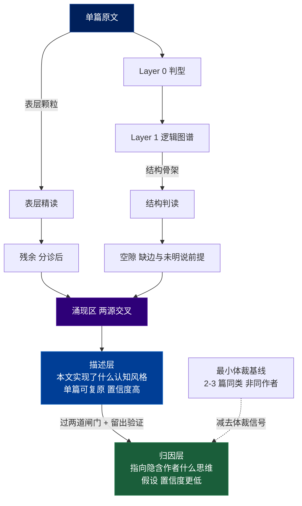
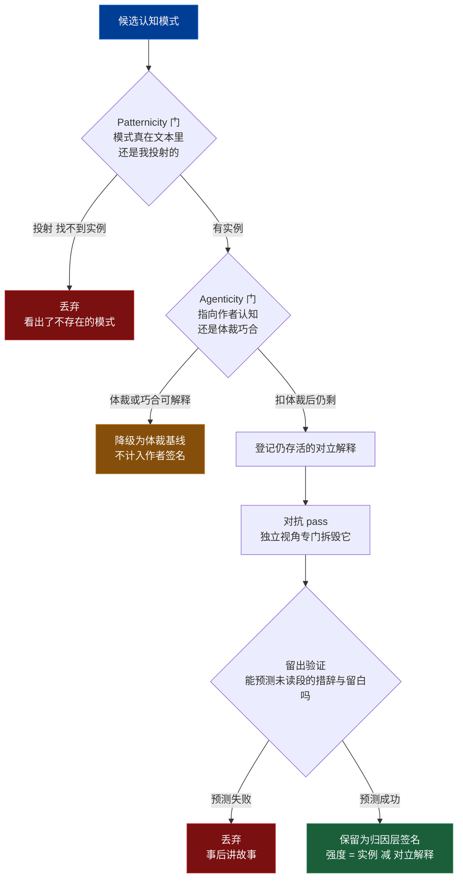

# 从单篇文章涌现作者认知签名:完整方法论 v2

> v2 是学术研究反馈后的修订版。改动的性质不是"加更多免责声明",而是**把原先混在一起的东西拆开、把缺的内部检验补上**——结果是方法论声称得*更少*,但每条声称都*更站得住*。
> 核心架构(双源、残余+空隙涌现引擎、锁定隐含作者、认识论谦逊)未变,且被研究坐实;改动集中在输出分层、质量闸门和验证机制。

---

## v2 改了什么(相对 v1)

1. **输出分两轨**:把"本文实现了什么认知风格"(描述层)和"这反映作者什么思维"(归因层)劈开,各自独立标置信度。大部分学术批判只针对归因层,分层后即被吸收。
2. **归因层需要最小体裁基线**:纯单篇在原则上无法把"作者信号"从"体裁信号"里分出来。归因层要么不做、只停在描述层,要么引入 2–3 篇同类(非同作者)文本作体裁基线减除。目标仍是那一篇,基线只用于校准。
3. **证伪拆成两道闸门**:Patternicity 门(模式真在文本里吗)+ Agenticity 门(就算真,它指向作者认知、还是体裁/巧合)。
4. **新增留出预测验证**:在文本一部分上形成签名,留出另一段,用签名*预测*作者在留出段如何措辞、如何留白,再对照。这是单篇本来缺的内部有效性检验。
5. **残余分诊**:不再说"残余即金子"。残余是高优先级*候选*,仍须过 Agenticity 门——否则"把所有残余当信号"本身就是在噪声里找意义。
6. **LLM 在环加独立对抗 pass**:自我证伪是同一模型给自己出题,不够;增设结构上独立的红队环节专门拆毁候选签名。
7. **签名卡新增"仍存活的对立解释"栏**:置信度 = 实例支持 *减去* 仍同样说得通的替代读法数量,强度不再虚高。

---

## 一、这套方法论在做什么(v2 定位)

把一篇文章当作认知的痕迹,从痕迹反推思维方式。三层管线不变:**判型 → 逻辑图谱 → 认知签名涌现**。v2 的关键变化在管线的*输出端*:涌现出的东西不再是单一结论,而是**先落到描述层(关于本文、高置信、不涉及作者),再有条件地升到归因层(关于隐含作者、假设、明确更低置信)**。这条分界线是 v2 的脊梁。

---

## 二、认识论边界(v2 收紧)

三个天花板不变,但 v2 把其中一条从"caveat"升级为有操作后果的硬约束:

1. **欠定性**:输出到过程多对一,任何归因都只是等价解释之一。**不可消除,只能标注。**
2. **观察者污染**:拆解框架(如 MECE 的正交性)会把自己的结构投射到文本上。
3. **单样本 = 体裁混淆(v2 升级)**:N=1 时,你在原则上无法把"作者的稳定特征"从"这个体裁/题目/读者逼出的临时表现"中分离。**后果**:**纯单篇做不出归因层**——除非引入最小体裁基线(见第五节)。这不是做得不够细的问题,而是样本量为一的逻辑后果。

姿态不变:产出是"对**隐含作者**的假设",不是对真人心智的确证。v2 把这个姿态进一步操作化为"描述层 / 归因层"的强制分层。

---

## 三、全景架构 v2:双源 → 涌现 → 两轨输出



读图要点:**描述层是免费的、稳的;归因层是要挣的、贵的。** 两源交叉(表层颗粒 × 结构骨架)和残余+空隙的负向定义引擎都在涌现区里,与 v1 一致;变化是涌现的产物先沉淀为描述层,只有通过闸门和验证、且有体裁基线托底的,才升为归因层。

---

## 四、三层详解(v2 调整处)

**Layer 0 判型** 与 **Layer 1 逻辑图谱** 同 v1:用四问("论证观点 / 给方案 / 梳理关系 / 讲过程")锁定主导逻辑、选拆解方法;建图时维护"补链日志"(每次你不得不补的缺失链接 = 作者未明说的 Warrant)。

**Layer 2 认知签名涌现(v2)** 双源抽取不变:

- **源 A 表层颗粒**(从原文,拆解会抹掉的):选词、隐喻、对冲/情态、局部连接词、价值词,以及**残余**。
- **源 B 结构骨架**(从图谱,线性读看不见的):图的形状(深/宽、交叉/纯树)、承重节点、**缺失的边**、不对称。

变化在两处:**残余要分诊**(下一节),且**全部产物先入描述层**,不直接成为作者签名。

---

## 五、描述层 vs 归因层(v2 的核心新增)

这是 v2 最重要的一刀。每条涌现出的签名,必须声明自己站在哪一层。

**描述层(Descriptive)——关于本文**
- 主张形如:"本文用空间隐喻处理抽象关系""本文的论证结构极深、几乎不枚举"。
- 只断言*这一篇文本实现了什么*,**不对作者下任何断言**。
- 单篇可复原,置信度可以高。意图谬误、作者之死这些批判**够不着这一层**——因为它们针对的是"通达作者",而描述层主动不通达。

**归因层(Attributive)——关于隐含作者**
- 主张形如:"这指向一个还原论式、不爱枚举的思维倾向"。
- 是**假设**,置信度*明确低于*描述层,且必须通过两道闸门 + 留出验证。
- **前置条件:最小体裁基线。**

**关于体裁基线与那个硬张力**

N=1 时,"这是作者的特征"和"这个文体本来就长这样"无法区分。所以归因层有且只有两个诚实选项:

- **选项 A:只做描述层。** 完全不归因作者,只把这一篇拆到极致。最干净,零体裁风险。
- **选项 B:引入最小体裁基线。** 找 2–3 篇*同类型、同场域、但非同作者*的文本,确立"这个文体的默认形态",把它从本文特征里减去,剩下的才是归因候选。

**这不违反"针对单篇、不归纳共性"的初衷**:目标始终是那一篇;基线文本既不是同作者、也不是用来提取共性,而仅仅是一把"体裁尺子",用完即弃。但必须承认:**"纯单篇"的纯粹性和"归因到作者"的野心是冲突的,你得选一个。** 想要纯单篇,就停在描述层;想归因作者,就接受最小基线。

**残余分诊(v2)**

apophenia 是双刃的:把*所有*残余都当信号,本身就是在噪声里找意义。所以残余的新定位是:**高优先级的归因*候选*,而非自动的金子。** 残余先问一句"这是认知线索,还是疲劳/凑字/编辑痕迹?",再送进 Agenticity 门。v1 那句"不合群的东西是金子"收回为"不合群的东西值得优先盘问"。

---

## 六、操作流程 v2(双轨)

```
描述轨(先走,稳)
1. 精读标 tells(先别拆):隐喻 对冲 连接词 价值词 反常选词 旁白 → 残余日志
2. 建逻辑图谱:每次补缺失链接 → 补链日志(未明说 Warrant)
3. 读图形状:深/宽 交叉/纯树 承重节点 缺失的边 不对称
4. 两源交叉,残余分诊 → 形成一批【描述层】签名,各标描述层置信度

归因轨(有条件,贵)
5. 决定是否做归因:不做 → 交付描述层即止;做 → 准备 2-3 篇体裁基线
6. 对每条候选过两道闸门(Patternicity → Agenticity,扣除体裁基线)
7. 登记仍存活的对立解释
8. 跑独立对抗 pass(尤其 LLM 在环时)
9. 留出验证:用签名预测留出段,对照命中
10. 留下过关者 → 【归因层】签名,置信度 = 实例支持 减 对立解释数
```

顺序的两个要点:**描述轨可独立交付**(很多用途到此为止就够);**归因轨的每一步都是减法**——不断扣除"非作者认知"能解释的部分,剩下的才是签名。

---

## 七、质量控制 v2:两道闸门 + 对抗 + 留出

v1 的单道证伪,在 v2 里拆成一条更严的流水线,对应 Shermer 那对孪生错误(看出不存在的模式 / 把真实模式错误归因给作者意图)。



四个环节各对应一个被研究点名的风险:

- **Patternicity 门**——对冲 apophenia / 确认偏误:这个模式是文本里的,还是我想看到的?钉不到实例就丢。
- **Agenticity 门**——对冲过度归因:就算模式为真,它指向作者*认知*吗?还是体裁惯例、题目要求、巧合、编辑/合著之手?用体裁基线把这些减掉。
- **对抗 pass**——对冲 LLM 的系统性归因漂移:自我证伪是同一模型给自己出题。换一个上下文/框架,专门去找每条签名最廉价的非认知解释,推不翻才留。
- **留出验证(最强升级)**——给单篇一个内部有效性检验:好签名应能*预测未读部分*。预测得了,才从"事后讲故事"升级为"挣来的支持"。

---

## 八、产出物:认知签名卡 v2

每条签名填一张两层卡。描述层可单独交付;归因层栏目只在做归因轨时填。

```
签名 #N:[一句话命名这个特征操作]

── 描述层(关于本文,不涉及作者)──
  本文实现:     [对本文中这个认知操作的客观描述]
  证据实例:     [1-3 处具体位置 / 片段]
  来源:         表层颗粒 / 结构骨架 / 残余 / 空隙
  描述层置信度:  高 / 中 / 低

── 归因层(关于隐含作者,假设;不做归因则留空)──
  归因主张:     [这指向隐含作者的什么思维方式]
  体裁基线:     [对照的 2-3 篇同类非同作者文本;扣除了什么体裁信号]
  Patternicity 检验: 模式实例是否充分?            通过 / 否
  Agenticity 检验:   扣除体裁后是否仍成立?        通过 / 否
  仍存活的对立解释:  [列出还说得通的非作者认知读法]
  对抗 pass 结论:    [独立视角的最强反驳,以及为何未推翻它]
  留出验证:     [用此签名预测了哪段未读内容?是否命中]
  归因层置信度:  实例支持 减 对立解释数 = ___(明确低于描述层)
  关联 Warrant:  [背后那个作者默认不需论证的前提]
```

汇总后,**描述层卡片**= 这一篇"实现了什么认知风格"的稳健画像;**归因层卡片**= 关于隐含作者的、带校准置信度和对立解释的假设集。其中"留出验证"通过的归因签名,是整套产出里最值钱的。

---

## 九、一页速查 v2

```
对象     单篇 → (描述层)本文认知风格 + (归因层,有条件)隐含作者思维假设

两轨     描述层:关于本文 高置信 单篇可做 不涉作者 → 多数用途到此为止
         归因层:关于作者 低置信 是假设 需体裁基线 + 两闸门 + 留出验证

硬约束   N=1 无法分离"作者信号"与"体裁信号"
         → 纯单篇只能做描述层;要归因必须引入最小体裁基线(非同作者,只当尺子)

双源     表层颗粒(选词 隐喻 对冲 连接词 + 残余分诊) × 结构骨架(形状 承重 缺边 不对称)
涌现区   残余 × 空隙(负向定义,最高产);残余是候选不是金子,须过 Agenticity 门
最核心   未明说的 Warrant(补链日志 + 空隙)

质量闸    Patternicity 门(模式真在?) → Agenticity 门(指向作者?扣体裁)
         → 登记对立解释 → 独立对抗 pass → 留出预测验证 → 留下者为归因签名
强度     = 实例支持 减 仍存活的对立解释数(不再虚高)

LLM      过度阐释+归因漂移是系统性的 → 必须独立对抗 pass,不能只自我证伪

不变     双源 / 残余+空隙引擎 / 锁定隐含作者 / 认识论谦逊 —— 被研究坐实,保留
残余风险 欠定性不可消;证伪本身仍是诠释;单篇无法判定"是否稳定特质"(需跨文本)
```

---

> **v2 的一句话**:研究没有削弱方法论,而是收紧了它的诚实边界——描述层让你*现在就能稳稳拿到*的东西更清楚,归因层让你*想多拿*时必须付的代价更明确,留出验证则给了单篇一个它本来没有的内部检验。
