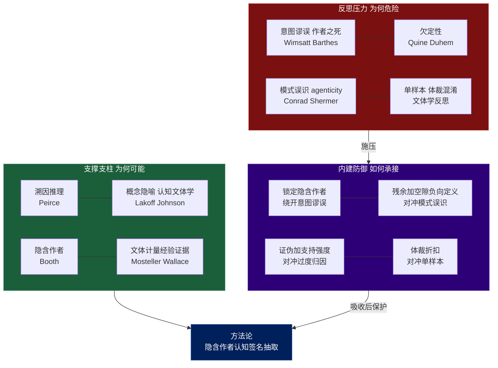

# 方法论的学术根基与反思:支撑、批判与综合

> 本文为《从单篇文章涌现作者认知签名》这套方法论建立学术坐标。
> **第一部分**找出每条承重假设背后的支撑理论(为什么这件事*可能*成立);
> **第二部分**找出对它的批判与上限(为什么这件事*危险*);
> **第三部分**汇合:论证这套方法论之所以能在批判下存活,恰恰是因为它的几个设计选择本身就是对那些批判的回应——并诚实标出仍然暴露的部分。

---

## 导言:核心张力

整套方法论站在一个古老而未决的问题上:**能否从文本读出心智?** 这个问题在二十世纪被两次反向回答——文学理论用"意图谬误"和"作者之死"宣判不能,而认知科学、语用学、法律语言学却在用各自的方式回答"能,在一定条件下"。方法论真正要做的,不是站队,而是**把"在什么条件下、以什么强度、读出什么对象"说清楚**。下面分别从支撑与反思两侧把相关理论摆出来。

---

# 第一部分:支撑性理论

这一部分回答:方法论的每条承重假设,在学术上有什么支持。

## 1. "文本是认知的痕迹,可反推生成过程" → 溯因推理 + 写作认知过程论

方法论把文章当作思维的痕迹,从痕迹反推过程。这正是 **Peirce 的溯因推理(abduction)**:面对一个结果,推出"什么样的前提/过程最能解释它"。溯因不是演绎的必然,而是"最佳解释推断(IBE)",这给方法论提供了正确的推理类型定位——它产出的是假设,不是证明(这也预埋了第二部分的批判)。

为什么"过程"会在"产物"里留痕?**Hayes 与 Flower(1980)的写作认知过程理论**指出,写作不是线性誊写,而是计划、转译、回顾三个子过程的递归交织。文本是这套认知机器运转后的沉积物,因此携带其运转方式的印记。但同一理论也立刻给出警告:**发表出来的线性结构是回顾与重排的产物,不等于思想的发现顺序**——这正对应方法论"生成顺序不可复原"的判断。

## 2. "语言选择索引认知结构" → 概念隐喻论 + 认知文体学 + 图式理论

方法论在表层抽"选词、隐喻、框架",依据是:语言表层不是中性容器,而是认知的索引。

- **Lakoff 与 Johnson(1980)的概念隐喻论**:隐喻不是修辞装饰,而是思维赖以运作的方式;一个人 reach for 什么隐喻("市场是一场对话"),暴露他用什么概念结构组织经验。这直接支撑方法论"隐喻是世界观的压缩"这一条。
- **认知文体学 / 认知诗学(Stockwell, 2002 等)**:整个学科的前提就是"文本的语言特征系统性地映射作者/读者的概念加工",为"从 diction 读认知"提供了方法论先例。
- **图式理论与心智模型(Bartlett, 1932;Johnson-Laird, 1983)**:人靠图式组织信息,而图式会在文本的切分方式、归类方式中显形——支撑方法论从"切分风格"读认知。

## 3. "复原的是隐含作者,不是真人" → Booth 的隐含作者

方法论刻意把目标定为"隐含作者的认知风格"而非真人心智。这不是退而求其次的话术,而是借用了 **Booth(1961)在《小说修辞学》提出的"隐含作者(implied author)"**:文本投射出的那个"作者形象",是读者从文本本身建构的、独立于传记真人的实体。把对象锁定在隐含作者,是方法论能绕开第二部分"意图谬误"批判的关键设计(详见第三部分)。

## 4. "未明说的前提可以复原" → 语用学的隐含 + 修辞学的省略三段论

方法论把"未明说的 Warrant"当作最核心的产物。这有两条支撑:

- **Aristotle 的省略三段论(enthymeme)**:论辩中说话者*故意省略*听众默认接受的前提。省略本身是有规律的——省掉的正是双方共享的预设。复原它在修辞学里是成立的操作。
- **Grice(1975)的会话隐含(implicature)**:意义大量存在于"没说出来但被传达"的层面,且可由合作原则系统地推出。这为"从文本可推出未明说内容"提供了语用学机制。
- **Toulmin(1958)的 Warrant** 概念本身,就是为"论据到主张之间那条通常隐而不宣的桥"命名——方法论对它的复原是有理论对象的。

## 5. "在表层与结构之间往复" → 诠释学循环

方法论要求在原文表层(部分)和逻辑图谱(整体)之间反复横跳。这正是 **诠释学循环(hermeneutic circle)**:从 Schleiermacher、Dilthey 到 Gadamer,理解被描述为部分与整体之间不断校准的螺旋——理解部分需要整体框架,把握整体又依赖各部分。方法论的"表层×结构交叉"不是临时技巧,而是诠释学的标准认识运动。

## 6. "痕迹确实携带可分辨的作者信号" → 文体计量学的经验证据

以上多为理论支撑,而方法论最硬的经验背书来自 **文体计量学(stylometry)与法律语言学**:**Mosteller 与 Wallace(1964)**用功能词频率成功判定了《联邦党人文集》中存疑篇目的作者;**Burrows(2002)的 Delta 方法**等后续工作反复证明,文本的低层统计特征足以稳定区分作者。这说明"文本携带作者签名"不是玄学——签名客观存在且可测。(但这把双刃剑的另一刃在第二部分:这些方法依赖大语料,恰恰是单篇所没有的。)

---

# 第二部分:反思性理论

这一部分回答:方法论的每条假设会在哪里失效、被高估、被污染。

## 1. "读出作者" 的合法性本身被质疑 → 意图谬误 + 作者之死

二十世纪文学理论对"从文本推作者"发起过两次正面否定:

- **Wimsatt 与 Beardsley(1946)的"意图谬误"**:作者的意图既不可得也不应作为评判文本的标准,文本的意义内在于文本而非作者心理。若取其强版本,方法论的整个目标都被取消。
- **Barthes(1967)的"作者之死"**:文本是无数引文的编织,意义由读者生成而非作者注入;追溯"作者想什么"是一种应被废除的执念。

这两条不是要让方法论放弃,而是逼它**精确界定对象**——这正是第三部分的工作。

## 2. "反推是可靠的" 被欠定性否定 → 杜恒-蒯因论题

溯因推理的根本软肋是**欠定性(under-determination)**。**杜恒-蒯因论题(Quine, 1951;Duhem)**指出:证据永远无法唯一地确定理论,总有多个不相容的解释与同一组证据相容。落到方法论上:同一篇文本,可由多套不同的认知过程生成,你给出的"作者这么想"永远只是等价解释之一。这是方法论"欠定性天花板"的严格学理来源,且**无法被任何技巧消除,只能被诚实标注**。

## 3. "单篇足够" 被样本问题否定 → 单样本 + 体裁混淆

方法论自己承认单篇是单样本,而文体学的最新反思给了它精确的形状。**关于保罗书信的计算文体学研究(2025)**论证:**没有可靠的参照语料,一个作者真实的"风格组(stylome)"根本不可知**;而且写作风格随**主题、语气、体裁、心境乃至时间**显著变化,在缺乏已知参照的情况下,无法把"作者的稳定特征"从"情境逼出的临时表现"中分离出来。该研究警告:**对本质上属于认识论的问题套用定量方法,须格外谨慎**。这把方法论的"体裁混淆"从直觉提升为有据的限制。

## 4. "发现是涌现的" 被模式误识威胁 → apophenia / patternicity / agenticity

方法论最大的内部敌人——"模式强加"——在认知心理学里有确切名字。**apophenia**(Conrad, 1958)指在随机或无关数据中*看见*并不存在的意义模式;**Shermer(2008)**称之为 **patternicity**(在噪声中找模式的倾向),并配上一个对方法论更致命的孪生概念 **agenticity**——把所见模式进一步归因为某个有意图的施动者。这两者正好对应方法论的两个风险:**把不存在的认知模式"看出来"(patternicity / Type I 错误),再把它归因成"作者的思维方式"(agenticity)**。叠加 **Wason(1960)的确认偏误**(人倾向于验证而非证伪假设),"拿着清单去扫文本一定能找到"就成了可预测的失败,而非偶然。

## 5. "拆解是中立的观察" 被观察者问题否定 → 前见 + 心理学家谬误

方法论承认"观察者污染",理论上有两个支点。其一,Gadamer 指出理解必然带着**前见(Vorurteil)**——前见既是理解的条件,也是扭曲的来源;你的拆解框架(如 MECE 强加的正交性)会把自己的结构投射到文本上。其二,**William James(1890)的"心理学家谬误"**:观察者把*自己*站在外部的视角,误当成被观察者*内部*的视角。从文本结构反推作者心智,极易犯这个错——你画出的图的形状,可能是你拆解镜片的形状。

## 6. "用 LLM 做更高效" 引入特有风险 → 过度阐释与归因漂移

当用 LLM(包括执行这套方法的 AI)来跑流程时,引入一类被实证记录的特有失败。一项 2025 年针对文档任务的研究发现:**LLM 在这类任务上的主要问题不是编造事实,而是过度阐释——给文档添上其并不支持的、自信的分析,同时剥离掉关键的归因**,研究者称之为"归因漂移(attribution drift)";即便表现最好的工具仍在 13% 的回答中产生此类问题。这把方法论"流畅的过度归因"警告从担忧坐实为有数据的现象:**LLM 会生成听起来极合理、却无文本支持的认知模式**,且其流畅性恰好掩盖了无据性。

---

# 第三部分:综合分析(汇合)

把两侧叠在一起,会发现一个并非偶然的结构:**第二部分的每一条批判,在方法论里几乎都已有一个对应的设计选择在承接它**。也就是说,这套方法论不是无视批判的天真实证主义,而是一套**把批判内化为约束**的诠释学程序。

## 批判 → 防御的逐条对应

| 批判压力 | 学理来源 | 方法论的内建防御 | 是否完全化解 |
|---|---|---|---|
| 意图谬误 / 作者之死 | Wimsatt & Beardsley;Barthes | 对象锁定**隐含作者**而非真人,不主张通达作者心理,只重构文本所投射的认知形象 | **基本化解**:批判针对的是"真人意图",方法论已主动让出该目标 |
| 欠定性 | Quine-Duhem | 产出定性为**假设**并标**支持强度**,不声称唯一解 | **不可化解,只能诚实标注**(承认是残余风险) |
| 模式误识(patternicity) | Conrad;Shermer;Wason | **残余 + 空隙的负向定义引擎**:靠"不合/缺失"制造惊讶,而非验证预设清单 | **大幅缓解**:负向定义结构性地抵抗确认偏误 |
| 过度归因(agenticity) | Shermer;LLM 实证研究 | **证伪过滤**:每条问"若为假,文本会怎样",找不到区分实例就丢 | **大幅缓解**:把波普尔式可证伪性引入诠释 |
| 单样本 / 体裁混淆 | 文体学反思 | **体裁折扣**:归因前先扣除体裁/题目/读者能解释的部分 | **部分化解**:无参照语料下,折扣本身也是估计 |
| 观察者污染 | Gadamer 前见;James | 表层×结构**双源交叉** + 钉实例,降低单一镜片主导 | **部分化解**:前见无法清零,只能多源相互制衡 |

## 三个汇合判断

**判断一:对象的精确化,是方法论存活的支点。** 意图谬误与作者之死之所以是致命批判,前提是你想通达"真人作者的真实意图"。方法论借 Booth 的隐含作者,把目标降维到"文本投射的认知形象"——这恰好落在 Wimsatt/Beardsley 都承认*内在于文本*的那一层。换句话说,方法论不是赢了这场争论,而是**搬到了争论双方都接受的那块地上**。这也呼应 Ricoeur 的"文本的距离化":文本一旦写就便获得脱离作者的"事(sense)",可被独立解读。

**判断二:方法论的认识论身份,是"受规训的溯因式细读"。** 把支撑与防御合起来看,它的真身清晰了:以**溯因推理**为引擎(Peirce),以**诠释学循环**为运动方式(Gadamer),以**可证伪性**为质量闸门(Popper 精神),产出关于**隐含作者**(Booth)的、带校准置信度的假设。它既不是文体计量学那种统计确证(没有语料),也不是天真的"读心",而是介于二者之间的、**带纪律的人文推断**。它的有效性不靠"证明为真",而靠 **Hirsch(1967)式的验证**:一个好解释应能预测文本中尚未检视的部分——若你对作者认知签名的假设能预言他在另一段如何措辞、如何留白,假设就获得了支持。这是单篇可做的、内部的有效性检验。

**判断三:LLM 在环既是放大器也是新污染源,必须区别对待。** LLM 能极大提速表层标注与结构判读,但实证已表明它的失败模式(过度阐释 + 归因漂移)与方法论的头号风险(过度归因)**同向叠加**——它不是中性工具,而是一个*自带 agenticity 倾向*的第二观察者。因此方法论里的证伪闸门对 LLM 不是可选项而是必需:对 AI 生成的每条认知模式,"若为假文本会怎样"这一问,是把它的流畅性与无据性分开的唯一手段。

## 残余的诚实:方法论无法逃出的部分

最后,综合不应粉饰。三处暴露是结构性的、无法靠技巧消除的:

1. **欠定性不可消除**。再多双源交叉与证伪,也只能把假设从"可能"推向"更可信",永远到不了"唯一为真"。这是溯因推理的宿命,不是方法的缺陷。
2. **证伪检验本身是诠释的**。"若为假文本会怎样"这一问的答案,仍由(带前见的)你或 LLM 给出。证伪降低了任意性,但没有提供方法之外的阿基米德点。
3. **单篇的天花板是真实的**。文体学反思已证明:稳定特质需要参照语料。单篇能给你丰富的*这一篇所实现的*认知风格,但"这是否是作者的稳定思维方式"这个问题,单篇在原则上无法回答——这不是做得不够细,而是样本量为一。

**净结论**:这套方法论是一套**学理自洽、且把对自身的主要批判内化为操作约束**的诠释学程序。它该被理解、被宣称为"对隐含作者的、受规训的溯因式细读",其产物是带校准置信度的假设而非确证。在这个被精确界定的范围内,它不仅可行,而且相当稳健;一旦越界去声称通达真人心智或稳定特质,前述每一条批判都会立刻生效。**方法论的价值,正比于它对自身边界的诚实。**

---

## 参考文献

**支撑侧**
- Peirce, C. S. *Collected Papers*(溯因推理 / 最佳解释推断).
- Hayes, J. R., & Flower, L. (1980). A Cognitive Process Theory of Writing.
- Lakoff, G., & Johnson, M. (1980). *Metaphors We Live By*.
- Stockwell, P. (2002). *Cognitive Poetics: An Introduction*(认知文体学).
- Bartlett, F. C. (1932). *Remembering*(图式理论);Johnson-Laird, P. (1983). *Mental Models*.
- Booth, W. C. (1961). *The Rhetoric of Fiction*(隐含作者).
- Aristotle. *Rhetoric*(省略三段论);Grice, H. P. (1975). Logic and Conversation(会话隐含).
- Toulmin, S. (1958). *The Uses of Argument*(Warrant).
- Schleiermacher / Dilthey / Gadamer, H-G. (1960). *Truth and Method*(诠释学循环 / 前见).
- Mosteller, F., & Wallace, D. (1964). *Inference and Disputed Authorship: The Federalist*;Burrows, J. (2002). Delta.

**反思侧**
- Wimsatt, W. K., & Beardsley, M. C. (1946). The Intentional Fallacy.
- Barthes, R. (1967). The Death of the Author.
- Quine, W. V. O. (1951). Two Dogmas of Empiricism(杜恒-蒯因 / 欠定性).
- Conrad, K. (1958). *Die beginnende Schizophrenie*(apophenia);Shermer, M. (2008). Patternicity / Agenticity, *Scientific American*.
- Wason, P. C. (1960). 确认偏误 / 2-4-6 任务.
- James, W. (1890). *The Principles of Psychology*(心理学家谬误).
- *Computational Stylometrics and the Pauline Corpus: Limits in Authorship Attribution.* (2025). *Religions*, 16(10), 1264. MDPI.(单样本 / 无参照语料 / 体裁混淆)
- *Not Wrong, But Untrue: LLM Overconfidence in Document-Based Queries.* (2025). arXiv:2509.25498.(过度阐释 / 归因漂移)

**综合侧**
- Popper, K. (1959). *The Logic of Scientific Discovery*(可证伪性).
- Hirsch, E. D. (1967). *Validity in Interpretation*(解释的验证).
- Ricoeur, P. *Hermeneutics and the Human Sciences*(距离化 / 文本之"事").
- Dennett, D. (1987). *The Intentional Stance*(把隐含作者当意图系统的方法论姿态).
