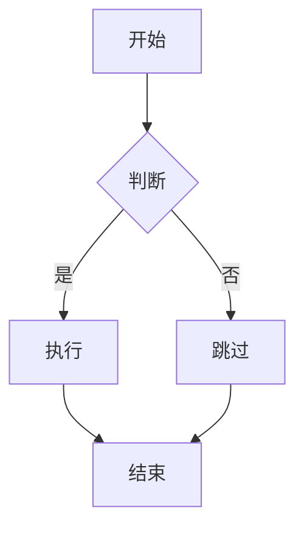

# md-to-docx PDF 扩展实施计划

> **For agentic workers:** REQUIRED SUB-SKILL: Use superpowers:subagent-driven-development (recommended) or superpowers:executing-plans to implement this plan task-by-task. Steps use checkbox (`- [ ]`) syntax for tracking.

**Goal:** 扩展 `md-to-docx` skill，新增 Markdown → PDF 转换，同时将 DOCX 侧内联样式迁移到独立文件，所有样式均不得写在脚本代码中。

**Architecture:** DOCX 路径不变（python-docx），但 DEFAULT_STYLE 从代码迁出为 `assets/default-style.json`。PDF 路径新增 `md_to_pdf.py`：python-markdown 转 HTML，Playwright Chromium 渲染为 PDF；Mermaid 代码块在 Playwright 里由 mermaid.js 原生执行，图片通过 `base_url` file URI 加载。两套样式文件独立，不共享。

**Tech Stack:** python-docx 1.2.0, playwright (Python, Chromium 已缓存), python-markdown (`pip install markdown`), mermaid.js (CDN 兜底 / `npm install mermaid` 离线)

---

## 文件变更总览

| 操作 | 路径 | 职责 |
|------|------|------|
| **新建** | `skills/writing/md-to-docx/assets/default-style.json` | DOCX 默认样式（从代码迁出） |
| **新建** | `skills/writing/md-to-docx/assets/default.css` | PDF 默认样式 |
| **新建** | `skills/writing/md-to-docx/assets/template.html` | PDF HTML 外壳模板 |
| **修改** | `skills/writing/md-to-docx/scripts/md_to_docx.py` | 移除 DEFAULT_STYLE，改从 assets/ 加载 |
| **新建** | `skills/writing/md-to-docx/scripts/md_to_pdf.py` | MD→PDF 转换脚本 |
| **修改** | `skills/writing/md-to-docx/SKILL.md` | 新增触发词、PDF 命令说明 |
| **新建** | `skills/writing/md-to-docx/tests/test_md_to_pdf.py` | PDF 脚本单元测试 |

所有修改均在 worktree `.worktrees/feature/md-to-docx-skill/` 中进行。

---

## Task 1：迁移 DOCX 默认样式到 assets/default-style.json

**Files:**
- Create: `skills/writing/md-to-docx/assets/default-style.json`
- Modify: `skills/writing/md-to-docx/scripts/md_to_docx.py`

- [ ] **Step 1：创建 assets/default-style.json**

文件内容为现有 `DEFAULT_STYLE` 的精确 JSON 表示（`True→true`, `False→false`, `None→null`）：

```json
{
  "page": {
    "top_cm": 2.54, "bottom_cm": 2.54,
    "left_cm": 3.17, "right_cm": 3.17
  },
  "body": {
    "font": "宋体", "font_en": "Times New Roman",
    "size_pt": 12, "line_spacing_pt": 22,
    "space_before_pt": 0, "space_after_pt": 6,
    "first_line_indent_chars": 2
  },
  "headings": {
    "h1": {
      "font": "黑体", "font_en": "Arial",
      "size_pt": 22, "bold": true, "color": "000000",
      "align": "center",
      "space_before_pt": 24, "space_after_pt": 12
    },
    "h2": {
      "font": "黑体", "font_en": "Arial",
      "size_pt": 16, "bold": true, "color": "000000",
      "align": "left",
      "space_before_pt": 18, "space_after_pt": 9
    },
    "h3": {
      "font": "黑体", "font_en": "Arial",
      "size_pt": 14, "bold": true, "color": "333333",
      "align": "left",
      "space_before_pt": 12, "space_after_pt": 6
    },
    "h4": {
      "font": "仿宋", "font_en": "Arial",
      "size_pt": 12, "bold": true, "color": "333333",
      "align": "left",
      "space_before_pt": 10, "space_after_pt": 4
    }
  },
  "code_block": {
    "font": "Courier New", "size_pt": 10,
    "bg_color": null
  },
  "blockquote": {
    "font": "仿宋", "font_en": "Times New Roman",
    "size_pt": 11, "color": "555555",
    "left_indent_cm": 1.0
  },
  "table": {
    "font": "宋体", "font_en": "Times New Roman",
    "size_pt": 11,
    "header_bold": true,
    "header_bg_color": "D9E1F2",
    "border_color": "AAAAAA",
    "cell_padding_pt": 4,
    "space_before_pt": 8,
    "space_after_pt": 8
  }
}
```

- [ ] **Step 2：修改 md_to_docx.py — 移除 DEFAULT_STYLE，添加 ASSETS_DIR**

在现有 `import` 块末尾之后、原 `DEFAULT_STYLE` 行之前，替换整段 DEFAULT_STYLE（第 25–81 行）：

删除：
```python
DEFAULT_STYLE: dict = {
    ...（整个字典）...
}
```

替换为：
```python
ASSETS_DIR = Path(__file__).parent.parent / "assets"
```

- [ ] **Step 3：修改 md_to_docx.py — 更新 main() 中的样式加载**

找到 `main()` 中以下片段：

```python
    style = DEFAULT_STYLE
    if args.style:
        with open(args.style, encoding="utf-8") as f:
            user_style = json.load(f)
        # Deep merge: user overrides defaults
        for section, values in user_style.items():
            if section in style and isinstance(style[section], dict):
                if section == "headings":
                    for h, hvals in values.items():
                        style[section].setdefault(h, {}).update(hvals)
                else:
                    style[section].update(values)
            else:
                style[section] = values
```

替换为：

```python
    with open(ASSETS_DIR / "default-style.json", encoding="utf-8") as f:
        style = json.load(f)
    if args.style:
        with open(args.style, encoding="utf-8") as f:
            user_style = json.load(f)
        for section, values in user_style.items():
            if section in style and isinstance(style[section], dict):
                if section == "headings":
                    for h, hvals in values.items():
                        style[section].setdefault(h, {}).update(hvals)
                else:
                    style[section].update(values)
            else:
                style[section] = values
```

- [ ] **Step 4：修改 md_to_docx.py — 更新 --dump-style**

找到：
```python
    if args.dump_style:
        print(json.dumps(DEFAULT_STYLE, indent=2, ensure_ascii=False))
        return
```

替换为：
```python
    if args.dump_style:
        print((ASSETS_DIR / "default-style.json").read_text(encoding="utf-8"))
        return
```

- [ ] **Step 5：验证 DOCX 转换仍正常**

```bash
cd .worktrees/feature/md-to-docx-skill
python3 skills/writing/md-to-docx/scripts/md_to_docx.py \
  md-to-docx-workspace/sample-basic.md /tmp/test-refactor.docx
ls -lh /tmp/test-refactor.docx
```

预期：输出 `Saved: /tmp/test-refactor.docx`，文件 > 30KB。

```bash
python3 skills/writing/md-to-docx/scripts/md_to_docx.py --dump-style | python3 -c "import sys,json; d=json.load(sys.stdin); print(list(d.keys()))"
```

预期：`['page', 'body', 'headings', 'code_block', 'blockquote', 'table']`

- [ ] **Step 6：运行测试套件**

```bash
npm test 2>&1 | tail -5
```

预期：`OK` + `custom skill tests: 1 passed, 0 failed`

- [ ] **Step 7：提交**

```bash
git -C .worktrees/feature/md-to-docx-skill add \
  skills/writing/md-to-docx/assets/default-style.json \
  skills/writing/md-to-docx/scripts/md_to_docx.py
git -C .worktrees/feature/md-to-docx-skill commit -m \
  "refactor(md-to-docx): externalize DEFAULT_STYLE to assets/default-style.json"
```

---

## Task 2：创建 assets/template.html

**Files:**
- Create: `skills/writing/md-to-docx/assets/template.html`

- [ ] **Step 1：创建 template.html**

```html
<!DOCTYPE html>
<html lang="zh-CN">
<head>
<meta charset="UTF-8">
<meta name="viewport" content="width=device-width, initial-scale=1.0">
<style>
{{CSS_CONTENT}}
</style>
</head>
<body>
{{BODY_CONTENT}}
<script src="{{MERMAID_JS_PATH}}"></script>
<script>
if (typeof mermaid !== 'undefined') {
  mermaid.initialize({ startOnLoad: true, theme: 'neutral' });
}
</script>
</body>
</html>
```

三个占位符：`{{CSS_CONTENT}}`、`{{BODY_CONTENT}}`、`{{MERMAID_JS_PATH}}`，其余无内联样式。

- [ ] **Step 2：提交**

```bash
git -C .worktrees/feature/md-to-docx-skill add \
  skills/writing/md-to-docx/assets/template.html
git -C .worktrees/feature/md-to-docx-skill commit -m \
  "feat(md-to-docx): add PDF HTML template"
```

---

## Task 3：创建 assets/default.css

**Files:**
- Create: `skills/writing/md-to-docx/assets/default.css`

- [ ] **Step 1：创建 default.css**

```css
@page {
  size: A4;
  margin: 2.54cm;
}

body {
  font-family: "Songti SC", "STSong", "SimSun", "宋体", "Times New Roman", serif;
  font-size: 12pt;
  line-height: 1.8;
  color: #000000;
  max-width: 100%;
}

h1 {
  font-family: "Heiti SC", "STHeiti", "SimHei", "黑体", "Arial", sans-serif;
  font-size: 22pt;
  font-weight: bold;
  color: #000000;
  text-align: center;
  margin-top: 24pt;
  margin-bottom: 12pt;
}

h2 {
  font-family: "Heiti SC", "STHeiti", "SimHei", "黑体", "Arial", sans-serif;
  font-size: 16pt;
  font-weight: bold;
  color: #000000;
  text-align: left;
  margin-top: 18pt;
  margin-bottom: 9pt;
}

h3 {
  font-family: "Heiti SC", "STHeiti", "SimHei", "黑体", "Arial", sans-serif;
  font-size: 14pt;
  font-weight: bold;
  color: #333333;
  text-align: left;
  margin-top: 12pt;
  margin-bottom: 6pt;
}

h4 {
  font-family: "STFangsong", "FangSong", "仿宋", "Arial", sans-serif;
  font-size: 12pt;
  font-weight: bold;
  color: #333333;
  text-align: left;
  margin-top: 10pt;
  margin-bottom: 4pt;
}

p {
  text-indent: 2em;
  margin-top: 0;
  margin-bottom: 6pt;
}

table {
  border-collapse: collapse;
  width: 100%;
  margin-top: 8pt;
  margin-bottom: 8pt;
  font-family: "Songti SC", "STSong", "SimSun", "宋体", "Times New Roman", serif;
  font-size: 11pt;
}

th {
  background-color: #D9E1F2;
  font-weight: bold;
  border: 1px solid #AAAAAA;
  padding: 4pt 6pt;
  text-align: left;
}

td {
  border: 1px solid #AAAAAA;
  padding: 4pt 6pt;
}

pre {
  background-color: #F5F5F5;
  border: 1px solid #DDDDDD;
  border-radius: 3px;
  padding: 8pt 10pt;
  margin: 6pt 0 6pt 1cm;
  overflow-x: auto;
  font-family: "Courier New", "Consolas", monospace;
  font-size: 10pt;
  line-height: 1.4;
}

code {
  font-family: "Courier New", "Consolas", monospace;
  font-size: 10pt;
  background-color: #F5F5F5;
  padding: 1px 3px;
  border-radius: 2px;
}

pre code {
  background-color: transparent;
  padding: 0;
  border-radius: 0;
}

blockquote {
  font-family: "STFangsong", "FangSong", "仿宋", "Times New Roman", serif;
  font-size: 11pt;
  color: #555555;
  margin-left: 1cm;
  margin-top: 4pt;
  margin-bottom: 4pt;
  padding-left: 0;
}

pre.mermaid {
  background-color: transparent;
  border: none;
  text-align: center;
  margin: 12pt auto;
  padding: 0;
}

pre.mermaid svg {
  max-width: 100%;
  height: auto;
}

img {
  max-width: 100%;
  height: auto;
  display: block;
  margin: 8pt auto;
}

ul, ol {
  margin-top: 2pt;
  margin-bottom: 2pt;
  padding-left: 1.5em;
}

li {
  margin-bottom: 2pt;
}

hr {
  border: none;
  border-top: 1px solid #AAAAAA;
  margin: 8pt 0;
}

a {
  color: #1155CC;
}
```

- [ ] **Step 2：提交**

```bash
git -C .worktrees/feature/md-to-docx-skill add \
  skills/writing/md-to-docx/assets/default.css
git -C .worktrees/feature/md-to-docx-skill commit -m \
  "feat(md-to-docx): add PDF default CSS"
```

---

## Task 4：实现 md_to_pdf.py

**Files:**
- Create: `skills/writing/md-to-docx/scripts/md_to_pdf.py`

- [ ] **Step 1：安装 python-markdown**

```bash
pip install markdown
python3 -c "import markdown; print(markdown.__version__)"
```

预期：打印版本号（如 `3.8`）。

- [ ] **Step 2：创建 md_to_pdf.py**

```python
#!/usr/bin/env python3
"""
Convert Markdown to PDF via Playwright Chromium.

Usage:
    python3 md_to_pdf.py input.md [output.pdf] [--style style.css]
    python3 md_to_pdf.py --dump-style
"""

import argparse
import re
import sys
from pathlib import Path

import markdown as md_lib

ASSETS_DIR = Path(__file__).parent.parent / "assets"
MERMAID_RE = re.compile(r"```mermaid\n(.*?)```", re.DOTALL)


def _mermaid_js_src() -> str:
    local = Path(__file__).parent.parent / "node_modules" / "mermaid" / "dist" / "mermaid.min.js"
    if local.exists():
        return local.as_uri()
    return "https://cdn.jsdelivr.net/npm/mermaid/dist/mermaid.min.js"


def _extract_mermaid(md_text: str) -> tuple[str, dict[str, str]]:
    """Replace ```mermaid blocks with unique placeholders. Returns modified text and mapping."""
    blocks: dict[str, str] = {}

    def replacer(m: re.Match) -> str:
        key = f"XMERMAIDX{len(blocks)}X"
        blocks[key] = f'<pre class="mermaid">{m.group(1).strip()}</pre>'
        return key

    return MERMAID_RE.sub(replacer, md_text), blocks


def build_html(md_text: str, css_path: Path) -> tuple[str, int]:
    """Return complete HTML string and count of Mermaid blocks."""
    processed, mermaid_blocks = _extract_mermaid(md_text)

    body = md_lib.markdown(
        processed,
        extensions=["tables", "fenced_code", "attr_list"],
    )

    for key, block in mermaid_blocks.items():
        body = body.replace(f"<p>{key}</p>", block)
        body = body.replace(key, block)

    template = (ASSETS_DIR / "template.html").read_text(encoding="utf-8")
    css = css_path.read_text(encoding="utf-8")

    html = (
        template
        .replace("{{CSS_CONTENT}}", css)
        .replace("{{BODY_CONTENT}}", body)
        .replace("{{MERMAID_JS_PATH}}", _mermaid_js_src())
    )
    return html, len(mermaid_blocks)


def render_pdf(html: str, output_path: Path, base_url: str, mermaid_count: int) -> None:
    from playwright.sync_api import sync_playwright

    with sync_playwright() as p:
        browser = p.chromium.launch()
        page = browser.new_page()
        page.set_content(html, base_url=base_url)
        if mermaid_count > 0:
            page.wait_for_function(
                f"document.querySelectorAll('pre.mermaid svg').length >= {mermaid_count}",
                timeout=10000,
            )
        page.pdf(path=str(output_path), format="A4", print_background=True)
        browser.close()


def main() -> None:
    parser = argparse.ArgumentParser(description="Convert Markdown to PDF.")
    parser.add_argument("input", nargs="?", help="Input .md file")
    parser.add_argument("output", nargs="?", help="Output .pdf file (default: same name)")
    parser.add_argument("--style", help="CSS style file")
    parser.add_argument("--dump-style", action="store_true",
                        help="Print default CSS and exit")
    args = parser.parse_args()

    if args.dump_style:
        print((ASSETS_DIR / "default.css").read_text(encoding="utf-8"))
        return

    if not args.input:
        parser.error("input is required unless --dump-style is used")

    input_path = Path(args.input)
    if not input_path.exists():
        print(f"Error: {input_path} not found", file=sys.stderr)
        sys.exit(1)

    output_path = Path(args.output) if args.output else input_path.with_suffix(".pdf")
    css_path = Path(args.style) if args.style else ASSETS_DIR / "default.css"
    base_url = input_path.resolve().parent.as_uri() + "/"

    md_text = input_path.read_text(encoding="utf-8")
    html, mermaid_count = build_html(md_text, css_path)
    render_pdf(html, output_path, base_url, mermaid_count)
    print(f"Saved: {output_path}")


if __name__ == "__main__":
    main()
```

- [ ] **Step 3：冒烟测试——无 Mermaid 的基础转换**

```bash
python3 .worktrees/feature/md-to-docx-skill/skills/writing/md-to-docx/scripts/md_to_pdf.py \
  md-to-docx-workspace/sample-basic.md /tmp/test-basic.pdf
ls -lh /tmp/test-basic.pdf
```

预期：`Saved: /tmp/test-basic.pdf`，文件 > 20KB。

```bash
open /tmp/test-basic.pdf
```

检查：标题、表格、代码块在 PDF 中正确显示。

- [ ] **Step 4：冒烟测试——含 Mermaid 的文档**

新建测试文件 `/tmp/test-mermaid.md`：

```markdown
# Mermaid Test



正文继续。
```

运行：

```bash
python3 .worktrees/feature/md-to-docx-skill/skills/writing/md-to-docx/scripts/md_to_pdf.py \
  /tmp/test-mermaid.md /tmp/test-mermaid.pdf
ls -lh /tmp/test-mermaid.pdf
open /tmp/test-mermaid.pdf
```

预期：PDF 中 Mermaid 渲染为流程图 SVG，不是代码文本。

- [ ] **Step 5：冒烟测试——--dump-style**

```bash
python3 .worktrees/feature/md-to-docx-skill/skills/writing/md-to-docx/scripts/md_to_pdf.py \
  --dump-style | head -5
```

预期：输出以 `@page {` 开头的 CSS 内容。

- [ ] **Step 6：提交**

```bash
git -C .worktrees/feature/md-to-docx-skill add \
  skills/writing/md-to-docx/scripts/md_to_pdf.py
git -C .worktrees/feature/md-to-docx-skill commit -m \
  "feat(md-to-docx): add md_to_pdf.py — Playwright Chromium renderer"
```

---

## Task 5：编写单元测试

**Files:**
- Create: `skills/writing/md-to-docx/tests/test_md_to_pdf.py`

- [ ] **Step 1：创建测试文件**

```python
import sys
import unittest
from pathlib import Path

sys.path.insert(0, str(Path(__file__).parent.parent / "scripts"))

from md_to_pdf import _extract_mermaid, build_html

ASSETS_DIR = Path(__file__).parent.parent / "assets"
CSS_PATH = ASSETS_DIR / "default.css"


class TestExtractMermaid(unittest.TestCase):
    def test_no_mermaid(self):
        text = "# Hello\n\nsome text"
        result, blocks = _extract_mermaid(text)
        self.assertEqual(result, text)
        self.assertEqual(blocks, {})

    def test_single_block(self):
        text = "before\n```mermaid\ngraph LR\n  A --> B\n```\nafter"
        result, blocks = _extract_mermaid(text)
        self.assertIn("XMERMAIDX0X", result)
        self.assertEqual(len(blocks), 1)
        self.assertIn('class="mermaid"', list(blocks.values())[0])
        self.assertIn("A --> B", list(blocks.values())[0])

    def test_multiple_blocks(self):
        text = "```mermaid\nA\n```\n\n```mermaid\nB\n```"
        _, blocks = _extract_mermaid(text)
        self.assertEqual(len(blocks), 2)


class TestBuildHtml(unittest.TestCase):
    def test_produces_valid_html(self):
        html, count = build_html("# Hello\n\nParagraph.", CSS_PATH)
        self.assertIn("<!DOCTYPE html>", html)
        self.assertIn("<h1>Hello</h1>", html)
        self.assertEqual(count, 0)

    def test_table_rendered(self):
        md = "| A | B |\n|---|---|\n| 1 | 2 |"
        html, _ = build_html(md, CSS_PATH)
        self.assertIn("<table>", html)
        self.assertIn("<th>", html)

    def test_mermaid_count(self):
        md = "```mermaid\ngraph LR\n  A-->B\n```"
        html, count = build_html(md, CSS_PATH)
        self.assertEqual(count, 1)
        self.assertIn('class="mermaid"', html)

    def test_mermaid_not_in_code_block(self):
        md = "```mermaid\ngraph LR\n  A-->B\n```"
        html, _ = build_html(md, CSS_PATH)
        # Should be <pre class="mermaid">, not inside <pre><code>
        self.assertNotIn("<code>graph LR", html)

    def test_css_injected(self):
        html, _ = build_html("text", CSS_PATH)
        self.assertIn("@page", html)
        self.assertIn("font-family", html)

    def test_custom_css(self, tmp_path=None):
        import tempfile, os
        with tempfile.NamedTemporaryFile(mode="w", suffix=".css", delete=False) as f:
            f.write("body { color: red; }")
            tmp = f.name
        try:
            html, _ = build_html("text", Path(tmp))
            self.assertIn("color: red", html)
        finally:
            os.unlink(tmp)


if __name__ == "__main__":
    unittest.main()
```

- [ ] **Step 2：运行测试，确认全部通过**

```bash
python3 -m pytest skills/writing/md-to-docx/tests/test_md_to_pdf.py -v 2>/dev/null || \
python3 -m unittest discover -s skills/writing/md-to-docx/tests -v
```

预期：所有测试 PASS。若 pytest 未装，unittest 模式也可。

- [ ] **Step 3：提交**

```bash
git -C .worktrees/feature/md-to-docx-skill add \
  skills/writing/md-to-docx/tests/test_md_to_pdf.py
git -C .worktrees/feature/md-to-docx-skill commit -m \
  "test(md-to-docx): add unit tests for md_to_pdf HTML generation"
```

---

## Task 6：更新 SKILL.md

**Files:**
- Modify: `skills/writing/md-to-docx/SKILL.md`

- [ ] **Step 1：更新 SKILL.md**

将现有 SKILL.md 全文替换为：

```markdown
---
name: md-to-docx
description: "Convert Markdown (.md) files to Word (.docx) or PDF format. Trigger whenever the user wants to: convert/export a .md file to Word or docx, says 'md转docx', 'markdown转word', '生成Word文档', 'export as docx', '导出Word'; OR convert to PDF, says 'md转pdf', 'markdown转pdf', '导出PDF', 'export as pdf', '生成PDF'; OR has a markdown file they need to share or browse as Word/PDF. Also trigger when the user writes a document in the conversation and wants it as .docx or .pdf."
user_invocable: true
version: "2.0.0"
---

## Overview

Convert a Markdown file to Word (.docx) or PDF. Both formats support headings, tables, code blocks, lists, inline formatting, blockquotes, and embedded images. PDF additionally supports Mermaid diagrams (rendered as vector SVG).

**Script locations (after `hskill` install):**
- DOCX: `~/.claude/skills/md-to-docx/scripts/md_to_docx.py`
- PDF:  `~/.claude/skills/md-to-docx/scripts/md_to_pdf.py`

---

## DOCX Conversion

**Basic:**
```bash
python3 ~/.claude/skills/md-to-docx/scripts/md_to_docx.py input.md
# → input.docx in the same directory
```

**Specify output:**
```bash
python3 ~/.claude/skills/md-to-docx/scripts/md_to_docx.py input.md output.docx
```

**Custom style:**
```bash
python3 ~/.claude/skills/md-to-docx/scripts/md_to_docx.py input.md --style custom.json
```

**Dump default style to customize:**
```bash
python3 ~/.claude/skills/md-to-docx/scripts/md_to_docx.py --dump-style > style.json
```

**Dependencies:** `pip install python-docx`

---

## PDF Conversion

**Basic:**
```bash
python3 ~/.claude/skills/md-to-docx/scripts/md_to_pdf.py input.md
# → input.pdf in the same directory
```

**Specify output:**
```bash
python3 ~/.claude/skills/md-to-docx/scripts/md_to_pdf.py input.md output.pdf
```

**Custom style:**
```bash
python3 ~/.claude/skills/md-to-docx/scripts/md_to_pdf.py input.md --style custom.css
```

**Dump default CSS to customize:**
```bash
python3 ~/.claude/skills/md-to-docx/scripts/md_to_pdf.py --dump-style > style.css
```

**Dependencies:** `pip install markdown` (playwright already required)

**Mermaid (optional, for offline use):** `npm install mermaid` inside the skill directory. Without this, mermaid.js is loaded from CDN.

---

## What Gets Converted

| Markdown | DOCX | PDF |
|----------|------|-----|
| `# H1` … `#### H4` | Styled headings | Styled headings |
| Paragraphs | 2-char indent, 宋体 | 2em indent |
| **bold**, *italic*, `code`, ~~strike~~, [links](url) | Inline runs | Inline HTML |
| ` ``` ` code blocks | Courier New, indented | Monospace, shaded |
| `>` blockquotes | 仿宋, indented | Indented, grey |
| Lists (ordered & unordered) | Bullets/numbers | Standard HTML lists |
| Pipe tables | Styled with header shading | Styled with header shading |
| `---` horizontal rule | Grey line | Grey line |
| `` images | ❌ Not supported | ✅ Loaded via base_url |
| ` ```mermaid` diagrams | ❌ Not supported | ✅ Rendered as SVG |

---

## Style Customization

**DOCX** — style.json keys: `page`, `body`, `headings` (h1–h4), `code_block`, `blockquote`, `table`. Only include sections to override; rest uses defaults.

**PDF** — style.css: standard CSS file. Use `--dump-style` to get the full default as a starting point. Supports all CSS properties recognized by Chromium (including `@page` for margins/size).

---

## If the skill directory isn't installed

```bash
# DOCX
python3 tools/md-formatter/md_to_docx.py input.md
# PDF
python3 skills/writing/md-to-docx/scripts/md_to_pdf.py input.md
```
```

- [ ] **Step 2：运行 npm test 验证 SKILL.md 格式**

```bash
npm test 2>&1 | grep -E "(FAIL|PASS|skill tests)"
```

预期：无 FAIL，`custom skill tests` 通过。

- [ ] **Step 3：提交**

```bash
git -C .worktrees/feature/md-to-docx-skill add \
  skills/writing/md-to-docx/SKILL.md
git -C .worktrees/feature/md-to-docx-skill commit -m \
  "feat(md-to-docx): update SKILL.md for v2.0.0 — add PDF support and triggers"
```

---

## Task 7：端到端验证

- [ ] **Step 1：测试中文报告 PDF**

```bash
python3 .worktrees/feature/md-to-docx-skill/skills/writing/md-to-docx/scripts/md_to_pdf.py \
  md-to-docx-workspace/sample-chinese-report.md /tmp/chinese-report.pdf
open /tmp/chinese-report.pdf
```

检查：中文字体正常（宋体/黑体），表格有边框，代码块有背景，H1 居中。

- [ ] **Step 2：测试含图片的 PDF（base_url 路径解析）**

创建测试 MD：

```bash
mkdir -p /tmp/img-test
curl -s "https://via.placeholder.com/200x100.png" -o /tmp/img-test/sample.png 2>/dev/null || \
  python3 -c "
from PIL import Image
import os
os.makedirs('/tmp/img-test', exist_ok=True)
img = Image.new('RGB', (200, 100), color=(100, 149, 237))
img.save('/tmp/img-test/sample.png')
" 2>/dev/null || echo "skip image test if PIL unavailable"

cat > /tmp/img-test/test.md << 'EOF'
# Image Test

Here is a local image:


And some text after.
EOF
```

```bash
python3 .worktrees/feature/md-to-docx-skill/skills/writing/md-to-docx/scripts/md_to_pdf.py \
  /tmp/img-test/test.md /tmp/img-test/test.pdf
open /tmp/img-test/test.pdf
```

预期：PDF 中图片正常显示（不是破图/空白）。

- [ ] **Step 3：测试自定义 CSS**

```bash
python3 .worktrees/feature/md-to-docx-skill/skills/writing/md-to-docx/scripts/md_to_pdf.py \
  --dump-style > /tmp/custom.css

# 修改 @page margin 为 1cm
sed -i '' 's/margin: 2.54cm/margin: 1cm/' /tmp/custom.css

python3 .worktrees/feature/md-to-docx-skill/skills/writing/md-to-docx/scripts/md_to_pdf.py \
  md-to-docx-workspace/sample-basic.md /tmp/custom-style.pdf --style /tmp/custom.css
open /tmp/custom-style.pdf
```

预期：页边距明显更窄。

- [ ] **Step 4：最终测试套件**

```bash
npm test 2>&1 | tail -5
```

预期：全部通过。

- [ ] **Step 5：最终提交（如有遗漏文件）**

```bash
git -C .worktrees/feature/md-to-docx-skill status --short
# 若有未提交文件：
git -C .worktrees/feature/md-to-docx-skill add -p
git -C .worktrees/feature/md-to-docx-skill commit -m "chore(md-to-docx): final cleanup"
```
