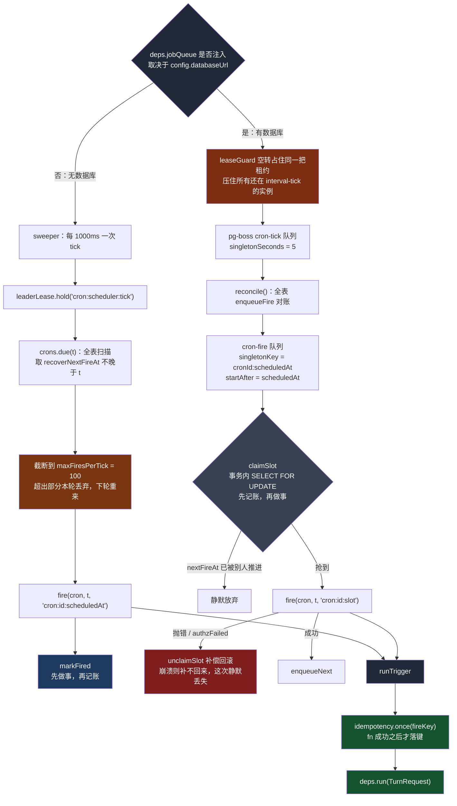
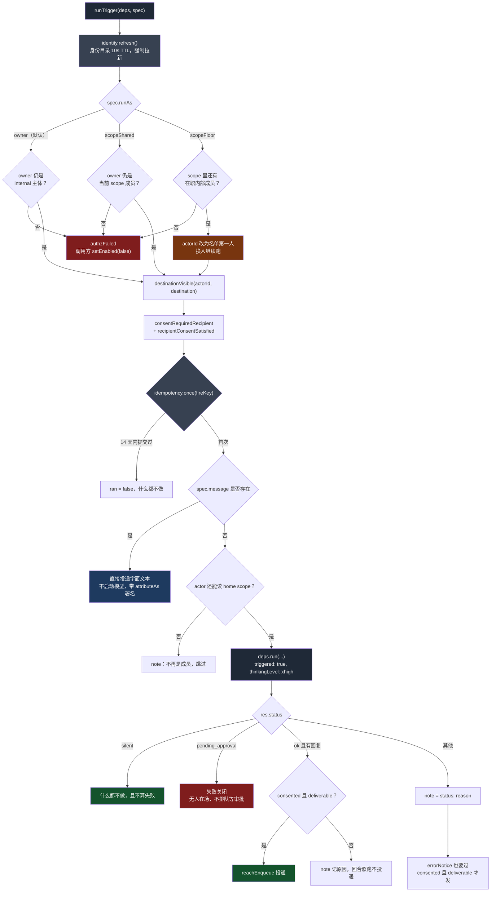
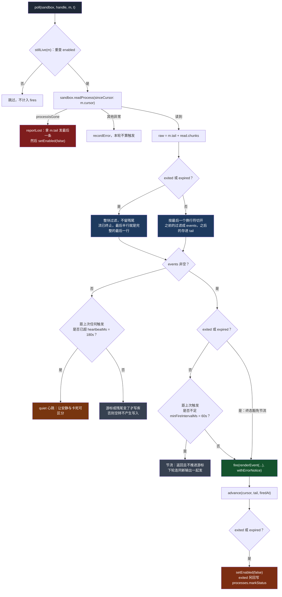

# QM 的自主工作层：定时任务不是「到点执行」，是「到点重新提问」

> 关联文档：
> - [[qm-overview]]（产品目标、八条哲学、十组模块分解）
> - [[qm-memory-layer]]（记忆层的逐文件深入分析）
> - [[qm-execution-layer]]（执行环境层深入分析，不含 skills）
> - [[qm-skills-layer]]（技能层深入分析——注册表、Pack 导入、物化、权限）
> - [[qm-resolution-layer]]（解析层深入分析——`Resolution` 对象、分层配置、audience floor、prompt 协议）
> - [[qm-turn-slice]]（纵切面——一条 Slack 消息从进入到回复送出，十九道闸门）
> - [[qm-harness-layer]]（Harness 层——四适配器一套接口、tape 事件溯源、上下文压缩、冷启动重放）
> - [[qm-run-lifecycle]]（执行内核的运行时——租约、排空、回收、中断重入）
> - [[qm-authz-layer]]（授权与安全层——身份、能力令牌、ACL、命令策略、安全姿态）
> - [[qm-credentials-layer]]（凭证层——借还协议、OAuth、加密盒、连接器状态缓存）
> - [[qm-publish-layer]]（发布层——共用两把 Postgres 锁；`publish` 的 upsert 与 `cron` 的先查后建成对照）
> - [[qm-surface-mirror]]（镜像层——「什么时候主动说话」的第三种答案：群里有人说了值得回应的话）
> - [[qm-crosscutting]]（横切件——`hashId` 的 NUL 分隔符；`cron-store` 与 `project-store` 对 CAS 的相反态度）
> - [[qm-assembly-layer]]（装配层——scheduler 的 pg-boss 队列在什么条件下才存在）
> - [[qm-synthesis]]（综述——本篇的 `runTrigger` 六问是「待验证的授权」一章的中心）
> - [[qm-surface-layer]]（表面层——有人在场的那一侧：登录、会话、冒充）
> - [[qm-web-client]]（Web 客户端——Crons 视图管理的就是这一层的对象）
>
> 调研对象：`yc-software/qm`（YC 出品的开源多人 agent harness）
> 本地路径：`~/Repositories/qm`
> 调研时间：2026-08-14
> 仓库版本：`main` @ `0f0e0ad`
>
> 阅读范围：`src/cron/`（4）、`src/monitors/`（3）、`src/triggers/`（6）、
> `src/wake/`（3）、`src/util/sweeper.ts`、`src/persistence/leader-lease.ts`、
> `src/idempotency/idempotency-store.ts`，共 18 个文件约 2100 行；
> 另核对 `src/persistence/durable-map.ts` 的事务语义、`src/core/turn-origin.ts`
> 与 `src/core/turn-options.ts` 的回合出身分类与模型参数、
> `src/api/control-service.ts` 的 cron 创建与 `runAs` 裁决、
> `src/harness/pi-tools.ts` 的 `cron` / `background` 工具描述原文、
> `src/security/security-posture.ts:111` 的数据承载 surface 判定、
> `src/core/orchestrator.ts` 中 `automatedTurn` 的全部分支、
> `src/wiring.ts:1260-1292` 的装配实参
>
> **本篇补上一个缺口**：[[qm-authz-layer]] §5.3 与 [[qm-credentials-layer]] §3.8
> 都提到「没有活人在场的回合不得行使管理权」，那是**否定的一半**。
> 本篇是肯定的一半——无人在场时，系统究竟允许 agent 做什么、
> 怎么让它知道自己身处什么处境、以及它做完之后的话由谁来听。

---

## 一、这一层在回答什么问题

三个目录看起来是三件事：`cron/` 管定时，`monitors/` 管后台作业，`triggers/`
管「触发」这个抽象。读完之后会发现这个分法是倒过来的——`triggers/run-trigger.ts`
才是主干，`cron/` 和 `monitors/` 只是它的两个调用者。

`runTrigger` 被五个 surface 调用：

| surface | 调用点 | 触发条件 | 可以沉默 | 输入要筛查 |
| --- | --- | --- | --- | --- |
| `cron` | `cron/scheduler.ts:120` | 到点 | 是 | 否 |
| `monitor` | `monitors/monitor-poller.ts:125` | 后台进程有新输出 / 退出 / 失联 / 长时间安静 | 是 | **是** |
| `keychain-ask` | `triggers/keychain-ask.ts:54` | 凭证请求被批准 / 拒绝 / 过期 | 否 | 否 |
| `secret-drop` | `triggers/keychain-ask.ts:114` | 密钥通过投递链接填入 | 否 | 否 |

（第五个是 `cron` 的 message-only 变体，见 §5.5，它走同一个函数但根本不启动模型。）

后两列各由一个只有一两个元素的集合决定：`POLL_SURFACES = {cron, monitor}`
（§8）和 `DATA_BEARING_SURFACES = {monitor}`（§9.8）。两个集合不重合也不包含，
因为它们问的是两个无关的问题——「这次没消息算不算成功」和「这次的输入是谁写的」。

把这四条摆在一起，共同点不是「定时」，是**「有一件事在没有人说话的情况下发生了，
需要让 agent 知道」**。而 `runTrigger` 做的事，用一句话概括：

> 调度器决定**何时**，`runTrigger` 决定**此刻是否仍然合法**。

这个分工是本层所有设计的来源。一个 cron 是三个月前某人建的；三个月里，这个人
可能离职了、被移出了频道、目标频道可能变成私有的了、当初同意接收提醒的人可能
改主意了。存下来的那条 cron 记录对这些一无所知。所以每一次 fire，
`runTrigger` 都从头重新问一遍（§5）——它不信任任何被存下来的授权判断。

换个说法：**cron 表里存的不是「一个待执行的动作」，是「一个待重新验证的授权」**。
动作只是那个授权的附属品。

---

## 二、时间有两种语义

`cron/schedule.ts`（122 行）是全组最小的文件，也是唯一一个纯函数文件。它坚持
「间隔」和「时刻」是两种不能混淆的东西。

### 2.1 两种 schedule，一个联合类型

```ts
export interface CronSchedule {
  cron?: string;       // 5 段 cron 表达式
  timezone?: string;   // IANA 时区
  everyMs?: number;    // 间隔
  firstFireAt?: number;
}
```

`isCalendarSchedule(schedule)` 就是 `schedule.cron !== undefined`。四个字段
分成互斥的两组，`normalizeSchedule` 在入口处强制这个互斥：

```ts
if (hasEveryMs || hasFirstFireAt) throw new Error("schedule.cron cannot be combined with everyMs or firstFireAt");
...
if (hasTimezone) throw new Error("schedule.timezone requires schedule.cron");
```

第二句是关键：**时区只对日历有意义**。`everyMs` 是一段物理时长，问它「在哪个
时区」是没有意义的问题，所以这个组合直接报错，而不是默默忽略。

### 2.2 一段会教书的报错

`schedule.ts:83-90` 是我在这个仓库里见过的最长的一条错误消息：

```ts
if (input.everyMs !== undefined && input.everyMs >= DAY_MS) {
  throw new Error(
    "schedule.everyMs >= 24h is almost always a clock-time schedule in disguise — it anchors to an " +
      "arbitrary epoch, has no timezone, and drifts with DST. Use {cron,timezone} for daily/weekly/monthly " +
      'runs (e.g. { cron: "30 7 * * 1-5", timezone: "America/Los_Angeles" }). Reserve everyMs for ' +
      "genuine sub-day polling where wall-clock time does not matter.",
  );
}
```

`everyMs: 86400000` 在技术上完全合法：它就是「每 24 小时一次」。系统仍然拒绝它，
理由是**这个写法几乎总是意图的错误表达**。写下它的人想要的是「每天早上七点半」，
而 `everyMs` 给他的是「从你创建那一刻起每隔 24 小时」——锚在一个随机时刻上，
夏令时切换时还会漂一小时。

这里有两件事值得单独说。

**第一，它拒绝的是一个合法输入。** 大多数校验拒绝的是非法值；这一条拒绝的是
「语法正确但语义几乎必然错」的值。这是把 API 设计意图硬编码进运行时的做法。

**第二，报错的读者是模型。** cron 是 agent 通过工具调用创建的，这条 `throw`
会作为工具错误回到模型的上下文里。所以这段文字不是写给运维看的日志，是**一段
即时的、只在犯错时才出现的文档**——它解释了为什么错、给了正确写法的完整示例、
还划清了 `everyMs` 剩下的合法用途。把纠正性文档放在错误路径上而不是工具描述里，
是一种很省 token 的教法：不犯错的人永远不用读它。

24 小时这个阈值下面还有一个下界，但它在另一个函数里：

```ts
export function validateUserSchedule(schedule: CronSchedule): void {
  if (schedule.everyMs !== undefined && schedule.everyMs < MIN_RECURRING_CRON_MS) {
    throw new Error(`schedule.everyMs must be at least ${MIN_RECURRING_CRON_MS}ms`);
  }
}
```

名字里的 `User` 是分界线：`normalizeSchedule` 对所有来源生效，
`validateUserSchedule`（下界 60 秒）只对用户/模型创建的 cron 生效。系统内部
如果要建一个更密的定时任务，绕过后者即可。**「谁能违反这条规则」被编码进了
函数名**，而不是一个 `internal: boolean` 参数。

### 2.3 从三个字段里恢复一个答案

`nextFireAt` 是一个缓存字段。它可能不存在（老记录、迁移、手工改库），所以
`recoverNextFireAt` 提供了一条四级回退链：

```ts
export function recoverNextFireAt(schedule, createdAt, lastFiredAt, nextFireAt) {
  if (nextFireAt !== undefined) return finiteEpochMs(nextFireAt, "nextFireAt");
  if (isCalendarSchedule(schedule)) return nextCalendarFireAfter(schedule, lastFiredAt ?? createdAt);
  if (lastFiredAt === undefined) return finiteEpochMs(schedule.firstFireAt, "schedule.firstFireAt") ?? createdAt;
  const everyMs = finitePositiveMs(schedule.everyMs, "schedule.everyMs");
  return everyMs === undefined ? undefined : lastFiredAt + everyMs;
}
```

依次是：缓存 → 日历重算 → 首次触发时间 → 上次触发加间隔。四条里只有第一条是
读缓存，后三条都是从**不可变的事实**（`schedule`、`createdAt`、`lastFiredAt`）
重新推导。这意味着 `nextFireAt` 这个字段可以整列删掉而系统不受影响，只是每次
都要多算一遍。

这也是为什么 `claimSlot` 敢用它做乐观锁的比较依据（§4.2）——比较的不是一个
存下来的数，是一个**可以从别处重新推出来的数**。

### 2.4 推进的起点分叉

`markFired` 和 `claimSlot` 里出现了同一行看起来很小的代码：

```ts
const advanceFrom = isCalendarSchedule(cron.schedule) ? (scheduledAt ?? at) : at;
```

日历任务从**计划时刻**往后推，间隔任务从**实际执行时刻**往后推。

这是两种完全不同的补偿策略。「每周一 9:00」如果因为服务重启拖到 9:07 才跑，
下一次仍然应该是下周一 9:00——从 `scheduledAt` 推进，**误差不累积**。而
「每 5 分钟轮询一次」如果这次拖到了第 7 分钟，下一次应该是第 12 分钟而不是
第 10 分钟——从 `at` 推进，**保证两次执行之间至少隔了一个间隔**。

如果间隔任务也从 `scheduledAt` 推进，一次长时间停机之后 `due()` 会一口气返回
几百个逾期 slot（这正是 `maxFiresPerTick` 存在的原因，§3.1）。选择从 `at`
推进等于说：**间隔任务积压的历史不需要补课**。

---

## 三、两套调度引擎，和它们之间的毒丸

`cron/scheduler.ts`（301 行）里有两套互不相干的执行引擎，由 `deps.jobQueue`
是否被注入来选择。

### 3.1 单进程路径：扫全表

```ts
const fireDue = async (t: number): Promise<void> => {
  const due = await deps.crons.due(t);
  const batch = due.slice(0, maxFiresPerTick);
  if (due.length > batch.length) {
    console.warn(`[scheduler] fan-out capped: firing ${batch.length}/${due.length} due crons this tick`);
  }
  for (const cron of batch) {
    const { authzFailed } = await fire(cron, t, `cron:${cron.id}:${cron.scheduledAt}`, cron.scheduledAt);
    if (!authzFailed) await deps.crons.markFired(cron.id, t, cron.scheduledAt);
  }
};
```

`sweeper` 每秒调一次 `tick`（`index.ts:106` 的 `scheduler.start(1000)`，整段
受 `config.backgroundWorkEnabled` 控制），`tick` 在 `leaderLease` 保护下扫全表。
批量上限 `maxFiresPerTick` 在 `wiring.ts` 里没有传，取默认 100，超出部分
**不是排队，是本 tick 直接丢弃**——下一个 tick 会重新 `due()`，它们还在，
只是被推后了一秒。截断加一条 `console.warn`，没有指标、没有告警。

`for` 循环是串行 `await` 的：100 个到期的 cron 会一个接一个跑完，每个都要等一
整个模型回合。实际上 `maxFiresPerTick = 100` 在这条路径上几乎不可能触及，因为
一秒的 tick 间隔远小于跑完一个回合的时间——真正的限流是串行本身。

### 3.2 多进程路径：pg-boss

```ts
await boss.createQueue(FIRE_QUEUE, { policy: "short", notify: true });
await boss.createQueue(TICK_QUEUE, { policy: "short", notify: true });
```

`cron/job-queue.ts`（88 行）在 Postgres 上开了两个队列：`cron-fire` 装具体的
「某个 cron 在某个 slot 该跑了」，`cron-tick` 装「该做一次全表对账了」。

投递用的是 pg-boss 的两个特性：

```ts
await boss.send(FIRE_QUEUE, job, {
  startAfter: new Date(job.scheduledAt),
  singletonKey: `${job.cronId}:${job.scheduledAt}`,
  retryLimit: 0,
});
```

`startAfter` 把「到点」这件事下放给了数据库——不需要任何人轮询，pg-boss 自己
在 `scheduledAt` 之后才让这个 job 可见。`singletonKey` 保证同一个 `(cron, slot)`
不会被排两次，这是**三层幂等的第一层**（§4）。`retryLimit: 0` 则说明这里不做
自动重试：cron fire 的重试语义由上层的 slot 推进逻辑负责，不是队列的事。

`onTick` 挂的是 `reconcile()`——全表遍历，把每个启用的 cron 的下一个 slot 重新
`enqueueFire` 一遍。因为有 `singletonKey`，重复投递是无害的。所以 tick 在这条
路径上退化成了**兜底对账**：正常情况下每次 fire 结束会自己 `enqueueNext`，
tick 只是在那条链断掉时把它接回来。

链条的第三个接入点是 `notifyChanged`：`wiring.ts:896-914` 用一层装饰器包住
`CronStore`，在 `create` / `update` / `setEnabled` 之后调
`scheduler.notifyChanged(id)`，后者重新 `enqueueNext`。改了 schedule 不必等
下一次对账。这个方法**在无队列路径上是空操作**（`scheduler.ts:273`
`if (!deps.jobQueue) return;`）——那条路径每秒扫一次全表，本来就不需要被通知。

装饰器覆盖了三个方法，没覆盖 `delete`。删掉的 cron 队列里可能还留着一个 job，
但 `fireJob` 的第一句 `if (!cron || cron.archived || !cron.enabled) return;`
会把它挡掉。**在一个已经会自查的消费端面前，生产端的清理是可选的**——这是
用消费端幂等换生产端简单的一次取舍。

### 3.3 那个不做事的租约持有者

```ts
const leaseGuard = createSweeper(
  () =>
    deps.jobQueue!.healthy()
      ? leaderLease.hold(TICK_LEASE_KEY, async (lost) => {
          let lockLost = false;
          void lost.then(() => (lockLost = true));
          while (!stopped && !lockLost && deps.jobQueue!.healthy())
            await Promise.race([sleep(1000, { unref: true }), lost]);
        })
      : undefined,
  1000,
  { label: "scheduler lease guard", immediate: true },
);
```

这段代码在租约里什么都不做——`while` 循环体只有一个 `sleep`。

它的作用是**占位**。`TICK_LEASE_KEY` 是 `"cron:scheduler:tick"`，和 §3.1 的
`tick()` 抢的是同一把锁。所以只要本进程的 pg-boss 队列是健康的，它就一直握着
这把锁不放，让任何还在跑 interval-tick 模式的实例**永远拿不到锁、永远扫不了表**。

这是一个滚动升级期的互斥装置：新版本（队列模式）一旦起来并健康，就用锁把旧版本
（轮询模式）的调度路径按住。等价的做法是加一个全局开关标志，但那需要一次额外的
配置分发和一段两边都要读的代码；用一把两边**已经在抢的锁**来表达，不需要任何
新协议。

三个退出条件同样值得看：`stopped`（本进程在关）、`lockLost`（数据库连接断了，
锁自动释放）、`!healthy()`（队列不再健康）。第三条是自我让位——**pg-boss 挂了,
就主动松手让轮询模式接管**。而 `healthy()` 的定义是：

```ts
const HEALTHY_SEND_MAX_AGE_MS = 30_000;
healthy() {
  return started && Date.now() - lastSendOkAt < HEALTHY_SEND_MAX_AGE_MS;
}
```

`lastSendOkAt` 只在 tick 成功投递时更新。也就是说健康的判据不是「连接是否还在」，
是「最近 30 秒内是否真的成功写进过队列」——**用一次真实的写操作证明可用性，
而不是用一个心跳包**。

### 3.4 顺序相反的同一对操作

两条路径都要做「跑一次」和「推进 slot」这两件事，但顺序是反的：

| | 顺序 | 崩溃在中间的后果 |
| --- | --- | --- |
| 单进程 `fireDue` | `fire()` → `markFired()` | slot 没推进，下个 tick 重来；靠 `idempotency.once(fireKey)` 去重，**不会重复执行** |
| 多进程 `fireJob` | `claimSlot()` → `fire()` → 失败则 `unclaimSlot()` | 崩溃时 `unclaimSlot` 跑不到，slot 已推进，**这一次静默丢失** |

两种都是标准做法：前者是「先做事再记账」（at-least-once + 幂等键），后者是
「先记账再做事」（at-most-once + 补偿）。挑法取决于并发度——单进程不需要抢
所有权，多进程需要，而抢所有权只能在动手之前抢。

代价是多进程路径多了一个丢失窗口。`unclaimSlot` 覆盖了两种可预期的失败
（`fire` 抛错、`authzFailed`），但覆盖不了进程被 kill。补偿式回滚的边界一向
如此：它是应用层的 undo，不是事务。

`unclaimSlot` 本身写得很小心：

```ts
const restore = (cron: Cron): Cron => {
  if (cron.lastFiredAt !== at) return cron;
  ...
};
```

只有在 `lastFiredAt` 还是自己写下的那个值时才回滚。如果期间已经有别人抢到并
推进了 slot，这次回滚就放弃——**补偿操作要先确认自己补偿的还是自己造成的那个状态**。

两条路径的全貌：



---

## 四、三层幂等，没有一层单独够用

「同一个 cron slot 只跑一次」这件事，在这个系统里由四个互不知情的机制共同保证，
每一个都只堵一种漏。

### 4.1 第一层：pg-boss 的 `singletonKey`

`singletonKey: "${cronId}:${scheduledAt}"` 防的是**同一个 slot 被排进队列两次**。
`reconcile()` 每次 tick 都会把所有 cron 的下一个 slot 重排一遍，没有它，队列里
会堆满同一个 job 的副本。

它不防：两个 worker 同时取走同一个 job（那是 pg-boss 的 job 状态机管的），也
不防同一个 slot 在被消费完之后被重新排入（`policy: "short"` 下 singleton 的
去重窗口只覆盖未完成的 job）。

### 4.2 第二层：`claimSlot` 的事务内 CAS

```ts
async claimSlot(id, scheduledAt, at) {
  let claimed = false;
  const transform = (cron: Cron): Cron => {
    claimed = false;
    if (cron.archived || !cron.enabled) return cron;
    if (recoverNextFireAt(cron.schedule, cron.createdAt, cron.lastFiredAt, cron.nextFireAt) !== scheduledAt)
      return cron;
    claimed = true;
    ...
  };
  if (backing.update) {
    await backing.update(id, transform);
    return claimed;
  }
```

`DurableMap.update` 的 Postgres 实现是真正的行级 CAS：

```ts
async update(id, fn) {
  return withBump(async (client) => {
    const current = await client.query(`SELECT json FROM ${table} WHERE id = $1 FOR UPDATE`, [id]);
    if (!current.rows[0]) return null;
    const next = fn(current.rows[0].json as T);
    await client.query(`UPDATE ${table} SET json = $2 WHERE id = $1`, [id, JSON.stringify(next)]);
    return next;
  });
}
```

`SELECT ... FOR UPDATE` 在 `withBump` 开的事务里，所以「读当前 `nextFireAt`
→ 判断是不是我要的那个 slot → 推进它」是原子的。两个 worker 同时进来，一个
拿到锁推进，另一个在锁上等，等到之后 `recoverNextFireAt` 已经不等于
`scheduledAt` 了，`claimed` 保持 false。

顺带一提，这个原子性其实是**免费的**——`withBump` 的第一句是：

```ts
await client.query("BEGIN");
await client.query(bumpSql);   // UPDATE durable_map_versions SET v = v + 1 WHERE tbl = '...'
```

每一次写操作都要更新 `durable_map_versions` 里属于该表的那一行。这意味着**同一张
DurableMap 表上的所有写入本来就被那一行序列化了**。版本号的本意是给
`snapshot()` 做缓存失效（`all()` 有 15 秒 TTL，版本变了就重取），副作用是给整张
表加了一把写锁。

`claimSlot`、`unclaimSlot`、`recordFire` 三个方法都写成了「有 `update` 走 CAS，
没有就退回 `get` + `merge`」的双分支。但 `DurableMap` 的两个实现——内存版
（`durable-map.ts:65`）和 Postgres 版（`:194`）——**都实现了 `update`**。接口里
的 `update?` 是可选的，实际却没有任何一个实现缺它。这三段回退分支在当前代码库
里是不可达的。（见 §12 存疑 1。）

### 4.3 第三层：`idempotency.once(fireKey)`

```ts
async once(key, fn) {
  if (inflight.has(key)) return false;
  inflight.add(key);
  try {
    if (await isCommitted(key)) return false;
    await fn();
    const at = now();
    await backing?.put(key, { key, at });
    ...
```

注意写键的时机：**在 `fn()` 成功返回之后**。如果 `fn` 抛错，键不落，下次重来。
这是「至少一次 + 成功后去重」，不是「至多一次」。保留期 14 天
（`DEFAULT_RETENTION_MS`），所以一个 fireKey 在两周内不会被重放。

`fireKey` 的构造决定了去重的粒度：

- cron 定时：`cron:${id}:${scheduledAt}` —— 按 slot 去重
- cron 手动：`cron:${id}:manual:${randomUUID()}` —— **永不去重**，`runNow` 每次都真跑
- monitor 输出：`monitor:${m.id}:${m.cursor}` —— 按游标位置去重
- monitor 退出：`monitor:${m.id}:exit` —— 一个 monitor 一生只报一次退出
- monitor 心跳：`monitor:${m.id}:quiet:${quietSince}` —— 按上次触发时刻去重
- 凭证请求：`ask:${ask.id}:${ask.status}` —— 同一个 ask 的每种终态各一次

`runNow` 那条最能说明设计意图：手动触发不参与幂等，因为**人重复点一次就是想再
跑一次**。幂等键的作用范围被限定在「系统自己重试」上。

### 4.4 第四层：`inflight` 只管进程内

`inflight` 是一个普通的 `Set<string>`，进程内的。它防的是同一进程里的并发重入，
跨进程完全无效——两个进程可以同时通过 `isCommitted` 检查然后都执行 `fn`。

所以真正的跨进程互斥从来不是幂等存储提供的，是 `leaderLease` 和 pg-boss 的 job
状态机提供的。**幂等存储防的是时间上的重放，租约防的是空间上的并发**，两者不能
互相替代。这一点在代码里没有注释说明，只能从 `inflight` 是个本地 `Set` 这个事实
推出来。

---

## 五、`runTrigger`：一次触发要重新回答的六个问题

`triggers/run-trigger.ts`（293 行）是本层的主干。函数体是一条长长的检查链，
每一步都可能提前返回。



### 5.1 第一句就是刷新

```ts
export async function runTrigger(deps: TriggerDeps, spec: TriggerSpec): Promise<TriggerOutcome> {
  await deps.identity.refresh();
```

这和 [[qm-authz-layer]] §3.2 里 API 层的做法一致：身份目录有 10 秒 TTL，触发
回合在做任何判断之前先把它拉新。区别在于 API 层是因为「这个请求可能来自一个
刚被停用的人」，触发层是因为「这条 cron 可能是三个月前建的」——同一个动作，
两种完全不同量级的陈旧风险。

### 5.2 `runAs`：三种「以谁的身份跑」

```ts
runAs?: "owner" | "scopeFloor" | "scopeShared";
```

- **`owner`**（默认）：以创建者身份跑。检查是 `identity.classify(spec.owner).type === "internal"`——人还在编制内吗。
- **`scopeFloor`**：以「这个 scope 里还剩下的任意一个内部成员」身份跑。
- **`scopeShared`**：以 owner 身份跑，但要求 owner **此刻仍然是这个 scope 的当前成员**。

`scopeFloor` 的实现是本层最有意思的一段：

```ts
const internalMembers = members.filter(
  (m) => m.type === "internal" && deps.identity.classify(m.id).type === "internal",
);
if (internalMembers.length === 0) {
  return { authzFailed: true, ran: false, note: "scopeFloor cron has no internal members left" };
}
if (!internalMembers.some((m) => samePerson(m.id, spec.owner))) actorId = internalMembers[0]!.id;
```

原 owner 走了，cron 不停——它**换一个人继续跑**，挑的是成员列表里的第一个还在职
的内部成员。这是「这个频道的定时任务属于频道，不属于建它的那个人」的表达。反过来
`scopeShared` 是「属于那个人，但只在他还在这个频道里时有效」。三种模式覆盖了
「任务的归属」这个问题的三种答案，而这个选择被暴露成了一个字段而不是硬编码的策略。

注意 `m.type === "internal"` 和 `identity.classify(m.id).type === "internal"`
两个条件都要满足：前者是**存下来的**成员记录上的标记，后者是**此刻**的身份服务
判断。两个都查是因为它们会分歧——成员列表是快照，身份服务是实时的。这又是同一
个模式：存下来的授权判断不被信任。

`runAs` 不只决定「以谁的身份跑」，还决定「谁能改它」。
`control-service.ts:130-142`：

```ts
const team = cron.runAs === "scopeFloor" || cron.runAs === "scopeShared";
```

团队模式的 cron，同 scope 里任何人都能改；`owner` 模式只有 owner 能改。而
**模式本身只有 owner 能改**（`resolveRunAsChange`，`control-service.ts:162-168`）——
否则任何成员都可以把一个 `owner` cron 改成 `scopeShared`，从而给自己拿到编辑权。

`scopeShared` 的准入条件最严，因为它是三种里唯一会把 owner 的**个人凭证**带进
共享 scope 的：

```ts
const eligibleForShared =
  !ownerScopeId.startsWith("personal:") && scopeIsMembershipControlled(ownerScopeId, capability);
// scopeIsMembershipControlled = cap.privateScope === true && cap.scopeId === scope
```

`privateScope` 由 orchestrator 在铸造能力令牌时写入，只对 DM / 群组 / 私有频道 /
多人私聊为真。所以 `scopeShared` 只能在**成员资格受控的 scope 里、并且从那个
scope 内部**创建。公开频道不行——公开频道的成员名单不构成一道门。
`routes/crons.ts:231-236` 还在非能力令牌的原始创建路径上把 `scopeShared` 整个
拒掉，理由写在报错里：「scopeShared crons must be created through an agent
capability (it validates the scope is membership-controlled)」。

这个字段最终的落点是 `ownerKeychainUnion`：

```ts
...(isScopeShared ? { ownerKeychainUnion: true } : {}),
```

它在 orchestrator 里展开成 owner 个人凭证与 scope 共享凭证的并集
（`orchestrator.ts:939-965`）。如果 `SHARED_OWNER_AUTH_ISOLATION` 打开，这些
凭证不进环境变量，而是走 `ownerAuthCommand` 逐条命令注入，每次注入记一条
`keychain.materialize ... (owner-auth command)` 审计。这条线的另一头在
[[qm-credentials-layer]]。

`routes/turns.ts:37` 会把外部提交的回合里的 `ownerKeychainUnion` 字段直接解构
丢弃——**这是一个只能由内部代码设置的标记**，外面传进来一律不认。

### 5.3 家 scope 的可读性

```ts
const canReadHome =
  currentMembers === undefined
    ? !deps.directory || (await actorMayReadScope(deps, actorId, ownerKind, ownerRef))
    : currentMembers.some((member) => samePerson(member.id, actorId));
if (!canReadHome) {
  note = "the acting person is no longer a member of this trigger's home scope — run skipped";
  return;
}
```

`actorMayReadScope` 按 scope 种类分流：`personal` 比对是不是同一个人，`group`
和 `channel` 查目录可见性，其余放行。私有频道那一支值得单看：

```ts
const isPrivate = await deps.directory.channelPrivacy?.(ref);
if (isPrivate === undefined) return false;
```

查不到隐私属性就当**不可读**。这是失败关闭——和 [[qm-credentials-layer]] §4.3
里 OAuth 去重设施不可用时的处理同向，判据同样是「猜错的后果是把内容送到不该
看的人面前」。

而 `!deps.directory` 那一支相反：**没有目录服务就全放行**。同一个函数里，
「目录不存在」放行，「目录存在但答不上来」拒绝。这不矛盾——前者是部署形态
（单租户、没接 Slack），后者是运行时故障。

### 5.4 目标是否还看得见

```ts
const deliverable = spec.destination ? await destinationVisible(deps, actorId, spec.destination) : true;
const notVisibleNote = "destination is no longer visible to the cron owner — delivery skipped";
```

`destinationVisible` 检查的是**执行者**能不能看见投递目标。注意这里用的是
`actorId` 不是 `spec.owner`——在 `scopeFloor` 模式下这两个可能不是同一个人。
接管 cron 的那个人必须自己能看见目标频道，才允许往那里投。

关键在于失败之后做什么：`note` 记下来，**回合照跑，只是不投递**。这是一次
「计算与送达分离」——判断投递权和执行任务是两件独立的事，前者失败不阻止后者。

### 5.5 一个不跑模型的 cron

```ts
const ran = await deps.idempotency.once(spec.fireKey, async () => {
  if (spec.message !== undefined) {
    status = "ok";
    if (!spec.destination) return;
    ...
    await reachEnqueue({ ..., text: spec.message, ... });
    return;
  }
```

`Cron` 类型上同时有 `action`（给 agent 的任务）和 `message`（一段字面文本）。
如果设了 `message`，整个模型回合被跳过——直接把这段文字投出去。

这是一个纯提醒：「每周五下午三点在 #team 发『别忘了填周报』」不需要任何智能。
系统识别出这一类并把它做成了零成本路径。在一个每个功能都想过一遍 LLM 的产品里，
留一条**明确绕开模型**的通道是个克制的决定。

这条路径上还挂了一个署名：

```ts
async function relayAttribution(deps: TriggerDeps, spec: TriggerSpec): Promise<string | undefined> {
  if (spec.message === undefined || !deps.directory) return undefined;
  const member = await deps.directory.get(spec.owner).catch(() => null);
  return member?.displayName;
}
```

只有 message-only 的投递才带 `attributeAs`。因为这段文字是**某个人写的**，不是
agent 生成的，署名应该归他。`action` 路径的产出是模型写的，就没有这个字段。
这是 [[qm-authz-layer]] 里那条「标注出身」方法论在投递侧的一次落点。

### 5.6 没有人在场时遇到审批

```ts
if (res.status === "pending_approval") {
  note = "hit a require_approval command — failed closed (no human at fire/event time)";
  console.warn(`[trigger] ${spec.surface} ${spec.fireKey} ${note}`);
  return;
}
```

这是本篇标题那个问题的正面回答之一：**无人在场的回合遇到需要审批的命令，
直接失败，不排队等审批**。

不排队是有理由的。一个排队等待的审批意味着一个悬挂的执行上下文——sandbox 还占着、
会话还开着、状态还在。cron 每分钟可能起一个，悬挂会堆积。而且到人来批的时候，
「早上 7:30 的那次定时任务」这个上下文早就过期了。所以选择是**当场放弃并留痕**：
`note` 会进 `fireLog`，人可以在 `cron` 工具的 `runs` 里看到「这次因为撞上审批而
没跑」。

### 5.7 出错通知只在能送达时才发

```ts
if (spec.errorNotice && spec.destination && consented && deliverable && isTriggerFailure(outcome)) {
  await deps.deliveries.enqueue({
    destination: spec.destination,
    text: spec.errorNotice(note ?? status!),
    idempotencyKey: `${spec.fireKey}:err`,
    ...
```

五个条件全满足才发错误通知。`consented && deliverable` 出现在这里的意思是：
**连正常输出都不许投的目标，错误通知也不许投**。错误通知不是一条特权消息，
它受同一套投递门禁管。

`errorNotice` 是个函数不是字符串，由调用方提供措辞。只有 monitor 传了它：

```ts
errorNotice: (s) => `⚠️ A background-job update (\`${m.command}\`) could not run: ${s}`
```

cron 不传——cron 的失败进 `fireLog` 就够了，因为 cron 是用户主动建的、会主动去
查的东西；而 monitor 是 agent 自己挂上的观察，用户根本不知道它存在，出了问题
必须主动说。**是否打扰用户，取决于这件事是不是他自己安排的。**

---

## 六、同意有两方

一个 cron 可能把内容投到**第三个人**那里：A 建了个 cron，每天早上给 B 发一条
提醒。这里有两个人的同意需要收集，代码把它们分得很干净。

### 6.1 owner 一侧：不许替别人背锅

```ts
export function assertNoEscalation(input: { owner: string; createdBy: string; ownerConsentedAt?: number }): void {
  if (!samePerson(input.owner, input.createdBy) && !input.ownerConsentedAt) {
    throw new Error("assigning a different owner requires that owner's consent");
  }
}
```

`owner` 和 `createdBy` 是两个字段。`owner` 是这个 cron **以谁的权限跑**，
`createdBy` 是谁建的。默认相同；不同时必须有 `ownerConsentedAt`。

这堵的是权限提升：否则我可以建一个 `owner` 是 CTO 的 cron，让它每天以 CTO 的
身份去读我读不到的东西。`cron-store.ts` 和 `monitor-store.ts` 的 `create()`
第一行都是这个断言。

有意思的是**目前没有任何代码会产生 `ownerConsentedAt`**。全仓搜索只有：类型声明
（`types.ts:155`、`trigger-store.ts:10`）、这个断言、`buildTriggerBase` 的透传
（`:82`），和三行测试。能力令牌路径把 `owner` 和 `createdBy` 都硬写成
`capability.actorId`（`control-service.ts:407-410`），monitor 那边同理，
所以 `samePerson` 恒真，断言恒不触发。唯一能让两者不同的入口是原始
`POST /v1/crons` 那条服务端到服务端的路径。

也就是说，**「代人创建 cron」这个功能没有实现，被实现的只是它的不变量**。先把
门装好，将来开这扇门时不必回头找该在哪加检查。这是一种预先支付的设计成本——
代价是一个当前不可达的分支和一个没有生产者的字段。

### 6.2 收件人一侧：只有周期性的、发给别人的才要同意

```ts
export function consentRequiredRecipient(input: {
  owner: string; standing: boolean; destination?: Destination;
}): string | undefined {
  if (!input.standing) return undefined;
  const d = input.destination;
  return d?.type === "principal" && !samePerson(d.target, input.owner) ? d.target : undefined;
}
```

三个条件同时成立才需要收件人同意：

1. `standing === true` —— 调用方传的是
   `recipientConsentRequired: cron.schedule.everyMs !== undefined || cron.schedule.cron !== undefined`，
   也就是**周期性任务才算 standing**。一次性提醒不需要征得同意。
2. `d?.type === "principal"` —— 投给一个具体的人（私聊），不是频道。
3. `!samePerson(d.target, input.owner)` —— 投给的不是自己。

这三条圈出的正是「订阅」这个概念：**反复地、私下地、往别人那里推送**。少任何
一条都不构成骚扰——发一次是提醒，发到频道是公开的（频道有它自己的准入），发给
自己是闹钟。

同意的判定同样严格：

```ts
export function recipientConsentSatisfied(input, requiredRecipient?): boolean {
  if (!requiredRecipient) return input.recipientConsent === undefined || input.recipientConsent.status === "accepted";
  return (
    input.recipientConsent?.status === "accepted" && samePerson(input.recipientConsent.recipientId, requiredRecipient)
  );
}
```

第二条里 `samePerson(...recipientId, requiredRecipient)` 这半句是防篡改：光有
一条 `status: "accepted"` 不够，那条同意记录**必须是当前这个收件人给的**。
如果 cron 的 destination 被改到了另一个人身上，旧的同意自动失效。

第一条（不需要同意时）也有讲究：`recipientConsent === undefined ||
status === "accepted"`。即使这次不需要同意，如果已经有一条 `declined` 的记录，
仍然拦。**「我不需要问你」不能覆盖「你已经说过不要」。**

### 6.3 拒绝和未答用不同的措辞

```ts
const consentNote =
  spec.recipientConsent?.status === "declined"
    ? "recipient turned this delivery off — skipped"
    : "awaiting the recipient's consent — delivery skipped";
```

两句话都进 `fireLog`，owner 能看见。区别是：前者是终局，后者是在等。这条 note
是 owner 唯一能知道「为什么我的提醒没发出去」的渠道，所以两种状态必须可区分——
否则 owner 会一直等一个永远不会来的答复。

### 6.4 征求同意的那条私信

`triggers/consent-notice.ts` 整个文件只有 21 行，核心是一段文案：

```ts
`${who} set up ${args.what} to be delivered to you. It won't start until you accept.\n` +
`Tell me "accept" to start receiving it, or "decline" to keep it off — you can stop it anytime. (ref: ${args.triggerId})`
```

`who` 默认 `"A teammate"`——查不到发起人显示名时不暴露原始 principal id。
`idempotencyKey: "consent-notice:${triggerId}"` 保证同一个 cron 只骚扰一次。

三句话说清了四件事：谁、什么、在你同意前不会开始、随时可以停。**「It won't
start until you accept」出现在第一句**，因为这决定了收件人要不要紧张——如果
默认是开着的、要主动关，那这条通知就是一个待办；默认是关着的，它只是一个可以
忽略的邀请。

回应的路由是 `POST /v1/triggers/:id/consent`。这里有一条例外规则，在
`api/server.ts` 的 `strictPostAllowed` 末尾：

```ts
return (
  /^\/v1\/triggers\/[^/]+\/consent$/.test(pathname) && (body as { decision?: unknown } | null)?.decision === "decline"
);
```

`strict` 安全姿态下几乎所有写操作都要走人工审批（见 [[qm-authz-layer]] §7），
这条路由被单独放行——但**只放行 `decline`**。`accept` 仍然受管。

方向是对的：拒绝是收缩权限，同意是扩张权限。一个处在最严格姿态下的系统，应该
让「关掉一个东西」永远畅通，而「打开一个东西」照常走审批。这和整篇里
「叠加约束、从不合并权限」的取向一致（[[qm-resolution-layer]] 的收紧代数）。

---

## 七、给模型的情境说明书

本层花在「向模型解释它此刻的处境」上的代码，比花在「告诉它做什么」上的多。

### 7.1 跨 fire 只有两样东西活着

`renderCronFireInput` 包在每一次 cron fire 的输入外面：

```
[Cron runtime context]
Cron id: {id} ({title}).
Each fire runs as a fresh thread with no memory of previous fires. Two things persist between fires:
- Your workspace disk. Durable state — notes, queues, checkpoints, anything a future fire should know — lives in files there.
- The stored task below: the standing instructions every fire receives. Edit it (via the cron tool) only to change what future fires are told to do.
The retained fire log (cron tool, action="runs", id="{id}") shows how prior fires went — useful when this run hits errors or surprising state.
[End cron runtime context]

Stored cron task:
{task}
```

这段话是整个自主工作层的运行时模型的完整说明，讲清了三件事：

**第一，会话不跨 fire。** `cronFireThreadRef` 每次生成一个新的
`cron:{id}:fire:{hash}`，所以每次 fire 都是全新会话。这不是限制，是刻意的——
一个每天跑一次的 cron 如果共用一个会话，一年后上下文里堆着 365 次的历史。

**第二，要持久化就写文件。** 无状态的回合 + 一块持久磁盘，是这里给自主 agent
的存储模型。跟「让 agent 有长期记忆」的做法比，这个更朴素也更好排查——状态在
文件系统里，人可以直接去看。

**第三，任务文本本身是可写的状态。** 「Edit it only to change what future fires
are told to do」——模型被明确告知它可以改自己的指令，以及什么时候该改。这是把
一个自我修改的能力**连同它的使用边界一起**交出去。

第三点还回答了一个 prompt 工程上的问题：怎么让一个无状态的循环体演化？两条路，
改代码或改数据。这里选了改数据，并且把「数据」和「这一次的临时笔记」区分开——
前者进 stored task，后者进磁盘。

### 7.2 叫名字不会 ping

```ts
function mentionable(m: DirectoryMember): string {
  const mentionId = m.slackId ?? (/^[A-Z0-9]+$/i.test(m.principalId) ? m.principalId : undefined);
  return `@${m.displayName}${mentionId ? ` (<@${mentionId}>)` : ""}`;
}
```

加上给模型的那句话：

```
If this reminder is for a specific person, @-mention them with their <@…> id so they're
actually notified — addressing them by name alone does not ping them.
```

模型不知道 Slack 的 mention 语法必须用 ID。它会很自然地写「@Alice 别忘了…」，
而这在 Slack 里只是一段普通文字，Alice 收不到通知。定时提醒不响，等于没有。

所以这里做了两件事：把名册渲染成 `@Alice (<@U123ABC>)` 这种**两种形式并列**的
格式，让模型两个都能看到；再用一句话解释为什么要用后者。名册本身有上限：

```ts
const CRON_MENTION_ROSTER_MAX = 40;
if (!members.length || members.length > CRON_MENTION_ROSTER_MAX) return undefined;
```

超过 40 人**整个名册都不给**，不是截断。因为一份被截断的名册比没有名册更糟——
模型会以为它看到了全部，然后漏掉不在前 40 名里的那个人。

`cronMentionRoster` 还限定了范围：只在 `channel` / `group` 类型的 destination 上
生成，私聊不需要（只有一个收件人）。整段还包在 `.catch(() => undefined)` 里——
名册取不到就不给，不影响 fire。

### 7.3 防止说明书被自己吃回去

```ts
function cronFireLogReply(s: string): string {
  if (s.includes("[Cron runtime context]") || s.includes("[End cron runtime context]")) {
    return "[reply echoed cron runtime context; omitted]";
  }
  return truncate(s, CRON_FIRE_REPLY_MAX_CHARS);
}
```

模型有时会把输入里的内容原样抄回来。如果它抄回了那段 runtime context，
这段文字会被记进 `fireLog`；而 `fireLog` 是模型下次可以通过 `runs` 读到的东西。
于是下一次 fire 里会同时出现真的 runtime context 和一份历史副本——模型没法分辨
哪个是当前的。

检测到就整条丢掉，不做剥离。剥离要处理部分匹配、嵌套、变形，而这条 reply 的
价值本来就不高（它是一份日志摘要），直接丢是划算的。

这类问题——**系统给模型的框架文字被模型复述后回流进系统**——在有回放机制的地方
都会出现。qm 在这里给了一个便宜的处理：给框架文字加固定标记，凡是回流的内容
带这个标记就整块作废。

### 7.3b 工具描述里的另一半规矩

runtime context 讲的是「你现在处在什么处境」，`cron` 工具的描述
（`harness/pi-tools.ts:1359-1407`，九个 action：`create/list/get/runs/patch/
delete/run/disable/retarget`）讲的是「你该怎么安排」。几条值得抄：

```
ALWAYS confirm the timing with the user before you create a schedule.
ONE recurring job = ONE cron: before creating, action=list and if a cron for
this job already exists, action=patch it in place — never create a second.
```

模型建 cron 太容易了，而 cron 是**会自己反复执行的副作用**。建重了的后果不是
一条冗余记录，是用户每天收到两遍同样的提醒。「先 list 再决定 create 还是 patch」
是把去重的责任显式交给模型——存储层的内容哈希去重（`cron-store.ts:64-74`）只
能挡住完全一致的重复，挡不住「同一件事的两种写法」。

`title` 那条也很具体：

```
a 2-5 word label naming what the cron is FOR (e.g. "Gmail unread digest",
"GitLab CI watch") — not the command it runs, not a generic word like "Run" or
"First". It sits in a list next to the owner's other crons, so make it
distinctive and scannable.
```

给出了长度、给出了三个正例、点名了两个反例、并且**解释了为什么**（它会出现在
一个列表里）。模型写标题的默认倾向就是复述命令或者写「Run」，这条描述把这两种
失败模式直接点名。

`everyMs` 与 `{cron,timezone}` 的选择规则在工具描述里出现了两遍（总述一遍、
参数级描述再一遍），措辞和 §2.2 那条运行时报错一致。**同一条规则在三个地方
重复**：工具总述、参数描述、以及违反时的报错。这不是冗余——三处的读者不同：
总述在模型规划时读，参数描述在填参数时读，报错只有犯错的人读到。

持久化那句和 runtime context 里的说法互为呼应：

```
`task` is the standing instructions every fire receives — patch it only to
change what future fires are told to do; durable run-state (notes, workarounds,
checkpoints a future fire needs) lives in files on the cron's workspace disk,
not in `task`.
```

`background` 工具那边有一条对应的（`pi-tools.ts:1038`）：回合的 token 会耗尽，
所以「checkpoint your progress to the workspace and continue from a later turn
or a cron」。**两个工具描述指向同一块磁盘**，构成了自主 agent 的完整存储建议。

### 7.4 monitor 的事件描述

monitor 侧的 `renderEvent` 更完整。它每次给模型的消息有固定的四段结构：

```ts
`[background job update — automated, not a user message] You are watching background job ${m.processId} (\`${m.command}\`) in this conversation. ${what}`,
...(capped.trim() ? ["", "<output>", capped, "</output>"] : []),
...(m.instructions ? ["", `When you armed this watch you said: ${m.instructions}`] : []),
"",
"Act on this. The user can't see the job, so when something changed that's worth telling them, ..." + replyGuidance(ev) + "Use the `background` tool (poll/stop/watch) if you need more than what's shown."
```

第一段开头那个 `[background job update — automated, not a user message]` 是
标注出身：告诉模型这条消息**不是人说的**。没有它，模型会当成用户发言并回应
「好的，我这就去看」。

第三段 `When you armed this watch you said: ...` 把模型自己当初设的 instructions
还给它。这是无状态回合下的自我提醒——挂 watch 的那个回合早就结束了，那句话只
剩这一份拷贝。

第四段那句 `The user can't see the job` 是最实用的一句：模型看得到输出，用户
看不到。如果不说，模型很容易写出「如你所见，构建失败了」这种话。

### 7.5 措辞按事件类型分叉

`describeEvent` 和 `replyGuidance` 各是一个五分支的 switch，前者说发生了什么，
后者说该不该回话：

| 事件 | `describeEvent` | `replyGuidance` |
| --- | --- | --- |
| `output` | "It produced new output." | "If the new output is just noise they wouldn't care about, finish silently." |
| `exited` | "It just exited with code {code}." | "This is the last update this watch will send, so stay quiet only if they explicitly asked for silence on this outcome." |
| `expired` | "Your watch on it expired (the job may still be running — \`background poll\` it, or arm a new watch if you still need one)." | 同上 |
| `lost` | "It is no longer on your computer (likely lost to a restart) — treat it as gone." | 同上 |
| `quiet` | "It's still running — just nothing wake-worthy in the last ~{n} min. Its most recent raw output (if any) is below so you can read where it's up to." | "This heartbeat exists so they can tell a quiet job from a stalled one: a one-line still-running note is the point, unless they asked you to stay quiet." |

`replyGuidance` 只有三种取值，但分组方式很讲究：

- `quiet` → **应该说话**（说话本身就是这次触发的意义）
- `output` → **可以不说话**（噪声就闭嘴）
- 其余三种终态 → **原则上要说话**，因为「这是这个 watch 发出的最后一条更新」

这是按「沉默的代价」分的。终态之后不会再有消息了，此时沉默意味着用户永远等不到
结果；而 `output` 事件后面还会有更多，漏掉一条无所谓。

`expired` 那句括号里附带的补救措施（`background poll` 或重新挂 watch）是一种
把「怎么办」和「发生了什么」写在一起的做法——模型收到坏消息的同时就拿到了下一步。

---

## 八、沉默是一等公民

```ts
const NO_UPDATE_SENTINEL = "[no-update]";
const SILENT_POLL_MARKERS = new Set([NO_UPDATE_SENTINEL, "no_reply", "[silent]"]);

const POLL_SURFACES = new Set(["cron", "monitor"]);
export const isPollSurface = (surface: string): boolean => POLL_SURFACES.has(surface);

export function isSilentPollReply(reply: string): boolean {
  const finalLine = reply
    .trimEnd()
    .split(/\r?\n/)
    .findLast((line) => line.trim() !== "")
    ?.trim()
    .toLowerCase();
  return finalLine === undefined || SILENT_POLL_MARKERS.has(finalLine);
}
```

一个定期跑的 agent 最大的失败模式不是出错，是**每次都说点什么**。每五分钟报告
一次「一切正常」的监控，两天之内就会被所有人静音。所以「这次没什么可说的」必须
是一个模型能表达、系统能识别的一等结果。

三个细节：

**只看最后一行。** `findLast((line) => line.trim() !== "")` 取的是最后一个非空行。
模型经常在给出结论前先写一段推理，判据放在最后一行意味着模型可以想出声，只要
结尾给出标记。

**认三个同义标记。** `[no-update]`、`no_reply`、`[silent]`。不同的 prompt 版本、
不同的模型可能倾向不同的写法，与其强求一种不如都认。这和 [[qm-harness-layer]]
里适配器容忍多种输出形态是同一种态度。

**空回复算沉默。** `finalLine === undefined` 时返回 true。什么都没说，就是没什么
好说。

`POLL_SURFACES` 只有 `cron` 和 `monitor` 两个——沉默权限只给轮询类的 surface。
`keychain-ask` 和 `secret-drop` 不在里面，因为那两类是**对一个具体请求的答复**，
有人在等，不能不吭声。

在 `runTrigger` 里，`res.status === "silent"` 会直接 return，既不投递也不记 note。
而 `isTriggerFailure` 把 `silent` 和 `ok` 并列排除在失败之外：

```ts
function isTriggerFailure(outcome: TriggerOutcome): boolean {
  return outcome.ran && outcome.status !== undefined && outcome.status !== "ok" && outcome.status !== "silent";
}
```

**沉默不是异常，是一种成功。**

---

## 九、monitor：把一条日志流切成事件

`monitors/monitor-poller.ts`（294 行）每 10 秒（`config.monitorPollMs`）扫一遍
所有启用的 monitor。它要解决的问题是：一条持续产出的字节流，怎么切成「值得
叫醒 agent」的离散事件。



### 9.1 游标与残尾

```ts
read = await sandbox.readProcess(handle, m.processId, { sinceCursor: m.cursor, maxBytes: MAX_READ_BYTES, waitMs: 0 });
...
const raw = (m.tail ?? "") + read.chunks;
let events = raw;
let tail: string | undefined;
if (m.pattern) {
  if (exited || expired) {
    events = filterLines(raw, m.pattern);
  } else {
    const lastNl = raw.lastIndexOf("\n");
    tail = (lastNl === -1 ? raw : raw.slice(lastNl + 1)).slice(-MAX_TAIL_CHARS) || undefined;
    events = lastNl === -1 ? "" : filterLines(raw.slice(0, lastNl + 1), m.pattern);
  }
}
```

按字节读，按行匹配。读到的一块字节几乎必然在半行处截断，所以最后一个换行符之后
的部分被存成 `tail`，下次拼回前面。

`exited || expired` 时不切残尾——进程已经死了，不会再有后续字节来补全最后半行，
那半行就是完整的最后一行。**同一个缓冲策略，在流结束时必须换一种收尾方式**，
否则最后一行会永远卡在 `tail` 里发不出去。

`tail` 有 `MAX_TAIL_CHARS = 4096` 的上限。一个没有换行的超长输出（比如一个进度条
用 `\r` 刷新）不会让 `tail` 无限增长，只是会丢掉开头。

注意这一切都只在 `m.pattern` 存在时才做。没有 pattern 的 monitor 直接把
`raw` 当 events，不需要行边界——反正整块都要发。

### 9.2 五种事件

```ts
type MonitorEvent =
  | { kind: "output" }
  | { kind: "exited"; code: number }
  | { kind: "expired" }
  | { kind: "lost" }
  | { kind: "quiet"; quietMins: number };
```

`lost` 和 `expired` 的区别值得说。`expired` 是**观察结束了**（watch 到期），
进程可能还活着；`lost` 是**被观察物没了**（进程记录查不到，或 `readProcess`
抛出 `processIsGone`），通常是重启导致的。给模型的措辞也严格区分：前者说
"the job may still be running"，后者说 "treat it as gone"。

把「我不再看了」和「它不在了」分开，是因为对模型来说下一步动作完全不同：前者
可以重新挂 watch，后者要重新起进程。

### 9.3 心跳：区分安静与卡死

```ts
if (!events.trim() && !exited && !expired) {
  const quietSince = m.lastFiredAt ?? m.createdAt;
  if (heartbeatMs > 0 && t - quietSince >= heartbeatMs) {
    const quietMins = Math.max(1, Math.round((t - quietSince) / 60_000));
    const outcome = await fire(m, `monitor:${m.id}:quiet:${quietSince}`, renderEvent(m, raw.slice(-MAX_TAIL_CHARS), { kind: "quiet", quietMins }));
    ...
  }
  if (read.cursor !== m.cursor || tail !== m.tail) await deps.monitors.advance(m.id, { cursor: read.cursor, tail });
  return false;
}
```

默认 `DEFAULT_HEARTBEAT_MS = 180_000`（3 分钟）。三分钟没有可报的事，就报一次
「还在跑，没消息」。

用户的疑问从来不是「有没有新输出」，是「这东西是不是卡死了」。而这两者在
**没有输出**这个观测上是不可区分的。心跳把它变得可区分：只要心跳还在来，就说明
轮询器活着、进程活着、只是没话说。

`quietSince = m.lastFiredAt ?? m.createdAt` 意味着心跳的计时起点是**上一次任何
形式的触发**，不是上一次心跳。有输出就重新计时，所以一个活跃的作业永远不会
发心跳。

`Math.max(1, Math.round(...))` 保证给模型的数字至少是 1——`~0 min` 读起来像
个 bug。

最后那句 `if (read.cursor !== m.cursor || tail !== m.tail)` 是省一次写：既没有
可报的事件、游标和残尾也都没变，就完全不写库。在一个每 10 秒扫全表的循环里，
这个判断决定了空闲的 monitor 是否会持续产生数据库写入。

### 9.4 节流，以及它的豁免

```ts
if (!exited && !expired && minFireIntervalMs > 0) {
  const sinceFire = t - (m.lastFiredAt ?? 0);
  if (m.lastFiredAt !== undefined && sinceFire < minFireIntervalMs) return false;
}
```

默认 `DEFAULT_MIN_FIRE_INTERVAL_MS = 60_000`：同一个 monitor 最快一分钟叫醒一次
agent。一个疯狂刷日志的构建进程不会每 10 秒起一个模型回合。

`!exited && !expired` 是豁免：**终态事件不受节流**。理由很直接——终态只有一次，
延迟一分钟报告「构建失败了」没有任何好处，而节流的目的（防止高频打扰）在只有
一次的事件上不成立。

被节流掉的这一轮直接 `return false`，游标不推进。所以那些输出不会丢，下一轮
连同新的一起发。**节流是延迟，不是丢弃。**

### 9.5 反-正则的 pattern

```ts
export function compileMonitorPattern(pattern: string): (line: string) => boolean {
  if (!pattern || pattern.length > MAX_PATTERN_CHARS)
    throw new Error(`pattern must be 1-${MAX_PATTERN_CHARS} characters`);
  if (/[\\[\](){}`*+?]/.test(pattern))
    throw new Error("pattern must use literal alternatives, with optional ^ and $ anchors");
  const alternatives = pattern.split("|").map((raw) => {
    if (!raw) throw new Error("pattern alternatives must not be empty");
    const starts = raw.startsWith("^");
    const ends = raw.endsWith("$");
    const literal = raw.slice(starts ? 1 : 0, ends ? -1 : undefined);
    if (!literal || literal.includes("^") || literal.includes("$"))
      throw new Error("^ and $ are supported only as alternative anchors");
    return { literal, starts, ends };
  });
  return (line) =>
    alternatives.some(({ literal, starts, ends }) => {
      if (starts && ends) return line === literal;
      if (starts) return line.startsWith(literal);
      if (ends) return line.endsWith(literal);
      return line.includes(literal);
    });
}
```

这个语言长得像正则——用 `|` 分支、`^` `$` 锚定——但**它不是正则，也从不编译成
正则**。所有元字符 ``\ [ ] ( ) { } ` * + ?`` 一律拒绝，四种匹配全部落到
`===` / `startsWith` / `endsWith` / `includes`。

动机是 ReDoS。pattern 是模型写的、对着无限长的日志流每 10 秒跑一遍，一个
`(a+)+b` 能把轮询器挂死。可选项有三个：跑真正的正则并加超时（要另起线程）、
用线性时间的正则引擎（要引依赖）、或者**砍掉表达力**。这里选了第三个。

选得对不对，取决于剩下的表达力够不够。对「从日志里挑出我关心的行」这个用途，
`ERROR|FAILED|^Build ` 这种字面量或组基本就是全部需求了。为一个几乎用不上的
能力引入一个能挂死轮询器的风险，不划算。

值得注意的是**语法故意长得像正则**。它本可以设计成 `{ contains: [...],
startsWith: [...] }` 这样的结构化对象——那样更诚实。但模型见过几百万个正则，
让它写 `ERROR|WARN` 是零成本的；让它学一个新的 JSON schema 要占 prompt。
**借用一个熟悉的语法的子集，比发明一个精确的新语法更省。** 代价是模型偶尔会
写出 `ERROR.*failed` 然后收到报错——所以那条错误消息把规则完整讲了一遍。

工具描述里对这个参数的措辞（`pi-tools.ts:1079-1082`）处理得很干净：

```
watch only: literal alternatives separated by |, with optional ^/$ anchors;
only matching output lines wake you (e.g. "error|FAILED|passed").
Omit to be woken on any new output.
```

**全程没有出现 "regex" 这个词。** 它直接描述了这个语言实际是什么——「用 `|`
分隔的字面量，可选 `^` `$` 锚定」——而不是说「一个受限的正则子集」。后者会让
模型去回忆它熟悉的正则然后往回删，前者让它照着例子写。借用语法归借用语法，
在描述里把它命名为正则就是自找麻烦了。

还有一处兜底：

```ts
function filterLines(chunk: string, pattern: string): string {
  let matches: (line: string) => boolean;
  try {
    matches = compileMonitorPattern(pattern);
  } catch {
    return chunk;
  }
  ...
```

编译失败时**返回整块未过滤的内容**。pattern 在 `watch` 时已经校验过了，这里
再失败只能是存量脏数据。失败开放（多给一些内容）而不是失败关闭（什么都不给），
因为这是个降噪功能不是权限功能——过滤器坏了的正确行为是不过滤，不是静音。

### 9.6 沙箱句柄按 scope 复用

```ts
const handles = new Map<string, SandboxHandle>();
...
let handle = handles.get(rec.scopeId);
if (!handle) {
  try {
    handle = await sandbox.provision([{ scopeId: rec.scopeId, mode: "rw", mountPath: "" }]);
  } catch (e) {
    await deps.monitors.recordError(m.id, errMessage(e));
    continue;
  }
  handles.set(rec.scopeId, handle);
}
...
} finally {
  for (const handle of handles.values()) {
    await sandbox.teardown(handle, { keepWarm: true }).catch(...);
  }
}
```

一个 tick 内，同一个 scope 下的多个 monitor 共用一个沙箱句柄。`provision`
是本层最贵的操作，而 monitor 通常成群出现在同一个 scope 里。

`enabled` 列表按 `createdAt` 排序而不是按 scope 分组——排序保证的是**公平性**
（先挂的先轮询），句柄复用靠的是 Map 而不是相邻性，所以两个目标不冲突。

`keepWarm: true` 是给下一个 tick 留的：10 秒后还会再来一次，冷启动一遍不划算。

provision 失败只记错误、`continue`，不影响别的 scope。一个坏掉的 scope 不会
让整轮轮询失败。

### 9.7 每一步都重查一次「还在不在」

```ts
async function stillLive(m: Monitor): Promise<boolean> {
  const fresh = await deps.monitors.get(m.id);
  return fresh !== null && fresh.enabled;
}
```

`poll()` 的第一句就是 `if (!(await stillLive(m))) return false;`。`enabled`
列表是在 tick 开头一次性取的，跑到第 15 个 monitor 时前面可能已经过去了几十秒——
用户可能已经 unwatch 了。

同样的重查出现在触发之后：

```ts
if (await deps.monitors.get(m.id)) {
  await deps.monitors.advance(m.id, { cursor: read.cursor, tail, firedAt: t });
  if (exited || expired) await deps.monitors.setEnabled(m.id, false);
}
```

一次 `fire` 里跑了完整的模型回合，可能是几分钟。这期间 monitor 可能被删了——
如果不查就 `advance`，`merge` 会往一个不存在的 id 上写（Postgres 版的 `merge`
是 `UPDATE ... WHERE id = $1`，影响 0 行，返回 null，静默无事）。所以这个检查
主要是省一次无用的写，而不是防数据损坏。

### 9.8 只有 monitor 的输入要过安全筛查

`monitor-poller.ts` 的 `renderEvent` 返回两个字段：

```ts
return {
  input: [...].join("\n"),
  securityScreenData: capped,
};
```

`input` 是给模型看的完整消息（带那些说明文字），`securityScreenData` 只是那块
**原始进程输出**。两者分开的原因在 `security/security-posture.ts`：

```ts
const DATA_BEARING_SURFACES = new Set(["monitor"]);
...
if (
  input.triggered &&
  input.surface &&
  (input.securityScreenData !== undefined || DATA_BEARING_SURFACES.has(input.surface))
) {
  const content = input.securityScreenData ?? input.text;
```

集合里只有 `monitor`，**没有 `cron`**。

这个区分是准确的。一个 cron 回合的输入是 owner 自己写的 `task` 文本——它经过
了人的确认，是可信的。一个 monitor 回合的输入是**某个进程的 stdout**：可能是
`curl` 抓回来的网页、`git log` 里别人写的提交信息、CI 里第三方 action 的日志。
那是彻头彻尾的不可信数据，而它此刻正被当作「用户消息」塞给模型。

所以 `securityScreenData` 存在的意义是**把「要筛查的部分」从「整条消息」里择
出来**。如果直接筛整条 `input`，系统自己写的那段说明文字（"Act on this. The
user can't see the job..."）也会进筛查器——那既浪费 token，又可能让筛查器对系统
自己的措辞报警。**筛查的对象必须精确到不可信的那一段，不能是整个 prompt。**

这一条和 §7 那些「给模型的情境说明书」是同一个设计的两面：既然要把不可信内容
包进一段可信的框架文字里，那就必须同时保留一个「哪一段是不可信的」的指针。
`renderEvent` 返回两个字段，正是这个指针。

---

## 十、失效时怎么退场

自主运行的东西必须能自己停下来。本层有四条退场路径。

### 10.1 授权失败 → 自动停用

```ts
if (outcome.authzFailed) {
  await deps.crons.setEnabled(cron.id, false);
  return { authzFailed: true };
}
```

`authzFailed` 只有三个来源，都在 `runTrigger` 的前半段：owner 不再是内部主体、
`scopeFloor` 没有内部成员了、`scopeShared` 的 owner 不再是当前成员。

三个都是**不会自愈的**——人离职了不会自己回来。所以不重试，直接停用。这和
「目标不可见」「等待同意」的处理形成对比：后两者是 `note` + 跳过投递，
cron 继续启用，因为频道权限和同意状态**都可能变回来**。

区分「暂时性失败」和「结构性失效」，是所有自动重试系统的核心判断。这里的判据
很清晰：**主体还存在吗**。主体没了就停，主体还在只是当下不合适就等。

pg-boss 路径上还多一步补偿：

```ts
if (authzFailed) {
  await deps.crons.unclaimSlot(job.cronId, slot, t, cron.lastFiredAt);
  return;
}
```

既停用又回滚 slot。看起来多余（都停用了还回滚什么），但如果之后有人重新
`setEnabled(true)`，slot 应该停在它没跑成的那个点上，而不是已经被推过去了。
**停用不是删除，恢复时的状态要是对的。**

### 10.2 一次性任务跑完就停

```ts
if (cron.schedule.everyMs == null && cron.schedule.cron == null) await deps.crons.setEnabled(cron.id, false);
```

只有 `firstFireAt` 的一次性提醒，fire 完自我停用。注意用的是 `setEnabled(false)`
而不是 `delete` ——记录留着，`fireLog` 也留着，用户还能看到「那条提醒发过了」。

### 10.3 monitor 的三种终结

- `exited` / `expired`：`advance` 之后 `setEnabled(false)`；`exited` 还会
  `deps.processes.markStatus(m.processId, "exited")`，**把状态回写给进程注册表**。
  轮询器是唯一会去读进程状态的东西，所以它顺带承担了更新注册表的职责。
- `lost`：`reportLost` 发一条最后的消息然后停用。它的 `fire` 用的是 `m.tail`
  作为输出——进程都没了，能给的只有上次留下的残尾。
- unwatch：用户/模型主动调 `monitor-broker.unwatch()`，这条是 `delete` 不是
  `setEnabled(false)`。

三条路径里两条停用一条删除。差别在于**谁结束的**：系统判定的终结留档，
用户主动取消的不留。

### 10.4 过期宽限

```ts
const EXPIRY_GRACE_MS = 5 * 60_000;
...
expiresAt: rec.expiresAt + graceMs,
```

monitor 的过期时间是**被观察进程的过期时间再加 5 分钟**。

这个偏移保证了顺序：进程先过期，watch 后过期。如果两者同时到期，谁先被判定就
成了竞态——可能报 `expired`（watch 到期），也可能报进程消失。多给 5 分钟，
`exited` 事件就总有机会先被观察到并上报。**让观察者的生命周期严格覆盖被观察者的**，
是个很小但很有效的排序技巧。

### 10.5 错误只留最后一条

```ts
async recordError(id, error) {
  await backing.merge(id, { lastError: error });
}
```

`Monitor.lastError` 是单个字符串，不是数组。每次覆盖。

对照 `Cron.fireLog` —— 那是个数组，按 `fireKey` 去重后按时间排序保留。两种
不同的处理：

```ts
async recordFire(id, entry) {
  const addEntry = (cron: Cron): Cron => {
    const byKey = new Map((cron.fireLog ?? []).map((e) => [e.fireKey, e]));
    byKey.set(entry.fireKey, { ...byKey.get(entry.fireKey), ...entry });
    return { ...cron, fireLog: [...byKey.values()].sort((a, b) => a.firedAt - b.firedAt) };
  };
```

cron 的历史是用户会去查的（工具里有 `runs` 这个 action，runtime context 里还
专门提了一句），所以留全量；monitor 的错误是给排障用的，最后一条就够。

`byKey.set(entry.fireKey, { ...byKey.get(entry.fireKey), ...entry })` 是**同一
个 fireKey 的多次记录会合并而不是追加**——因为一次 fire 可能先记一条失败再记一条
补充信息。合并时新字段覆盖旧字段，旧字段里没被覆盖的保留。

`fireLog` 没有看到长度上限。一个每分钟跑一次的 cron 一年会积累 52 万条记录，
每条含一段最长 2000 字符的 reply。（见 §12 存疑 2。）

### 10.6 别人改了你的 cron，你会收到私信

`triggers/edit-notice.ts`（125 行）负责一件只在共享 cron 上才存在的事。门在
第一行：

```ts
if (cron.runAs !== "scopeShared") return;
```

只有 `scopeShared` 的 cron 会发编辑通知。这正好对上 §5.2 的权限表：
`scopeShared` 是「任何成员都能改、但跑的是 owner 的凭证」的那一档。**别人用
你的访问权限改了一件事，你必须知道。** `owner` 模式不需要通知（只有你能改），
`scopeFloor` 也不需要（跑的是 scope 的公共凭证，不涉及你的个人访问权）。

第二道门是不通知自己：

```ts
const ownerKeys = personKeys(owner, cron.owner);
if ([...personKeys(editor, args.editorId)].some((k) => ownerKeys.has(k))) return;
```

比的不是 id 相等，是 `personKeys` 集合有交集——同一个人在 Slack、邮箱、内部
目录里可能是三个 id（[[qm-authz-layer]] §2 的 `personKey`）。用集合相交而不是
字符串相等，是这个仓库里判断「是不是同一个人」的统一做法。

去重键是内容指纹而不是时间：

```ts
const editKey = createHash("sha256")
  .update(`${cron.id}:${args.editorId}:${args.editFingerprint}`)
  .digest("hex").slice(0, 16);
...
idempotencyKey: `cron-edit-notice:${cron.id}:${editKey}`,
```

同一个人做同一处修改（比如重试一次失败的请求）只通知一次；换个人改、或者改
别的地方，都是新通知。

通知文案由 `composeCronEditNotice` 把一个 `changes: string[]` 拼成人话，
`LIFECYCLE_VERB` 把状态位翻译成动词：`enabled=false` → "paused"、
`archived=false` → "restored"、`title` → "renamed"。`scheduleClause` 把
`everyMs` 还原成「几分钟/几小时/几天」，日历表达式则原样显示。**给人看的
通知里不出现字段名和布尔值。**

整个函数包在 try/catch 里，失败只 `console.warn`。通知发不出去不能影响那次编辑
本身——这和 §9.6 里 provision 失败只记错误是同一种边界处理。

---

## 十一、一个触发回合与一个人类回合的差集

本篇开头说，[[qm-authz-layer]] 讲了无人在场的回合**不能**做什么。把
`origin.kind === "automation"` 在 orchestrator 里的所有分支收拢起来，完整的
差集是这样的。

### 11.1 多出来的：想得更久

```ts
export const NON_INTERACTIVE_THINKING_LEVEL = "xhigh";
export const NON_INTERACTIVE_FAST_MODE = false;

export function turnModelOptions(input: { triggered?: boolean; ... }) {
  let thinkingLevel = input.thinkingLevel;
  if (!thinkingLevel && input.triggered) thinkingLevel = NON_INTERACTIVE_THINKING_LEVEL;
  let fastMode = input.fastMode;
  if (typeof fastMode !== "boolean" && input.triggered) fastMode = NON_INTERACTIVE_FAST_MODE;
```

触发回合默认拿到**最高档思考预算，并且禁用快速模式**。而
`resolveTurnFastMode` 只把交互式的 fast 默认给 `humanTurn`，所以自动回合永远
不会走上快速路径。

这是本层最反直觉也最合理的一条。直觉上「后台任务」应该省着跑，实际恰恰相反：
**没有人在等，延迟就不是成本**。人类回合要在几秒内出第一个字，因为对面盯着屏幕；
凌晨三点的 cron 多想两分钟没有任何人察觉。同时它的容错更差——出错了没人能立刻
纠正，所以更需要一次想对。

把「谁在等」而不是「多重要」作为算力分配的依据，是个可以直接搬走的判据。

### 11.2 多出来的：三段额外的系统提示

- **平台托管的投递**（`orchestrator.ts:1401-1404`）：当自动回合带 destination
  且没开 `surfaceTools` 时，追加「Core will deliver your final reply after you
  finish. Do not call Slack, email, chat, or other send APIs to deliver it
  yourself; put the exact message to send in your final reply.」——防止模型自己
  调发送 API 造成一条消息发两遍。
- **沉默是成功**（`orchestrator.ts:1405-1407`，只对 `POLL_SURFACES`）：
  「silence is the success case for a poll, so don't post a summary or a
  'nothing to report' note just to fill the silence.」注意它明确点名了那个失败
  模式——「为了填补沉默而发一条『无事报告』」。
- **数据承载 surface 的筛查结论**（§9.8）。

### 11.3 多出来的：不同的记账

- 输入条目**隐藏写入**：`...(automatedTurn ? { hidden: true } : {})`
  （`orchestrator.ts:722`）。那条合成的 prompt 不出现在人看的会话记录里。
- 投递溯源标记为触发来源：`trigger: automatedTurn ? (input.surface ?? "wake") : "conversation"`。
- 记忆捕获打上 `autonomous: true`（`orchestrator.ts:2605`）——自主回合产生的
  记忆和人对话产生的记忆是可区分的。
- 能力令牌带 `triggered: true`，且**不带** `liveActor` / `liveAuthor`
  （`orchestrator.ts:1063-1065`）。这一个字段的缺席，就是下面所有禁令的根。

### 11.4 少掉的

| 少掉的 | 位置 | 原因 |
| --- | --- | --- |
| 不登记为会话参与者 | `orchestrator.ts:673, 899` | 触发回合不是一个「在场的人」 |
| 拿不到 `mode-conversation` | `orchestrator.ts:779` | 它不是在对话 |
| 没有 sender note | `orchestrator.ts:1951` | 没有发送者 |
| 不生成会话标题、不持久化失败载荷 | `orchestrator.ts:2008-2020` | 算合成 prompt |
| 不预热沙箱 | `orchestrator.ts:1989` | `isPollFire` 排除在 `eagerProvision` 之外 |
| 不能记录凭证同意 | `routes/keychain.ts:183, 366` | `CONSENT_ON_TRIGGERED_TURN` |
| 不能发起凭证请求 | `routes/keychain.ts:276-280` | "asks can only be sent on a turn a person sent" |
| 不能接收密钥投递 | `routes/secret-drop.ts:114` | 同上 |
| 不能共享 / 提升共享 skill | `api/artifact-share.ts:9-14` | 缺 `liveActor` |
| 撞上审批直接失败 | `run-trigger.ts:242` | 无人可批 |

不预热沙箱那条容易被忽略但很实在：普通回合如果历史里用过工具，系统会提前
`provision(true)` 把机器暖起来，省掉后面的等待。轮询回合不这么做——**大部分
轮询什么都不会做就结束了**，为一次大概率的空转预热是纯浪费。这里又是「谁在等」
这个判据的另一个方向：没人等，就不必抢跑。

那几条凭证相关的禁令措辞几乎一样：
`"consent can only be recorded on a turn its owner themself sent — this turn was
fired by a trigger, not a person"`。**同意必须由本人在场时给出**，这是
[[qm-credentials-layer]] 借还协议的前提；本层负责的是把「不在场」这个事实
准确地传下去。

### 11.5 一句话

多出来的三样（更高思考预算、更明确的行为约束、更严的输入筛查）都是在补偿
**「没有人能当场纠正它」**；少掉的十样都源自**「没有人可以被问、被记账、被代表」**。
这两句话合起来，就是 `liveActor` 这一个布尔值的全部含义。

---

## 十二、存疑

1. **三段不可达的回退分支。** `cron-store.ts` 的 `claimSlot`、`unclaimSlot`、
   `recordFire` 都写成了 `if (backing.update) { ... } else { get + merge }`。
   `DurableMap.update` 在接口里是可选的（`durable-map.ts:11`），但内存版
   （`:65`）和 Postgres 版（`:194`）都实现了它。除非有第三个实现，这三段
   `else` 分支永远不执行。而它们恰恰是没有原子性的版本——如果哪天真有一个不带
   `update` 的实现接进来，`claimSlot` 会静默退化成一个有竞态的读-改-写。
   更安全的做法是把 `update` 改成必选。没找到注释说明为什么留成可选。

2. **`fireLog` 没有上限。** 每条 `CronFireLogEntry` 可以带一段最长 2000 字符的
   `reply`（`CRON_FIRE_REPLY_MAX_CHARS`）加上 `note`。整个 `fireLog` 数组作为
   一个 JSONB 字段整体读写——`recordFire` 每次都要把全部历史读出来、加一条、
   再整个写回。一个跑了一年的高频 cron 会让每次 fire 都附带一次几十 MB 的读写。
   `types.ts:227` 的字段名叫 `fireLog?: CronFireLogEntry[]`，注释里
   （`renderCronFireInput`）称它为 "The retained fire log"，"retained" 暗示
   应该有保留策略，但代码里找不到任何裁剪。

3. **pg-boss 路径的丢失窗口。** §3.4 提到 `claimSlot` 之后、`fire` 完成之前
   进程被 kill，这次 fire 会静默丢失：`unclaimSlot` 跑不到，slot 已经推进，
   `reconcile()` 下次只会排下一个 slot。`idempotency.once` 也帮不上——它的键
   在 `fn` 成功后才落，但问题是根本没有第二次尝试。要修需要一个「已认领但未完成」
   的中间态。对定时任务来说漏一次通常可以接受，但代码里没有任何地方承认这个
   取舍。

4. **`maxFiresPerTick` 截断在两条路径上含义不同。** 单进程路径里超出上限的 cron
   被丢弃，下个 tick 重新 `due()` 会再看到它们——是延迟。但 monitor 侧
   （`maxFiresPerTick` 默认 20）的 `break` 发生在按 `createdAt` 排序的遍历中途，
   而每次 tick 都从同一个顺序的开头重新开始——**如果前 20 个 monitor 持续活跃，
   第 21 个之后的永远轮不到**。这是一个饥饿而不是延迟。cron 那边不会有这个问题
   因为 `due()` 只返回到期的，跑完就不在列表里了。monitor 侧没有轮转或优先级。

5. **`healthy()` 的 30 秒窗口与 tick 间隔的关系没有约束。** `HEALTHY_SEND_MAX_AGE_MS`
   是 30 秒，而 `lastSendOkAt` 只在 ticker 成功投递时更新，ticker 的间隔是
   `start(handlers, tickIntervalMs)` 的实参。当前唯一调用方传的是 1000ms
   （`index.ts:106`），安全。但如果哪天改成大于 30 秒，`healthy()` 会在每两次
   tick 之间周期性地返回 false，`leaseGuard` 会不停地放开又抢回那把租约。
   没找到对 `tickIntervalMs` 上限的校验或断言。

6. **一次性的 cron fire 会话看起来会无限积累。** 每次 fire 用一个新的
   `threadRef`（`cron:{id}:fire:{hash}`），`getOrCreateByThread` 每次都
   `INSERT` 一行新 session。而 `src/sessions/` 里唯一的 `DELETE FROM sessions`
   除了一次性迁移，就只有 `deleteSession(id)`，其唯一调用方是
   `routes/admin/users.ts:308` 的管理员「重置用户」流程。没有 TTL、没有保留窗口、
   没有按 surface 的清理，`runtime.start()` 里那一串 sweeper（blob、闲置机器、
   reach、wake、孤儿信号、排空）也都不碰 sessions 表。一个每 5 分钟跑一次的
   cron 一年会留下十万行。有保留策略的是 `fireLog`（工具描述里称 "the retained
   fire log"），但那是另一个存储。

7. **两种 cron threadRef 形态并存，产生方与消费方对不上。** 调度器发出的是
   `cron:{id}:fire:{hash}`（session-store 里叫 legacy 形态），而管理后台
   （`routes/admin/sessions.ts:170, 235`）合成的是 `agent:main:cron:{id}`
   （stable 形态）。`cronIdOf` 用 `COALESCE(stable, legacy)` 两个正则都认，所以
   查询不会错。但 `parseSessionWakeRef` 会把 stable 形态标成 `monologue: true`——
   语义上 stable 形态代表「一个 cron 一个长会话」，legacy 形态代表「一次 fire
   一个会话」。当前调度器只产生后者，前者是后台自己拼出来的。两种形态的语义差异
   是真实存在的，但没有任何代码在产生 stable 形态。

8. **`runAs` 的默认值在代码和工具描述里不一致。** `control-service.ts:372`
   的代码默认是 `"owner"`；而工具描述（`pi-tools.ts:1391-1393`）告诉模型
   「a cron in a channel/group defaults to "scopeShared" ... This is the default
   for a shared scope and is usually what you want」。这个「默认」只有在模型
   照着描述显式传 `runAs="scopeShared"` 时才成立。如果模型漏传，得到的是
   `owner` 模式——一个同 scope 的人改不动、也不发编辑通知的 cron。
   把提示词当默认值用，是个会静默偏离的做法。

---

## 十三、可迁移做法

**关于「重新验证」这个中心思路**

1. 存下来的授权判断在使用时全部重做一遍，不缓存结论——存的是「一个待验证的
   授权」，不是「一个已批准的动作」。
2. 分清「谁决定何时」和「谁决定是否合法」，让它们是两个模块。调度器不该懂权限。
3. 同一个事实同时查快照和实时源（`m.type === "internal"` 且
   `identity.classify(m.id).type === "internal"`），因为它们会分歧。
4. 区分「暂时性失败」和「结构性失效」，前者留着重试，后者直接停用。判据要
   写得出来——这里是「主体还存在吗」。
5. 停用而不是删除，且停用时要把状态回滚到能正确恢复的点。

**关于时间**

6. 「间隔」和「时刻」是两种语义，用互斥的字段组表达，并在入口强制互斥。
7. 时区只属于日历语义。给间隔配时区应当报错而不是忽略。
8. 日历任务从计划时刻推进（误差不累积），间隔任务从实际执行时刻推进
   （两次之间保证有间隔）。
9. 缓存的「下次触发时间」要能从不可变字段完整重算，这样它才能安全地参与
   乐观锁比较。
10. 拒绝那些「语法合法但语义几乎必然错」的输入（`everyMs >= 24h`），并在
    错误消息里把正确写法写全。

**关于幂等与并发**

11. 分层幂等：队列去重（防重复入队）、事务 CAS（防并发认领）、幂等键
    （防跨时间重放）、进程内 Set（防重入）。想清楚每一层堵的是哪种漏。
12. 幂等键在操作成功之后才落，失败不落——这样重试是免费的。
13. 手动触发不参与幂等（`manual:${randomUUID()}`），因为人重复操作就是想再来一次。
14. 「先做事再记账」用于单写者 + 幂等键；「先记账再做事」用于多写者 + 补偿回滚。
    别混用。
15. 补偿式回滚要先确认自己回滚的还是自己造成的状态（`if (cron.lastFiredAt !== at) return cron;`）。
16. 用一把双方都已经在抢的锁来做互斥，比引入一个新的开关协议便宜（`leaseGuard`）。
17. 可用性判据用「最近一次真实写操作的时间」，不用心跳包。

**关于向模型解释处境**

18. 每一次自动触发的输入都要标注出身（`[background job update — automated,
    not a user message]`），否则模型会把它当人话回应。
19. 明确告诉模型什么跨回合存活、什么不存活。无状态回合 + 一块盘，是个够用且
    好排查的自主 agent 存储模型。
20. 如果允许模型修改自己的长期指令，要连同「什么时候该改」一起说明。
21. 模型不知道宿主平台的语义细节（Slack 的 mention 必须用 ID）。把两种形式
    并列渲染，再解释一句为什么。
22. 名册超过上限时整个不给，不要截断——截断会让模型以为自己看到了全部。
23. 给模型的框架文字加固定标记，凡是回流内容带这个标记就整块作废，防止说明书
    被复述后污染下一轮。
24. 坏消息要和补救措施写在同一句里（"the job may still be running — `background
    poll` it, or arm a new watch"）。
25. 把纠正性文档放在错误路径上而不是工具描述里：不犯错的人不用读，省 token。

**关于沉默与打扰**

26. 「没什么可说的」必须是一个模型能表达、系统能识别的一等结果，否则周期性
    agent 一定会被静音。
27. 沉默标记只看最后一个非空行，让模型可以先想出声再给结论。
28. 认多个同义标记，别强求一种写法。
29. 沉默权只给轮询类 surface。对具体请求的答复不许沉默——有人在等。
30. 是否主动打扰用户，取决于这件事是不是他自己安排的（cron 失败记日志，
    monitor 失败发通知）。
31. 心跳的意义是让「安静」和「卡死」变得可区分，而不是报告状态。
32. 终态事件豁免节流——节流防的是高频打扰，而只发生一次的事件不构成打扰。
33. 节流是延迟不是丢弃：被节流的这轮不推进游标，下轮连同新的一起发。

**关于流式监视**

34. 按字节读、按行匹配时，把最后一个换行符之后的残尾存起来下次拼回。
35. 流结束时（进程退出/观察到期）不切残尾——那半行就是完整的最后一行。
36. 区分「我不再看了」和「它不在了」，两者对使用者意味着完全不同的下一步。
37. 让观察者的生命周期严格覆盖被观察者的（`expiresAt + graceMs`），消除
    终结事件的判定竞态。
38. 面向不可信输入的模式匹配，砍掉表达力比加超时便宜。但语法可以借用一个
    熟悉的语言的子集，这样使用者（包括模型）不需要学新东西。
39. 降噪功能的降级方向是不过滤，不是静音——过滤器坏了不该让内容消失。
40. 昂贵资源（沙箱句柄）在一轮遍历内按 key 复用，遍历顺序仍按公平性排。
41. 长循环里每一步都重查目标是否还有效，因为一轮可能跑很久。
42. 空闲时不写库（`if (read.cursor !== m.cursor || tail !== m.tail)`）——
    高频轮询里这一个判断决定了空载写入量。

**关于同意**

43. `owner` 和 `createdBy` 分成两个字段，不同时必须有 owner 的明示同意，
    否则是权限提升。
44. 「需要收件人同意」的条件要精确圈出骚扰的形状：反复地、私下地、发给别人的。
    少任何一条都不算。
45. 同意记录要绑定收件人身份，改了目标就自动失效。
46. 「这次不需要问你」不能覆盖「你已经说过不要」。
47. 「被拒绝」和「在等答复」要用不同措辞回报，否则发起人会一直等一个不会来的答复。
48. 征求同意的通知，第一句就要讲清默认是关的还是开的——这决定了收件人把它当
    待办还是当邀请。
49. 最严格的安全姿态下，「关掉一个东西」应当永远畅通，「打开一个东西」照常
    走审批（`strictPostAllowed` 只放行 `decline`）。
50. 用别人凭证跑的共享资源被改动时通知所有者；判断「是不是本人」用身份键集合
    相交，不用 id 相等；通知的去重键用内容指纹，不用时间窗口。
51. 先把不变量的检查写好，即使触发它的功能还没实现——但要意识到这会留下一个
    不可达分支和一个没有生产者的字段。

**关于无人在场的回合**

52. 算力预算按「谁在等」分配，不按「多重要」。没有人等待时，延迟不是成本，
    而容错更差，所以后台回合应当想得**更久**而不是更省。
53. 同理，投机性的预热（沙箱预置）应当对大概率空转的轮询回合关掉。
54. 自动回合和人类回合产生的记忆要可区分（`autonomous: true`）。
55. 合成的输入条目隐藏写入会话记录——它不是任何人说过的话。
56. 需要本人在场才能给出的东西（同意、授权、代表），在自动回合上一律拒绝，
    并在错误消息里说明为什么（"this turn was fired by a trigger, not a person"）。
57. 平台会代为投递时，明确禁止模型自己调发送 API，否则会发两遍。

**关于把不可信数据喂给模型**

58. 区分「输入」和「其中需要筛查的那一段」，用两个字段传（`input` 与
    `securityScreenData`）。筛查整个 prompt 既浪费又会对系统自己的措辞误报。
59. 判断一个 surface 是否承载不可信数据，看它的「用户消息」是谁写的：
    cron 的是 owner 自己的任务文本，monitor 的是进程 stdout。

**关于工具描述**

60. 同一条规则在工具总述、参数描述、违反时的报错里各写一遍——三处读者不同，
    不是冗余。
61. 描述一个受限语言时，直接描述它实际是什么，不要说「某某的子集」。说「用 `|`
    分隔的字面量」比说「受限正则」更不容易被模型往回补全。
62. 命名规则要给正例、点名反例、并解释为什么（「它会出现在一个列表里」）。
63. 有副作用且会反复执行的资源，在工具描述里显式要求「先 list 再决定
    create 还是 patch」——存储层的内容哈希只能挡住完全一致的重复。

---

## 十四、与其他篇的连接

**与 [[qm-turn-slice]]**：那篇追的是一条 Slack 消息的十九道闸门，入口是
`surface: "slack"`、`liveActor: true`。本篇的四个 surface 走的是同一条主干，
但入口参数不同：`triggered: true`、没有 `liveActor`。`runTrigger` 里
`deps.run(...)` 那一句就是两篇的接缝——本篇 §1 到 §10 讲的全部内容都发生在那一句
**之前**，而 §11 那张差集表讲的是那一句**之后**同一条主干上的分叉。两篇合看，
`origin.kind` 这个枚举的四个取值（`direct` / `human` / `ambient` / `automation`）
就有了完整的行为定义。

**与 [[qm-run-lifecycle]]**：那篇讲一个 run 起来之后的租约、排空、中断重入。
本篇的 `leaderLease` 是同一个 `persistence/leader-lease.ts`，但用法不同：run
生命周期用它保护一个具体 run 的所有权，调度器用它保护「谁来扫表」这个角色。
`createPostgresLeaderLease` 的 `pg_try_advisory_lock` 加连接级持有，天然适合
后者——连接断了锁自动释放，正是「领导者下线」该有的语义。

**与 [[qm-authz-layer]]**：本篇是 §5.3 那条 `liveActor !== true` 的另一半。
那篇列举了触发回合**不能**做什么（不得行使管理权、不得共享 skill），本篇讲
它**能**做什么，以及每次触发要重新过的那几道验证。两篇合起来，
`origin.kind === "automation"` 这个标记的全部后果才完整。

**与 [[qm-credentials-layer]]**：`triggers/keychain-ask.ts` 同时属于两篇。
那篇讲借还协议的状态机（ask → grant → materialize → claim），本篇讲这个状态机
的**异步通知边**——`createAskExpirySweep` 挂在调度器的 `sweepAsks` 上，
每个 tick 顺带扫一遍已解决但未通知的 ask。凭证审批的「批准了之后怎么让 agent
知道」这个问题，答案在本层。

**与 [[qm-resolution-layer]]**：`runTrigger` 组装的 `conversation` 对象
（`{ kind: "channel", channelRef, threadRef, audience }`）是解析层的输入。
`scopeFloor` / `scopeShared` 模式下传的 `audience` 数组，正是那篇 §4 里
audience floor 的实参来源——**定时任务的权限下界由它当前的成员名单决定**。

**与 [[qm-execution-layer]]**：monitor 观察的是执行层起的后台进程
（`processes/process-registry.ts` + `sandbox.readProcess`）。执行层负责进程
能跑、能读输出；本层负责什么时候值得为这些输出叫醒一个模型。
`markStatus(m.processId, "exited")` 是本层往那层的唯一一次回写。

**与 [[qm-harness-layer]]**：cron 每次 fire 用新的 `threadRef` 起全新会话，
所以自主任务几乎不触发那篇讲的上下文压缩和冷启动重放——它们从来长不到那个地步。
真正会长的是 monitor：同一个 `m.threadRef` 上反复触发，一个跑了几小时的构建
监视会在同一个会话里累积几十次事件。

**与 [[qm-memory-layer]]**：`renderCronFireInput` 那句「Your workspace disk...
Durable state lives in files there」是记忆层在自主场景下的落点——定时任务的
跨次记忆不走记忆层的任何机制，就是文件。

**与 [[qm-skills-layer]]**：`api/artifact-share.ts` 的 `triggerBlocksSharedSkill`
让触发回合不能提升共享 skill。那是技能层的规则，判据（`liveActor`）来自本层
的回合出身标记。

**与 [[qm-overview]]**：本篇覆盖 §四 的 H 组，并把 `triggers/`（原属未分类）
一并纳入。剩下 I 组（`deploy/` `environments/`）、J 组（`persistence/`
`idempotency/` `audit/` `onboarding/`）以及四个未分类目录。本篇已经顺带啃掉了
J 组的两块——`persistence/durable-map.ts` 的事务语义（§4.2）和
`idempotency/idempotency-store.ts` 的全部（§4.3），两者都是前面几篇反复引用
但从未打开过的。
