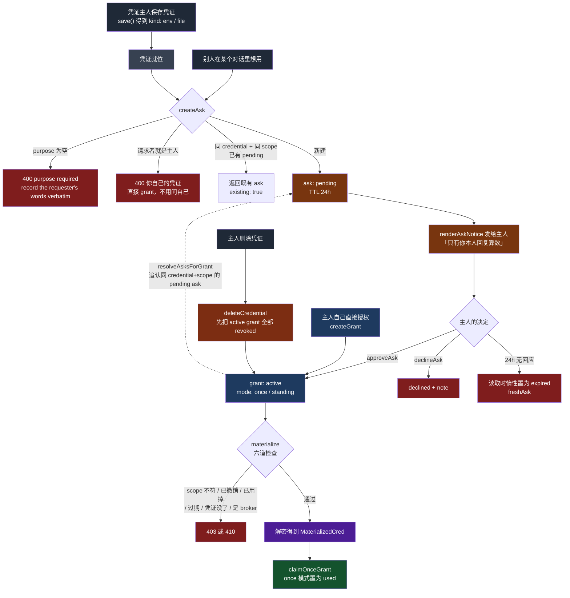

# QM 的凭证层：agent 从不拥有密钥，它只是借用

> 关联文档：
> - [[qm-overview]]（产品目标、八条哲学、十组模块分解）
> - [[qm-memory-layer]]（记忆层的逐文件深入分析）
> - [[qm-execution-layer]]（执行环境层深入分析，不含 skills）
> - [[qm-skills-layer]]（技能层深入分析——注册表、Pack 导入、物化、权限）
> - [[qm-resolution-layer]]（解析层深入分析——`Resolution` 对象、分层配置、audience floor、prompt 协议）
> - [[qm-turn-slice]]（纵切面——一条 Slack 消息从进入到回复送出，十九道闸门）
> - [[qm-harness-layer]]（Harness 层——四适配器一套接口、tape 事件溯源、上下文压缩、冷启动重放）
> - [[qm-run-lifecycle]]（执行内核的运行时——租约、排空、回收、中断重入）
> - [[qm-authz-layer]]（授权与安全层——身份、能力令牌、ACL、命令策略、安全姿态）
> - [[qm-autonomy-layer]]（自主工作层——凭证审批的异步通知边：`createAskExpirySweep` 挂在调度器上）
> - [[qm-publish-layer]]（发布层——`viewer-session` 的 HMAC 用途派生是 HKDF 域分离的廉价版）
>
> 调研对象：`yc-software/qm`（YC 出品的开源多人 agent harness）
> 本地路径：`~/Repositories/qm`
> 调研时间：2026-08-14
> 仓库版本：`main` @ `0f0e0ad`
>
> 阅读范围：`src/credentials/`（10）、`src/connectors/`（6）、`src/model/`（7），
> 共 23 个文件约 4547 行；另核对 `src/api/routes/connectors.ts` 的 OAuth 回调、
> `src/core/orchestrator.ts` 的令牌铸造段、`src/wiring.ts` 的密钥派生装配
>
> **本篇与 [[qm-authz-layer]] 的分工**：上一篇讲「这个人能不能做这件事」，
> 凭证只出现在铸造端（`aws-role-broker`、能力令牌里的 `credentials` 字段）；
> 本篇讲凭证本身的一生——存进来、借出去、用掉、刷新、过期、还回去。

---

## 一、这一层在回答什么问题

F 组三个目录，主线是一个词：**借**。

qm 的 agent 从不拥有任何第三方凭证。你的 GitHub token 存在你名下，agent 想用，得走一套完整的借还协议：**问（ask）→ 批（grant）→ 物化（materialize）→ 用掉（claim）**。借出时要写明用途，用途会存进授权记录；借的范围限定在某一个对话；借法分「一次性」和「常驻」；凭证删除时未归还的借条一并作废。

`model/` 是这条主线的反面。模型 API key 是平台自己的凭证，不需要借——所以那七个文件加起来 874 行，比 `keychain.ts` 一个文件还短。**这个体量差本身就是论点**：治理「别人的凭证」比治理「自己的凭证」贵一个数量级。

| 目录 | 回答什么 | 体量 |
|---|---|---|
| `credentials/` | 谁的凭证、怎么借、借条的状态机、常驻 vs 临时 | 10 文件 2416 行 |
| `connectors/` | 怎么从外部 IdP 拿到 token（协议）、OAuth App 注册、加密盒 | 6 文件 1257 行 |
| `model/` | 平台自己的模型凭证与模型清单 | 7 文件 874 行 |

---

## 二、一张表装三种凭证

### 2.1 三种 ID 方案，一个 `DurableMap`

`createKeychain` 只拿三个 map：`creds` / `grants` / `asks`（`credentials/keychain.ts:424-433`）。而 `creds` 这一张表里同时住着三类语义完全不同的东西，靠三种 ID 生成方式区分：

```ts
function credId(ownerId: string, service: string, slot: string): string {
  return hashId([ownerId, service, slot]);
}
const brokerId = (orgScopeId: string, slug: string) => credId(orgScopeId, slug, "broker");
```
（`keychain.ts:377-379`、`keychain.ts:504`）

| 类别 | ID | 主体 | `kind` | `managed` |
|---|---|---|---|---|
| 个人凭证 | `credId(ownerId, service, slot)` | 某个人 | `env` / `file` | 无 |
| 组织服务凭证 | `brokerId(orgScopeId, slug)` | org scope | `broker` | 无 |
| 连接器令牌 | `oauthId(host, principalId, accountType)` | 某个人 | `env` | `"connector"` |

ID 是**内容派生的哈希**而不是随机的。同一个 (owner, service, slot) 再存一次会覆盖而不是产生第二条——重复保存同一个凭证是常见操作，让它天然幂等比事后去重便宜。`slot` 的构成也讲究（`keychain.ts:753-759`）：单值凭证是 `env:${envKey}`，多字段凭证是**排序后 join 的字段名列表**，文件凭证固定 `"file"`。排序保证字段顺序不影响身份。

三类共表带来的代价是每个读方法都要过滤。`listAllMetadata` / `listByOwner` / `listByOwners` 三处重复着同一个谓词 `(c) => !c.managed && c.kind !== "broker"`（`keychain.ts:880`、`885`、`890`）——**个人凭证 = 既不是托管的也不是 broker 的**，用两个否定表达一个肯定。这是共表设计付的税。

### 2.2 类型系统承担保密职责

```ts
export type KeychainCredentialMeta = Omit<KeychainCredential, "secretEnc">;

function toMeta(rec: KeychainCredential): KeychainCredentialMeta {
  const { secretEnc: _, ...meta } = rec;
  return meta;
}
```
（`keychain.ts:81`、`400-403`）

对外的所有列举接口返回的都是 `KeychainCredentialMeta`。密文字段在**类型层面**被摘掉了，不是靠调用方记得别序列化。同样的手法用在组织凭证上：`PublicServiceCredential` 没有 `secret` 字段，只有 `hasSecret: boolean`（`keychain.ts:151`）；要真的拿到明文，必须走名字里写着 `Secret` 的那个方法 `getServiceCredentialSecret`。

**接口名字里带 `Secret` 的才返回密钥**，这个约定配合 `Omit` 的类型保证，比任何注释都可靠。

### 2.3 环境变量名的命名空间保护

```ts
export function isValidServiceCredentialEnvKey(envKey: string): boolean {
  return /^[A-Z][A-Z0-9_]*$/.test(envKey) && !envKey.startsWith("AGENT_");
}
```
（`keychain.ts:173-175`）

用户配置的凭证不能注入以 `AGENT_` 开头的环境变量。沙箱里 `AGENT_API_URL` / `AGENT_API_TOKEN` / `AGENT_OAUTH_CONSENT_TOKEN` 都是平台自己的通道——**留一段前缀给自己，是最便宜的注入防御**。

---

## 三、借还协议

### 3.1 全景



*图 1：借还协议。虚线是「主人绕过 ask 直接授权」时对已有请求的追认。*

### 3.2 `purpose` 是必填的，而且要原话

```ts
if (!purpose) throw new KeychainError(400, "purpose required — record the requester's words verbatim");
```
（`keychain.ts:956`，`mintGrant` 那侧是 `"purpose required — record the owner's approval verbatim"`，`keychain.ts:847`）

两条错误信息都在教调用方**怎么填**，不只是说必填。`purpose` 会一路带到 `MaterializedCred.purpose`，也会出现在给主人看的通知里。它是这套协议唯一的审计内容——授权记录里 who / what / where 都是结构化字段，只有 why 是自由文本，所以它必须是请求者的原话而不是 agent 的转述。

### 3.3 同一个房间里问两次，只算一次

```ts
for (const rec of await deps.asks.all()) {
  const a = await freshAsk(rec, t);
  if (a.status === "pending" && a.credentialId === cred.id && a.requesterScopeId === input.requesterScopeId) {
    return { ask: a, existing: true };
  }
}
```
（`keychain.ts:965-970`）

去重键是 **(凭证, 请求方 scope)**，不含请求者本人。同一个频道里两个人先后问同一份凭证，第二个人复用第一张请求单——因为授权的粒度本来就是 scope 不是人。返回值带 `existing: true`，调用方据此决定是「已经帮你问过了，等回复」还是「已发送请求」。

**不给凭证主人发重复打扰，是这套协议能被真实使用的前提。**

### 3.4 追认：主人绕过流程直接授权时

`resolveAsksForGrant`（`keychain.ts:1057-1074`）处理一个很现实的竞态：主人可能没点通知里的按钮，而是自己去后台直接授权了。这时任何 credential + scope 匹配的 pending ask 会被批量收编：

```ts
const patch = { status: "approved" as const, resolvedAt: t, grantId: grant.id, notifiedAt: t };
await deps.asks.merge(a.id, patch);
await deps.grants.merge(grant.id, { askId: a.id });
```

双向回填 `grantId` 与 `askId`，并且**当场把 `notifiedAt` 设成现在**——请求者马上就能用了，再发一条「你的请求被批准」的通知是噪音。

### 3.5 过期是读出来的，不是扫出来的

```ts
async function freshAsk(rec: KeychainAsk, t: number): Promise<KeychainAsk> {
  if (rec.status !== "pending" || rec.expiresAt >= t) return rec;
  const patch = { status: "expired" as const, resolvedAt: t };
  await deps.asks.merge(rec.id, patch);
  return { ...rec, ...patch };
}
```
（`keychain.ts:497-502`）

每个读路径都过一遍 `freshAsk`——**读操作会写库**。没有定时任务，没有过期扫描。配套的清理挂在通知轮询上（`keychain.ts:1042-1051`）：`unnotifiedResolvedAsks` 一边收集待通知的，一边把 `notifiedAt` 超过 14 天（`ASK_PRUNE_AFTER_MS`）的记录删掉。

这和 [[qm-authz-layer]] §3.5 的 `replay-dedupe` 懒清理是同一个模式：**把 GC 挂在一条本来就会被反复调用的路径上，省掉一整套定时任务的运维面**。代价是没人调用就永远不清理。

### 3.6 六道检查，以及 claim 的位置

```ts
if (grant.audienceScopeId !== scopeId) throw new KeychainError(403, "grant is for a different conversation");
if (grant.status === "revoked") throw new KeychainError(410, "grant was revoked");
if (grant.status === "used") throw new KeychainError(410, "one-time grant already used");
if (expired(grant, now())) throw new KeychainError(410, "grant is expired");
```
（`keychain.ts:1183-1186`，之后还有「凭证不存在」与「broker 凭证不可 grant」两道）

注意 `claimOnceGrant` 的调用位置——在解密**之后**（`keychain.ts:1195`、`1200`）。顺序反过来的话，一次因为解密失败而中断的物化会白白烧掉一张一次性借条。**先做可能失败的事，再做不可逆的事。**

`materializeOwnById` 的限制更硬（`keychain.ts:1204-1210`）：

```ts
if (scopeId !== toScopeId("personal", ownerId)) {
  throw new KeychainError(403,
    "a credential id loads only in its owner's own personal conversation — anywhere else needs a grant from the owner");
}
```

凭证 id 本身不是权限。知道 id 也只能在自己的私聊里加载。

### 3.7 删除要级联

```ts
async function deleteCredential(id: string): Promise<void> {
  for (const grant of await deps.grants.all()) {
    if (grant.credentialId === id && grant.status === "active") {
      await deps.grants.merge(grant.id, { status: "revoked", revokedAt: now() });
    }
  }
  await deps.creds.delete(id);
}
```
（`keychain.ts:867-874`）

先撤销所有活跃借条，再删凭证。顺序也不能反：中途崩溃时，「借条还在但凭证没了」比「凭证还在但借条没了」难处理——前者是悬空引用，后者只是提前失效。**把不一致的窗口留在更安全的那一侧。**

`remove()` 还额外拒绝删除托管凭证和 broker 凭证（`keychain.ts:901`）：那两类的生命周期属于连接器和组织，不属于个人。

### 3.8 一次性 vs 常驻，与 `liveActor` 的呼应

`GrantMode = "once" | "standing"`。`materializeStanding(scopeId)` 在每回合开始时把该对话所有常驻借条一次性物化成环境变量（`keychain.ts:1236`），一次性借条则要显式走 `materialize(grantId, ...)`。

`mintGrant` 的错误信息藏了一条本篇之外的规则：

```ts
throw new KeychainError(403,
  "only the credential's owner can grant it — and only on a turn the owner themself sent");
```
（`keychain.ts:840-845`）

后半句在这个文件里没有实现——它由 [[qm-authz-layer]] §5.3 的 `liveActor !== true` 检查在路由层兜住。**cron 触发的自动回合不能替人授权凭证**，和「不能替人做管理动作」是同一条规则的两个落点。

---

## 四、OAuth：协议在一边，存储在另一边

### 4.1 `oauth.ts` 是纯客户端

624 行里没有任何签发 token 给别人的逻辑。三个核心函数 `authorizeUrl()` / `exchangeCode()` / `makeRefresh()` 都只接受注入的 `FetchLike` 与 `ResolvedClient`，不导入任何存储模块。只支持 `authorization_code` + `refresh_token` 两种 grant type，没有 `client_credentials`。PKCE 只有 Twitter（`x`）provider 声明 `pkce: true`，`code_challenge_method` 硬编码 `"S256"`。

### 4.2 state 防伪造，nonce 防重放，两件事分开做

`sealOAuthState` / `openOAuthState`（`connectors/oauth.ts:501-529`）把 state 做成签名 JWS，内含 `nonce: randomUUID()` 和 `issuedAt`，验证时校验 10 分钟时间窗。但**签名只能证明这个 state 是我们发出的，不能阻止同一个合法回调被重放两次**。真正的一次性在回调路由里：

```ts
if (
  !deps.replayDedupe ||
  !(await deps.replayDedupe.claim(`oauth:${state.nonce}`, state.issuedAt + OAUTH_STATE_MAX_AGE_MS))
) {
  throw new Error("OAuth state was already used or replay protection is unavailable");
}
```
（`api/routes/connectors.ts:141-144`）

复用的正是 [[qm-authz-layer]] §3.5 那张 `source_auth_replay` 表的 `claim` 原语，key 加了 `oauth:` 前缀做命名空间隔离，过期时间对齐 state 的时间窗。

`!deps.replayDedupe` 那半句是**失败关闭**：去重设施不可用时，OAuth 回调整个拒绝，不降级放行。对比 [[qm-authz-layer]] §7.3 安全筛查器不可用时的失败开放——同一个仓库里两种相反的选择，区别在于「筛查失败最多是内容没检查」，而「OAuth 回调重放成功」直接等于凭证被劫持。

### 4.3 单飞刷新

```ts
async function connectorTokenForRecord(rec: KeychainCredential): Promise<string | null> {
  const t = now();
  const refreshable = rec.refresh?.refreshTokenEnc && deps.refreshConnector && rec.host ? rec.host : null;
  if (refreshable && rec.expiresAt !== undefined && t >= rec.expiresAt - oauthRefreshMargin) {
    let pending = inflightRefreshes.get(rec.id);
    if (!pending) {
      pending = refreshAndStore(refreshable, rec.ownerId, rec.refresh?.accountType, rec);
      inflightRefreshes.set(rec.id, pending);
      void pending.finally(() => inflightRefreshes.delete(rec.id));
    }
    return pending;
  }
  if (oauthExpired(rec, t) && !refreshable) return null;
  return tryDecrypt(rec, (r) => decryptSecret(r.secretEnc, deps.key));
}
```
（`keychain.ts:685-699`）

按 `rec.id` 去重的 in-flight promise map。同一回合里多个工具同时要同一个连接器令牌，只发一次刷新请求。

**两个阈值，不是一个**：

```ts
const oauthSkew = deps.oauthSkewMs ?? 60_000;
const oauthRefreshMargin = Math.max(deps.oauthRefreshMarginMs ?? 10 * 60_000, oauthSkew);
const oauthExpired = (rec, t) => rec.expiresAt !== undefined && t >= rec.expiresAt - oauthSkew;
```
（`keychain.ts:435-436`、`682-683`）

- `oauthRefreshMargin`（10 分钟）：还有这么多时间就提前换，别等用的时候才发现过期
- `oauthSkew`（60 秒）：判定「已经过期」时给时钟偏差留的余量

那个 `Math.max` 是防配置错误的：**刷新余量永远不小于时钟余量**。否则会出现一个窗口——已经按 skew 算作过期，却还没到刷新阈值，令牌既不能用也不会被换。

需要指出的是这只是**进程内**去重。多实例部署下 N 个进程仍可能各刷一次。上游 IdP 通常容忍这个（刷新是幂等的，旧 refresh token 多数实现会保留），但如果遇到「刷新即轮换 refresh token」的严格实现，这里会丢令牌。代码里没有分布式锁，也没有注释说明这是有意的。

### 4.4 不支持刷新的 provider 直接报错

Slack / Notion / Linear 三家在 provider 配置里显式声明 `refresh: null`（`connectors/oauth.ts:293`、`321`、`345`），`makeRefresh` 遇到就抛：

```ts
if (match.config.refresh === null) throw new Error(`${match.name} tokens do not refresh — reconnect`);
```
（`connectors/oauth.ts:607`）

用 `null` 而不是 `undefined` 来表示「明确不支持」，与「没配置」区分开。这样漏配一个 provider 会得到不同的错误，不会被当成「这家不支持刷新」而永久放弃刷新。

### 4.5 刷新结果的合并顺序

```ts
const merged: OAuthToken = {
  ...(stored.clientRef ? { clientRef: stored.clientRef } : {}),
  ...(stored.accountType ? { accountType: stored.accountType } : {}),
  ...(stored.orgId ? { orgId: stored.orgId } : {}),
  ...fresh,
};
```
（`keychain.ts:660-665`）

新响应覆盖旧值，但旧的元数据字段先铺底。OAuth 刷新响应经常只回 `access_token` 和 `expires_in`，不重复 `scope` 或自定义字段——**如果直接用 fresh 整体替换，每次刷新都会丢掉一部分账户元信息**。

失败路径也值得看（`keychain.ts:668-679`）：

```ts
} catch (e) {
  const message = storedRefreshError(e);
  console.error(`[keychain] connector token refresh failed for ${host}: ${message}`);
  try {
    await markConnectorRefreshFailure(rec, message);
  } catch (writeErr) {
    console.error(`[keychain] connector token refresh failure metadata write failed for ${host}: ...`);
  }
  return null;
}
```

失败被记进 `refresh.refreshFailedAt` / `refreshError`，供 `connectorTokenStatus` 报告 `needsReconnect`。而**记录失败这件事本身失败了，也不能把原始失败盖掉**——第二层 try/catch 只打日志。这是很容易写错的地方：清理或记账代码抛出的异常，常常会把真正的错因从栈里挤掉。

### 4.6 依赖方向是反的

```ts
import type { OAuthToken, OAuthRefresh } from "../credentials/keychain.ts";
```
（`connectors/oauth.ts:1`）

`OAuthToken` 和 `OAuthRefresh` 这两个协议层的核心类型，定义在**存储层**。直觉上应该是协议层产生数据、存储层消费，这里反过来了。

读代码时这很别扭，但意图能想明白：keychain 是唯一的类型真源，协议层想给 token 加字段就必须先让存储层承认。**把「谁定义词汇」和「谁产生数据」分开**——数据流是 oauth → keychain，控制流（谁说了算）是 keychain → oauth。

---

## 五、加密：一把根密钥，三个用途，两种密文格式

### 5.1 HKDF 做用途隔离

```ts
const HKDF_SALT = "agent-platform.secret-box";

export function deriveConnectorKey(material: Buffer | string, purpose = "connector-secrets"): SecretKey {
  const ikm = Buffer.isBuffer(material) ? material : Buffer.from(material, "utf8");
  const current = Buffer.from(hkdfSync("sha256", ikm, HKDF_SALT, `${purpose}.v2`, 32));
  const legacy =
    Buffer.isBuffer(material) && material.length === 32 ? material : createHash("sha256").update(material).digest();
  return { current, legacy };
}
```
（`connectors/connector-client-store.ts:61-69`）

同一个 `config.connectorSecretKey` 派生出至少三把互不相同的工作密钥：

| 调用点 | purpose | 存什么 |
|---|---|---|
| `wiring.ts:657` | `"keychain"` | 个人凭证、组织凭证、连接器令牌 |
| `model/model-credential-store.ts:34` | `"model-credentials"` | 三家内建模型提供商的 API key |
| `model/custom-provider-store.ts:53` | `"custom-model-providers"` | 自带 provider 的 API key |

根密钥泄露仍然全线沦陷，但**一个用途的密文不会在另一个用途下解开**。真实收益在事故处置：从某张表泄出的密文，拿到另一张表里也没用；也不会因为代码写错把 model 的密钥拿去解 keychain 的记录而静默产生垃圾数据（GCM 的认证标签会直接失败）。

### 5.2 密文格式自带版本

```ts
return `v2:${iv.toString("base64")}:${tag.toString("base64")}:${ct.toString("base64")}`;
```
（`connector-client-store.ts:76`）

解密时按段数分流（`connector-client-store.ts:79-95`）：四段带 `v2:` 前缀的用 HKDF 派生的 `current`，三段的旧格式用 `legacy`。再叠一层 `fallbacks?: SecretKey[]`——整把密钥的候选链，轮换期间新旧根密钥并存。

三层兼容：**密文格式版本 × 密钥派生方式 × 密钥候选链**。这是本仓库「持久化的代价」里最精致的一处（[[qm-run-lifecycle]] §12 记了三处，[[qm-authz-layer]] §3.4 与 §6.5 各一处，这是第六处）。凡是加密落库的系统，这三个维度迟早都要有，早点留出位置比事后加便宜得多。

### 5.3 解不开的记录跳过，不是崩溃

```ts
function tryDecrypt<T>(rec: KeychainCredential, fn: (rec: KeychainCredential) => T): T | null {
  try {
    return fn(rec);
  } catch (err) {
    console.error(
      `[keychain] credential ${rec.id} (${rec.service}, owner ${rec.ownerId}) does not decrypt under the current key — skipped: ${errMessage(err)}`,
    );
    return null;
  }
}
```
（`keychain.ts:479-488`）

日志里带上 id、service、owner——**足够定位是谁的哪个凭证需要重存，但不泄露任何密文内容**。一条坏记录不该让整个凭证列表打不开。

---

## 六、常驻凭证与临时凭证

### 6.1 用符号链接把 `~/.aws` 搬到 `/tmp`

`credentials/resident-paths.ts` 处理一类 keychain 管不了的凭证：`gh auth login` / `aws configure` / `gcloud auth` 这些工具的登录产物，是写在 home 目录里的文件，不是能塞进环境变量的字符串。

```ts
export const BASE_RESIDENT_AUTH_PATHS = [".aws", ".config/gh", ".config/gcloud", ".ssh", ".netrc", ".git-credentials"];
const DURABLE_CREDENTIAL_PATHS = [".ssh", ".git-credentials"] as const;
export const EPHEMERAL_CRED_DIR = "/tmp/agent-creds";
```
（`resident-paths.ts:4-22`）

**`.ssh` 和 `.git-credentials` 被排除在临时化之外**（`DURABLE_CREDENTIAL_PATHS`，在 `ephemeralCredLinkPaths` 的 `covered()` 里跳过，`resident-paths.ts:44-46`）。SSH 密钥搬进 `/tmp` 会在容器重启后消失，而它恰恰是最需要持久的那一类。

`ephemeralCredLinkScript` 生成的 shell 有两个细节值得抄：

```ts
const mkdirHealing = (dir: string): string =>
  `if ! mkdir -p ${shq(dir)} 2>/dev/null; then rm -rf ${shq(dir)}; mkdir -p ${shq(dir)}; fi`;
```
（`resident-paths.ts:54-55`）

`mkdir -p` 在路径上存在同名普通文件时会失败。**自愈版本**先试，失败了就删掉挡路的东西再来。这在反复重建的沙箱里是必需的。

另一段（`resident-paths.ts:64-65`）处理三种前置状态：目标已是指向别处的符号链接（重定向前先把旧内容搬过来）、目标是真实文件或目录（搬走再建链接）、目标不存在（直接建）。整段是幂等的——脚本跑一百遍结果一样。

### 6.2 三态切换与「重置代际」

`device-flow-cutover.ts` 管的是从「常驻凭证」迁移到「临时凭证」的过程：

```ts
export const DEVICE_FLOW_CUTOVER_MODES = ["legacy", "prefer_ephemeral", "ephemeral_only"] as const;
```

三态而非布尔开关，中间态 `prefer_ephemeral` 让迁移可以灰度。策略按 scope 存，解析时回退到 org（`resolvePolicy`，`device-flow-cutover.ts:79-83`），默认 `"legacy"`——与 [[qm-resolution-layer]] 的分层配置同构。

真正有意思的是**回退方向**。从新模式切回 `legacy` 时（`device-flow-cutover.ts:121`）：

```ts
...(mode === "legacy" && previous !== "legacy" ? { resetResident: true, resetGeneration: resetId() } : {})
```

生成一个「重置代际」标记。因为切到临时模式期间，常驻位置的凭证文件已经被搬走或链接掉了；切回来时必须让沙箱知道要重建一次，而不是继续用残留的链接。`residentResetGeneration` 把三个来源的代际串成一个字符串（`device-flow-cutover.ts:96-102`），`markResidentReset` 记录完成的代际，两者相等就说明这一代已经处理过了。

**用「代际标识」而不是「待处理布尔」，好处是重复的重置请求会合并成同一代，而新的请求一定产生新代际不会被旧的完成记录覆盖。** 这是幂等消费的标准做法，只是通常出现在消息队列而不是配置项里。

---

## 七、状态缓存：什么时候算过期

`credentials/connector-status.ts` 缓存「这个人连了哪些 provider」。判断缓存是否失效的函数有两个条件：

```ts
export function connectorStatusIsStale(record, now, maxTtlMs = CONNECTOR_STATUS_MAX_TTL_MS): boolean {
  if (!record) return true;
  if (now - record.checkedAt > maxTtlMs) return true;
  for (const entry of Object.values(record.providers)) {
    const expiredSinceChecked =
      entry.connected && entry.expiresAt !== undefined && now >= entry.expiresAt && entry.expiresAt > record.checkedAt;
    if (expiredSinceChecked) return true;
  }
  return false;
}
```
（`connector-status.ts:35-48`）

第一个条件是普通 TTL（15 分钟）。第二个条件才是关键：**某个令牌在我们检查之后才到期**。最后那半句 `entry.expiresAt > record.checkedAt` 容易被当成冗余——不加也「能跑」。但它区分了两种情况：

- 检查时令牌还有效，现在过期了 → 缓存里那句「已连接」现在是错的，必须刷新
- 检查时令牌就已经过期 → 缓存里记的就是「过期」，它仍然正确，不用刷新

**把「缓存内容错了」和「缓存内容说的是坏消息」区分开**。少了这半句，所有已过期的连接会在每次读取时触发一轮全 provider 探测，而结论毫无变化。

同一文件里 `mergeStatus`（`connector-status.ts:58-73`）合并多个 host 的状态时，`expiresAt` 取 **min**（最早到期的说了算），`refreshFailedAt` 取 **max**（最近一次失败）。两个字段两个方向，都是「最坏情况」，只是最坏的定义不同。

`bestOAuthTokenStatus`（`connector-status.ts:50-56`）则是三级降级：已连接且健康 > 已连接 > 第一个 > `{ connected: false }`。一个人可能同时有 personal 和 company 两个账号连着同一个 provider（`CONNECTOR_STATUS_ACCOUNT_TYPES`），报告时挑最好的那个。

---

## 八、模型层：自己的凭证不需要借

### 8.1 权威是清单，目录只是展示层

`pi-models.ts` 的 `MODEL_REGISTRY` 是硬编码静态清单，价格与上下文窗口大多来自 `@earendil-works/pi-ai` 的内建表，只有 clone 条目才在本地覆写。`model-catalog.ts` 不定义任何模型能力，`builtInModelCatalog()` 直接读 `SELECTABLE_BASE_MODELS` 再用 `resolveModel(id)?.provider` 取归属。

连 OpenRouter 动态拉回来的目录也要反向过滤（`model-catalog.ts:78`）：`resolveModel(id)?.provider === "openrouter"`。**上游 API 说有这个模型不算数，本地清单认识它才算数。** 这是把「外部系统的返回值」当数据而不是当真相的又一例。

### 8.2 同一组里两种失败姿态

**失败关闭**——`getRequiredModel` 找不到型号直接抛（`pi-models.ts:245-249`）：

```ts
export function getRequiredModel(id: string): PiModel {
  const model = resolveModel(id);
  if (!model) throw new Error(`Unsupported model: ${id}`);
  return model;
}
```

**失败开放**——`selectableModelCatalog` 拉 OpenRouter 失败时退回已有缓存或纯内建目录，并把缓存 TTL 从 `CACHE_TTL_MS`（5 分钟）缩到 `FAILURE_TTL_MS`（30 秒）（`model-catalog.ts:100-105`）。

分界线是清楚的：**「用哪个模型跑这一回合」不能猜，「选择器里列哪些模型」可以少列几个。** 失败时缩短 TTL 也是对的——出错状态不该被缓存 5 分钟。

### 8.3 自定义 provider：用管理员权限换掉了 SSRF allowlist

`parseProviderBaseUrl`（`model/provider-endpoints.ts:29-43`）是所有 endpoint URL 的唯一入口，校验协议白名单（http/https）、禁止内嵌凭证、禁止 query、禁止 fragment。但**没有对内网地址、localhost、云元数据地址（169.254.169.254）做任何拦截**。

缓解是注册接口 admin-only（`api/routes/admin/custom-providers.ts:8-12` 用 `authorizeAdmin`，文件里还写着注释 "the registration is admin-only either way"）。这是一个明确的取舍而不是遗漏：把 SSRF 的信任边界压到「管理员不会拿这个打自己的内网」。

值得注意的是同一组里另外两处防御做得很到位：`RESERVED = new Set([...PROVIDER_IDS, "mock"])` 拒绝自定义 provider 撞名内建 provider（`custom-providers.ts:42`、`48`），且解析时内建永远遮蔽自定义——**碰撞不能劫持内建模型**。密钥也不放在运行时注册表里，`custom-providers.ts` 文件头注释明写 "Secrets never live here"。

### 8.4 单一卡点

`builtinModel()` 里有一段注释解释为什么 base URL 覆盖要放在这里（`pi-models.ts:112-114`）：

> `// Endpoint overrides apply here, at the single choke point every`
> `// resolution passes through — including clones, whose template is`
> `// spread by cloneModel, so an overridden template covers its clones.`

如果覆盖放在各 harness 里，clone 出来的模型会绕过它。**找到所有路径必经的那一个点，改动只做一次**——这条在改配置注入类逻辑时反复适用。

### 8.5 28 行的「网关」，和一个没人读的方法

```ts
export function createModelGateway(opts: { maxRecords?: number } = {}): ModelGateway {
  const max = Math.max(1, opts.maxRecords ?? DEFAULT_MAX_RECORDS);
  const records: ModelCallRecord[] = [];
  return {
    recordCall: (rec) => {
      records.push(rec);
      if (records.length > max) records.splice(0, records.length - max);
    },
    audit: () => [...records],
  };
}
```
（`model/model-gateway.ts:18-28`）

名叫 gateway，实际不拦截任何调用，只是个 1000 条的内存环形缓冲。四个写入点（`orchestrator.ts:1527`、`:2272`、`orchestrator/compaction.ts:110`、`orchestrator/security-screen.ts:47`）写法一致：

```ts
recordCall: (rec) => {
  deps.modelGateway.recordCall({ at: Date.now(), scopeLabel: scopeId, ...rec });
  void deps.budget?.record(actor.id, estimateCostUsd(rec.inputTokens));
},
```

有实际下游效果的是第二行——写进 [[qm-authz-layer]] §8 的预算表。而 `audit()` **全仓库没有任何调用方**（grep `.audit()` 零命中）。数据进了内存环，没有导出、没有路由、没有仪表盘。

这不是 bug，但它意味着这 1000 条记录目前只在调试器里有价值。真正的模型调用审计走的是别的路（`admin/` 的 `turn_metrics` 表，见 [[qm-authz-layer]] §5.4）。

---

## 九、这一层要对模型说话

凭证系统罕见地包含大量渲染代码——`keychain.ts` 最后 280 行几乎全是把凭证状态变成给人和给模型看的文本。

### 9.1 给主人的通知：内建反社工规则

```ts
// Never surface a raw Slack scope id to a person — describe the place instead.
```
（`keychain.ts:1324`）

于是 `channel:C01ABC` 被渲染成 `#general` 或退化成「a Slack channel」「a group DM」。通知正文的最后一句是重点（`keychain.ts:1335-1336`）：

> `Reply here to approve or decline — only your own reply counts; a yes relayed through anyone else doesn't.`

**把「转达的同意不算数」这条规则写进每一条请求通知里。** 这是 [[qm-authz-layer]] §7.6 那套「不过滤内容，标注内容出身」的方法论第一次指向人而不是模型：告诉凭证主人，agent 可能会转达一句「他说他同意了」，那不算。

### 9.2 给模型的说明书

`SAVE_HINT`（`keychain.ts:1354-1364`）是一段嵌在凭证模块里的 prompt 片段，教 agent 怎么保存凭证——包括完整的 curl 命令模板、什么时候用 `secret`+`envKey`、什么时候用 `files`、以及：

> `verify first (e.g. \`gh api user\`) and pass what the service reports as \`accountLabel\``

**先验证再保存，并且 accountLabel 要用服务方报的名字而不是用户自称的名字。** 这条约束只能写在 prompt 里，因为服务端无法验证 agent 是否真的调了 `gh api user`。

`expiryNote`（`keychain.ts:1366-1375`）对同一个事实给出两种措辞：

```ts
return own
  ? ", EXPIRED — they must re-auth before it can be used"
  : ", EXPIRED — ask the owner to re-auth before requesting a grant";
```

同样是「过期了」，读者是主人时给的下一步是「重新登录」，读者是别人时给的是「去找主人」。**清单不只报告状态，还报告读者该做什么。**

### 9.3 文件凭证的假 HOME

`renderUseScript`（`keychain.ts:1280-1307`）为文件型凭证生成一段 shell：`mktemp -d` + `umask 077`，逐个文件 base64 解码写入并 `chmod 600`，然后按 `FILE_ENV_POINTERS` 设置指向性环境变量（例如把 `AWS_CONFIG_FILE` 指过去）。

如果有文件找不到对应的指向变量，就走兜底（`keychain.ts:1300-1305`）：

```ts
lines.push(
  `for __e in "$HOME"/.[!.]* "$HOME"/*; do [ -e "$__e" ] || continue; __b=\${__e##*/}; [ -e "$__kc_dir/$__b" ] || ln -s "$__e" "$__kc_dir/$__b"; done`,
  `export HOME="$__kc_dir"`,
);
```

把真 HOME 的每一项符号链接进临时目录，然后**把 `HOME` 指过去**。工具于是在一个「除了这几份凭证之外和真 HOME 一模一样」的目录里运行。

这招很聪明，也很值得警惕：`.[!.]*` 这个 glob 故意排除 `.` 和 `..`，但对以两个点开头的文件（`..foo`）会漏掉；更重要的是，凭证退出作用域后这个临时目录的清理没有出现在这段脚本里。文件权限做到了 600 + 目录 700，但生命周期依赖沙箱整体销毁。

---

## 十、三处目录名骗人的地方

调研这一组最花时间的不是读代码，是搞清楚文件为什么在那个目录里。三处需要提前知道：

**`connectors/background-exec-broker.ts` 和 OAuth 毫无关系。** 它 broker 的是沙箱后台进程（`start`/`poll`/`write`/`stop`/`list`），依赖 `sandbox/sandbox.ts` 和 `processes/process-registry.ts`，调用方是 `tools/primitives.ts` 与 `orchestrator.ts`。大概是「connector = 外部能力接入点」这个更宽泛的旧含义留下的。里面的工程细节倒是不错：同 scope 内按脱敏后的命令字符串复用运行中的进程、`Math.min(ttlMs ?? defaultTtlMs, maxTtlMs)` 的 TTL 硬顶、TERM→等待→KILL 的分级停止（与 [[qm-execution-layer]] 的沙箱回收同构）。

**`connectors/connector-client-store.ts` 是全系统的加密盒。** 它主业是存组织注册的 OAuth App 凭据（`client_id`/`client_secret`，不是用户 token），但顺带定义了 `encryptSecret` / `decryptSecret` / `deriveConnectorKey`，被 `model/` 和 `credentials/` 全都 import。想找加密实现的人不会想到来这里翻。

**`credentials/connector-status.ts` 存的是缓存不是凭证**，而 `connectors/browser-session-store.ts` 存的是 Playwright 的 storageState（cookie + localStorage），**既不是 OAuth token 也不是用户登录 qm 的会话**。后者的存在理由在下一节。

准确的边界描述应该是：**`connectors/` = OAuth 协议 + OAuth App 注册 + 加密原语（外溢）+ 两个不相干的服务；`credentials/` = 凭证主存储 + 借还协议 + 刷新编排 + 常驻/临时凭证 + 状态缓存。**

### 10.1 顺带一提：为什么上传 emoji 需要 199 行

`connectors/emoji-upload-service.ts` 是这组里最好的一个「现实很脏」的样本。Slack 的 OAuth Web API 没有面向普通用户 token 的自定义 emoji 上传接口——`emoji.add` 是未公开的内部接口，只认浏览器的 `xoxc-` token 和 cookie，不认 OAuth 的 `xoxb-`/`xoxp-`。

所以它走不了 `oauth.ts` → `keychain.ts` 那条正规链路，只能用 `browser-session-store.ts` 里存的 cookie jar：筛出 `*.slack.com` 域的 cookie（要求存在 `d` cookie）→ 用该 cookie 请求 workspace 首页 HTML → **正则从内联 JS 里抠出 `"api_token":"(xoxc-...)"`** → 拿这个 token 调 `/api/emoji.add`。

依赖前端页面结构的抓取当然脆弱，但没有更干净的替代方案。周边的工程处理反而很扎实：

- **幂等**：把 Slack 返回的 `error_name_taken` 当成成功——重复上传同名 emoji 的结果和第一次一样，这就是成功
- **URL 硬化**：`normalizeWorkspace()` 严格限制只能是 `*.slack.com`，拒绝带 userinfo / port / path / query / hash 的输入，因为它直接拼进 fetch URL
- **错误分类**：`AUTH_ERRORS` / `PERMISSION_ERRORS` / `TOO_BIG_ERRORS` 三个 Set 把原始 error code 映射成人话
- **不重试**：单次请求 + 30 秒超时，`ratelimited` 直接透传成「稍后再试」的提示，把重试决策交给上层 agent

最后一条是本篇第二次看到这个选择（第一次是 §4.4 的 `refresh: null`）：**在 agent 系统里，把可恢复的失败原样告诉 agent，常常比在底层自动重试更好**——agent 有上下文决定这件事还值不值得做，底层没有。

---

## 十一、存疑

### 11.1 没配置 `connectorSecretKey` 时，重启即失忆

`wiring.ts` 里三处独立地 `randomBytes(32)` 兜底（`:405`、`:657`、`:692`）。也就是说未配置持久密钥时，每次进程重启都换一把根密钥，之前加密写入的 `secretEnc` / `apiKeyEnc` 全部解不开——由 §5.3 的 `tryDecrypt` 捕获、打日志、跳过。

从「本地开发不用配任何东西就能跑」的角度这是合理默认。但它在生产上是静默的：没有启动告警，没有「你正在使用临时密钥，数据不会跨重启存活」的提示，只有事后一堆 `does not decrypt under the current key` 的错误日志。**我倾向于认为这是有意的开发体验取舍，但没有找到注释或文档确认，不写成断言。** 检查点是 `wiring.ts` 那三行附近以及 `config.ts` 对 `connectorSecretKey` 的处理。

### 11.2 刷新单飞只在进程内

§4.3 已述。多实例部署下同一个连接器令牌可能被 N 个进程同时刷新。对「刷新即轮换 refresh token」的 IdP，后完成的那次会拿到已被作废的 refresh token 从而失败，进而写入 `refreshFailedAt` 触发误报的 `needsReconnect`。

代码里没有分布式锁也没有注释。考虑到这个仓库在别处（[[qm-run-lifecycle]] 的两层租约、[[qm-authz-layer]] 的 `ON CONFLICT` 去重）对分布式竞态处理得很细致，这里只用进程内 Map 更像是「暂时够用」而非「判断过不需要」。**不确定，列为存疑。**

### 11.3 `modelGateway.audit()` 无消费方

§8.5 已述，grep 零命中。可能是为将来的调试端点预留，也可能是重构后的遗留。区别在于要不要删。

### 11.4 假 HOME 的清理

§9.3 的 `renderUseScript` 创建 `mktemp -d` 目录写入解密后的凭证文件，脚本里没有对应的清理。依赖沙箱整体销毁是可以的——但如果同一个沙箱里多次物化文件凭证，会累积多个临时目录，每个都躺着明文密钥。我没有查沙箱的销毁路径是否覆盖 `$TMPDIR`。

### 11.5 自定义 provider 的 SSRF

§8.3 已述。这个我倾向于认为是**已知取舍而非缺陷**——注册接口 admin-only，且代码注释显式提到了 admin-only 这个前提。但它值得记下来，因为「管理员可信」这个假设在 [[qm-authz-layer]] §5.3 的其他地方是被主动削弱的（agent 替管理员操作时能做的事更少）。同一个仓库对「管理员」的信任程度在两处不一致。

---

## 十二、可迁移的做法

1. **凭证的默认关系是「借」不是「有」。** 借要写用途、限对话、分一次性与常驻、可撤销、可级联作废。
2. **用途字段必填，且错误信息要教人怎么填**（"record the requester's words verbatim"）。它是整套授权唯一的自由文本审计内容。
3. **请求去重的键是「资源 + 目标范围」，不含请求人。** 授权粒度是什么，去重粒度就是什么，这样才不会重复打扰审批人。
4. **给「审批人绕过流程直接授权」留一条追认路径**，并当场标记已通知，避免重复通知。
5. **过期用读时惰性计算 + 写回，GC 挂在本来就会被反复调用的路径上。** 省掉一整套定时任务的运维面。
6. **先做可能失败的事，再做不可逆的事。** 解密在前、消耗一次性授权在后。
7. **级联删除的顺序要让中断留在更安全的一侧。** 先失效引用者，再删被引用者。
8. **敏感字段用 `Omit` 从对外类型里摘掉**，让「不泄露」成为类型保证而不是纪律；方法名里带 `Secret` 的才返回明文。
9. **给自己的环境变量留一段保留前缀**，禁止用户配置的凭证占用。
10. **内容派生的 ID 让重复保存天然幂等**；复合键要排序后再拼，顺序不能影响身份。
11. **OAuth 的 state 只解决防伪造，重放要靠单独的 nonce 一次性 claim。** 两件事分开做，前者用签名，后者用去重表。
12. **去重设施不可用时，OAuth 回调应当失败关闭。** 和内容筛查可以失败开放不同——判据是失败的后果是否等价于凭证被劫持。
13. **刷新要单飞**（按凭证 id 去重 in-flight promise）；跨进程还需要分布式协调，别把进程内 Map 当成完整方案。
14. **「提前刷新阈值」与「判定过期阈值」是两个数**，且前者必须 `Math.max` 保证不小于后者，否则会出现既不能用也不会刷新的窗口。
15. **用 `null` 表示「明确不支持」，与 `undefined` 的「没配置」区分开。**
16. **刷新结果要以旧元数据铺底、新响应覆盖**——OAuth 刷新响应经常省略字段。
17. **记录失败的代码本身失败了，不能盖掉原始失败。** 第二层 try/catch 只打日志。
18. **一把根密钥按用途 HKDF 派生**，一个用途的密文在另一个用途下解不开。
19. **密文自带格式版本前缀**，并预留「旧派生方式」与「候选密钥链」两个维度。加密落库的系统迟早都要这三层。
20. **解不开的单条记录跳过并记 id/owner/service，不要让它打断整个列表。**
21. **生成的 shell 要自愈且幂等**：`mkdir -p` 失败就删掉挡路的再来；符号链接重定向前先把旧内容搬过去。
22. **迁移开关用三态不用布尔**，中间态留给灰度。
23. **回滚需要重建时，用「代际标识」而不是「待处理布尔」**：重复请求合并成同一代，新请求不会被旧的完成记录覆盖。
24. **缓存失效判据要区分「缓存内容错了」和「缓存内容是坏消息」。** 后者不需要刷新。
25. **合并多来源状态时想清楚每个字段的「最坏」是哪个方向**：到期时间取最早，失败时间取最近。
26. **外部 API 返回的清单要用本地权威二次过滤。** 上游说有不算数。
27. **失败开放时同时缩短缓存 TTL。** 出错状态不该被缓存和成功一样久。
28. **配置注入类的覆盖逻辑放在所有路径必经的单一卡点**，否则派生形态（clone、代理、包装）会绕过它。
29. **自定义扩展的 ID 要有保留字集合，且内建永远遮蔽自定义**，碰撞不能劫持内建。
30. **凭证清单不只报告状态，还要按读者身份给出不同的下一步。**
31. **把「转达的同意不算数」写进每一条审批通知。** 有 agent 参与的流程里，这条必须对人明说。
32. **永远不要把原始 scope id / 内部 ID 直接呈现给人**，描述地点而不是打印标识符。
33. **可恢复的失败原样告诉 agent，别在底层自动重试。** agent 有上下文判断这件事还值不值得做。
34. **把「重复操作的结果与首次相同」的错误码当成成功**（`error_name_taken`），这是幂等的实现方式而不是掩盖错误。

---

## 十三、与其他篇的连接

- [[qm-authz-layer]] —— 上一篇讲铸造端，本篇讲凭证本身；`OAUTH_CONSENT_AUD` 的窄受众模式见那篇 §3.3，`liveActor` 对授权凭证的约束见 §5.3，OAuth 重放复用的 `claim` 原语见 §3.5，预算表见 §8；「持久化的代价」第六处见本篇 §5.2
- [[qm-resolution-layer]] —— 常驻借条在每回合开始时物化成环境变量，是 `Resolution` 里 `credentials` 字段的来源；device-flow cutover 的 scope→org 回退与分层配置同构
- [[qm-turn-slice]] —— 十九道闸门里「注入凭证」那一道，展开就是本篇 §3.8 的 `materializeStanding`
- [[qm-execution-layer]] —— `renderUseScript` 生成的脚本在沙箱里执行；`background-exec-broker` 的 TERM→KILL 分级与沙箱进程回收同构；假 HOME 的清理依赖沙箱销毁
- [[qm-harness-layer]] —— 模型清单与 harness 能力的交叉约束（自定义模型只对 pi / opencode / mock 开放）
- [[qm-memory-layer]] —— `DurableMap` 的 `take` / `merge` / `deleteIf` 原语在本篇被大量使用（secret drop 的一次性兑换、ask 的惰性过期写回、组织凭证的 CAS 删除）
- [[qm-run-lifecycle]] —— 「持久化的代价」的原始三处；`replaceGrantsIfCurrent` 式的乐观并发在本篇是 `setServiceCredentialIfCurrent` 与 `markConnectorRefreshFailure`
- [[qm-skills-layer]] —— skill 使用组织凭证走 broker 通道，`service-cred:` 前缀的 ACL grant 见 [[qm-authz-layer]] §4.3
- [[qm-overview]] —— F 组的三个目录在本篇合并成一条「借用」主线；目录名与实际职责的三处错位见 §10
