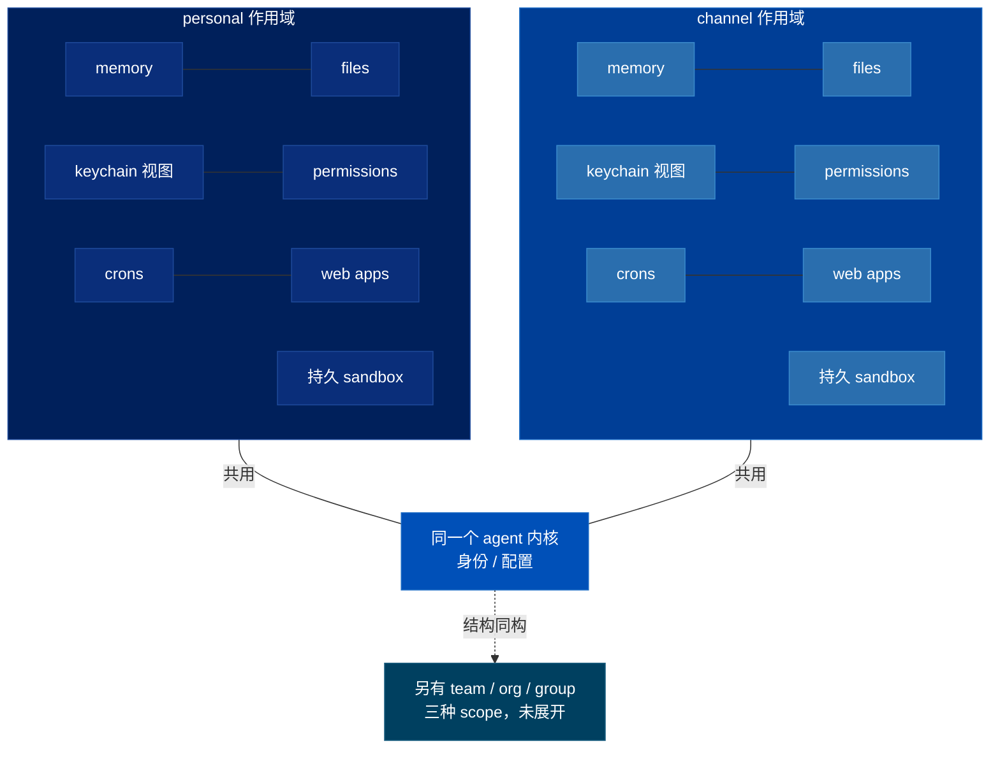
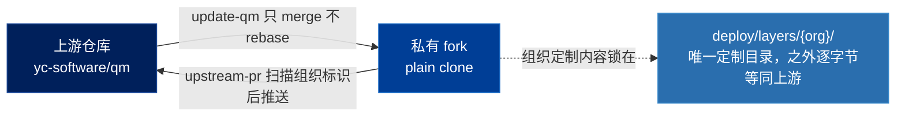
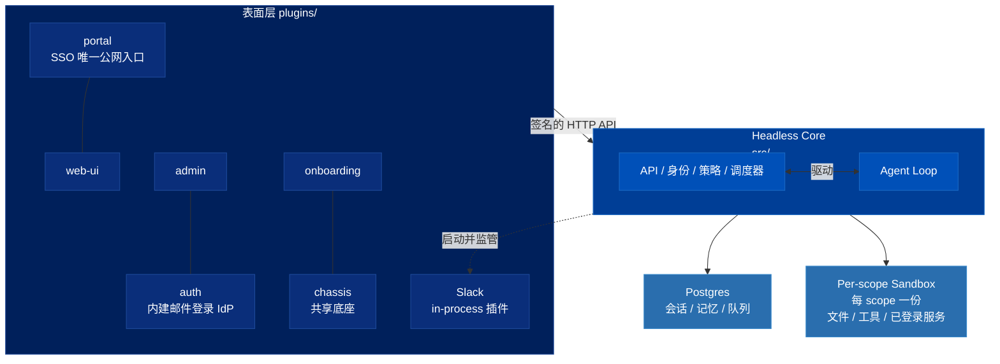
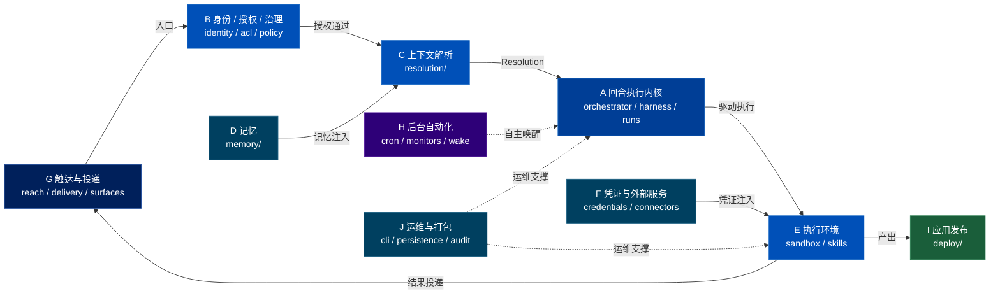

# QM 项目整体调研：产品目标、哲学与功能模块

> 关联文档：
> - [[qm-memory-layer]]（记忆层的逐文件深入分析）
> - [[qm-execution-layer]]（执行环境层深入分析，不含 skills）
> - [[qm-skills-layer]]（技能层深入分析——注册表、Pack 导入、物化、权限）
> - [[qm-resolution-layer]]（解析层深入分析——`Resolution` 对象、分层配置、audience floor、prompt 协议）
> - [[qm-turn-slice]]（纵切面——一条 Slack 消息从进入到回复送出，十九道闸门）
> - [[qm-harness-layer]]（Harness 层——四适配器一套接口、tape 事件溯源、上下文压缩、冷启动重放）
> - [[qm-run-lifecycle]]（执行内核运行时——蓝绿自我排空、两层租约、重试与回收、`routeWake` 并发策略、中断重入）
> - [[qm-authz-layer]]（授权与安全层——身份等价、能力令牌四道闸门、ACL audience floor、命令反混淆、安全姿态与筛查、审计）
> - [[qm-credentials-layer]]（凭证与外部连接层——借还协议、OAuth 客户端、加密盒、常驻/临时凭证、模型清单）
> - [[qm-synthesis]]（综述——十五篇的可迁移做法按问题收敛，不按模块）
>
> 调研对象：`yc-software/qm`（YC 出品的开源多人 agent harness）
> 本地路径：`~/Repositories/qm`
> 调研时间：2026-08-09
> 仓库版本：`main` @ `0f0e0ad`
>
> 阅读范围：README / AGENTS.md / SECURITY.md / CONTRIBUTING.md、`src/` 全部 52 个模块目录、
> `src/harness/pi-tools.ts` 工具定义、`plugins/*/README.md`、`cli/` 与部署契约、`skills-seed/`
>
> 规模：`src/` 约 76,648 行 TS，`plugins/` 约 35,133 行，`test/` 386 个测试文件

---

## 一、产品是什么

**一句话**：QM 是一个「多人协作的 agent harness」（multiplayer agent harness for work），跑在 Slack 和 Web 上。

它要解决的问题在 README 第一段说得很直白：

> 大多数 agent 是按**个人助理**设计的。你可以让它服务整个公司，但很快就会变得复杂。

市面上的 agent（Claude Code、ChatGPT、Devin）本体是「一个人 + 一个 agent」。当你想让它变成「一个公司 + 一个 agent」时，会撞上一堆结构性问题：谁的记忆？谁的凭证？谁能看到这个文件？谁批准了这条命令？

QM 的答案是**把 scope（作用域）提升为系统的第一等公民**，而不是事后打补丁。

目标客户明确是**创业公司**——不是个人，也不是大企业 SaaS 多租户（SECURITY.md 明说「QM 不是加固的公开或多租户服务边界」）。部署形态是：每个组织在**自己的云账号**里跑一个实例。

---

## 二、产品哲学

八条，每条都能在代码或文档里找到硬约束支撑。

### 2.1 Scope 是第一性的，不是权限系统的附属品

`src/types.ts` 里 scope 只有五种：`personal | channel | team | org | group`。

关键设计不是「权限检查」，而是**每个 scope 都拥有一整套完整的自己**：

> 每个人和每个房间，都有自己独立的 memory、files、keychain 视图、权限、crons、web apps 和持久 sandbox。

这是产品哲学层面的取舍：不是「一个 agent 服务多人」，而是「**同一个 agent 内核，在 N 个隔离的身份下各活一份**」。个人 DM 里它是你的；频道里它是团队的；两者共享身份与配置，但数据面隔离。

图的形状就是论点：上半部 `personal` 与 `channel` 两个 subgraph 左右对称、互不连线，代表数据面隔离；下方共享一个 agent 内核节点，代表控制面共享。



### 2.2 Agent 以「人」的身份行动，而不是以「服务账号」的身份

> QM 的做法沿袭本地编码 agent（OpenCode、Codex、Claude Code）：agent 作为它服务的那个人行动，用那个人的凭证和权限，并且所有行为都被审计。

这条否掉了传统企业机器人的「万能 bot 账号」模型。后果是：权限天然收敛（agent 越不过它服务的人），审计天然可归因（`src/admin/attribution.ts`）。

### 2.3 有三件事**故意**不给 agent —— 这是墙，不是缺口

SECURITY.md 有一节叫「Deliberately portal-only actions」：

| 不给的能力 | 理由 |
|---|---|
| 修改 admin 授权 | 被 prompt injection 的 agent 可以自我提权 |
| 冒充其他身份 | 下游所有鉴权都以 turn 的身份为 key |
| 批准被 gate 的命令 | 那会让 human-in-the-loop 塌缩成一次模型决策 |

它总结出的共同形状是：

> 每一个都是**授权 agent 未来行为**的决定，所以这个决定本身必须来自 agent 之外。

并且预先警告审计者：「它们在审计里看起来像能力对齐的缺口；它们是墙。修之前先回来读这段推理。」——把设计意图写进代码库，用来抵抗未来的自己和未来的 agent。

### 2.4 工具面要小而固定，能力靠 sandbox 扩展

Agent 只有十来个工具（`src/harness/pi-tools.ts`）：

```
execute · read · write · publish · memory · history
background · cron · guidance · share · stay_silent · finish_silently
```

其中 `execute` 在 scope 自己的沙箱里跑 shell。README 用了一个很好的隐喻——sandbox 是这个 scope 的**「耐用电脑」（durable computer），装过的工具会一直在**。

所以扩展路径不是「加 MCP tool」，而是「在你的电脑上 `npm install` 一个东西 + 写个 skill」。这大幅压低了工具面的组合复杂度和授权面积。

工具描述本身承担了大量「教模型别犯错」的职责，比如 `memory` 的描述：

> 它**不是文件**：永远不要用 `write` 或 shell 命令去写它（那些会落在你的电脑上然后被静默丢失）。

以及 `cron` 的：「一个循环任务 = 一个 cron，创建前先 list，已存在就 patch，永远不要建第二个。」

### 2.5 供应商中立是架构约束，不是营销话术

> Pi、OpenCode、Codex、Claude Code 都驱动同一个 core，所以一次部署不会绑死在任何单一供应商上。

代码层面：`src/harness/` 下四个 adapter + 一个 `harness-router.ts`；每个 substrate（harness / session store / sandbox / memory）都在接口后面，生产实现通过**一个** `src/wiring.ts` 换进来。所以每个 store 都成对存在——`memory-session-store.ts` / `postgres-session-store.ts`，`local-sandbox.ts` / `aws-sandbox.ts` / `sprites-sandbox.ts`。

四组接口族并列摆开，`wiring.ts` 是唯一把生产实现换进每个接口的注入点；`..|>` 是实现，`..>` 是依赖注入。

```mermaid
classDiagram
    class Harness
    class SessionStore
    class Sandbox
    class MemoryService
    <<interface>> Harness
    <<interface>> SessionStore
    <<interface>> Sandbox
    <<interface>> MemoryService

    class createPiHarness
    class createClaudeHarness
    class createCodexHarness
    class createOpenCodeHarness
    class createHarnessRouter
    createPiHarness ..|> Harness
    createClaudeHarness ..|> Harness
    createCodexHarness ..|> Harness
    createOpenCodeHarness ..|> Harness
    createHarnessRouter ..|> Harness

    class createMemorySessionStore
    class createPostgresSessionStore
    createMemorySessionStore ..|> SessionStore
    createPostgresSessionStore ..|> SessionStore

    class createLocalSandbox
    class createAwsSandbox
    class createSpritesSandbox
    createLocalSandbox ..|> Sandbox
    createAwsSandbox ..|> Sandbox
    createSpritesSandbox ..|> Sandbox

    class createMemoryService
    class createPostgresMemoryService
    createMemoryService ..|> MemoryService
    createPostgresMemoryService ..|> MemoryService

    class wiring["wiring.ts"]
    wiring : 唯一注入点
    wiring ..> Harness : 生产实现换入
    wiring ..> SessionStore : 生产实现换入
    wiring ..> Sandbox : 生产实现换入
    wiring ..> MemoryService : 生产实现换入

    classDef interfaceStyle fill:#00205B,color:#fff,stroke:#1E4A9A
    classDef implStyle fill:#0050B8,color:#fff,stroke:#1A6AC4
    classDef wiringStyle fill:#004060,color:#fff,stroke:#1A5E80

    cssClass "Harness,SessionStore,Sandbox,MemoryService" interfaceStyle
    cssClass "createPiHarness,createClaudeHarness,createCodexHarness,createOpenCodeHarness,createHarnessRouter,createMemorySessionStore,createPostgresSessionStore,createLocalSandbox,createAwsSandbox,createSpritesSandbox,createMemoryService,createPostgresMemoryService" implStyle
    cssClass "wiring" wiringStyle
```



### 2.6 Durable by default —— 内存里不许留系统要读回的东西

AGENTS.md 专门给这条开了一节，因为它是「反复犯的错误」：

> core 跑 blue-green 和多实例——内存里的 `Map` 或 ring buffer 是每实例的，每次部署都会被抹掉。任何 operator 或系统之后要读回的东西（审计、日志、已解析的配置、排队中或进行中的工作）必须放在持久存储里，绝不能只在 RAM。

这解释了 `src/persistence/`、`src/runs/`、`src/idempotency/` 的存在，也解释了为什么几乎每个 store 都有 `postgres-*` 版本。

### 2.7 Core 保持通用，公司特定的东西全部关进一个目录

两种定制路径：

- **部署仓库**（不需要 checkout 源码）：`qm init` 生成一个依赖 `@yc-software/qm` 的目录
- **私有 fork**（要源码同读）：一切组织特定内容锁在 `deploy/layers/<org>/`，此目录外**逐字节等同上游**

配套两个 skill 双向维护边界：`update-qm`（上游 → fork，只 merge 不 rebase）、`upstream-pr`（fork → 上游，推送前扫描 diff / commit / 截图里有没有组织标识）。

README 里还花了一整段解释**为什么必须用 plain clone 而不是 GitHub Fork**：公开仓库的 fork 无法变私有，且 fork 与源仓库共享同一个 object network，push 进去的 commit 能被 SHA 从公开侧拉到。

两条边方向相反，各自的硬约束就是这套治理机制的闭环。



### 2.8 工程纪律：简化优先、零注释、禁止自审

AGENTS.md 里最锋利的几条：

- **修就修全部实例**：发现一个 bug，grep 整个 repo 把同类全改掉。「一个改对的调用点配五个没动的兄弟，是等着被重新发现的回归。」
- **修复必须让系统更简单**：宁可删除 / 合并，也不要加一层、加一个 flag、加一个 special case。
- **零注释**：不留解释性注释、docblock、TODO/FIXME、lint 抑制指令、注释掉的代码。意图靠命名、结构和测试表达，理由写进 commit message。
- **在所有路径流经的那一层解决**：动调用点之前先问该不该改 helper / store 接口 / base module。AGENTS.md 甚至列出了 helper 的「家庭住址」。同时反向也卡：只有一个调用者的模式不要造抽象。
- **禁止在写代码的上下文里自审**：

  > 产出 diff 的那个上下文已经相信自己是对的，而这个信念正是 review 存在要击败的偏见。

  review 深度按 blast radius 定，而**「深度由 reviewer 而非 author 说了算」**——一个小范围的 review 发现了它没被授权范围内的风险，应当自行升级而不是「守在自己的车道里」。
- **本地只跑受影响的测试**，全量交给 CI（CI 分片并行，本地串行复现同样信号要几倍墙钟时间）。

还有一条产品级的：**贡献政策只收人写的文字，不收代码**。

> 请在 `adrs/` 里用 `.txt` 或 `.md` 非正式地描述你想要的改动，如果我们对齐了，实现由我们来做。

这是 AI 时代很有想法的开源治理姿态——把「人类的意图」当作稀缺输入，把实现当作可再生资源。

---

## 三、功能模块分解

### 3.1 分层总览



### 3.2 十组功能模块

下图只画 A–J 十个组之间的关系，不下沉到组内的具体模块（那些在下面各组的表格里）。主链是一个回路——G 既是入口也是出口；实线是一次 turn 的必经路径，虚线是异步触发与横切支撑。



#### A. 回合执行内核 —— 「一次对话怎么跑完」

| 模块 | 作用 |
|---|---|
| `core/orchestrator*` | 单次 turn 的总编排：组装 prompt block、拉 surface 上下文、上下文压缩、安全筛查、结果投递 |
| `harness/` | 四种 agent 循环适配（Pi / Codex / Claude Code / OpenCode）+ `harness-router` + `mock-harness`（测试）+ `tape-fold`（回合记录折叠）+ `replay` |
| `sessions/` | 会话与逐轮 transcript（memory / postgres 两实现），`history-search` 支撑 `history` 工具 |
| `runs/` | 一次执行的生命周期：worker、instance registry、drain（优雅下线）、reaper（回收僵尸）、tool ledger、turn stream(SSE) |
| `wake/` | 唤醒机制：什么事件该把 agent 叫起来、engaged registry、周期 sweep |
| `tasks/` | 任务存储 |

> 这一组已拆成三篇：
> - [[qm-harness-layer]]（harness）——四适配器一套接口、tape 事件溯源、上下文压缩、冷启动重放
> - [[qm-turn-slice]]（orchestrator 的编排主干）——一次 turn 的十九道闸门
> - [[qm-run-lifecycle]]（runs / sessions / wake / tasks）——那条路径底下的失效模型：蓝绿自我排空、两层租约、
>   两个重试计数器、`routeWake` 并发策略、中断重入、22 相延迟归因

#### B. 身份、授权与治理 —— 「谁能做什么」

| 模块 | 作用 |
|---|---|
| `identity/` | principal 解析、停用记录 |
| `acl/` | 授权（grant）存储与 `resource-ref`（统一资源引用） |
| `directory/` | 组织通讯录：人、频道、群、可见性规则 |
| `auth/` | capability token、签名 token、source-auth（插件与 core 的签名互认）、portal identity、AWS role broker、重放去重 |
| `admin/` | 管理面：授权、审计日志、指标、错误日志、凭证使用、egress 审计、留存策略、归因 |
| `policy/` | `command-policy`：预声明的命令审批规则与硬禁止（递归删除、破坏性 SQL 等），**所有 posture 下都生效，包括 Dangerous** |
| `security/` | 三档 posture（Strict / Auto / Dangerous）、安全筛查器、密钥脱敏 |
| `classify/` | scope 分类器 |
| `ratelimit/` | 限流 + 预算追踪（防花钱失控） |

> 这一组已单独成篇，见 [[qm-authz-layer]]。九个目录合起来在回答同一个问题的五个互不信任的子问题：
> 你是谁（`identity/`，10 秒 TTL）、你在哪（`directory/`，push 快照）、资源共享给谁（`acl/`，每回合重算）、
> 这次调用被授权做什么（`auth/`，1 小时能力令牌 + 每次使用重新核对）、这段内容能不能当指令
> （`security/` `policy/` `classify/`，单次）。`admin/` 与 `ratelimit/` 是治理与花钱的闸门，不在这条主线上。
>
> 表格里「留存策略」一项需要更正：`admin/retention.ts` 算的是 DAU / WAU / MAU 与周 cohort **留存分析报表**，
> 不是数据保留期策略。`admin/` 范围内的五张事件表没有任何过期清理。

#### C. 上下文解析 —— 「这一轮该带什么进模型」

`resolution/` 是最能体现产品复杂度的模块，**已单独深入分析，见 [[qm-resolution-layer]]**：

- `resolution-service` — 把 (principal, conversation) 解析成一个 `Resolution`：scope、workspace layers、命令策略、安全策略
- `config-store` — 分层作用域配置（org 设地板，窄 scope 只能收紧）
- `audience-floor` — **受众下限**：房间里有外部人时，自动压低能说 / 能读的内容等级
- `context-filter` / `scope-membership` / `scope-reach` / `publish-audience` / `egress-policy` / `prompt-vars`

#### D. 记忆

`memory/` — notebook 行语法、策略、多种 strategy、postgres 实现、bench。产品定位在工具描述里写得很清楚：**「你是一个会记得的同事，不是每次都重开的聊天窗」**。

> 这一层已单独深入分析，见 [[qm-memory-layer]]。

#### E. 执行环境 —— agent 的「电脑」

| 模块 | 作用 |
|---|---|
| `sandbox/` | 四种后端（local / docker / AWS microVM / sprites）+ 只读层叠加 + 迁移运行器 + 进程轮询 |
| `workspace/` | 工作区存储 |
| `files/` | 文件产物存储 + 去重字节存储 |
| `processes/` | 长驻进程注册、回收、对账 |
| `tools/primitives.ts` | 工具上下文与 `NeedsApproval` / `CommandDenied` 这两个关键控制流异常 |
| `skills/` | 技能全生命周期：frontmatter 解析、ingest、命名 / 冲突、物化到沙箱、pack fetcher（从 git 导入技能包）、bundle store、同步引擎、seed |

`skills-seed/` 有 18 个开箱技能：browse、cloud-cli、connect-apps、dropbox、github-gitlab、google-workspace、google-drive-sheets、linear、memory、morning-digest、email-voice-profile、email-draft-in-voice、interactive-login、publish、taste-skill、use-shared-credential、popular-web-designs、admin。

从这个清单能反推目标用户画像：**用 Slack + Google Workspace + Linear + GitHub 的创业公司**。

> 这一组已拆成两篇深入分析：
> - [[qm-execution-layer]]（sandbox / workspace / files / processes / tools）——能力协商式的 Sandbox 接口、四个后端、三层文件模型、用 shell 长出所有能力、路由与迁移、进程生命周期的三层真相
> - [[qm-skills-layer]]（skills）——scope 所有权与遮蔽、状态机与能力授权、Pack 的供应链防护、两级物化与懒加载、`liveActor` 授权维度
> - [[qm-autonomy-layer]]（自主工作层——cron 调度、monitor 轮询、`runTrigger` 主干、触发回合与人类回合的差集）
> - [[qm-publish-layer]]（发布层——`publish` 把工作区目录变成持久内部 Web 应用：名字、版本、受众、视角）
> - [[qm-surface-mirror]]（镜像层——`surface-cache/` 不是缓存；ambient 决定 AI 什么时候主动开口）
> - [[qm-crosscutting]]（横切件——`util/`、`projects/`、`audit/`、`onboarding/`；一行代码的防线）
> - [[qm-assembly-layer]]（装配层——五个顶层文件 + `deployment/`：词汇、旋钮、接线、交付、以及第二个进程）

#### F. 凭证与外部服务

`credentials/`（keychain、resident auth、secret drop、device flow 迁移）+ `connectors/`（OAuth、connector client、browser session、consent link、background exec broker）+ `model/`（model gateway、模型目录、自定义 provider、模型凭证）。

凭证的产品模型有意思：**共享凭证带「用途」（purpose）**——但 SECURITY.md 诚实承认「purpose 不是强制授权，它只是随凭证走的一条给模型的指令 + 一个审计字段」。

> 这一组已单独成篇，见 [[qm-credentials-layer]]。主线是一个词：**借**——agent 从不拥有第三方凭证，
> 只走「问（ask）→ 批（grant）→ 物化（materialize）→ 用掉（claim）」的借还协议。
> `model/` 是这条主线的反面：平台自己的模型凭证不需要借，所以七个文件加起来比 `keychain.ts`
> 一个文件还短——这个体量差本身就是论点。
>
> 上面这段描述有三处需要更正：`background-exec-broker.ts` 与 OAuth 毫无关系（broker 的是沙箱后台进程）；
> `browser-session-store` 存的是 Playwright 的 cookie jar，不是用户登录会话；
> `connector-status.ts` 在 `credentials/` 不在 `connectors/`，且存的是缓存不是凭证。

#### G. 触达与投递 —— 「回复送到哪儿」

`reach/`（解析收件人 / 频道 / 群，含成员校验与「群 DM 最多 8 人」这类产品规则）+ `delivery/` + `surfaces/`（Slack 安装、manifest、runtime）+ `triggers/`（consent notice、edit notice、keychain ask、provenance、run trigger）+ `insights/reach-denied-notifier`。

#### H. 后台自动化 —— 「没人看着的时候」

`cron/`（store、schedule、pg-boss 队列、scheduler）+ `monitors/`（broker、poller、store，即 watches）。对应工具面上的 `cron` 和 `background`（`watch` / `unwatch` 两个 action，不是独立工具）。

> **[[qm-autonomy-layer]] 的更正与补充。** 这个分组把 `triggers/` 划给了 G 组，
> 但读下来 `triggers/run-trigger.ts` 才是 H 组的主干——`cron/` 和 `monitors/`
> 都只是它的调用者，另外两个调用者是 `keychain-ask` 和 `secret-drop`。按调用
> 关系而不是按「触达」这个词分，`triggers/` 应当归 H 组；G 组里真正属于投递的
> 是 `reach/` 和 `delivery/`。
>
> H 组回答的问题也不是「后台自动化」这么宽。它的中心是一句话：
> **调度器决定何时，`runTrigger` 决定此刻是否仍然合法**。cron 表里存的不是
> 一个待执行的动作，是一个待重新验证的授权——三个月前建的 cron，人可能离职了、
> 被移出频道了、目标频道可能变私有了、收件人可能改主意了，所以每次 fire 都要
> 从头重问一遍那六个问题。
>
> 另外 `wake/`（3 个文件）在 A 组里只被当作「唤醒机制」提过一句，它和 H 组
> 共用 `util/sweeper.ts` 与 `persistence/leader-lease.ts`，一并在那篇里覆盖了。

#### I. 应用发布 —— 「把内部工具做出来并发出去」

`deploy/`（deploy service、store、git store、app shell、access token、viewer session、Docker / AWS provider）+ `environments/`。

对应 `publish` 工具：把工作区里一个目录发布成**持久的、scope 绑定的内部 Web 应用**，拿到稳定链接 `/d/<name>/`，turn 结束后继续跑。这是 QM 区别于普通聊天 agent 的一个大功能——agent 能给你造内部工具并交付给对的人。

#### J. 运维与打包

`cli/`（`qm init` / 部署目录契约 / Fly 与 AWS 模板）、`deploy/layers/`、`scripts/`（29 个）、`persistence/`（pg pool、advisory lock、leader lease、S3、blob transfer）、`idempotency/`、`audit/`、`onboarding/`。

---

## 四、观察

**1. 真正的产品创新在「scope 模型 + 固定工具面」的组合。**
很多团队做企业 agent 会走「加更多 MCP 工具 + 加 RBAC 中间件」，QM 走的是「工具面锁死到十来个，能力全部下沉到每个 scope 自己的持久沙箱」。前者的复杂度随工具数 × 权限数增长，后者近似常数。

**2. SECURITY.md 的诚实度罕见。**
它列了 12 条 known limitations，包括「命令策略可被绕过，它是防手滑和注入的减速带，不是沙箱边界」「沙箱里的凭证在使用时是明文」「audience-floor 过滤有已知缺口」。这种坦白本身是一种产品姿态——把安全模型当作可讨论的工程对象，而不是营销资产。

**3. 它高度假设「用户是 agent」。**
AGENTS.md 是写给 coding agent 看的操作手册（`CLAUDE.md` 是它的 symlink），部署靠「把 skill 交给一个 agent」，贡献政策要求人只写意图。整个仓库的组织方式假定：**大部分代码由 agent 写，人负责判断和边界**。零注释规则、「禁止自审」规则、「修就修全部实例」规则，都是针对 agent 失效模式设计的护栏。

---

## 五、后续可深入的方向

- [[qm-memory-layer]] —— 记忆层（已完成）
- [[qm-execution-layer]] —— 执行环境层，不含 skills（已完成）
- [[qm-skills-layer]] —— 技能层，E 组剩下的一半（已完成）
- [[qm-resolution-layer]] —— 解析层：`Resolution` 对象、四种收紧代数、audience floor、prompt 协议（已完成）
- [[qm-turn-slice]] —— 纵切面：一条 Slack 消息从进来到回复送出，十九道闸门（已完成）
- [[qm-harness-layer]] —— Harness 层：四适配器、tape 事件溯源、上下文压缩、冷启动重放（已完成）
- [[qm-run-lifecycle]] —— A 组运行时：`runs/` `sessions/` `wake/` `tasks/`，蓝绿自我排空、两层租约、两个重试计数器、中断重入（已完成）
- [[qm-authz-layer]] —— B 组授权与安全层：`identity/` `acl/` `directory/` `auth/` `admin/` `policy/` `security/` `classify/` `ratelimit/`，能力令牌四道闸门、audience floor 的执行侧、命令反混淆、安全姿态与影子筛查（已完成）
- [[qm-credentials-layer]] —— F 组凭证与外部连接层：`credentials/` `connectors/` `model/`，借还协议、OAuth 单飞刷新、HKDF 用途隔离、常驻/临时凭证迁移、模型清单（已完成）
- [[qm-autonomy-layer]] —— H 组自主工作层：`cron/` `monitors/` `triggers/` `wake/`，`runTrigger` 主干、时间的两种语义、两套调度引擎与租约毒丸、三层幂等、给模型的情境说明书、沉默作为一等结果、触发回合与人类回合的差集（已完成）
- [[qm-publish-layer]] —— I 组发布层：`deploy/` `environments/`，两个版本指针、git 作为版本存储、86 行与 664 行的两个 provider、默认受众的差量重算、owner shell、三扇门鉴权（已完成）
- [[qm-surface-mirror]] —— 镜像层：`surface-cache/`，平台无关抽象、单调合并的 upsert、双实现契约与它的偏差、ambient 判官、把模型每次自主决定都存下来（已完成）
- [[qm-crosscutting]] —— 横切件：`util/`（13）、`projects/`（1）、`audit/`（1）、`onboarding/`（1），一行代码的防线、两种 ReDoS 答案、`swallow` 约定、伪装成 scope 的托管群组（已完成）
- [[qm-assembly-layer]] —— 装配层：五个顶层文件 `wiring.ts` `config.ts` `types.ts` `egress-authz-main.ts` `index.ts` + `deployment/`，三条切换轴、状态孪生与能力缺席、九处延迟绑定、什么该崩什么该警告、装机定制层、出网执法的第二个进程（已完成）

- [[qm-synthesis]] —— 综述：把十五篇里散落的约 330 条可迁移做法按**问题**（而非按模块）收敛。十个反复出现的答案、一个反复出现的失败、七条只出现一次但值得单拎的、以及这些做法失效的四个前提（已完成）

**`src/` 已全部覆盖，调研收尾。** 前十五篇按模块覆盖 A–J 十组 + 四个未分类目录 + 五个从未进入分组的顶层文件；第十六篇不覆盖新代码，按问题重排。
