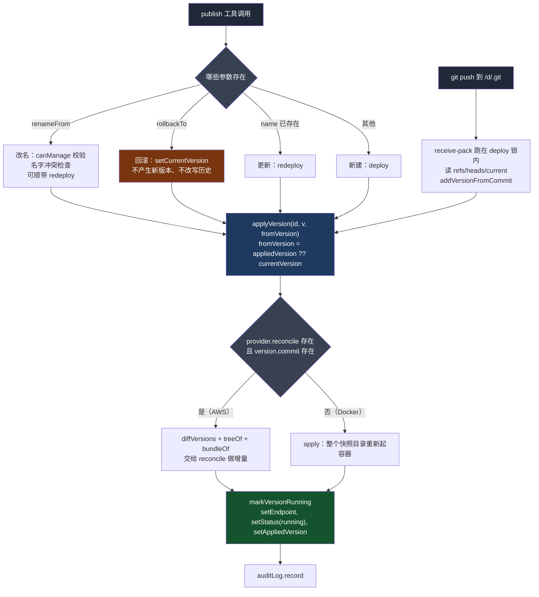
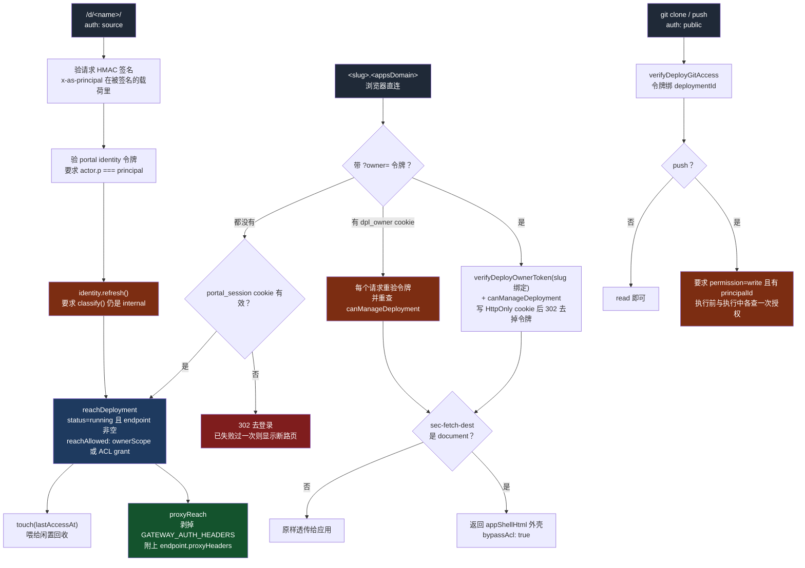

# QM 的发布层：把一坨文件变成一个有身份的东西

> 关联文档：
> - [[qm-overview]]（产品目标、八条哲学、十组模块分解）
> - [[qm-memory-layer]]（记忆层的逐文件深入分析）
> - [[qm-execution-layer]]（执行环境层深入分析，不含 skills）
> - [[qm-skills-layer]]（技能层深入分析——注册表、Pack 导入、物化、权限）
> - [[qm-resolution-layer]]（解析层深入分析——`Resolution` 对象、分层配置、audience floor、prompt 协议）
> - [[qm-turn-slice]]（纵切面——一条 Slack 消息从进入到回复送出，十九道闸门）
> - [[qm-harness-layer]]（Harness 层——四适配器一套接口、tape 事件溯源、上下文压缩、冷启动重放）
> - [[qm-run-lifecycle]]（执行内核的运行时——租约、排空、回收、中断重入）
> - [[qm-authz-layer]]（授权与安全层——身份、能力令牌、ACL、命令策略、安全姿态）
> - [[qm-credentials-layer]]（凭证层——借还协议、OAuth、加密盒、连接器状态缓存）
> - [[qm-autonomy-layer]]（自主工作层——cron、monitor、触发器主干、无人在场的回合）
> - [[qm-surface-mirror]]（镜像层——同为 Postgres 双实现模式，但那里是编排，这里是事件合并）
> - [[qm-crosscutting]]（横切件——`shq`、`proxyHeaders` 的 `extra` 参数、双层锁模式）
> - [[qm-assembly-layer]]（装配层——`src/deployment/` 与 `src/deploy/` 名字接近而毫无关系）
>
> 调研对象：`yc-software/qm`（YC 出品的开源多人 agent harness）
> 本地路径：`~/Repositories/qm`
> 调研时间：2026-08-15
> 仓库版本：`main` @ `0f0e0ad`
>
> 阅读范围：`src/deploy/`（10）、`src/environments/`（1），共 11 个文件约 2735 行；
> 另核对 `src/persistence/advisory-lock.ts`、`src/util/async.ts` 的 `createKeyedQueue`、
> `src/audit/audit-log.ts` 与 `src/admin/scoped-event-sink.ts` 的事件汇、
> `src/harness/pi-tools.ts` 的 `publish` 工具描述、`src/api/routes/deployments.ts`
>
> **这是 QM 区别于普通聊天 agent 的那个大功能**：agent 在工作区里写出一个目录，
> 把它变成一个持久的、绑定 scope 的内部 Web 应用，拿到稳定链接 `/d/<name>/`，
> 回合结束后继续跑。本篇讲这件事的全部机械。

---

## 一、这一层在回答什么问题

工作区里的文件是短命的：它属于某个回合、某个 sandbox，机器闲置就被回收
（[[qm-execution-layer]]）。而 `publish` 要做的事是把其中一个目录**从这条生命线里
摘出来**，给它一套独立的存在。

摘出来之后要补上四样东西，缺一样都不成立：

| 要素 | 由谁提供 | 没有它会怎样 |
| --- | --- | --- |
| 一个稳定的名字 | `validateName` + `getByName` | 每次重新发布链接都变，发出去的链接会失效 |
| 一条版本历史 | `deploy-git-store` + `versions[]` | 改坏了回不去 |
| 一份受众名单 | `AclStore` 上的 `deploy:<id>` 资源 | 要么谁都能看，要么只有自己能看 |
| 一个「谁在看」的判断 | `viewer-session` + `app-shell` | 作者和访客只能看到同一个页面 |

真正花代码的是这四样，不是「把容器跑起来」。本地 Docker provider 只有 86 行；
整个 `deploy/` 目录 2579 行里，编排相关的部分是少数。

所以本篇的立论是：**发布不是把代码送上服务器，是给一个产物同时安上名字、
历史、受众和视角**。容器只是这四样东西的载体，可以换。

### 1.1 一个 app 是一等的 artifact

最能说明这一点的是这行：

```ts
const deploymentRef = (id: string): string => encodeRef(deployRef(id));
const grantsOn = (d: Deployment): Promise<Grant[]> => deps.acl.grantsFor(d.ownerScopeId, deploymentRef(d.id));
```

`deployRef(id)` 生成的是 `deploy:<id>`，和文件的 `file:<id>`、cron 的
`cron:<id>` 一样，进的是**同一个 `AclStore`**（[[qm-authz-layer]] §4）。
一个已发布的应用在权限系统眼里和一个共享文件没有区别：可以 grant、可以 revoke、
可以按 scope 判可达、可以转让归属。

这决定了后面一切的形状。「谁能访问这个内部工具」这个问题，不需要一套新的权限
模型——它复用了「谁能读这个文件」的那一套。

---

## 二、两个版本指针

`Deployment` 上有两个看起来重复的字段：

```ts
export interface Deployment {
  id: string;
  ownerScopeId: ScopeId;
  createdBy: string;
  createdInScope?: ScopeId;
  defaultAudience?: DefaultAudienceSnapshot;
  name?: string;
  displayName?: string;
  currentVersion: number;
  status: DeploymentStatus;      // "running" | "stopped" | "archived"
  endpoint: DeployEndpoint | null;
  lastAccessAt?: number;
  appliedVersion?: number;
  versions: DeploymentVersion[];
}
```

`currentVersion` 是**期望态**——用户/agent 选中的那个版本。
`appliedVersion` 是**实际态**——provider 那边真正跑着的那个版本。

两者分开是这个目录的骨架。所有的写路径都遵循同一个节奏：

```ts
const markVersionRunning = async (id: string, version: number, endpoint: DeployEndpoint): Promise<void> => {
  await deps.deployStore.setEndpoint(id, endpoint);
  await deps.deployStore.setStatus(id, "running");
  await deps.deployStore.setAppliedVersion(id, version);
};
```

**先改期望态，再去 apply，apply 成功了才更新实际态。** 中间挂掉，
`appliedVersion` 停在老值上，而 `applyVersion(id, v, before.appliedVersion)`
的第三个参数正是「从哪个版本增量到这个版本」——下次重试仍然算得出正确的差量。

如果只有一个 `currentVersion`，一次失败的发布会让记录声称新版本已生效，
而增量的起点也跟着错位。**期望态与实际态分离，本质上是为了让「失败之后的重试」
仍然知道自己要补的是哪一段差。**

### 2.1 git 的 `current` 分支跟的是实际态

这个区分一路贯到了 git 层：

```ts
const CURRENT_REF = "refs/heads/current";
const versionRef = (version: number): string => `refs/versions/${version}`;

async function updateVersionRef(deploymentId: string, version: DeploymentVersion): Promise<void> {
  if (!version.commit) return;
  await git.setRef(deploymentId, versionRef(version.version), version.commit);
  await git.setRef(deploymentId, `refs/deploy-commits/${version.commit}`, version.commit);
}

async function updateAppliedRef(deploymentId: string, version: DeploymentVersion): Promise<void> {
  if (version.commit) await git.setRef(deploymentId, CURRENT_REF, version.commit);
  else await git.deleteRef(deploymentId, CURRENT_REF);
}
```

`updateVersionRef` 在 `addVersion` 时调用（期望态），`updateAppliedRef` 只在
`setAppliedVersion` 时调用（实际态）。所以 **`git clone` 下来看到的默认分支
`current`，是线上正在跑的那份代码，不是最新提交的那份**。对一个「拿链接给别人看」
的产物来说，这个选择是对的：默认分支应该对应默认 URL 看到的东西。

### 2.2 一个指向自己的 ref

```ts
await git.setRef(deploymentId, `refs/deploy-commits/${version.commit}`, version.commit);
```

一个名字是 commit 哈希、内容也是那个 commit 哈希的 ref。看起来毫无意义。

它的作用是**防垃圾回收**。git 的 `gc` 会清掉从任何 ref 都不可达的对象。回滚
之后 `current` 指向老版本，那些比它新的 commit 就悬空了；`refs/versions/N`
覆盖了有版本号的那些，但**通过 `git push` 进来又被回滚掉的中间提交**不一定有。
给每个部署过的 commit 建一个以自己命名的 ref，等于说「凡是曾经上线过的，
永远不许回收」。

这是一个很便宜的 pin：不需要额外的表、不需要 GC 钩子，用 git 自己的可达性规则
就表达了保留策略。

### 2.3 为什么版本存储是 git

`deploy-git-store.ts`（379 行）给每个 deployment 开一个**裸仓库**，
`HEAD` 符号引用到 `refs/heads/current`，作者固定为
`QM <deployments@qm.local>`。选 git 而不是「一个版本一个目录」，换来四样东西：

1. **内容寻址去重。** 十个版本里改了三行，存储成本是三行。
2. **免费且正确的 diff**，包括改名（`git diff --name-status -z` 的 `R`/`C`
   被拆成 delete + add）。
3. **一个自包含的传输单元。** `git bundle create <tmp> refs/deploy-commits/<sha>`
   产出单个文件，就是推给 microVM 的东西。
4. **仓库本身就是一个部署入口。** 人可以 `git clone` / `git push`（§7.2）。

但最有说服力的是第五样，它是回滚：

```ts
const endpoint = await applyVersion(id, v, before?.appliedVersion ?? before?.currentVersion);
```

回滚**不产生新版本，也不改写历史**，只是把 `currentVersion` 指回去。于是交给
provider 的那份 diff 是一个**反向 diff**——从较新的实际态回到较老的目标态。
git 天然对称地算得出来，不需要任何额外代码。

如果版本是一堆独立的目录快照，「回滚」就得单独实现成「把老目录整个再传一遍」；
有了 git，回滚和前滚走的是同一条 `reconcile` 代码路径，只是差量的方向反了。
**把「版本」建模成一棵提交图，回退就免费了。**

`commit()` 里还有一处很小但很对的处理：

```ts
const changed = diff.code === 1;
if (!changed && input.parent) return input.parent;
```

内容和上一版完全一样时**不产生新提交，直接复用父提交**。重复发布同样的代码
不会污染历史。

### 2.4 tmpdir 里的仓库只是缓存

裸仓库落在 `os.tmpdir()/qm-deploy-git` 下——这在容器里意味着重启即失。所以有
一层归档：`persistArchive` 用 `git bundle create --all` 打包整个仓库，
算 sha256 当 etag，存进 `DurableByteStore`（大 blob）或 `DurableMap`
（base64）。`ensureRepo` 每次比对本地 `qm-archive-etag` 文件和持久层的 etag，
不一致就整个重建（`rm` → `init --bare` → `fetch bundle +refs/*:refs/*`）。

**把一个「本来就有持久化格式的东西」（git 仓库）序列化成它自己的传输格式
（bundle）再存进通用存储**，比自己设计一套仓库序列化省事得多。代价是每次
持久化都要打全量包——没有增量归档。

---

## 三、名字与路径：两处不肯让步的校验

### 3.1 名字

```ts
const NAME_RE = /^[a-z0-9](?:[a-z0-9-]{0,38}[a-z0-9])?$/;
const UUID_RE = /^[0-9a-f]{8}-[0-9a-f]{4}-[0-9a-f]{4}-[0-9a-f]{4}-[0-9a-f]{12}$/i;

function validateName(name: string): void {
  if (UUID_RE.test(name)) throw new Error(`invalid deployment name (looks like an id): ${name}`);
  if (!NAME_RE.test(name)) {
    throw new Error(
      `invalid deployment name "${name}": use 2-40 chars, lowercase letters/digits/hyphens, no leading/trailing hyphen`,
    );
  }
}
```

第一条检查是关键：**名字不许长得像 UUID**。因为查找是这么写的：

```ts
async getDeployment(idOrName) {
  return (await deps.deployStore.get(idOrName)) ?? (await deps.deployStore.getByName(idOrName));
}
```

先按 id 查，查不到再按名字查。如果允许把一个 app 命名成另一个 app 的 id，
按名字查永远轮不到它——**命名空间重叠时，必须禁止其中一方进入另一方的形状**。
这比引入一个 `name:` 前缀便宜，代价是用户不能用 UUID 当名字（没人想这么做）。

`displayName` 是另一套：

```ts
const DISPLAY_NAME_MAX = 60;
function validateDisplayName(displayName: string): void {
  if (/[\u0000-\u001f\u007f]/.test(displayName)) throw new Error("invalid display name: no control characters");
  if (displayName.length > DISPLAY_NAME_MAX) throw new Error(`display name too long (max ${DISPLAY_NAME_MAX} chars)`);
}
```

**`name` 进 URL，所以字符集必须窄；`displayName` 只给人看，所以只挡控制字符和长度。**
一个产物有两个名字，各自按自己的用途约束，是个值得抄的分法。

### 3.2 路径

`deploy-fs.ts` 的 `normalizeRelPath` 是本层最狠的一段校验：

```ts
function isGitMetadataComponent(part: string): boolean {
  const p = part
    .normalize("NFC")
    .replace(/[.\s]+$/, "")
    .toLowerCase();
  return p === ".git" || /^git~[0-9]+$/.test(p);
}

export function normalizeRelPath(path: string): string {
  const p = path.replace(/\\/g, "/").replace(/^\.\/+/, "").replace(/\/+$/, "");
  const parts = p.split("/").filter(Boolean);
  if (
    !parts.length ||
    path.startsWith("/") ||
    parts.some((part) => part === "." || part === ".." || part.includes("\0")) ||
    parts.some(isGitMetadataComponent)
  ) {
    throw new Error(`invalid deploy path: ${path}`);
  }
  return parts.join("/");
}
```

拦 `..`、绝对路径、`\0`，这些是常规的。真正见功力的是 `isGitMetadataComponent`
的三层归一：

1. **`normalize("NFC")`** —— Unicode 里同一个字符可以有多种编码形式，不归一就能
   用等价形式绕过字符串比较。
2. **`.replace(/[.\s]+$/, "")`** —— Windows 在创建文件时会**静默剥掉结尾的点和
   空格**，所以 `".git."` 和 `".git "` 在 Windows 上落地就是 `.git`。
3. **`/^git~[0-9]+$/`** —— Windows 的 8.3 短文件名。`.git` 目录在某些配置下
   可以用 `git~1` 访问。

为什么这么较真？因为发布出去的目录会变成一个 **git 仓库**，而且这个仓库接受
`git push`（§7）。如果能往里塞一个 `.git/hooks/post-receive`，下一次推送就是
任意代码执行。所以这不是路径遍历防护，是**供应链注入防护**——被攻击面是 git
自己。

同一个判定在 `carriesGitMetadata` 里也导出了一份，供上层在打包之前先筛一遍。

### 3.3 快照落盘时再查一次

```ts
async function snapshotFiles(deployDir: string, files: DeployFile[]): Promise<string> {
  const dir = join(deployDir, randomUUID());
  await mkdir(dir, { recursive: true });
  for (const f of files) {
    const target = resolve(dir, normalizeRelPath(f.path));
    const rel = relative(dir, target);
    if (rel.startsWith("..") || isAbsolute(rel)) throw new Error(`deploy file escapes snapshot: ${f.path}`);
    ...
```

`normalizeRelPath` 已经查过一遍了，这里**用 `resolve` + `relative` 又查一遍**。
前者是字符串层面的规则匹配，后者是让操作系统的路径解析器给出真实答案。

两道检查的性质不同：字符串规则可能有没想到的形式，`resolve` 之后再比较是
**语义等价性检查**，不依赖穷举。字符串那道先挡掉大部分（并给出好的错误消息），
`resolve` 那道兜底。字符串规则能给出「你不能用 `.git`」这样的具体反馈，
`resolve` 只能说「逃逸了」——**先跑能解释的检查，再跑管用的检查**。

---

## 四、两把锁，和它们各自负责的问题

`deploy-service.ts` 里几乎每个写操作都包在同一个东西里：

```ts
const deployQueue = createKeyedQueue();
function withDeployLock<T>(id: string, fn: () => Promise<T>): Promise<T> {
  return deployQueue(id, () => advisoryLock.withLock(`deploy:${id}`, fn));
}
```

两层，顺序很重要。

### 4.1 进程内：`createKeyedQueue`

`util/async.ts` 里 12 行的一个函数，是整个仓库并发控制的基础件：

```ts
export function createKeyedQueue<K = string>(): <T>(key: K, fn: () => Promise<T>) => Promise<T> {
  const tails = new Map<K, Promise<void>>();
  return (key, fn) => {
    const prev = tails.get(key) ?? Promise.resolve();
    const run = prev.then(fn, fn);
    const tail = run.then(() => undefined, () => undefined);
    tails.set(key, tail);
    void tail.then(() => {
      if (tails.get(key) === tail) tails.delete(key);
    });
    return run;
  };
}
```

三个细节：

- **`prev.then(fn, fn)`** —— 成功和失败都执行 `fn`。前一个任务炸了不能卡死队列。
- **`tail` 把结果吞掉**，只保留时序。调用方拿到的是 `run`（带真实结果），
  队列内部串的是 `tail`（只有时序）。
- **`if (tails.get(key) === tail) tails.delete(key)`** —— 只在自己还是队尾时删。
  否则会把后来排进来的队列头删掉，两个任务就并行了。这是 keyed queue 最常见的
  写错的地方。

### 4.2 跨进程：`advisory-lock` 与 `leader-lease` 的分工

这个仓库有**两个** Postgres advisory lock 封装，语义完全不同：

| | `persistence/leader-lease.ts` | `persistence/advisory-lock.ts` |
| --- | --- | --- |
| 拿不到锁 | 立刻返回 `null` | 每 300ms 重试，5 分钟超时后抛错 |
| 连接 | 一条长连接复用，断了通过 `lost` promise 通知 | 每次 `pool.connect()` 新拿一条 |
| 适用 | 「谁来干这件事」——角色选举 | 「这件事不能同时干两次」——互斥 |
| 用户 | 调度器 tick、monitor 轮询、闲置回收 | 每个 deployment 的写操作 |

选哪个的判据是**拿不到锁时该怎么办**。扫表这件事拿不到锁就不做（别人在做，
结果一样）；发布这件事拿不到锁必须等（别人在发另一个版本，我这次不能丢）。

两者用的是同一个 `pg_try_advisory_lock(hashtextextended($1, 0))` 键空间。
`leader-lease` 硬编码了 `leader-lease:${key}` 前缀，`advisory-lock` 用裸 key
（这里是 `deploy:${id}`），靠约定避开碰撞——**前缀只在一边强制，另一边靠自觉**。

### 4.3 为什么本地队列在外层

`deployQueue(id, () => advisoryLock.withLock(...))`——本地队列包在外面。

反过来写也能工作，但同一进程里 N 个并发请求会各自去数据库轮询同一把锁，
每 300ms 一轮。先在本地串行化，同一时刻每个进程最多只有一个请求在争锁。
**便宜的锁放外层，贵的锁放内层**，是个通用的排法。

---

## 五、惰性复活与闲置回收

一个内部工具大部分时间没人访问。这一层给了两种处理，由 provider **自己声明**
它属于哪一种。`deploy-provider.ts` 整个文件只有 24 行：

```ts
export interface DeployProfile {
  managedScaleToZero: boolean;
  inPlaceReconcile?: boolean;
  dataDir?: string;
}

export interface DeployProvider {
  readonly profile: DeployProfile;
  apply(d: Deployment, version: DeploymentVersion): Promise<DeployEndpoint>;
  reconcile?(d: Deployment, version: DeploymentVersion, input: DeployReconcileInput): Promise<DeployEndpoint>;
  destroy(d: Deployment): Promise<void>;
  resolveEndpoint?(d: Deployment, version: DeploymentVersion): Promise<DeployEndpoint | null>;
}
```

必须实现的只有三个：`profile`、`apply`、`destroy`。`reconcile` 和
`resolveEndpoint` 是两个**可选能力**，而它们的有无就是本地 Docker 与 AWS 的
全部差别（§5.3）。

`profile` 三个字段的消费方式各不相同，值得单独看：

| 字段 | 谁读它 | 效果 |
| --- | --- | --- |
| `managedScaleToZero` | `wiring.ts:1352`、`deploy-service.ts:535` | 决定整个闲置回收任务做不做 |
| `dataDir` | `tools/primitives.ts:736`、`pi-tools.ts:815` | **决定给模型的工具描述里多不多一段话** |
| `inPlaceReconcile` | **没有任何读者** | 见 §10 存疑 6 |

中间那条最有意思。`dataDir` 一路流到工具返回文本里：

> `Durable data: runtime state written under ${r.dataDir} ($DATA_DIR) survives
> restarts and redeploys — keep SQLite at ${r.dataDir}/app.db ...`

Docker provider 不声明 `dataDir`，模型就**永远不会被告知有持久盘这回事**，
于是不会去写它（写了也没用）。AWS 配了 S3 才声明，模型才会被建议把 SQLite
放在 `/data/app.db`。

**能力探测的结果不只改变代码分支，还改变说给模型听的话。** 一个部署形态下
不成立的建议，压根不出现在上下文里——比给出建议再在运行时报错便宜得多。

### 5.1 provider 不会缩容时：主动回收

```ts
async reapIdleDeployments(ttlMs, now = Date.now()) {
  const result = await leaderLease.hold("deployments:reaper", async () => {
    if (deps.provider.profile.managedScaleToZero) return 0;
    let stopped = 0;
    for (const d of await deps.deployStore.list()) {
      if (d.status !== "running") continue;
      const last = d.lastAccessAt ?? d.versions[d.versions.length - 1]?.createdAt ?? 0;
      if (now - last < ttlMs) continue;
      await withDeployLock(d.id, async () => {
        const cur = await deps.deployStore.get(d.id);
        if (!cur || cur.status !== "running") return;
        ...
```

第一句就是**能力探测短路**：如果 provider 自己会缩到零，整个回收任务不做。
一个后台 sweeper 的存在与否，取决于下游组件报告的一个布尔值——比用配置开关好，
因为它不会和实际部署形态不一致。

`lastAccessAt ?? 最后一个版本的 createdAt ?? 0` 是三级回退：从没被访问过的
app，用它最后一次发布的时间当基准，而不是当成「从未访问，立刻回收」。
**刚发布还没来得及分享出去的 app 不该被立刻杀掉。**

锁外判一次 `status !== "running"`、拿到锁后再判一次——列表是遍历开始时取的，
遍历到第 50 个时前面的状态可能已经变了。

### 5.2 provider 会缩容时：惰性复活

```ts
const liveEndpoint = async (d: Deployment): Promise<DeployEndpoint> => {
  if (!deps.provider.resolveEndpoint || d.endpoint == null) return d.endpoint!;
  const version = d.versions.find((v) => v.version === d.currentVersion);
  if (!version) return d.endpoint;
  const resolved = await deps.provider.resolveEndpoint(d, version);
  if (resolved) {
    if (!endpointsEqual(resolved, d.endpoint)) await deps.deployStore.setEndpoint(d.id, resolved);
    return resolved;
  }
  return withDeployLock(d.id, async () => {
    const cur = (await deps.deployStore.get(d.id)) ?? d;
    const v = cur.versions.find((x) => x.version === cur.currentVersion) ?? version;
    const again = await deps.provider.resolveEndpoint!(cur, v);
    if (again) { ... return again; }
    const fresh = await applyVersion(cur.id, v, cur.appliedVersion ?? cur.currentVersion);
    await markVersionRunning(cur.id, v.version, fresh);
    return fresh;
  });
};
```

这是一段标准的**双重检查加锁**：先在锁外问一次 provider「它还活着吗」，
活着就直接返回（绝大多数请求走这条，零锁开销）；不活着才拿锁，**拿到锁后再问
一次**——因为等锁的这段时间里，别人可能已经把它拉起来了。两次都说没有，才真的
重新 apply。

顺带一提，`resolved` 和记录里的 `endpoint` 不相等时会写回。所以这个函数除了
「保证它活着」，还兼任**端点信息的自愈**：云那边换了地址，第一个访问的人负责
把新地址写回记录。

`endpointsEqual` 的实现是 `JSON.stringify(a) === JSON.stringify(b)`——依赖字段
顺序稳定。对象都由同一个 provider 构造，顺序是稳的；但这是个脆弱的相等判断，
provider 换个字段顺序就会导致每次访问都多一次写。

### 5.3 八十六行与六百六十四行

两个 provider 的体量差是这一层最有说服力的一组数字。

`docker-deploy-provider.ts` 的 `apply` 就是一条命令：建网络 →
`docker rm -f` 同名容器 → 从一个进程内计数器加空闲表里分配宿主端口 →
`docker run -d --memory 512m --cpus 1 --pids-limit 256 -p 127.0.0.1:<port>:8080`，
快照目录**只读**挂到 `/app`，`PORT=8080` 加上版本自带的 env，`sh -c <entrypoint>`。
失败就释放端口抛错。`destroy` 是 `docker rm -f` 加释放端口。没有 `reconcile`，
没有 `resolveEndpoint`。幂等性靠 `run` 之前先 `rm -f` ——粗暴但有效。

`aws-deploy-provider.ts` 的 `apply` 和 `reconcile` 是同一个函数：

```ts
apply: (d, version) => place(d, version),
reconcile: (d, version, input) => place(d, version, input),
```

664 行分成十块：配置与默认值（27 个选项）、镜像 ARN 解析与记忆化、
STS 受限凭证铸造、litestream 部署与监督、`/data` 的 tar 快照与水合、
microVM 生命周期、代码物化、应用进程监督、端点铸造、以及活性解析。

差在哪？差在**云上每一个「本地默认成立」的前提都不成立**：

| 本地默认成立 | 云上的现实 | AWS 侧的代价 |
| --- | --- | --- |
| 进程一直跑着 | microVM 有寿命上限（`maximumDurationInSeconds` 默认 28800，`rotateAfterSeconds` 默认 27000） | `ensureBody` 的轮换逻辑 + `resolveEndpoint` + 服务层的惰性复活 |
| 本地磁盘是持久的 | 不是 | 整套 S3 + STS + litestream 子系统，约 250 行 |
| 可以 bind mount | 不能 | 代码要经 agent HTTP 推进去；于是有了 git bundle 和 `reconcile` |
| `docker run` 帮你管进程 | 没人管 | `startApp` 手写：按 pid 文件杀旧进程组、轮询等端口真的释放、`setsid` 起新的、记 PID |
| `docker port` 告诉你端口 | 端点是主机加一个会过期的代理令牌 | `endpointFor` 要重铸，`resolveEndpoint` 要缓存刷新 |
| 单机，端口表是个 Map | 多节点 | `DurableMap` + keyed queue + 分布式 advisory lock |

**「云原生」的复杂度绝大部分不是功能复杂度，是前提失效的复杂度。**
把这两个文件并排放，就是这句话的实证。

### 5.4 把 shell 退出码当协议用

AWS provider 里最特别的一处，是它往 microVM 里写的那些 shell 脚本用**退出码
编码具体故障**，而不是靠解析 stderr：

| 码 | 含义 |
| --- | --- |
| 22 | litestream 复制进程数不等于 1 |
| 23 | S3 写探测失败 |
| 24 | litestream 二进制不存在 |
| 25 | 旧复制进程 TERM→KILL 之后仍未退出 |
| 97 | 应用端口仍被占用，拒绝启动 |

调用侧据此分流。24 号码触发一个**十分钟的熔断**（`binariesMissingUntilMs`）——
二进制缺失是环境问题，重试一百次也没用，直接停一段时间。

跨进程边界传结构化错误一向麻烦：stdout 会被日志污染，stderr 格式不稳。
**退出码是唯一一个「一定能传回来、一定是整数、一定不会被别的输出干扰」的通道**，
代价是只有 8 位、需要维护一张码表。在这种「远端跑一段脚本」的场景里划得来。

### 5.5 轮换要先存后杀

```
snapshot → terminate → launch → hydrate
```

轮换 microVM 时先做数据快照，快照失败并且配了 S3 就**把轮换推迟 5 分钟、
继续用老的**，而不是硬着头皮换。宁可跑在一个快到期的 VM 上，也不能在数据没
存下来的情况下杀掉它。

水合失败则相反——立刻把刚起的 VM 终止掉再抛错，并且**存储指针是在水合成功之后
才写的**，所以失败不留悬空引用。

「先建后拆」（§6.3 的转让）和「先存后杀」（这里）看起来矛盾，其实判据一致：
**哪一侧的丢失不可逆，就先保住哪一侧**。权限丢了可以重新授，数据丢了回不来。

---

## 六、受众：三条改动路径，三种严格程度

一个 app 的可达性由 `AclStore` 上 `deploy:<id>` 的 grant 决定。改这份 grant
有三条路，权限要求依次收紧。

### 6.1 默认受众：发布在哪个频道，那个频道就能看

```ts
async function reconcileDefaultAudience(d, da, isCreate) {
  if (!isCreate && !da.force && d.createdInScope && da.contextScopeId !== d.createdInScope) return;
  const ref = deploymentRef(d.id);
  const owner = d.createdBy;
  const prior = isCreate ? [] : (d.defaultAudience?.granteeScopeIds ?? []);
  const priorSet = new Set(prior);
  const nextSet = new Set(da.granteeScopeIds);
  const before = await grantsOn(d);
  for (const grantee of prior) {
    if (nextSet.has(grantee)) continue;
    const explicit = before.filter((g) => g.granteeScopeId === grantee && g.permission !== "read");
    await deps.acl.revoke(d.ownerScopeId, ref, grantee, owner);
    for (const g of explicit) await deps.acl.grant(g);
    ...
  }
  for (const grantee of da.granteeScopeIds) {
    if (priorSet.has(grantee)) continue;
    await deps.acl.grant({ ownerScopeId: d.ownerScopeId, ref, granteeScopeId: grantee, permission: "read", grantedBy: owner });
    ...
```

在频道里发布，频道成员自动获得 `read`。成员变了，下次更新时重算。

中间那三行是本层最巧的一处：

```ts
const explicit = before.filter((g) => g.granteeScopeId === grantee && g.permission !== "read");
await deps.acl.revoke(d.ownerScopeId, ref, grantee, owner);
for (const g of explicit) await deps.acl.grant(g);
```

要撤掉一个不再属于默认受众的人，但如果这个人**另外**被显式授过 `write`，
那份授权应该保留。`AclStore` 不记录 grant 的来源（自动 or 手动），所以这里
用「先存下非 read 的、撤销全部、再把存下的加回去」来模拟。

**在一个没有出处概念的存储上模拟出处，办法是把要保留的那部分先取出来再放回去。**
不优雅——中间有一个短暂的无权限窗口，而且如果 `revoke` 之后 `grant` 之前崩溃，
那份 write 就真的没了。但它不需要改 ACL 的数据模型，代价局限在这一个函数里。
用 `permission !== "read"` 区分自动与手动，也是一个假设：默认受众只发 `read`，
所以凡是非 read 的必然是人给的。

第一行的守卫同样重要：

```ts
if (!isCreate && !da.force && d.createdInScope && da.contextScopeId !== d.createdInScope) return;
```

**只有在最初发布的那个频道里更新，才会重算默认受众。** 从另一个频道更新同一个
app，受众保持不动。否则「我在 #eng 建的工具，去 #random 改了个错字，
受众就变成 #random 了」。

### 6.2 显式共享：只有个人 scope 的主人能改

```ts
async shareDeployment(idOrName, grantee, permission, actor) {
  const d = ...;
  if (d.ownerScopeId !== scopeId("personal", actor.createdBy)) {
    throw new Error(`only the owner can change who can reach "${d.name ?? d.id}"`);
  }
```

这一条比 `canManage` 严得多——`canManage` 认「管得了 home scope」或「有 write
grant」，这里只认「这个 app 归你个人所有」。所以一个归频道所有的 app，
**任何人都不能通过这个接口改它的受众**，只能靠默认受众重算。

（这个不一致没有注释解释，见 §10 存疑 3。）

### 6.3 转让：先建后拆

```ts
const prior = await grantsOn(d);
const newOwnerId = parseScopeId(toScope).kind === "personal" ? parseScopeId(toScope).ref! : actor.callerId;
const oldOwnerId = parseScopeId(fromScope).kind === "personal" ? parseScopeId(fromScope).ref! : actor.callerId;
for (const g of prior) {
  if (g.granteeScopeId === toScope) continue;
  await deps.acl.grant({ ...g, ownerScopeId: toScope, grantedBy: newOwnerId }, d.createdBy);
}
await deps.acl.grant(
  { ownerScopeId: toScope, ref, granteeScopeId: fromScope, permission: "write", grantedBy: newOwnerId },
  d.createdBy,
);
await deps.deployStore.setOwnerScope(d.id, toScope);
for (const g of prior) await deps.acl.revoke(fromScope, ref, g.granteeScopeId, oldOwnerId, d.createdBy);
```

grant 全部搬到新 owner scope 名下 → 给旧 scope 补一个 `write` → 改归属 →
撤销旧 scope 名下的全部 grant。

顺序是**先建后拆**：中间有一段两边都有权限的窗口。转让途中崩溃的结果是
「两个 scope 都能管」，而不是「谁都管不了」。对一个可能有人正在使用的内部工具，
这个方向是对的——**不可逆操作的中间态应该偏向多权限而不是少权限**。

那句额外的 `grant(..., granteeScopeId: fromScope, permission: "write")` 是
产品决定：把工具转给团队之后，原作者仍然改得动。

---

## 七、发布的三个入口

同一个 deployment 可以由三种方式产生新版本。

### 7.0 `publish` 工具没有 action 枚举

这个仓库里几乎每个工具都有 `action` 参数（`cron` 九个、`background` 七个）。
`publish` 是例外：**一次扁平调用，行为由哪些可选参数存在来决定**。

| 参数 | 效果 |
| --- | --- |
| `dir` / `entrypoint` / `env` | 发布内容 |
| `name` | 稳定链接 `/d/<name>/`；已存在同名就变成更新 |
| `renameFrom` | 把叫这个名字的改名成 `name` |
| `rollbackTo` | 把叫 `name` 的翻回这个版本号 |
| `share` | 给别的 scope 授权 |

隐含的四个动作——rename / rollback / update / create——全在
`deployOrUpdate` 里按参数形状判出来。

这和 [[qm-autonomy-layer]] §7.3b 里 `cron` 工具「先 `list` 再决定 create 还是
patch」的要求正好相反。判据是**重复创建的后果**：cron 建重了会真的每天发两遍
消息，app 建重了只是多占一个名字。所以前者把去重责任显式交给模型，
后者直接做成 upsert。

工具描述里最实在的是这两句：

> Egress is open, so bake data in or have the app fetch it.
>
> For a database use SQLite at exactly `$DATA_DIR/app.db` — it gets the strongest
> durability the runtime offers (continuous replication where enabled, periodic
> snapshots otherwise; a crash can lose the most recent writes). The rest of the
> disk is reset from source on every relaunch.

第二句把持久性等级**如实说清楚了**：连续复制或者定期快照、崩溃会丢最近的写入、
其余磁盘每次重启从源码重置。没有含糊成「数据会持久保存」。给模型的能力描述
如果夸大，模型就会替用户做出错误的架构选择——它不会去验证。



### 7.1 `deployOrUpdate`：一个大分派器

`publish` 工具最终落到这个函数上，它按输入的形状分三条路：

```ts
if (input.renameFrom !== undefined) { ... }        // 改名（可顺带发布）
if (input.rollbackTo !== undefined) { ... }        // 回滚到某版本
if (!input.entrypoint) throw new Error("publish requires an entrypoint");
const existing = input.name !== undefined ? await deps.deployStore.getByName(input.name) : null;
// 有同名的就 redeploy，没有就 deploy
```

「按名字找，找到就更新，没找到就新建」——upsert 语义。这对模型友好：不需要先
查询再决定调哪个动作。（[[qm-autonomy-layer]] §7.3b 里 `cron` 工具走的是相反
的路子，要求模型先 `list` 再决定，因为 cron 建重了会真的发两遍消息。app 建重
了只是多一个 app。）

撞名字但没权限时报的错是：

```ts
throw new Error(`deployment name taken: ${input.name}`);
```

和「名字被别人占了」是同一句话。**不区分「存在且你无权」和「存在」**——但这也
意味着名字的存在性本身是可枚举的。这更像是省事而不是刻意的防护。

### 7.2 `git push`：推上去就部署

```ts
async pushGit(id, runReceivePack) {
  return withDeployLock(id, async () => {
    const { result, ok } = await runReceivePack();
    if (!ok) return result;
    let ownerScopeId = "unknown";
    try {
      const before = await deps.deployStore.get(id);
      if (!before) return result;
      ownerScopeId = before.ownerScopeId;
      const pushed = await deps.deployStore.refOf(id, deployCurrentGitRef);
      if (!pushed) return result;
      const v = await deps.deployStore.addVersionFromCommit(id, pushed);
      if (!v) return result;
      const endpoint = await applyVersion(id, v, before.appliedVersion ?? before.currentVersion);
      await markVersionRunning(id, v.version, endpoint);
      ...
    } catch (e) {
      console.error(`[deploy] failed to register pushed version for ${id}:`, errMessage(e));
      deps.auditLog.record({ ..., action: "deploy_git_push_failed", status: "error" });
    }
    return result;
  });
}
```

人可以 `git clone` 下来、改、`git push` 回去，自动出新版本。整个 receive-pack
跑在 deploy 锁里面，所以推送和 agent 的重新发布不会打架。

`try` 的范围值得注意：**receive-pack 在 try 外面，注册新版本在 try 里面**。
推送本身成功了就一定返回成功（`return result`），哪怕后续的部署失败——
git 客户端那边看到的是「推送成功」，失败信息进审计日志。

这是对的：git 协议没有「推送成功但部署失败」这种回执，硬要把部署失败表达成
推送失败，用户会以为代码没进去，然后重推。**协议表达不了的状态，不要硬塞进
协议的返回值里。** 代价是失败会静默——用户得去别处看。

`addVersionFromCommit` 会先比对：

```ts
const current = d.versions.find((x) => x.version === d.currentVersion);
if (current?.commit === commit) return null;
```

推了一个和当前版本一样的 commit（比如 `git push` 了个空更新），不产生新版本。

### 7.3 版本记录的一处妥协

```ts
const v: DeploymentVersion = {
  version,
  createdAt: Date.now(),
  entrypoint: current?.entrypoint ?? "",
  snapshotDir: current?.snapshotDir ?? "/unused",
  ...
```

git 推上来的版本没有对应的快照目录，于是填一个字符串 `"/unused"`。
`snapshotDir` 是必填字段，但对这条路径没有意义。

用哨兵值填必填字段，是「类型说必须有，现实说不一定有」时最省事的解法。
干净的做法是把 `snapshotDir` 改成可选，代价是所有读它的地方都要处理 undefined。
这里选了让一个假路径流进数据。（见 §11 存疑 2。）

---

## 八、同一个 URL，两种页面

`app-shell.ts` 是这一层最不像基础设施的部分——它是一段 200 行的内联 HTML，
只发给已登录的**所有者**。

### 8.1 用 `Sec-Fetch-Dest` 决定包不包

文件顶部的注释把机制讲清楚了：

```
The owner shell: a Claude-artifacts-style top bar over the deployed app, with a
slide-out chat column for iterating on it. Served only to a signed-in owner on
top-level document loads; the app itself renders untouched inside a same-origin
iframe (its sub-resource and iframe requests carry a non-document sec-fetch-dest,
so the gateway proxies them straight through).
```

同一个 URL，浏览器请求 HTML 文档时带 `Sec-Fetch-Dest: document`，请求
CSS/JS/图片/iframe 内容时带别的值。网关据此判断：**这是一个人在看，还是页面在
取资源**。前者包一层壳，后者原样透传。

这个技巧的好处是应用完全不需要知道壳的存在。它在 iframe 里以为自己是根文档，
路径、相对链接、cookie 全部照旧（同源）。

### 8.2 壳套壳的自我识别

```js
if (window.top !== window.self) { document.body.className = "bare"; return; }
```

壳内的 iframe 指向同一个路径，那次请求的 `Sec-Fetch-Dest` 是 `iframe` 而不是
`document`，所以正常不会再套一层。这行是**万一套上了的兜底**：检测到自己不在
顶层就把顶栏藏掉，只留一个小标签。不是抛错，也不是重定向，是降级成无害形态。

### 8.3 从「聊天面板开着没开着」推断意图

整个文件里最好的一段是这个注释和它对应的三行代码：

```js
// Chat open = you're iterating and waiting on your own change: reload the app
// frame automatically (the chat column is untouched, so the thread survives).
// Chat closed = the update came from elsewhere: offer a pill, never yank the
// page out from under someone mid-interaction.
```

```js
if (panel.classList.contains("open")) reloadApp(d.version);
else upd.classList.add("show");
```

版本变了怎么办？**取决于你是不是那个正在改它的人。**

聊天面板开着，说明你正对着 agent 说「把按钮改成蓝色」，然后盯着看结果——
这时候自动刷新正是你要的。面板关着，说明你在用这个工具干活，版本变化来自
别人——这时候把页面抽走是最糟的体验，只给一个「已更新，点击刷新」的小药丸。

**用一个已有的 UI 状态去推断用户此刻的意图，而不是加一个设置项。** 这是本篇
里最值得抄的一条产品设计。而且推断错了的代价是对称的小：该刷没刷，多点一下；
不该刷刷了，聊天列还在，线程没丢（注释专门点了这一句）。

### 8.4 让外壳透明

```js
const sync = () => {
  try {
    const loc = app.contentWindow.location;
    if (loc.href === "about:blank" || loc.href === lastHref) return;
    lastHref = loc.href;
    history.replaceState(null, "", loc.pathname + loc.search + loc.hash);
    const t = app.contentDocument && app.contentDocument.title;
    document.title = t || slug;
  } catch {}
};
setInterval(sync, 500);
app.addEventListener("load", sync);
```

iframe 内部导航时，把外层的地址栏和标题同步过去。这样用户复制地址栏里的链接
发给别人，对方打开的是同一个页面，而不是应用首页。

用 500ms 轮询 + `load` 事件双管齐下，是因为同源 iframe 的 `history.pushState`
不会冒泡到父窗口——没有事件可听，只能轮询。`try/catch` 包着是防跨源（应用如果
跳到外部域名，读 `contentWindow.location` 会抛）。

### 8.5 两处注入防护

```js
const accent = /^[#a-zA-Z0-9(),.% -]{1,64}$/.test(opts.accent ?? "") ? (opts.accent as string) : "#4f46e5";
```

`accent` 会被插进 `<style>` 里。白名单字符集 + 长度上限 + 不匹配就用默认值——
**校验失败时静默回退到安全值，而不是抛错**。这是给 UI 用的，一个坏颜色不该让
页面打不开。

```js
function escAttr(value: string): string {
  return value.replace(/&/g, "&amp;").replace(/"/g, "&quot;").replace(/</g, "&lt;");
}
```

`slug` 和 `path` 进属性。只转义 `&` `"` `<` 三个——属性上下文里够用（`>` 在
双引号属性值里无害）。而进 JS 的那两个走 `JSON.stringify`：

```js
const slug = ${JSON.stringify(opts.slug)};
const portal = ${JSON.stringify(opts.portalUrl.replace(/\/$/, ""))};
```

**同一个变量在三种上下文里用三种转义**：HTML 文本、HTML 属性、JS 字面量。
这是模板拼接里最容易出错的地方，这里三处都对。

### 8.6 `<meta name="robots" content="noindex">`

一行，但它是这类产品必须有的：内部工具的链接会被贴进聊天、邮件、文档，
不该出现在搜索结果里。

---

## 九、访客要过几道门

（本节的令牌部分基于 `access-token.ts` 与 `viewer-session.ts`。）

### 9.1 两种令牌，两种绑定

```ts
export interface DeployOwnerSession {
  kind: "dpl-owner";
  slug: string;
  sub: string;
  version: 1;
  exp: number;
}

export async function verifyDeployOwnerToken(secret, token, slug, now = Date.now()) {
  const session = (await verifySignedPayload(token, secret)) as DeployOwnerSession | null;
  if (!session || session.kind !== "dpl-owner" || session.version !== 1) return null;
  if (typeof session.slug !== "string" || session.slug !== slug) return null;
  ...
```

`verifyDeployOwnerToken` **要求调用方传入 `slug` 并比对**。一个给 app A 签的
所有者令牌，拿到 app B 上验不过。这和 [[qm-authz-layer]] §3.5 里能力令牌的
`aud` 检查是同一个形状：**签名只证明「这是我签的」，绑定才证明「这是给你的」**。

另一种是 git 访问令牌：

```ts
export interface DeployGitAccess {
  deploymentId: string;
  permission: "read" | "write";
  principalId?: string;
  version: 1;
  exp: number;
}
```

绑的是 deployment id 而不是 slug——因为改名不该让已经发出去的 git remote 失效。
**面向人的令牌绑名字，面向机器的令牌绑 id。**

两个类型都带 `version: 1` 并且验证时严格比对。这是给未来的格式变更留的位置：
[[qm-run-lifecycle]] §12 那份「持久化的账单」里，`signed-token.ts` 正是因为
没有提前留版本位，后来不得不靠 `token.split(".").length !== 3` 分流。这里
学到了。

### 9.2 会话 cookie 的三个细节

```ts
export function portalSessionSub(cookieHeader: string | undefined, secret: string, now = Date.now()): string | null {
  for (const token of readCookies(cookieHeader, "portal_session")) {
    const sub = verifySessionToken(token, secret, now);
    if (sub) return sub;
  }
  return null;
}
```

**遍历所有同名 cookie，而不是取第一个。** 浏览器可以为不同的 path/domain
存多个同名 cookie，一次请求里全都发过来，顺序不保证。取第一个的实现会在
「用户先访问了 `/d/foo/` 又访问了根路径」这类情形下随机失败。这是个真实的坑，
而且极难复现。

```ts
const key = createHmac("sha256", secret).update("portal.session.v1").digest();
```

不直接用 `secret` 签，先用它派生一把**用途专属**的密钥。字符串
`"portal.session.v1"` 同时编码了用途和版本。这是 [[qm-credentials-layer]] §5.1
那套 HKDF 域分离的廉价版——用一次 HMAC 代替 HKDF，效果同类：同一个 secret
在别处签出的东西，在这里验不过。

```ts
const got = Buffer.from(token.slice(dot + 1));
const expected = Buffer.from(createHmac("sha256", key).update(body).digest("base64url"));
if (got.length !== expected.length || !timingSafeEqual(got, expected)) return null;
```

`timingSafeEqual` 在长度不等时会抛，所以前面必须先比长度。这个先后顺序写错是
常见 bug。

### 9.3 一个不一致：exp 的单位

`DeployOwnerSession.exp` 判的是 `now >= session.exp`（毫秒），
`portal_session` 判的是 `now >= claims.exp * 1000`（秒）。

同一个目录下，两种令牌，两种时间单位。都能工作，因为各自的签发方和验证方是
配对的。但这是个等着出事的地方——任何人把一种令牌的 exp 逻辑抄到另一种上，
就会得到一个有效期差 1000 倍的令牌。（见 §11 存疑 4。）

### 9.4 三扇门，没有一扇是匿名的

一个已发布的 app 实际上有三个入口，鉴权方式完全不同。



**门一：`/d/<name>/`**，`auth: "source"`——只接受 HMAC 签名的核心间调用，
外部浏览器打不到。链路是：解析 id-or-name → 验请求签名（**`x-as-principal`
在被签名的载荷里面**，所以网关无法被诱导冒充另一个人）→ 验 portal identity
令牌且要求 `actor.p === principal` → `identity.refresh()` 之后要求
`classify(actor.p).type === "internal"`（离职即刻失效）→ 才轮到
`reachDeployment` 做 ACL。

**门二：`https://<slug>.<appsDomain>/`**，真人浏览器走的那条。
`?owner=<token>` 换成 `HttpOnly; Secure; SameSite=Lax` 的 `dpl_owner` cookie，
然后 302 到干净 URL——**令牌不留在地址栏里**。此后每个请求都重新验一次令牌
**并且**重新调一次 `canManageDeployment`，所以撤销管理权立刻生效，不用等
cookie 过期。非所有者则要求 portal session cookie，没有就跳登录，
并且有一个「已经跳过一次还失败」的死循环断路器。

**门三：git**，路由层 `auth: "public"` 但自己验 `DeployGitAccess` 令牌，
push 额外要求 `permission === "write"` 且带 `principalId`，并且
**在后端跑之前和 push 执行过程中各查一次授权**——推到一半被撤权也会被拦下。

三扇门最后都汇到同一个 `reachAllowed`。**没有匿名访问这个东西。**

代理转发时还有一步：

```ts
// GATEWAY_AUTH_HEADERS 里的头在转发给用户的应用之前被剥掉
```

`x-signature`、`x-as-principal`、portal identity 令牌这些**永远不会到达用户
自己写的那个应用**。否则一个内部工具就能读到调用方的身份断言并拿去别处重放。
网关的凭证止步于网关，是这类反向代理的必修课。

---

## 十、`environments/`：一个名字骗人的目录

`environments/environment-store.ts`（156 行）里**没有任何环境变量，也没有任何
密钥**。`Environment` 记录只有 `id` / `orgId` / `name` / `ownerActorId` /
`createdAt` / `updatedAt`，两张表是 `environments` 和 `environment_attachments`。

它真正的作用是这一个函数：

```ts
export async function resolveEnvironmentId(store: EnvironmentStore | undefined, scopeId: ScopeId): Promise<string> {
  if (!store) return scopeId;
  const attachment = await store.getAttachment(scopeId);
  return attachment ? attachment.environmentId : scopeId;
}
```

「**这个会话的读写工作区，应该用哪个 scope id？**」默认用自己的，
挂载到某个 environment 之后用那个 environment 的。orchestrator 里的落点：

```ts
const environmentId = await resolveEnvironmentId(deps.environments, scopeId);
const rwLayer = resolution.layers.find((l) => l.mode === "rw");
if (rwLayer && environmentId !== rwLayer.scopeId) rwLayer.scopeId = environmentId;
```

所以 environment 是**一个可命名、可拥有、可被多个会话共享的工作区身份**。
`environment_attachments` 以 `scope_id` 为主键，一个会话 scope 最多挂一个
environment，一个 environment 可以被多个会话挂——多对一。

**它和 deployment 没有任何直接关系。** `src/deploy/` 里 grep `environment`
零命中，`Deployment` 上没有 `environmentId` 字段，`publish` 从不查这个存储。
唯一的联系是间接的：environment 决定了 agent 的文件写在哪个工作区，
而 `publish` 快照的正是那个工作区里的东西。

发布用的环境变量走的是完全另一条路：`publish` 工具的 `env` 参数 →
`DeploymentVersion.env` → 烤进不可变的版本 → Docker 的 `-e` 或者 AWS 侧的
shell `export`（带 `/^[A-Za-z_][A-Za-z0-9_]*$/` 的键名过滤和 `shq` 引号转义）。

那条 403 消息把这个目录的权限模型讲得比代码清楚：

> environment "…" is owned by …. Ask them to attach this conversation to it
> (the same way you'd ask an owner for a credential grant) — only its owner can
> attach others.

**用一个用户已经理解的机制（凭证授权）去解释一个新机制**，比重新解释一遍便宜。
这是 [[qm-credentials-layer]] 那套借还协议在措辞层面的复用——虽然两者在代码上
毫无关系。

这已经是本次调研里第四个「目录名骗人」的例子（前三个见
[[qm-credentials-layer]] §10）。加上 `deployment/` 与 `deploy/` 无关、
`surface-cache/` 不是缓存，这个仓库在命名上的失误率相当稳定。

---

## 十一、存疑

1. **`DeployStore` 的所有写操作都是 `get` 然后 `put`，没有一个用 CAS。**
   `addVersion` 是 `d.versions.push(v); await backingMap.put(id, d)`，
   `setStatus` / `setEndpoint` / `setName` 全是同样的读-改-写。而
   `DurableMap.update`（`SELECT ... FOR UPDATE` 事务内 CAS，见
   [[qm-autonomy-layer]] §4.2）在这里一次都没用。
   两个并发的 `addVersion` 会丢一个版本。
   实践中被 `withDeployLock` 挡住了——但**注意 `deploy()` 这条路径没有锁**
   （id 还不存在），而 `deployStore.create` 之后紧跟 `applyVersion` 和三次
   `set*`。更要紧的是名字唯一性：`getByName` 检查和 `create` 之间没有任何互斥，
   两个同名的并发发布都会通过检查。`renameDeployment` 虽然拿了锁，但锁的键是
   deployment id 而不是名字，对名字冲突没有保护作用。**名字唯一性在这套代码里
   从头到尾没有被真正保证过。**

2. **`snapshotDir: "/unused"` 这个哨兵值。** `git push` 产生的版本没有快照目录，
   于是给必填字段填一个假路径。如果哪天有代码不加判断地拿 `snapshotDir` 去读
   文件，会去访问根目录下一个叫 `unused` 的路径。字段应该改成可选。

3. **`shareDeployment` 与 `canManageDeployment` 的权限判据不一致。**
   前者要求 `d.ownerScopeId === personal:${callerId}`（只有个人所有的 app），
   后者认 `managesHome` 或任意 `write` grant。结果是：一个归频道所有的 app，
   有 write 权限的人可以改它的代码、改名、回滚，**但不能改谁能访问它**——
   只能靠在原频道里重新发布来触发默认受众重算。这可能是刻意的（改受众比改代码
   敏感），但没有注释，而且从 API 的形状上看不出来。

4. **两种令牌的 `exp` 单位不同**（§9.3），毫秒 vs 秒，同一个目录内。

5. **`endpointsEqual` 用 `JSON.stringify` 比较。** 依赖字段插入顺序稳定。
   provider 如果在不同代码路径上以不同顺序构造 `DeployEndpoint`，
   `liveEndpoint` 每次访问都会多一次无意义的写库。

6. **`DeployProfile.inPlaceReconcile` 没有任何读者。** 它在接口里声明、
   AWS provider 里设成 `true`，但全仓（含 `test/`）grep 不到一处读取。
   实际分支走的是**方法是否存在**：`if (deps.provider.reconcile && version.commit)`。
   所以这个字段目前是纯描述性元数据。两种可能：要么是没写完的分派逻辑，
   要么是遗留字段。无论哪种，一个「声明了能力但没人查」的字段会误导下一个
   实现 provider 的人。

7. **`reconcile` 收到的三个路径列表全都没被用。** `applyVersion` 费力算出
   `changedPaths` / `deletedPaths` / `allPaths`（一次 `git diff`、一次
   `ls-tree -r`），但 AWS provider 的 `materialize` 只读 `input.gitBundle`，
   把差量计算交给 VM 里的 `git checkout --force` + `git clean -ffd -e .qm-ready`。
   三个列表算了传了没人看——每次发布多一次 diff 和一次全树列举。
   这倒不是错（把差量交给 git 更可靠），但接口应该收窄，或者至少注明。

8. **`place` 整体不是事务性的。** 如果 `startApp` 在 `materialize` 写完新代码
   之后失败，VM 上留着新文件但没有跑着的应用，错误往上抛。
   `redeploy` **不会自动回退到上一个版本**——`currentVersion` 已经推进了，
   而实际态卡在一个半吊子状态上。要恢复得人工 `rollbackTo`。
   服务层只有 `restoreDeployment` 有 try/catch 补偿，`redeploy` 没有。

---

## 十二、可迁移做法

**关于「发布」这件事本身**

1. 把一个短命的东西变成长期存在的东西，要同时安上四样：稳定的名字、版本历史、
   受众名单、以及「谁在看」的判断。少一样这个产物就不完整。
2. 让发布产物成为权限系统里的一等资源（和文件、技能同一个 `AclStore`），
   而不是另起一套访问控制。
3. 期望态（`currentVersion`）与实际态（`appliedVersion`）分成两个字段。
   这不是洁癖——失败重试时要靠它算出「还差哪一段」。
4. 先改期望态、再执行、成功后才更新实际态。
5. 版本控制系统的默认分支应该对应默认 URL 看到的东西，也就是实际态。
6. 给每个上线过的提交建一个以自己命名的 ref，用可达性规则表达「永不回收」，
   不需要额外的保留策略表。

**关于命名与路径**

7. 一个产物给两个名字：进 URL 的（字符集窄、可校验）和给人看的
   （只挡控制字符和长度）。
8. 当查找逻辑是「先按 id，再按名字」时，必须禁止名字长成 id 的形状。
9. 面向 git 仓库的路径校验要处理 Unicode 归一化、Windows 的结尾点/空格剥离、
   以及 8.3 短文件名（`git~1`）——攻击面是 `.git/hooks`，后果是 RCE。
10. 先跑「能解释的检查」（字符串规则，给出具体错误消息），再跑「管用的检查」
    （`resolve` + `relative` 的语义等价性）。两道都要。

**关于并发**

11. 本地 keyed queue 包在分布式锁外面：便宜的锁在外层，贵的锁在内层。
12. keyed queue 的三个必须：失败也要继续（`prev.then(fn, fn)`）、
    队列内部只串时序不串结果、删除时确认自己还是队尾。
13. 分清「拿不到锁就不做」（角色选举，`try` 语义）和「拿不到锁必须等」
    （互斥，轮询语义），用两个不同的抽象，不要用一个凑合。
14. 共享同一个锁键空间的多个抽象，前缀约定要在**每一边**都强制，
    不能只有一边硬编码。
15. 惰性复活用双重检查：锁外问一次，锁内再问一次，两次都说没有才动手。
16. 顺带让读路径承担状态自愈——第一个发现端点变了的人负责写回。

**关于回收与能力探测**

17. 后台回收任务的存在与否，由下游组件自己声明的能力位决定
    （`profile.managedScaleToZero`），而不是配置开关。这样不会和实际部署形态
    不一致。
18. 「最后访问时间」缺失时回退到「最后发布时间」，别回退到 0——
    刚创建还没分享出去的东西不该被立刻回收。

**关于权限的增量重算**

19. 在一个不记录 grant 出处的存储上区分自动授权与手动授权：把要保留的那部分
    先取出来，撤销全部，再放回去。承认它不优雅，但代价局限在一个函数里。
20. 自动重算受众只在「最初创建它的那个上下文」里触发，换个地方更新不改受众。
21. 转让归属时先建后拆，中间态偏向多权限而不是少权限。

**关于面向人的一层**

22. 用 `Sec-Fetch-Dest: document` 区分「人在看」和「页面在取资源」，
    只对前者包装外壳。应用完全不需要知道外壳存在。
23. 外壳套壳时降级成无害形态（藏掉顶栏），不要抛错或重定向。
24. **用已有的 UI 状态推断用户意图，而不是加设置项**：聊天面板开着 =
    你在等自己的改动 = 自动刷新；关着 = 更新来自别处 = 只给一个提示药丸。
    前提是推断错的代价对称且小。
25. 包装层要让自己透明：同步内层的地址和标题到外层，这样复制链接仍然有效。
    同源 iframe 的导航没有事件可听，只能轮询。
26. 同一个变量进 HTML 文本、HTML 属性、JS 字面量要用三种不同的转义。
27. 样式类的注入防护，校验失败时静默回退到安全默认值，不要抛错——
    一个坏颜色不该让页面打不开。
28. 内部工具的页面要 `noindex`。

**关于令牌与会话**

29. 签名只证明「是我签的」，绑定才证明「是给你的」。所有者令牌绑名字，
    机器令牌绑 id（改名不该让已发出的 git remote 失效）。
30. 令牌结构里提前留 `version` 字段并严格比对——没留的代价见
    [[qm-run-lifecycle]] §12 那份账单。
31. 读 cookie 要遍历所有同名项，不要取第一个。浏览器会为不同 path/domain
    发多个同名 cookie，顺序不保证，取第一个会随机失败且极难复现。
32. 用 `HMAC(secret, "purpose.vN")` 派生用途专属密钥，是 HKDF 域分离的廉价版。
33. `timingSafeEqual` 之前必须先比长度（它在长度不等时会抛）。

**关于协议边界**

34. 协议表达不了的状态不要硬塞进它的返回值。`git push` 成功但部署失败，
    应当回「推送成功」并把失败记到别处——否则用户以为代码没进去，会重推。
35. 补偿清理的每一步各自 `catch` 并吞掉，最后重新抛出**原始**错误，
    不要让清理失败掩盖真正的失败原因。

**关于版本与差量**

36. 把「版本」建模成一棵提交图而不是一串目录快照，回退就免费了——
    回滚只是把指针指回去，交给下游的差量自动变成反向差量，走同一条代码路径。
37. 差量的基准要取**实际态**而不是期望态（`before.appliedVersion ?? before.currentVersion`），
    否则失败重试和回滚都会算错。
38. 内容没变就复用父提交，不产生新版本。
39. 一个本来就有持久化格式的东西（git 仓库），序列化成它自己的传输格式
    （bundle）再存进通用存储，比自己设计序列化省事。代价是没有增量归档。

**关于跨越进程边界**

40. 远端 shell 脚本用**退出码编码具体故障**，不要靠解析 stderr。
    退出码是唯一一个一定传得回来、一定是整数、一定不被其他输出干扰的通道。
41. 某些故障码（二进制缺失）代表环境问题，重试无用——给它配一个分钟级熔断，
    而不是继续退避重试。
42. 反向代理必须剥掉自己的鉴权头，绝不能让下游应用看到调用方的身份断言。

**关于云与本地的差别**

43. 「云原生」的复杂度绝大部分不是功能复杂度，是**本地默认成立的前提在云上
    全部失效**的复杂度：进程有寿命、磁盘不持久、不能挂载、没人管进程、
    端口不是端口、控制面异步且会抖。86 行 vs 664 行的差距全在这里。
44. 能力探测的结果不只改变代码分支，还应当改变**说给模型听的话**。
    一个在当前部署形态下不成立的建议，压根不该出现在上下文里。
45. 给模型的能力描述必须如实（「连续复制或定期快照、崩溃会丢最近的写入、
    其余磁盘每次重启重置」），不能含糊成「数据会持久保存」——模型不会去验证，
    它会直接据此做架构选择。
46. 轮换有状态的实例时先存后杀；水合失败时先杀刚起的再抛错，并且**存储指针
    在成功之后才写**，失败不留悬空引用。
47. 「先建后拆」和「先存后杀」的统一判据：**哪一侧的丢失不可逆，就先保住哪一侧**。

**关于多入口鉴权**

48. 被签名的载荷里要包含调用方声称的身份（`x-as-principal`），
    否则网关可以被诱导冒充。
49. URL 里的一次性令牌，换成 cookie 之后立刻 302 到干净 URL。
50. cookie 每次请求都要重新验令牌**并且**重新查一次授权，
    这样撤权立刻生效，不用等 cookie 过期。
51. 登录跳转要有「已经跳过一次还失败」的断路器，否则是死循环。
52. 长操作（git push）在开始前和执行中各查一次授权，中途被撤权也要能拦下。

---

## 十三、与其他篇的连接

**与 [[qm-execution-layer]]**：本层的输入是那层的输出。工作区里的文件由 sandbox
产生，`publish` 把其中一个目录读出来（`readTree`）冻成快照。两层的生命周期
恰好相反：sandbox 是回合级的、闲置就回收；deployment 是长期的、要主动 archive
才消失。`deployDir` 下的快照目录是两者之间的中转站。

**与 [[qm-authz-layer]]**：`deploy:<id>` 走的是同一个 `AclStore`，
`reachAllowed` 用的是同一套 scope 可达判断。差别在于本层多了一个
「默认受众」的概念——一份**会随成员变化自动重算**的 grant 集合，那篇里没有
对应物。§6.1 那段「先存下、撤销、再放回」的做法，本质上是在补 ACL 数据模型
里缺失的 grant 出处字段。

**与 [[qm-autonomy-layer]]**：两层共用 `persistence/leader-lease.ts`
和 `util/sweeper.ts`，但本层还多用了一个 `persistence/advisory-lock.ts`——
§4.2 那张表是两个抽象的完整分工。另外 `publish` 工具的 upsert 语义
（按名字找，有就更新）和 `cron` 工具要求「先 list 再决定」形成对照：
判据是重复创建的后果有多严重。

**与 [[qm-credentials-layer]]**：`viewer-session.ts` 用 HMAC 做用途派生，
是那篇 §5.1 HKDF 三用途隔离的简化版。两处的动机相同：**同一个 secret 在不同
用途下签出的东西必须互不通用**。

**与 [[qm-run-lifecycle]]**：`access-token.ts` 的两个类型都带 `version: 1`，
正是那篇 §12「持久化的账单」里 `signed-token.ts` 因缺少版本位而付出代价的
反面教材的正面写法。

**与 [[qm-harness-layer]]**：`app-shell.ts` 的聊天列指向
`/app-edit?slug=...&embed=1`，那是同一个 agent 的另一个 surface。
「对着一个跑着的应用直接说改哪里」这条闭环，是本层和对话层的接缝。

**与 [[qm-overview]]**：本篇覆盖 I 组的 `deploy/` 与 `environments/`。
剩下 `deployment/`（5 文件 1647 行，和 `deploy/` 完全无关，是 QM 装机本身的
配置层）、`audit/`、`onboarding/`、`util/`、`surface-cache/`、`projects/`。
