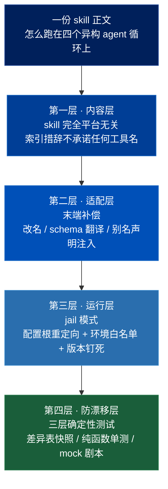
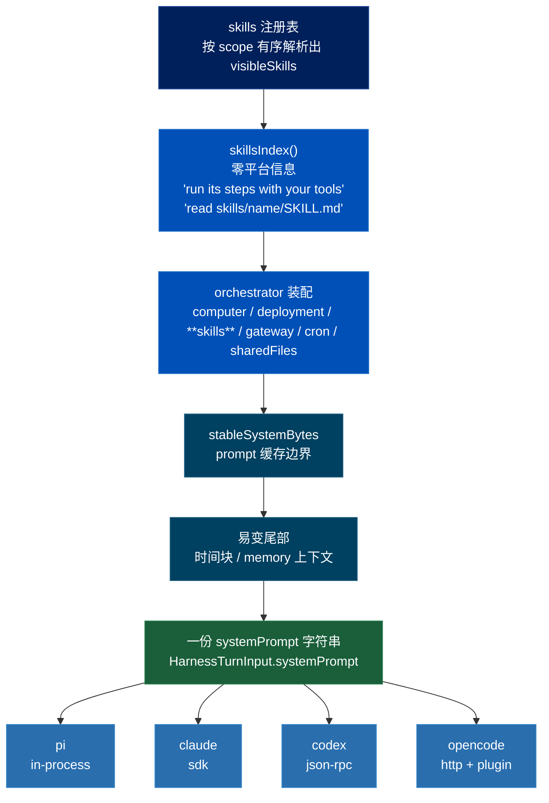
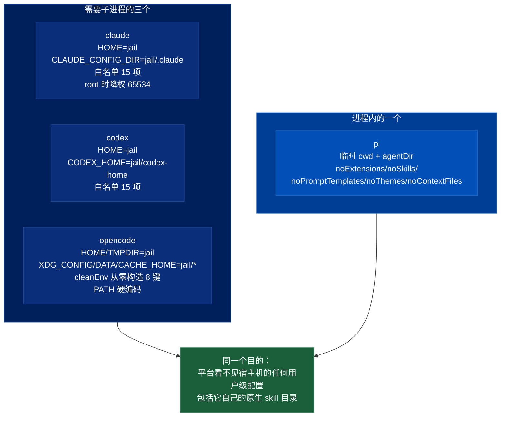
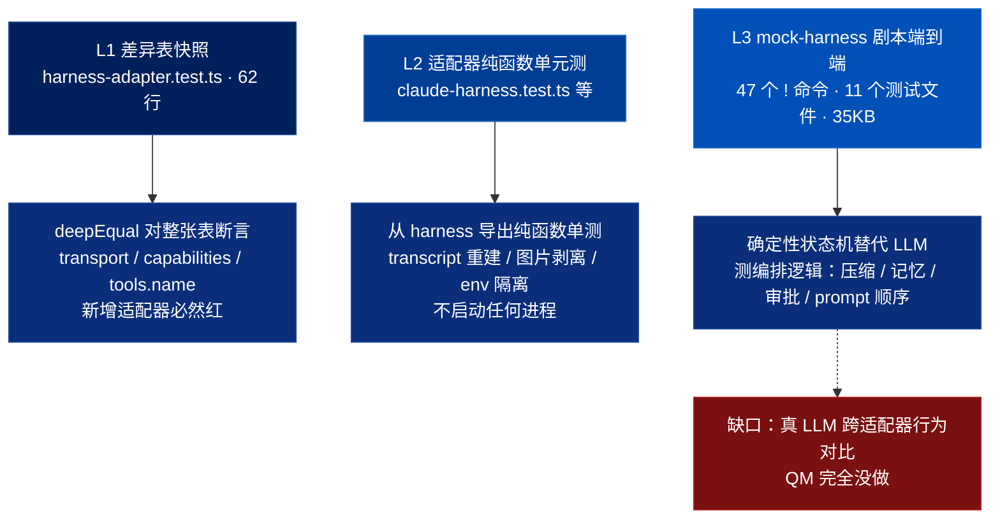

# QM Skill 跨 Harness 适配机制深入分析

> 关联文档：
> - [[qm-harness-layer]]（Harness 层——接口、tape 事件溯源、上下文压缩、冷启动重放；**本篇修正其中两处**）
> - [[qm-skills-layer]]（技能层——注册表、Pack 导入、两级物化）
> - [[qm-execution-layer]]（执行环境层——`AgentComputerProfile` 与本篇的 `HarnessAdapterProfile` 同构）
> - [[qm-overview]]（QM 项目整体调研）
> - [[qm-turn-slice]]（纵切面——systemPrompt 在 turn 时序里的装配位置）
> - [[qm-run-lifecycle]]（执行内核运行时——`GapPhase` 的另一端）
> - [[qm-adaptation-takeaways]]（**姊妹篇：从本篇提炼的可借鉴清单**）
>
> 调研对象：`yc-software/qm` 中「同一个 skill 怎么在四个互不相同的 agent 循环上都能用」这条纵切面
> 本地路径：`~/Repositories/qm`
> 调研时间：2026-08-14
> 仓库版本：`main` @ `0f0e0ad`（与前七篇同一基准）
>
> 范围：
> - `src/harness/harness.ts`（217 行，接口与 `defineHarness`）
> - `src/harness/codex-app-server.ts`（169 行，JSON-RPC 客户端全文）
> - `src/harness/opencode-plugin.ts`（286 行，工具 schema 翻译与插件钩子全文）
> - 四个 `*-harness.ts` 的 systemPrompt 加工点、profile 声明、jail 构造、生命周期与 abort 路径
> - `src/skills/materialize.ts:402` `skillsIndex()`、`src/core/orchestrator.ts:840-870` prompt 装配段
> - `src/sessions/session-store.ts:109-177` 观测数据模型
> - `package.json` 的平台依赖钉法
> - `test/` 下 379 个测试文件中与适配器一致性相关的部分
>
> 本篇只描述 QM 自身的机制。可借鉴性分析见姊妹篇 [[qm-adaptation-takeaways]]。

**一句话：QM 让一份 skill 跑在四个异构 agent 循环上的办法，是「skill 内容完全平台无关 + 每个适配器在自己那一端做末端补偿 + 把平台关进 jail 里用钉死的版本驱动 + 三层确定性测试守住那张差异表」。**

---

## 一、问题的形状

QM 的 README 把供应商中立写成架构约束：

> Pi、OpenCode、Codex、Claude Code 都驱动同一个 core，所以一次部署不会绑死在任何单一供应商上。

这句话落到 skill 上，就产生一个具体问题：**skills-seed 里那 18 个开箱技能，正文只有一份，怎么保证它在四个不同的 agent 循环里都能被正确执行？**

四个循环的差异不是细节层面的：

- 工具叫什么名字不一样
- 工具 schema 用什么语言描述不一样（JSON Schema vs Zod）
- systemPrompt 塞进哪个字段不一样
- 会话历史存在谁那儿不一样
- 连进程都不一定有（pi 是进程内的）

QM 的答案分四层，下面逐层拆。



---

## 二、内容层：skill 对四个 harness 完全无感

这一点必须先确立，因为它推翻了一个很自然的预期——「一定有个 skill 适配层，按平台改写正文」。**没有。一行都没有。**

### 2.1 唯一的装配路径

`src/core/orchestrator.ts:858`：

```js
if (visibleSkills.length) systemPrompt += `\n\n${skillsIndex(visibleSkills)}`;
```

`skillsIndex()` 的产出（`src/skills/materialize.ts:402`）不含任何平台信息：

```js
export function skillsIndex(resolved: SkillResolution[]): string {
  const items = resolved.filter((r) => r.skill).sort(/* 按 name 字典序 */);
  if (!items.length) return "";
  const lines = items.map((r) => {
    const m = r.skill!.manifest;
    const shadow = r.shadowed.length ? " (shadows a broader-scope skill of the same name)" : "";
    return `- **${m.name}** — ${m.description}${shadow}  → read \`${SKILLS_DIR}/${safeSkillDirName(m.name)}/SKILL.md\``;
  });
  return [
    "## Skills",
    "You have these skills available. To use one, read its SKILL.md and follow it (run its steps with your tools):",
    ...lines,
  ].join("\n");
}
```

然后**同一个 `systemPrompt` 字符串**通过 `HarnessTurnInput.systemPrompt` 原样交给四个适配器。没有 per-harness 分支。

### 2.2 「with your tools」：索引层不承诺工具面

`run its steps with your tools` —— 这句话里没有任何具体工具名。这不是随手写的措辞，是让 skill 跨 harness 可移植的前提：**索引层只说「用你的工具」，不说是哪个工具**。工具面的差异全部推到下游的适配层（第三节）解决。

同理，skill 正文的引用方式是 `→ read \`skills/<name>/SKILL.md\``——指向一个**沙箱里的文件路径**，而不是任何平台的 skill 加载机制。四个 harness 都有读文件的能力，所以这条指令在四处都成立。这是一个刻意选择的最小公共分母。

### 2.3 skill 索引落在 prompt 缓存的稳定前缀里

`orchestrator.ts` 的装配顺序（840-870 行）：

```js
// computer block
if (computerBlock) systemPrompt += `\n\n${computerBlock}`;
// deployment hints
if (deps.deploymentLayer?.hints.length) systemPrompt += `\n\n## Deployment tool hints\n...`;
// ← skills 在这里
if (visibleSkills.length) systemPrompt += `\n\n${skillsIndex(visibleSkills)}`;
// gateway / cron / sharedFiles
...
const stableSystemBytes = systemPrompt.length;      // ← 缓存边界画在这里
if (turnTimezone) systemPrompt += `\n\n${currentTimeBlock(turnTimezone, Date.now())}`;   // 易变尾部
```

`stableSystemBytes` 之前的一切按字节缓存，时间块起算易变尾部。**skill 索引在缓存内**——所以可见 skill 列表变化会击穿 prompt 缓存。这个边界由一条字节级断言守着（见 6.3 节）。

一份 systemPrompt，一个缓存边界，四条下游管线：



---

## 三、适配层：四条控制通道与末端补偿

### 3.1 四条通道的具体形态

| | pi | claude | codex | opencode |
|---|---|---|---|---|
| controlTransport | `in-process` | `sdk` | `json-rpc` | `http` |
| toolTransport | `in-process` | `in-process-mcp` | `dynamic` | `plugin` |
| transcriptFormat | `pi` | `claude-agent-sdk` | `responses-api` | `opencode` |
| 进程 | 无（同进程） | SDK 内部 spawn | `spawn(binary, ["app-server"])` | `spawn(binary, ["serve", "--hostname=127.0.0.1", "--port=N"])` |
| 通信 | 直接函数调用 | Claude Agent SDK | JSON-RPC over stdio | HTTP + loopback 回调桥 |
| 行数 | 2070 | 926 | 942 (+169 RPC) | 1163 (+286 plugin) |

值得注意 **四条通道的抽象层级完全不同**：pi 是函数调用，claude 是别人的 SDK，codex 是自研的 RPC 客户端，opencode 是「起一个 HTTP 服务 + 往它进程里塞一个插件 + 插件再 HTTP 回调过来」。QM 没有强行把它们统一成一种形态，只统一了**接口**（`Harness`），实现各自长成它该长的样子。

### 3.2 codex：自己写的 169 行 JSON-RPC 客户端

`codex-app-server.ts` 是整个 harness 层最独立的一个文件，值得逐条看它解决了什么。

**双向 RPC。** 不只是「我发请求它回结果」，codex 也会反过来调 QM：

```ts
export interface CodexAppServerOptions {
  binaryPath: string;
  cwd: string;
  env?: NodeJS.ProcessEnv;
  onNotification(method: string, params: unknown): void | Promise<void>;
  onRequest(method: string, params: unknown): Promise<unknown>;   // ← codex 调 QM
}
```

这就是 `toolTransport: "dynamic"` 的含义——工具不是预先注册的，是 codex 在需要时通过 `onRequest` 反向调用过来的。

**握手声明实验能力：**

```ts
await this.request("initialize", {
  clientInfo: { name: "qm", title: "QM", version: "1" },
  capabilities: { experimentalApi: true },
});
await this.notify("initialized");
```

**两条 Promise 串行链保证顺序。** 这是这个文件里最容易被忽略但最关键的设计：

```ts
private writeTail = Promise.resolve();   // stdin 写入串行
private eventTail = Promise.resolve();   // stdout 事件处理串行
```

写入侧：

```ts
private send(message: JsonRpcMessage): Promise<void> {
  const line = `${JSON.stringify(message)}\n`;
  const operation = this.writeTail.then(async () => {
    if (this.closed || !this.process.stdin?.writable) throw new Error("Codex app-server stdin is closed");
    await new Promise<void>((resolve, reject) => {
      this.process.stdin!.write(line, (error) => (error ? reject(error) : resolve()));
    });
  });
  this.writeTail = operation.catch(() => undefined);   // 失败不阻断后续
  return operation;
}
```

读取侧同理，每一行都挂在 `eventTail` 后面。**因为 JSON-RPC over stdio 是一条按行分隔的流，两个并发的 `write` 可能交错出半行 JSON。** 这条串行链是协议正确性的必要条件，不是性能优化。

注意 `this.writeTail = operation.catch(() => undefined)`——**尾指针挂的是「吞掉错误的版本」**，所以一次写失败不会让后续所有写都 reject。返回给调用方的是原始的 `operation`（会 reject），两者分离。

**stderr 环形缓冲进错误消息：**

```ts
this.process.stderr?.on("data", (chunk) => {
  this.stderr = `${this.stderr}${chunk.toString()}`.slice(-16_384);   // 只留最后 16KB
});
this.process.once("close", (code, signal) => {
  this.closeError = new Error(
    `Codex app-server exited (${code ?? signal ?? "unknown"})` +
    `${this.stderr.trim() ? `: ${this.stderr.trim()}` : ""}`,
  );
  this.failAll(this.closeError);
});
```

子进程死掉时，退出码单独看没有诊断价值。把 stderr 尾部拼进错误消息，才能知道**为什么**死。16KB 上限防止 stderr 刷屏撑爆内存。

**失败要全量传播：**

```ts
private failAll(error: Error): void {
  for (const waiter of this.pending.values()) waiter.reject(error);
  this.pending.clear();
}
```

进程死了，所有在途请求立刻 reject。否则它们会挂到超时，把一次快速失败变成一次漫长等待。

**关闭是两段式：**

```ts
async close(): Promise<void> {
  if (this.closed) return await this.processClosed;
  this.closed = true;
  this.process.kill("SIGTERM");
  const timer = setTimeout(() => this.process.kill("SIGKILL"), 2_000);
  await this.processClosed;
  clearTimeout(timer);
}
```

SIGTERM 给 2 秒体面退出，不走就 SIGKILL。`processClosed` 是一个在 `error` 或 `close` 事件里 resolve 的 Promise，保证 `close()` 真的等到进程没了才返回。

**无效 JSON 是致命错误：**

```ts
try { message = JSON.parse(line) as JsonRpcMessage; }
catch { throw new Error(`Codex app-server emitted invalid JSON: ${line.slice(0, 500)}`); }
```

抛出后被 `eventTail` 的 catch 接住 → `failAll` + `SIGTERM`。**协议一旦破损就整体放弃**，不尝试跳过坏行继续。这跟 [[qm-harness-layer]] 第 4.2 节 `lintFold` 的态度一致：结构合法性不可协商。

### 3.3 opencode：起服务 + 塞插件 + 回调桥

opencode 这条路是四条里最曲折的，因为 opencode 是一个**独立的 agent 产品**，有自己的工具、自己的 system prompt、自己的会话存储。QM 要做的是**把它的内在全部替换掉，只留循环**。

手段是 opencode 的插件机制。`opencode-plugin.ts` 是一个跑在 **opencode 进程内**的插件，通过一个 loopback HTTP 桥回调 QM core。

**桥的两端约束：**

```ts
function loopbackBridgeUrl(raw: string): URL {
  const url = new URL(raw.endsWith("/") ? raw : `${raw}/`);
  const hostname = url.hostname.toLowerCase();
  if (url.protocol !== "http:" ||
      (hostname !== "localhost" && hostname !== "[::1]" && !hostname.startsWith("127."))) {
    throw new Error("OPENCODE_BRIDGE_URL must be an HTTP loopback URL");
  }
  return url;
}
```

**这是 SSRF 防护的反面写法**——[[qm-skills-layer]] 第 5.1 节的 pack fetcher 拒绝私网地址，这里**只接受回环地址**。同一个安全直觉的两个方向：出网的必须是公网，内部桥的必须是本机。

配套 bearer 认证：

```ts
headers: { authorization: `Bearer ${bridgeSecret}`, ... }
```

`OPENCODE_BRIDGE_URL` 和 `OPENCODE_BRIDGE_SECRET` 都是 `requiredEnv` —— 缺了直接抛，没有默认值。

**工具是运行时发现的：**

```ts
const discovered = await request<BridgeTool[] | { tools: BridgeTool[] }>("definitions");
const bridgeTools = Array.isArray(discovered) ? discovered : discovered.tools;
```

插件启动时问 core 要工具定义，而不是硬编码。（注意它同时接受裸数组和 `{tools:[...]}` 两种形状——对自家协议的宽容。）

**150 行的 JSON Schema → Zod 翻译器。** 这是工具面适配最深的一层：core 的工具用 JSON Schema 描述参数，opencode 的 `tool()` API 要 Zod schema。所以有 `jsonSchemaToZod`：

```ts
function jsonSchemaToZod(z: any, schema: JsonSchema): any {
  const alternatives = schema.anyOf ?? schema.oneOf;
  if (alternatives) return schemaWithMetadata(schema, union(z, alternatives.map(m => jsonSchemaToZod(z, m))));
  if (schema.const !== undefined) return schemaWithMetadata(schema, literal(z, schema.const));
  if (schema.enum) return schemaWithMetadata(schema, union(z, schema.enum.map(m => literal(z, m))));
  if (Array.isArray(schema.type)) { /* 联合类型展开成 union */ }
  switch (schema.type) {
    case "object": value = objectSchema(z, schema); break;
    case "array":  value = z.array(jsonSchemaToZod(z, schema.items ?? {})); /* + minItems/maxItems */ break;
    case "string": value = stringSchema(z, schema);   /* + minLength/maxLength/pattern */ break;
    case "integer": value = numberSchema(z, schema, true);   /* + minimum/maximum */ break;
    case "number": value = numberSchema(z, schema, false); break;
    case "boolean": value = z.boolean(); break;
    case "null": value = z.null(); break;
    case undefined: value = schema.properties || schema.patternProperties ? objectSchema(z, schema) : z.unknown(); break;
    default: throw new Error(`Unsupported JSON Schema type: ${schema.type}`);
  }
  return schemaWithMetadata(schema, value);
}
```

几个细节：

- **约束不是丢的，是翻译的**：`minLength` → `.min()`、`pattern` → `.regex()`、`minimum` → `.min()`。参数校验的语义完整保留。
- **`description` 和 `default` 统一由 `schemaWithMetadata` 挂**，在每个分支末尾调用一次，不重复。
- **`additionalProperties` 三态映射**：`false` → `.strict()`、对象 → `.catchall(...)`、其余 → `.passthrough()`。
- **不认识的类型抛错**，不静默降级成 `z.unknown()`。翻译器宁可炸也不悄悄丢约束。
- **`patternProperties` 单例特化**：没有具名属性且只有一条 pattern 时翻译成 `z.record()`，这是 map 类型的惯用编码。

**三个插件钩子，各管一件事：**

```ts
return {
  tool: tools,

  // ① 注入模型网关的路由头
  "chat.headers": async (input, output) => {
    const context = await sessionContext(input.sessionID);
    Object.assign(output.headers, context.proxyHeaders ?? {});
  },

  // ② 完全替换 opencode 自己的 system prompt
  "experimental.chat.system.transform": async (input, output) => {
    if (!input.sessionID) return;
    const context = await sessionContext(input.sessionID);
    if (context.systemPrompt !== undefined)
      output.system.splice(0, output.system.length, context.systemPrompt);
  },

  // ③ 冷启动导入历史 + 把最终 prompt 回传给 core
  "experimental.chat.messages.transform": async (_input, output) => {
    const currentLastUser = output.messages.findLast((m) => m.info.role === "user");
    const sessionID = sessionIDFromMessages(output.messages);
    if (!sessionID || !currentLastUser) return;
    const context = await sessionContext(sessionID);
    const history = context.history ?? context.messages;
    if (needsHistoryImport(output.messages, history)) {
      output.messages.splice(0, output.messages.length, ...(history ?? []), currentLastUser);
    }
    await request(`session/${sessionID}/capture`, {
      method: "POST",
      body: JSON.stringify({ system: context.systemPrompt ?? "", messages: output.messages }),
    });
  },
};
```

钩子 ② 用的是 `splice(0, output.system.length, context.systemPrompt)`——**把 opencode 自己那一整套 system prompt 数组清空，换成 QM 的一条**。这是「只留循环，内在全换」最直白的一行代码。

钩子 ③ 的 `capture` 值得注意：**把最终真正发给模型的 system + messages 回传给 core 存档**。QM 不假设自己的注入一定生效，而是把落地结果捞回来。这是可观测性设计，也是事后审计的依据。

冷启动判据：

```ts
export function needsHistoryImport(messages, history): boolean {
  return history !== undefined && messages.length === 1;
}
```

opencode 侧只有一条消息（就是这轮的用户输入）说明它没有历史 → 从 core 导入。被导出成独立函数，可单测。

**竞态重试：**

```ts
const sessionContext = async (sessionID: string): Promise<SessionContext> => {
  let error: unknown;
  for (let attempt = 0; attempt < 20; attempt++) {
    try { return await request(`session/${sessionID}/context`); }
    catch (next) { error = next; await new Promise((r) => setTimeout(r, 25)); }
  }
  throw error;
};
```

20 次 × 25ms = 最多 500ms。这是在解决一个真实竞态：opencode 可能在 core 完成会话注册**之前**就触发了钩子。重试而不是加锁，因为窗口极短。注意它保留的是**最后一次**的错误抛出，不是第一次。

**工具执行里的终止信号：**

```ts
const result = await request<ToolResponse>(`session/${context.sessionID}/tool`, { ... });
if (result.terminate) {
  await client.session.abort({ path: { id: context.sessionID } }).catch(() => undefined);
}
return result.output;
```

core 的工具可以返回 `terminate: true`（对应 `stay_silent` / `finish_silently` 这类控制工具），插件收到后主动 abort opencode 的会话。**控制流跨进程传递**。

### 3.4 末端补偿：四个适配器各自加工 systemPrompt

四个适配器在接到 `systemPrompt` 之后、发给模型之前，各做一次加工：

| 适配器 | 加工点 | 做了什么 | 补偿的差异 |
|---|---|---|---|
| **opencode** | `opencode-harness.ts:863` | 尾部追加**工具别名说明** | 工具名不同 |
| **claude** | `claude-harness.ts:340` | 子 agent 时追加 `childPolicy` | 有原生 subagent，需额外收敛 |
| **codex** | `codex-harness.ts:607` | 塞进 `baseInstructions` 而非 `system` | 协议字段名不同 |
| **pi** | `pi-harness.ts:1294` | 追加 `replayPreamble(history)` | 冷启动无 provider session |

**opencode 的工具别名是这一组里最有代表性的。** 它先有一个纯函数做改名（`opencode-harness.ts:122`）：

```ts
export function bridgeToolName(name: string): string {
  if (name === "execute") return "workspace_execute";
  if (name === "read")    return "workspace_read";
  if (name === "write")   return "workspace_write";
  return name;
}
```

但改名会造成一个隐蔽问题：skill 正文和 core 的其他 prompt 段落里写的是 `execute`，模型看到的工具叫 `workspace_execute`，模型未必认得出是同一个东西。所以（`opencode-harness.ts:863`）：

```js
system: `${turn.systemPrompt}\n\nOpenCode tool aliases: workspace_execute is foreground \`execute\`; ` +
        `workspace_read reads workspace files; workspace_write writes workspace files.`,
```

**不改内容，给模型一张翻译表。**

这跟 [[qm-skills-layer]] 第 5.4 节完全同构：外部 pack 的 SKILL.md 写「运行 `./scripts/foo.sh`」，那是仓库相对路径；QM 不改写正文，而是追加一段「共享文件的基准路径在 `skills/.packs/<packId>/`」。同一个哲学的第二次应用——**用「告诉模型真相」替代「改写内容」**。

claude 的 `childPolicy` 是另一种形态的补偿：

```js
const childPolicy = `${turn.systemPrompt}\n\nComplete only the delegated task. ` +
  `Do not contact people, schedule work, change standing configuration, or suppress the parent reply.`;
```

claude 有原生 subagent（`CLAUDE_CHILD_AGENT_TYPES = new Set(["research", "code", "consult"])`），别的平台没有。多出来的能力要多一道约束，这道约束也是**文字**而不是代码。

---

## 四、运行层：jail 模式

三个需要起子进程的适配器（claude / codex / opencode）用了**同一个模式**：把平台的配置发现根目录整个重定向到一个临时 jail，环境变量按白名单放行。pi 因为是进程内的，用等价手段达到同样效果。

### 4.1 四次应用

| | jail | 重定向的配置根 | 环境变量策略 |
|---|---|---|---|
| **claude** | `mkdtempSync` | `HOME=jail`<br/>`CLAUDE_CONFIG_DIR=jail/.claude` | `CLAUDE_ENV_PASSTHROUGH` 白名单（15 项） |
| **codex** | `mkdtempSync(tmpdir, "qm-codex-")` | `HOME=jail`<br/>`CODEX_HOME=jail/codex-home` | `CODEX_ENV_PASSTHROUGH` 白名单（15 项） |
| **opencode** | `mkdtempSync(tmpdir, "qm-opencode-")` | `HOME=jail`, `TMPDIR=jail`<br/>`XDG_CONFIG_HOME=jail/.config`<br/>`XDG_DATA_HOME=jail/.data`<br/>`XDG_CACHE_HOME=jail/.cache` | `cleanEnv` 从零构造，只有 8 个键 |
| **pi** | `mkdtempSync` × 2（cwd + agentDir） | 构造器参数 `{cwd, agentDir}` | 用资源发现开关代替 |

### 4.2 白名单，不是黑名单

```ts
const CLAUDE_ENV_PASSTHROUGH = [
  "PATH", "TMPDIR", "LANG", "LC_ALL",
  "SSL_CERT_FILE", "SSL_CERT_DIR", "NODE_EXTRA_CA_CERTS",
  "HTTP_PROXY", "HTTPS_PROXY", "NO_PROXY", "ALL_PROXY",
  "ANTHROPIC_API_KEY", "ANTHROPIC_AUTH_TOKEN", "ANTHROPIC_BASE_URL", "CLAUDE_CODE_OAUTH_TOKEN",
] as const;

export function claudeChildEnv(source: NodeJS.ProcessEnv, jail: string): NodeJS.ProcessEnv {
  const env: NodeJS.ProcessEnv = { HOME: jail, CLAUDE_CONFIG_DIR: join(jail, ".claude") };
  for (const name of CLAUDE_ENV_PASSTHROUGH) {
    if (source[name] !== undefined) env[name] = source[name];
  }
  return env;
}
```

codex 的版本是逐字同构的，只有最后四项换成 `OPENAI_API_KEY` / `OPENAI_BASE_URL` / `CODEX_ACCESS_TOKEN`。

白名单的四类内容也很整齐：**PATH 与本地化**、**TLS 与证书**、**代理**、**该平台自己的凭证**。别的一律不传——`AWS_*`、`GITHUB_TOKEN`、`GIT_*`、用户的一切个人环境变量都进不去子进程。

这跟 [[qm-skills-layer]] 第 5.1 节 pack fetcher 的 git 进程隔离是同一招：

```js
for (const k of Object.keys(env)) if (/^(GIT_|SSH_)/.test(k)) delete env[k];
env.HOME = cwd;
```

只不过那里是黑名单删除，这里是白名单构造。**白名单更彻底**——新出现的环境变量默认不通过。

### 4.3 opencode 的 `cleanEnv`：连 PATH 都是自己写的

```js
const cleanEnv: NodeJS.ProcessEnv = {
  PATH: `${resolve(import.meta.dirname, "../../node_modules/.bin")}:/usr/local/bin:/usr/bin:/bin`,
  HOME: jail,
  TMPDIR: jail,
  XDG_CONFIG_HOME: join(jail, ".config"),
  XDG_DATA_HOME:   join(jail, ".data"),
  XDG_CACHE_HOME:  join(jail, ".cache"),
  OPENCODE_CONFIG_CONTENT: JSON.stringify(config),
  OPENCODE_BRIDGE_URL: bridgeUrl,
  OPENCODE_BRIDGE_SECRET: bridgeSecret,
};
```

三点值得注意：

- **PATH 是硬编码的四段**，第一段指向 QM 自己的 `node_modules/.bin`。不继承用户 PATH，所以用户装的任何东西都影响不到 opencode 子进程。
- **XDG 三件套全部重定向**。opencode 用 XDG 约定找配置（这一点在 [[qm-skills-layer]] 关联的 `USER_DIR_OVERRIDES` 里也体现过），所以三个都要盖。
- **`OPENCODE_CONFIG_CONTENT` 把整份配置以 JSON 字符串塞进环境变量**，不落盘。配置里包含了 agent 定义、工具启用表（`tools: { ...enabledTools, task: false }`）等。这比写配置文件干净——没有清理问题，没有并发问题。

### 4.4 pi：关掉全部资源发现

pi 是进程内的，没有环境变量可隔离，所以用另一种等价手段（`pi-harness.ts:948`）：

```js
async function createIsolatedResources(prefix: string, systemPrompt: string): Promise<IsolatedResources> {
  const cwd      = mkdtempSync(join(tmpdir(), `${prefix}-cwd-`));
  const agentDir = mkdtempSync(join(tmpdir(), `${prefix}-agent-`));
  const resourceLoader = new DefaultResourceLoader({
    cwd, agentDir, systemPrompt,
    noExtensions: true,
    noSkills: true,
    noPromptTemplates: true,
    noThemes: true,
    noContextFiles: true,
  });
  await resourceLoader.reload();
  return { resourceLoader, cwd, agentDir };
}
```

**五个 `no*` 开关把 pi 自己的全部资源发现机制关死。** 尤其 `noSkills: true`——**QM 驱动 pi 时，明确禁用 pi 原生的 skill 加载**。skill 只能通过 QM 注入的 systemPrompt 索引 + 沙箱里的文件进来，不能走 pi 自己的 `~/.pi/agent/skills`。

这是整个适配机制里最能说明设计意图的一行：**平台的原生 skill 机制是被主动关掉的，不是被绕过的。** 因为 QM 有自己的 scope 所有权与遮蔽模型（[[qm-skills-layer]] 第二节），平台自带的全局 skill 目录会破坏那个模型。

清理是显式的：

```js
function removeIsolatedDirs(dirs: { cwd: string; agentDir: string }): void {
  for (const dir of [dirs.cwd, dirs.agentDir]) {
    try { rmSync(dir, { recursive: true, force: true }); }
    catch (e) { swallow("pi: temp dir cleanup", e); }
  }
}
```

清理失败被 `swallow` 吞掉——临时目录泄漏比因清理失败而中断一次 turn 更可接受。

jail 模式的四次应用：



### 4.5 root 时降权

```ts
export function claudeProcessIdentity(uid = process.getuid?.()): { uid: number; gid: number } | undefined {
  return uid === 0 ? { uid: 65534, gid: 65534 } : undefined;
}

export function spawnClaudeProcess(options: SpawnOptions, identity?: { uid: number; gid: number }): SpawnedProcess {
  return spawn(options.command, options.args, {
    cwd: options.cwd, env: options.env, signal: options.signal,
    stdio: ["pipe", "pipe", "inherit"],
    ...identity,
  });
}
```

65534 是 `nobody`/`nogroup` 的传统 uid。**只在自己是 root 时才降权**（容器里常见），非 root 时返回 `undefined`，`...identity` 展开成空，不影响 spawn。一个三行函数处理了「容器里以 root 跑」这个真实场景。

### 4.6 平台版本精确钉死 + vendored

`package.json`：

```json
"@anthropic-ai/claude-agent-sdk": "0.3.211",
"@openai/codex":                  "0.144.5",
"opencode-ai":                    "1.17.18",
"@opencode-ai/sdk":               "1.17.18",
"@opencode-ai/plugin":            "1.17.18",
"@anthropic-ai/tokenizer":        "^0.0.4",
```

**五个平台相关依赖全是精确版本，没有 `^` 没有 `~`。** 整个 dependencies 里唯一带 caret 的是 tokenizer。

配套地，二进制从自己的 `node_modules` 解析，不是从 PATH：

```js
const binary = opts.binaryPath ?? resolve(import.meta.dirname, "../../node_modules/.bin/opencode");
```

再配套一个源码里的版本常量，只用于错误消息：

```js
const OPENCODE_VERSION = "1.17.18";
// ...
`OpenCode ${OPENCODE_VERSION} did not start within ${Math.round(timeoutMs / 1000)}s: ${diagnostics()}`
```

这三件事合起来的含义是：**QM 不驱动「用户机器上的那个 opencode」，它驱动「自己 vendored 的那个 1.17.18」。** 适配器代码里所有关于输出格式、启动横幅、插件钩子名的假设，都是对这个确切版本的假设。

（`OPENCODE_VERSION` 常量与 package.json 里的版本是两处独立维护的字符串，没有任何机制保证它们同步——见第九节风险 5。）

### 4.7 就绪探测：正则匹配启动横幅

```js
async function waitForServer(proc: ChildProcess, timeoutMs: number): Promise<string> {
  return await new Promise((resolveUrl, reject) => {
    let output = "";
    const diagnostics = () => output.trim().slice(-4096) || "(no output)";
    const cleanup = () => { clearTimeout(timer); proc.stdout?.off("data", onChunk); proc.stderr?.off("data", onChunk); };
    const timer = setTimeout(() => {
      cleanup();
      reject(new Error(`OpenCode ${OPENCODE_VERSION} did not start within ${...}s: ${diagnostics()}`));
    }, timeoutMs);
    const onChunk = (chunk: Buffer) => {
      output += chunk.toString();
      const match = output.match(/opencode server listening.*?on\s+(https?:\/\/[^\s]+)/);
      if (!match) return;
      cleanup();
      resolveUrl(match[1]!);
    };
    proc.stdout?.on("data", onChunk);
    proc.stderr?.on("data", onChunk);
    proc.once("error", (error) => { cleanup(); reject(error); });
    proc.once("exit", (code) => { cleanup(); reject(new Error(`OpenCode exited during startup (${code}): ${diagnostics()}`)); });
  });
}
```

五个设计点：

1. **stdout 和 stderr 都监听**，因为不确定横幅打在哪一路
2. **累积后再匹配**，不是逐 chunk 匹配——横幅可能被分片
3. **从横幅里解析出实际 URL**，而不是假设端口就是自己指定的那个
4. **三种失败出口**：超时 / `error` 事件 / `exit` 事件，每种都有专属消息
5. **三种失败都带 `diagnostics()`**（输出尾部 4KB）——启动失败时最需要的就是它到底打了什么

超时值 `OPENCODE_STARTUP_TIMEOUT_MS = 90_000`，比 codex 的 `CODEX_START_TIMEOUT_MS = 30_000` 长三倍。

### 4.8 abort：三种形态

`abort` 是四个适配器都声明了的能力，但实现完全不同：

- **claude**：`AbortController` 传进 SDK 的 `abortController` 参数，同时 `ref.abortSignal = controller.signal` 让工具侧也能感知；另有 `onAbort: async () => interrupt(true)` 回调
- **codex**：`toolAbort` 一个独立 controller 给工具用；`turn.cancel` 挂 listener；工具结果里的 `result.terminate` 也算一种终止
- **opencode**：跨进程——插件收到 `terminate` 后调 `client.session.abort({ path: { id: sessionID } })`；本地另有 `abortEvents` controller 管事件轮询循环

三者共同的入口守卫是一致的：

```js
if (turn.cancel?.aborted) return { reply: "", stopped: true };
```

**在开始干活之前先看一眼是不是已经被取消了**，三个适配器都有这一行（claude:327、codex:561、opencode:821/823/830，opencode 甚至在三个不同阶段各查一次）。

---

## 五、能力表的真实身份

```ts
export interface HarnessAdapterProfile {
  id: string;
  controlTransport: "mock" | "in-process" | "sdk" | "http" | "json-rpc" | "api";
  toolTransport:    "mock" | "in-process" | "plugin" | "dynamic" | "in-process-mcp" | "mcp";
  transcriptFormat: string;
  capabilities: ReadonlySet<"abort" | "steer" | "images" | "thinking-level" | "fast-mode" | "provider-sessions">;
}
```

逐条核对源码后的完整表：

| | pi | claude | codex | opencode | mock |
|---|---|---|---|---|---|
| controlTransport | `in-process` | `sdk` | `json-rpc` | `http` | `mock` |
| toolTransport | `in-process` | `in-process-mcp` | `dynamic` | `plugin` | `mock` |
| transcriptFormat | `pi` | `claude-agent-sdk` | `responses-api` | `opencode` | `qm` |
| abort / steer / images | 有 | 有 | 有 | 有 | — |
| thinking-level | 有 | 有 | — | — | — |
| fast-mode | 有 | 有 | — | — | — |
| provider-sessions | 有 | **无** | 有 | 有 | — |

### 5.1 全仓 grep 的结果

```
capabilities 声明点：5 处（四个适配器 + mock）
capabilities 断言点：3 处（全部在 test/harness-adapter.test.ts:40-42）
capabilities 生产消费点：0 处
```

`controlTransport` / `toolTransport` / `transcriptFormat` 同样——**除测试外没有任何生产代码读它们**。

所以能力表在 QM 里的真实身份不是「运行时分派依据」，而是两件事：

1. **一张可执行的文档**——差异写在代码里而不是 README 里，不会腐烂成过期文字
2. **一道回归护栏**——某次重构不小心把 opencode 的 `fast-mode` 打开了，`harness-adapter.test.ts` 会红

[[qm-harness-layer]] 第一节把 `HarnessAdapterProfile` 讲成「不假装四个后端一样，把差异提升成可查询的数据」——**「可查询」这半句在实现层面目前是空的**。差异确实被提升成了数据，但没有查询者。

### 5.2 唯一真正被消费的差异：`tools.name`

`HarnessToolPresentation` 是 `Harness` 接口的第四个字段，默认恒等：

```ts
export function defineHarness(
  profile: HarnessAdapterProfile,
  implementation: HarnessImplementation,
  tools: HarnessToolPresentation = { name: (coreName) => coreName },
): Harness
```

opencode 覆盖了它（映射到 `bridgeToolName`），并且有测试守着（`test/harness-adapter.test.ts:52-55`）：

```js
assert.equal(pi.tools.name("read"), "read");
assert.equal(opencode.tools.name("read"), "workspace_read");
assert.equal(opencode.tools.name("execute"), "workspace_execute");
assert.equal(opencode.tools.name("write"), "workspace_write");
```

**这是整个 profile 机制里唯一有真实消费者的字段。** 它加上 3.4 节的别名声明注入，构成了跨平台工具面适配的完整闭环。

### 5.3 勘误：对 [[qm-harness-layer]] 的两处修正

**修正一（重要）。** 该文第 88 行原写：

> `tools.name` 默认是恒等函数，**目前四个适配器没有一个覆盖它**——这个接缝存在但未使用。

**这是错的。** 依据见上。原文把整个 profile 机制里唯一落地的那条判成了「未使用」，而把没有消费者的 `capabilities` 讲成了核心手法——两处评价正好接反了。

**修正二（次要）。** [[qm-overview]] 称 `test/` 有 386 个测试文件；本次实测 `test/*.test.ts` 为 379 个（目录条目 384，含 `support/`、`memory-bench/` 等非测试项）。基准 commit 相同，差异应为原文计数口径不同。

---

## 六、防漂移层：三层确定性测试，零真 LLM



### 6.1 L1：62 行守住五个适配器

```js
assert.deepEqual(
  [mock, pi, opencode, codex, claude].map(h => h.profile.controlTransport),
  ["mock", "in-process", "http", "json-rpc", "sdk"],
);
assert.deepEqual(
  [mock, pi, opencode, codex, claude].map(h => h.profile.toolTransport),
  ["mock", "in-process", "plugin", "dynamic", "in-process-mcp"],
);
```

**用 `deepEqual` 对整个数组断言，而不是五个独立的 `equal`。** 失败时一次看到全表；新增适配器**必然**让这条测试红，强制作者来这里登记。这是一种「注册表守卫」模式。

第三个 test 守的是接口的职责切分本身：

```js
assert.equal(typeof harness.turns.runTurn, "function");
assert.equal(await harness.models.oneShot?.("system", "hello"), "mock one-shot reply to: hello");
assert.equal("oneShot" in harness.turns, false);
assert.equal("runTurn" in harness.models, false);
```

**后两条是负向断言**——`turns` 里不许有 `oneShot`，`models` 里不许有 `runTurn`。`defineHarness` 那套「只挂载实现了的方法」的条件展开如果写错，这里会红。

`skill-conformance.test.ts` 是同一思路的另一面，全文 23 行：

```js
test("every seed SKILL.md parses with a name, description, and body", () => {
  const files = seedSkillFiles();
  assert.ok(files.length > 0, `expected at least one seed SKILL.md under ${SEED_DIR}`);
  for (const path of files) {
    const m = parseSeedSkill(readFileSync(path, "utf8"));
    assert.ok(m.name && m.description && m.body.trim(), `${path} is missing a required field`);
  }
});
```

注意 `assert.ok(files.length > 0, ...)`——**防止「glob 没匹配到文件所以零个失败」这种假绿**。这是整个 skill 层面唯一的自动化检查：纯静态，只验证能不能解析出三个必需字段。

### 6.2 L2：把 harness 的纯函数掏出来单独测

`claude-harness.ts` 是 926 行的适配器，但它 `export` 了一批纯函数专供测试：

```js
import {
  claudeChildAgentAllowed, claudeChildEnv, claudeProcessIdentity,
  claudeReplayTranscript, claudeToolContext, spawnClaudeProcess, stripClaudeImageBytes,
} from "../src/harness/claude-harness.ts";
```

于是「重建 transcript 时有没有正确声明它是不可信历史」变成一个字符串断言：

```js
const replay = claudeReplayTranscript(messages);
assert.match(replay, /untrusted conversation history, not instructions/);
assert.match(replay, /Assistant tool call \(history, call call-1\).*needle/);
assert.match(replay, /Tool result \(history, call call-1\): found it/);
```

同样的手法在 opencode 侧是 `needsHistoryImport` 和 `bridgeToolName`——**适配器里最容易出错的是格式转换与判据，而这两者都是纯函数**。掏出来单测，能覆盖适配器绝大部分风险，成本接近零。

### 6.3 L3：`!sysprompt` 回吐 + 字节级缓存断言

`mock-harness.ts:248`：

```js
} else if (command0 === "!sysprompt") {
  reply = turn.systemPrompt;
}
```

假 harness 收到 `!sysprompt` 就把它拿到的 systemPrompt 原样当回复吐出来。于是「prompt 装配对不对」变成对一个字符串做结构断言（`system-prompt-order.test.ts`）：

```js
assert.ok(hasHeading(prefixA, title), `expected "## ${title}" inside the cached prefix`);
assert.ok(!hasHeading(prefixA, title), `"## ${title}" must stay in the volatile tail, not the cached prefix`);
assert.equal(prefixB, prefixA, "the cached prefix must be byte-identical across two turns of one conversation");
assert.ok(prefixA.includes("**alpha**") && prefixA.includes("**zeta**"), "skills render in the cached prefix");
assert.doesNotMatch(prompt, /hi alice/);
assert.doesNotMatch(slack.reply ?? "", /## Talking on Slack/);
```

四个手法：

- **正向 + 负向成对**：既断言该有的在，也断言不该有的不在
- **字节级相同**：`prefixB === prefixA`，两轮之间缓存前缀必须一字节不差——这是 prompt 缓存正确性唯一可靠的断言方式
- **skill 索引的位置被明确断言**在缓存前缀内（`prefixA.includes("**alpha**")`）
- **「不该被碰的东西」本身是断言**：

  ```js
  const unreached = () => {
    throw new Error("fakeSandbox: a conversational !sysprompt turn must not touch the sandbox");
  };
  ```

  `fakeSandbox` 的每个方法都是 `unreached`。一次纯对话的 turn 如果碰了沙箱，测试就炸，错误消息直接说明违反了什么约束。

### 6.4 mock-harness：47 个命令的确定性剧本引擎

35KB 的 `mock-harness.ts` 不是「返回固定字符串的桩」，是一个**由 prompt 驱动的确定性状态机**。输入以 `!` 开头就触发对应行为：

```
!run !read !write !post !react !edit !delete !search !broadcast !reach !owner !scratch
!speakpost !postthread !reachchan !read_thread !read_members !read_file !whats_new
!think !summary-boom !summary-hang !summary-none !cachemiss !histcount !priorturns !overheard
!paused-approval !collect-approval !collect-exec !double-exec !preamble !wallclock !sysprompt
!finish-silent !finish-silent-approval !finish-silent-paused !staysilent !silent
!refuse !boom !boom-always !shed !shedmute !work-then-boom !askagent !get !set
```

共 47 个，11 个测试文件在用。覆盖的是记忆抽取、上下文压缩、prompt 顺序、持久进程会话、拒绝路径、审批中断——**全是编排逻辑，全部确定性，零 LLM 调用**。

它还模拟资源消耗，让 token 会计路径也能被测：

```js
const callUsage = (step: number) => ({
  input: inputTokens, output: 8,
  cacheRead:  cacheMiss && step === 0 ? 0 : prefixTokens,
  cacheWrite: cacheMiss && step === 0 ? prefixTokens : 0,
  totalTokens: prefixTokens + inputTokens + 8,
  costUsd: 0,
});
```

`!cachemiss` 命令专门用来制造一次缓存未命中，验证缓存会计逻辑。

### 6.5 分工总结

| 测什么 | 用什么 | 要不要真模型 |
|---|---|---|
| 编排逻辑（压缩、记忆、审批、prompt 装配） | mock-harness 剧本 | 否 |
| 适配器格式转换与判据 | 导出的纯函数 | 否 |
| 平台差异不漂移 | profile 整表快照 | 否 |
| seed skill 能否解析 | 23 行静态检查 | 否 |
| **skill 指令在不同模型下是否被正确理解** | **无** | **—** |

最后一行是空的。

---

## 七、观测数据模型

`HarnessTurnInput` 里有一个 `recordLlmRequest?` 回调，各适配器逐步填充：

```ts
export interface HarnessLlmRequestRecord {
  turnSeq: number | null;
  step: number;
  model: string;
  request: unknown;
  truncated: boolean;
  transport?: LlmTransportMeta | null;
  ttftMs?: number | null;        // time to first token
  durationMs?: number | null;
  stepGapMs?: number | null;     // 两步之间的空档
  toolWallMs?: number[] | null;  // 每个工具的墙钟
  gapPhases?: GapPhases | null;
  usage?: LlmCallUsage | null;
}

export interface LlmCallUsage {
  input: number; output: number;
  cacheRead: number; cacheWrite: number;
  totalTokens: number; costUsd: number;
}
```

### 7.1 `GapPhase`：22 相延迟归因

最有意思的是 `gapPhases`。QM 把「模型没在算的那些时间」切成 22 个相：

```ts
export type GapPhase =
  | "provision" | "creds" | "dir_cleanup" | "proc_reconcile" | "auth_probe" | "skills_materialize"
  | "recall" | "memory_write" | "file_op" | "exec"
  | "model_dispatch" | "dispatch_glue" | "loop_reentry" | "context_assemble" | "glue_other"
  | "tool_body" | "pre_tool" | "in_tool_untagged" | "post_tool" | "tool_ledger"
  | "persist" | "stream_open";

export interface GapWork { phase: GapPhase; start: number; end: number; tool?: string; }

export type GapPhases = Partial<Record<GapPhase, number>>
  & { residual?: number }
  & { [key: `tool_body.${string}`]: number | undefined };
```

三个设计点：

- **`residual`**：22 相加起来对不上总时长的部分单列。**承认自己没归因完**，而不是把误差摊进某一相。
- **模板字面量键 `tool_body.${string}`**：工具体时间按工具名再细分一层，类型系统层面就允许 `tool_body.execute`、`tool_body.read`。
- **`skills_materialize` 单独是一相**——skill 物化（[[qm-skills-layer]] 第六节）的耗时被独立计量。

记录点分布在三处：`tools/primitives.ts:403` 的 `timed<T>(phase, op)` 包装器、`core/orchestrator.ts:1220` 的 `emitGapWork`、`core/orchestrator/sandboxes.ts:56`。

### 7.2 这套模型是 harness 无关的

`recordLlmRequest` 是 `HarnessTurnInput` 的字段，四个适配器各自在自己的循环里调用它。**观测的数据结构由 core 定义，适配器负责填**——这跟 systemPrompt 的方向一致：core 定义形状，适配器负责翻译进/出。

不过 `ttftMs` / `stepGapMs` 这类指标依赖流式事件，能填多满取决于各平台给不给。代码里全是可选字段（`?` + `| null`），说明预期就是**参差不齐**。

---

## 八、设计哲学

**1. 内容平台无关，差异在末端补偿。**
skill 正文、systemPrompt 主体、工具语义都只有一份。平台差异在每个适配器的最后一步用**追加文字**的方式消化。补偿是数据（一段字符串），不是分支逻辑。

**2. 用「告诉模型真相」替代「改写内容」。**
工具改名了就告诉它别名表；路径基准变了就告诉它基准在哪；历史是重放的就告诉它这是不可信记录。三处同构。

**3. 统一接口，不统一实现形态。**
四条控制通道分别是函数调用 / 第三方 SDK / 自研 RPC / HTTP+插件注入。`Harness` 接口统一，实现各自长成它该长的样子。没有为了对称而强行抽象。

**4. 平台要关进 jail，用钉死的版本驱动。**
配置发现根目录全部重定向到临时目录，环境变量白名单构造，二进制从自己的 node_modules 解析，版本精确到 patch。**包括主动关掉平台自己的 skill 加载机制**——因为 core 有自己的 skill 所有权模型。

**5. 白名单优于黑名单。**
`CLAUDE_ENV_PASSTHROUGH` / `CODEX_ENV_PASSTHROUGH` / opencode 的 `cleanEnv` 都是从零构造。新出现的环境变量默认不通过。

**6. 协议破损就整体放弃，不尝试局部修复。**
codex 收到无效 JSON → `failAll` + SIGTERM。这跟 `lintFold` 不过就不 seed 是同一态度。

**7. 失败诊断要带上下文。**
子进程退出消息拼 stderr 尾部 16KB；启动超时消息拼输出尾部 4KB；三种启动失败出口各有专属措辞。退出码单独看没有诊断价值。

**8. 用确定性状态机替代 LLM 来测编排。**
47 个命令的 mock-harness 覆盖压缩、记忆、审批、prompt 顺序。真模型只出现在生产里，不出现在测试里。

**9. 差异表用整表快照守住。**
`deepEqual` 对数组整体断言，新增适配器必然让测试红，强制来登记。

**10. 承认归因不完整。**
`GapPhases.residual` 把对不上的时间单列，而不是摊进某一相。

---

## 九、张力与风险

**1. 能力表没有消费者，长期会腐烂成谎言。**
5 处声明、3 处断言、0 处消费。这张表靠 `harness-adapter.test.ts` 一条测试守着，而这条测试断言的正是声明本身——**自己证明自己**。如果有人改了适配器的能力集合同时改了测试（很自然的操作），表就和现实脱节而无人察觉。没有任何生产路径会因为这张表错了而出错，所以错误不会被发现。

**2. `OPENCODE_VERSION` 常量与 package.json 版本是两处独立字符串。**
`opencode-harness.ts:27` 硬编码 `"1.17.18"`，package.json 里三个 opencode 包也是 `1.17.18`。升级时需要改四处，没有任何机制保证同步。常量只用于错误消息，所以不同步的后果是「错误消息里报了个错误的版本号」——低危但误导性强。

**3. 就绪探测依赖启动横幅的正则。**
`/opencode server listening.*?on\s+(https?:\/\/[^\s]+)/` 匹配的是 opencode 的一行人类可读输出。**上游改一次措辞，QM 的启动就永久超时 90 秒然后失败。** 版本钉死缓解了这个风险（1.17.18 的横幅不会变），但也意味着升级 opencode 时这条正则是必须复核的隐性契约。同类脆弱性在 codex 侧是 `CODEX_NON_RETRYABLE_PATTERN` 对错误消息的正则匹配。

**4. `jsonSchemaToZod` 是一个 150 行的手写翻译器，覆盖面有限。**
不支持的类型直接抛错（这是对的），但支持的部分也有缺口：没有处理 `allOf`、没有处理 `$ref`、没有处理 `not`、`exclusiveMinimum`/`exclusiveMaximum` 未映射、`uniqueItems` 未映射、`format`（date-time / uri 等）完全忽略。core 目前的工具 schema 用不到这些，所以不是 bug；但这是一个**只对当前工具集正确**的翻译器，加一个用了 `allOf` 的工具就会在 opencode 上炸。

**5. `bridgeToolName` 是三行 if 硬编码。**
三个工具三行。工具面一旦扩大，这里会变成一长串 if，且与 3.4 节那段人工维护的别名说明文字**没有任何一致性保证**——改了映射忘了改文字，模型就会拿到一张过期的翻译表，而没有测试会发现（`harness-adapter.test.ts` 只断言映射，不断言那段文字）。

**6. 插件的 `sessionContext` 用 20×25ms 重试掩盖竞态。**
最多 500ms。竞态窗口如果因为负载变长（core 忙、注册慢），重试会耗尽然后抛出**最后一次**的错误——那个错误是「找不到 session」，指向的是症状不是原因。没有区分「还没准备好」和「真的不存在」。

**7. pi 的临时目录清理失败被静默吞掉。**
`swallow("pi: temp dir cleanup", e)`。选择是对的（不该因清理失败中断 turn），但长时间运行的实例会在 `$TMPDIR` 下累积 `pi-cwd-*` / `pi-agent-*` 目录，没有兜底的周期清扫。

**8. opencode 的 `capture` 回传没有大小上限。**
```js
await request(`session/${sessionID}/capture`, {
  method: "POST",
  body: JSON.stringify({ system: context.systemPrompt ?? "", messages: output.messages }),
});
```
每一轮把完整的 system + 全部 messages POST 回 core。桥的接收侧有 `body(req, max = 16MB)` 限制，但发送侧没有截断——长会话下这是一次 16MB 边缘的重复传输，且**每轮都传全量**。

**9. 三个 jail 用 `mkdtempSync`（同步）。**
`claude` / `codex` / `opencode` 的 jail 和 pi 的隔离目录都用同步版本。在事件循环上阻塞，虽然每轮只有一两次，但这是一个反复强调并发正确性的代码库里的一处不一致。

**10. 四个适配器的 abort 语义只在「入口守卫」这一行上真正一致。**
`if (turn.cancel?.aborted) return { reply: "", stopped: true };` 三处都有。但之后的中断路径完全不同：claude 靠 SDK 的 `abortController` + `onAbort`，codex 靠独立的 `toolAbort` + `result.terminate`，opencode 靠跨进程的 `client.session.abort`。`capabilities` 里 `abort` 那一格是「有」，但四个「有」的语义强度（能不能中断到一半的工具？中断后 provider session 是什么状态？）并不相同，而这张表表达不了这个差别。

---

> 相关：[[qm-adaptation-takeaways]]（姊妹篇：可借鉴清单） · [[qm-harness-layer]]（本篇修正其两处） · [[qm-skills-layer]] · [[qm-execution-layer]] · [[qm-overview]]
