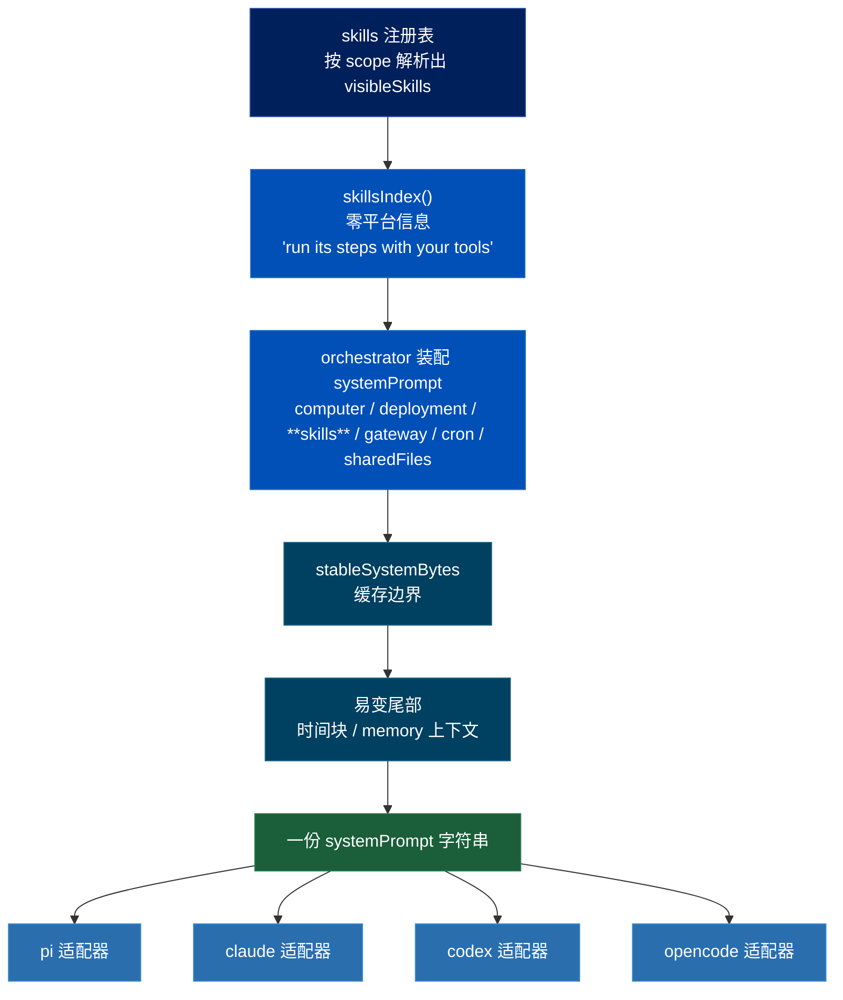
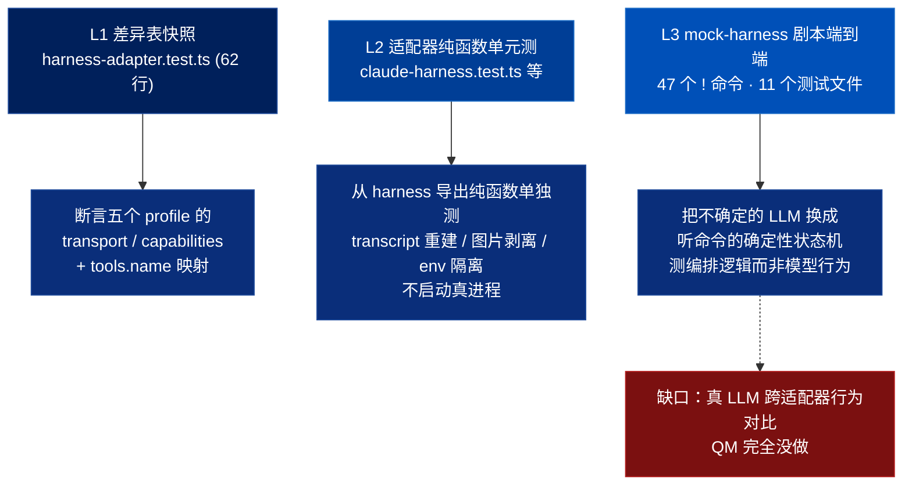

# QM Skill 跨 Harness 适配机制深入分析

> 关联文档：
> - [[qm-harness-layer]]（Harness 层——四适配器一套接口、tape 事件溯源；**本篇修正其中两处**）
> - [[qm-skills-layer]]（技能层——注册表、Pack 导入、两级物化）
> - [[qm-overview]]（QM 项目整体调研）
> - [[qm-turn-slice]]（纵切面——systemPrompt 在 turn 时序里的装配位置）
>
> 调研对象：`yc-software/qm` 中「同一个 skill 怎么在四个互不相同的 agent 循环上都能用」这条纵切面
> 本地路径：`~/Repositories/qm`
> 调研时间：2026-08-14
> 仓库版本：`main` @ `0f0e0ad`（与前七篇同一基准）
>
> 范围：`src/harness/harness.ts`（接口）、四个 `*-harness.ts` 的 systemPrompt 加工点与 profile 声明、
> `src/skills/materialize.ts:402` `skillsIndex()`、`src/core/orchestrator.ts:840-870` 的 prompt 装配段、
> 以及 `test/` 下 379 个测试文件中与适配器一致性相关的部分
> （`harness-adapter.test.ts` 62 行、`skill-conformance.test.ts` 23 行、`system-prompt-order.test.ts`、
> `claude-harness.test.ts`、`mock-harness.ts` 35KB）。
>
> **提出的问题**：我们要造一个「同一个 skill 在 N 个 agent 平台上的适配性测试框架」。
> QM 是唯一一个真的在生产里让一份 skill 跑在四个异构 harness 上的开源系统。它怎么做的？哪些能抄？

**一句话：QM 让 skill 跨四个 harness 可用的办法，不是「为每个平台改写 skill」，而是「skill 完全平台无关 + 适配器做末端补偿 + 三层测试守住那张差异表」。而它从来没有跑真 LLM 做过跨适配器行为对比——那一块得我们自己造。**

---

## 一、最重要的事实：skill 内容对四个 harness 完全无感

这一点必须先确立，因为它推翻了一个很自然的预期——「一定有个 skill 适配层，按平台改写正文」。**没有。一行都没有。**

装配路径只有一条（`src/core/orchestrator.ts:858`）：

```js
if (visibleSkills.length) systemPrompt += `\n\n${skillsIndex(visibleSkills)}`;
```

`skillsIndex()` 产出的东西（`src/skills/materialize.ts:402`）也完全不含平台信息：

```js
return [
  "## Skills",
  "You have these skills available. To use one, read its SKILL.md and follow it (run its steps with your tools):",
  ...lines,   // - **name** — description  → read `skills/<name>/SKILL.md`
].join("\n");
```

然后**同一个 `systemPrompt` 字符串**通过 `HarnessTurnInput.systemPrompt` 原样交给四个适配器。

### 1.1 「with your tools」是刻意的措辞

`run its steps with your tools` —— 这句话里没有任何具体工具名。这不是随手写的，是让 skill 跨 harness 可移植的关键措辞：**索引层不承诺工具面**，工具面的差异由适配器自己在下游解决（见第二节）。

对照我们仓库：`skills/` 下大量 SKILL.md 直接写 `用 Bash 跑`、`用 WebSearch 查`、`用 AskUserQuestion 问`。这些是**索引层措辞的反面**——把工具名焊死在正文里。这正是「写在 Claude Code 上用了 Claude 特性」的具体形态。

### 1.2 skill 索引落在 prompt 缓存的**稳定前缀**里

```js
if (visibleSkills.length) systemPrompt += `\n\n${skillsIndex(visibleSkills)}`;
// ... gateway / cron / sharedFiles 块
const stableSystemBytes = systemPrompt.length;      // ← 缓存边界画在这里
if (turnTimezone) systemPrompt += `\n\n${currentTimeBlock(...)}`;   // 易变尾部
```

`stableSystemBytes` 之前的一切按字节缓存，时间块之后的算易变尾部。**skill 索引在缓存内**——所以 skill 列表变化会击穿缓存，而这被一条字节级断言守着（第四节 4.3）。

一份 systemPrompt，一个缓存边界，四条下游管线：



---

## 二、适配发生在哪：四种「末端补偿」

既然 skill 正文不改，平台差异必须在别处消化。四个适配器各自在**接到 systemPrompt 之后、发给模型之前**做一次加工。这是整个调研里最可借鉴的一段。

| 适配器 | 加工点 | 做了什么 | 补偿的是什么差异 |
|---|---|---|---|
| **opencode** | `opencode-harness.ts:863` | 尾部追加**工具别名说明** | 工具名不同（`execute` → `workspace_execute`） |
| **claude** | `claude-harness.ts:340` | 子 agent 时追加 `childPolicy` 约束 | 有原生 subagent，需额外收敛权限 |
| **codex** | `codex-harness.ts:607` | 塞进 `baseInstructions` 而非 `system` | 协议字段名不同 |
| **pi** | `pi-harness.ts:1294` | 追加 `replayPreamble(history)` | 冷启动无 provider session，要补历史 |

### 2.1 opencode 的工具别名：教科书级的做法

opencode 平台的工具命名空间和 core 不一致，所以有一个纯函数做映射（`opencode-harness.ts:122`）：

```js
export function bridgeToolName(name: string): string {
  if (name === "execute") return "workspace_execute";
  if (name === "read")    return "workspace_read";
  if (name === "write")   return "workspace_write";
  return name;
}
```

**但真正精彩的是它没有停在这儿。** 光改工具名会造成一个隐蔽问题：skill 正文里写的是 `execute`，模型看到的工具叫 `workspace_execute`，模型可能认不出这是同一个东西。所以（`opencode-harness.ts:863`）：

```js
system: `${turn.systemPrompt}\n\nOpenCode tool aliases: workspace_execute is foreground \`execute\`; ` +
        `workspace_read reads workspace files; workspace_write writes workspace files.`,
```

**不改 skill 正文，而是给模型一张翻译表。**

这条模式的一般形式是：

> 当平台 P 的工具面与 skill 正文假设的工具面不一致时，
> 不要重写 skill，也不要禁用它——**在 P 的适配器里注入一段声明差异的文字**。

这跟 [[qm-skills-layer]] 第 5.4 节的 pack 共享文件是完全同构的手法：外部 skill 写「运行 `./scripts/foo.sh`」，QM 不改写正文，而是**追加一段说明告诉模型基准路径在哪**。同一个哲学的第二次应用：**用「告诉模型真相」替代「改写内容」**。

### 2.2 这条模式为什么对我们特别重要

我们的问题是「skill 写在 Claude Code 上，用了 Claude 的特性」。QM 给出的答案不是「为每个平台维护一份 skill 变体」（那会 N 倍维护成本），而是：

- skill 正文保持一份、平台无关
- **每个平台适配器持有一份「差异声明」**，运行时注入
- 差异声明是**数据**（一段可测的字符串），不是分支逻辑

这直接决定了我们框架的形状：适配器 = `{ 怎么起进程, 怎么注入, 怎么抽输出 } + 一段平台差异声明`。

---

## 三、能力协商的真相：声明了，测了，但生产从不读它

[[qm-harness-layer]] 第一节把 `HarnessAdapterProfile` 讲成核心架构手法。**在实现层面这个说法要打折扣。**

```ts
export interface HarnessAdapterProfile {
  id: string;
  controlTransport: "mock" | "in-process" | "sdk" | "http" | "json-rpc" | "api";
  toolTransport:    "mock" | "in-process" | "plugin" | "dynamic" | "in-process-mcp" | "mcp";
  transcriptFormat: string;
  capabilities: ReadonlySet<"abort" | "steer" | "images" | "thinking-level" | "fast-mode" | "provider-sessions">;
}
```

四个适配器的实际声明（逐条核对源码）：

| | pi | claude | codex | opencode | mock |
|---|---|---|---|---|---|
| controlTransport | `in-process` | `sdk` | `json-rpc` | `http` | `mock` |
| toolTransport | `in-process` | `in-process-mcp` | `dynamic` | `plugin` | `mock` |
| transcriptFormat | `pi` | `claude-agent-sdk` | `responses-api` | `opencode` | `qm` |
| abort / steer / images | 有 | 有 | 有 | 有 | — |
| thinking-level | 有 | 有 | — | — | — |
| fast-mode | 有 | 有 | — | — | — |
| provider-sessions | 有 | **无** | 有 | 有 | — |

### 3.1 全仓 grep 的结果

```
capabilities 的声明点：5 处（四个适配器 + mock）
capabilities 的断言点：3 处（全部在 test/harness-adapter.test.ts:40-42）
capabilities 的生产消费点：0 处
```

`profile.controlTransport` / `toolTransport` / `transcriptFormat` 同样——**除了测试，没有任何生产代码读它们**。

所以能力表在 QM 里的真实身份不是「运行时分派依据」，而是：

1. **一张可执行的文档**——差异写在代码里而不是 README 里，不会腐烂
2. **一道回归护栏**——某次重构不小心把 opencode 的 `fast-mode` 打开了，`harness-adapter.test.ts` 会红

### 3.2 这对我们是个好消息

我一开始的设想是「测试用例声明所需能力 → 平台没有就自动 skip」。QM 的实践说明：**能力表先做成「声明 + 断言」就够了，不必一上来就建分派机制。**

真实的降级需求会自己浮现（QM 跑到 v1 都还没浮现出来），到时候再让消费点长出来。先建一个没有消费者的能力分派框架，是典型的过度设计。

### 3.3 勘误：对 [[qm-harness-layer]] 的两处修正

**修正一（重要）。** 该文第 88 行写：

> `tools.name` 默认是恒等函数，**目前四个适配器没有一个覆盖它**——这个接缝存在但未使用。

**这是错的。** opencode 覆盖了它，且有测试守着（`test/harness-adapter.test.ts:52-55`）：

```js
assert.equal(pi.tools.name("read"), "read");
assert.equal(opencode.tools.name("read"), "workspace_read");
assert.equal(opencode.tools.name("execute"), "workspace_execute");
assert.equal(opencode.tools.name("write"), "workspace_write");
```

这个接缝不但在用，而且是整个跨平台适配里**唯一真正落地的能力协商机制**——见第二节。原文把最有价值的那条判成了「未使用」。

**修正二（次要）。** [[qm-overview]] 称 `test/` 有 386 个测试文件；本次实测 `test/*.test.ts` 为 379 个（目录条目 384，含 `support/`、`memory-bench/` 等非测试项）。基准 commit 相同，差异应为原文计数口径不同。

---

## 四、一致性怎么被守住：三层测试，零真 LLM

这是我们最该抄的部分。QM 用三层测试守住「四个适配器行为一致」，**全程不调真模型**。



### 4.1 L1：差异表快照（62 行守住五个适配器）

```js
assert.deepEqual(
  [mock, pi, opencode, codex, claude].map(h => h.profile.controlTransport),
  ["mock", "in-process", "http", "json-rpc", "sdk"],
);
```

**用 `deepEqual` 对一个数组做整体断言，而不是五个独立的 `equal`。** 好处是失败时一次看到全表，且新增适配器**必然**让这条测试红——强制作者来这里登记。这是一种「注册表守卫」模式：想加平台？先在差异表上登记。

`skill-conformance.test.ts` 是同一个思路的另一面，23 行：

```js
test("every seed SKILL.md parses with a name, description, and body", () => {
  const files = seedSkillFiles();
  assert.ok(files.length > 0, `expected at least one seed SKILL.md under ${SEED_DIR}`);
  for (const path of files) {
    const m = parseSeedSkill(readFileSync(path, "utf8"));
    assert.ok(m.name && m.description && m.body.trim(), `${path} is missing a required field`);
  }
});
```

注意 `assert.ok(files.length > 0, ...)` 那一行——**防止「glob 没匹配到文件所以零个失败」这种假绿**。我们仓库的 `tests/skills.bats` 应该检查有没有这道保险。

### 4.2 L2：把 harness 的纯函数掏出来单独测

`claude-harness.ts` 是 926 行的适配器，但它 `export` 了一批纯函数专供测试：

```js
import {
  claudeChildAgentAllowed, claudeChildEnv, claudeProcessIdentity,
  claudeReplayTranscript, claudeToolContext, spawnClaudeProcess, stripClaudeImageBytes,
} from "../src/harness/claude-harness.ts";
```

于是「重建 transcript 时有没有正确声明它是不可信历史」变成一个字符串断言：

```js
const replay = claudeReplayTranscript(messages);
assert.match(replay, /untrusted conversation history, not instructions/);
assert.match(replay, /Assistant tool call \(history, call call-1\).*needle/);
```

**适配器里最容易出错的部分是格式转换，而格式转换是纯函数。** 把它们导出来单独测，能覆盖掉适配器绝大部分风险，成本接近零。

### 4.3 L3：`!sysprompt` 回吐 + 字节级缓存断言

`system-prompt-order.test.ts` 用了一招很漂亮的：mock harness 收到 `!sysprompt` 就把它拿到的 systemPrompt 原样当回复吐出来（`mock-harness.ts:248`）：

```js
} else if (command0 === "!sysprompt") {
  reply = turn.systemPrompt;
}
```

于是「prompt 装配对不对」变成对一个字符串做结构断言：

```js
assert.ok(hasHeading(prefixA, title), `expected "## ${title}" inside the cached prefix`);
assert.ok(!hasHeading(prefixA, title), `"## ${title}" must stay in the volatile tail, not the cached prefix`);
assert.equal(prefixB, prefixA, "the cached prefix must be byte-identical across two turns of one conversation");
assert.ok(prefixA.includes("**alpha**") && prefixA.includes("**zeta**"), "skills render in the cached prefix");
```

三个细节值得学：

- **正向 + 负向成对**：`assert.doesNotMatch(prompt, /hi alice/)`、`doesNotMatch(slack.reply, /## Talking on Slack/)`。既断言该有的在，也断言不该有的不在。
- **字节级相同**：`prefixB === prefixA`——两轮之间缓存前缀必须一字节不差。这是 prompt 缓存正确性唯一可靠的断言方式。
- **「不该被碰的东西」本身是断言**：

  ```js
  const unreached = () => {
    throw new Error("fakeSandbox: a conversational !sysprompt turn must not touch the sandbox");
  };
  ```

  fakeSandbox 的每个方法都是 `unreached`。**一次纯对话的 turn 如果碰了沙箱，测试就炸**，错误消息直接说明违反了什么约束。

### 4.4 mock-harness：47 个命令的确定性剧本引擎

35KB 的 `mock-harness.ts` 不是「返回固定字符串的桩」，是一个**由 prompt 驱动的确定性状态机**。输入以 `!` 开头就触发对应行为：

```
!run !read !write !post !react !edit !delete !search !broadcast !reach !owner !scratch
!think !summary-boom !summary-hang !summary-none !cachemiss !histcount !priorturns
!paused-approval !collect-approval !collect-exec !double-exec !finish-silent !staysilent
!refuse !boom !boom-always !shed !shedmute !work-then-boom !wallclock !sysprompt ...
```

共 47 个，11 个测试文件在用它。覆盖的是记忆抽取、上下文压缩、prompt 顺序、持久进程会话、拒绝路径、审批中断——**全是编排逻辑，全部确定性，零 LLM 调用**。

分工非常清楚：

| 测什么 | 用什么 | 要不要真模型 |
|---|---|---|
| 编排逻辑（压缩、记忆、审批、prompt 装配） | mock-harness 剧本 | 否 |
| 适配器格式转换 | 导出的纯函数 | 否 |
| 平台差异不漂移 | profile 快照 | 否 |
| **skill 指令在不同模型下是否被正确理解** | **无** | **—** |

最后一行是空的。这是本次调研最重要的负面发现。

---

## 五、QM 没做的事（负面发现，同样重要）

全仓搜索确认：

- **没有 `evals/` / `benchmarks/` / `golden/` / `snapshot/` 目录**（唯一的 `test/memory-bench` 是记忆策略的性能基准，不是行为评估）
- **没有任何跑真 LLM 做跨适配器行为对比的测试**
- **没有 skill 级别的质量评估**——`skill-conformance.test.ts` 只检查 seed skill 能不能解析出 name/description/body，23 行，纯静态

也就是说：**QM 保证的是「四个适配器的管道对等」，不保证「四个模型对同一个 skill 的理解对等」。** 后者它根本没测，也没打算测。

这个边界划得其实是合理的——QM 是运行时，不是 skill 作者工具。skill 质量由 skill 作者负责。但对我们来说，**我们要造的恰恰是它没造的那一半**：

```
QM 造的：   一份 skill → 四条管线 → 管线对等性由三层确定性测试守住
我们要造的： 一份 skill → N 个真实平台 → 行为对等性由真跑 + 双重评估守住
```

所以结论是：**QM 的架构可以抄，QM 的测试策略只能抄一半，QM 的评估层不存在，得自己造。**

评估层的现成参照不在 QM，而在我们自己已有的 [`docs/explanation/skill-creator-testing-system.md`](../../docs/explanation/skill-creator-testing-system.md)——那套 `evals.json` + 断言 + grader + `benchmark.json` + 人工 viewer 的对照实验方法论。两者是互补的：QM 给**适配器架构**，skill-creator 给**评估方法论**。

---

## 六、对照 harveyz-skill：能抄什么

我们仓库当前状态：`lib/targets.js` 已支持 7 个安装目标（claude / cursor / codex / openclaw / hermes / opencode / pi），本机 6 个 CLI 可用；`skills/mint/runby-opencode/` 是一个手工的单平台验证原型；`tests/` 是 bats + 一个 mjs。

### 直接可抄

**① 「一份 skill + 适配器末端补偿」的总架构。**（第二节）
skill 正文保持平台无关、一份；每个平台适配器持有一段「差异声明」在运行时注入。不为任何平台维护 skill 变体。这是整个调研最核心的收获。

**② 差异表用 `deepEqual` 整表快照守住。**（第 4.1 节）
一张 `PlatformProfile` 表 + 一条 `assert.deepEqual` 整表断言。新增平台必然让测试红，强制来这里登记。比七个分散的 `equal` 好，也比零测试好得多。

**③ 能力表先做「声明 + 断言」，不做分派。**（第 3.2 节）
QM 跑到 v1 都还没有一个生产消费点。我们更不该一上来就建能力分派机制。先让它当可执行文档 + 回归护栏。

**④ 把适配器的格式转换掏成纯函数单独测。**（第 4.2 节）
每个平台适配器最易错的是「解析它的 JSON 输出流」。把 `parseClaudeStreamJson` / `parseCursorStreamJson` / `parseOpenCodeExport` 做成纯函数，喂固定的样本 JSONL 断言解析结果。这类测试跑得飞快、零成本、覆盖大部分适配器风险——**应该是框架里数量最多的测试**。

**⑤ 「回吐」式断言。**（第 4.3 节）
`!sysprompt` 让假 harness 把收到的 prompt 原样吐回。对应到我们：框架应该有一个 `--dry-run` / `echo` 模式，把**将要注入各平台的完整 prompt** 原样输出，不真跑。这样「注入内容对不对」可以零成本断言，跟「模型表现好不好」彻底解耦。

**⑥ 正向 + 负向成对断言，「不该被碰的」本身是断言。**（第 4.3 节）
`fakeSandbox` 的 `unreached` 模式：一次只读任务的 skill，如果在某平台上触发了写工具，测试应该炸，且错误消息说明违反了什么约束。这是**过程评估**最容易落地的第一个形态——比「评估推理质量」实际得多。

**⑦ 空集合保险。**（第 4.1 节）
`assert.ok(files.length > 0)` 防止 glob 没匹配到文件造成的假绿。我们的矩阵测试同理：跑了 0 个平台组合不能算通过。

**⑧ 用「告诉模型真相」替代「改写内容」。**（第 2.1 节）
适配器发现 skill 正文假设了不存在的工具（比如 skill 写 `AskUserQuestion`，但 cursor 没有），不要改写正文、也不要判失败，注入一段说明。这既是适配手段，也是**框架能给出的最有价值的产出**——那段说明文字本身就是「这个 skill 要在这个平台上跑需要补什么」的答案。

### 抄不了 / 不该抄

- **mock-harness 那 47 个命令的剧本引擎**——它测的是 QM 自己的编排内核（压缩、记忆、审批），我们没有这个内核，我们的「编排」薄得多。但**「用确定性假模型测框架本身、用真模型测 skill 内容」这个分工**要抄。
- **`tape` 事件溯源与冷启动重放**——那是长会话服务的需求，我们是一次性跑 + 抓输出，不需要。
- **scope 所有权 / 签名 / 状态机**（见 [[qm-skills-layer]] 第十节）——单人仓库，纯负担。
- **QM 的评估层**——不存在，无从抄。

---

## 七、张力与风险

**1. 「skill 完全平台无关」在 QM 成立，在我们这儿不成立。**
QM 的 core 自己定义工具面（十来个固定工具），四个 harness 都被迫适配到这个工具面上——所以 skill 只要针对这一套写就够了。**我们没有这样一个中间工具面**：我们的 skill 直接针对 Claude Code 的工具名写。这意味着 QM 的「末端补偿」在我们这儿要补的差异**大得多**（不是 3 个工具改名，是整套工具面语义映射）。这是抄这套架构时最大的落差，必须正视。

一个可能的推论：我们或许需要先有一个**最小公共工具面词汇表**（读文件 / 写文件 / 跑命令 / 搜网 / 问用户），让 skill 正文向它对齐，适配器再往下翻译。但这会波及全部 50+ 个现存 skill，是个大决定，不该在框架设计里顺手做掉。

**2. 能力表没有消费点，长期会腐烂成谎言。**
QM 的能力表靠 `harness-adapter.test.ts` 一条测试守着，只要有人改了适配器同时改了测试，表就和现实脱节而无人察觉。我们的表如果同样没有消费点，风险一样。缓解办法是让**至少一个真实消费点**存在（比如报告渲染时读它），让谎言有代价。

**3. QM 的三层测试全是确定性的，我们的核心价值恰恰在不确定的那一层。**
抄了三层之后我们仍然面对原问题：怎么判断 cursor 上的输出和 claude 上的输出「等价」。LLM 输出天然有方差，同平台跑两次都不一样。**跨平台差异 vs 同平台方差怎么区分**，QM 没有任何参照。这需要多次采样 + 基线方差测量，成本直接翻倍，是整个设计里最实的风险点。

**4. `bridgeToolName` 那种硬编码映射不 scale。**
三个工具三行 if。我们要映射的是六个平台 × 数十个工具，硬编码会失控。但反过来，一上来就做通用映射引擎也是过度设计。QM 的做法提示的是**先硬编码、等痛了再抽象**——但我们的规模会比它更早撞到痛点。

**5. 本机 `codex` 已损坏。**
`/opt/homebrew/lib/node_modules/@openai/codex/vendor/aarch64-apple-darwin/codex` ENOENT，`codex --help` 都跑不起来。任何真跑框架落地前必须先修（重装 `@openai/codex`）。`openclaw` 本机没有 CLI，7 个安装目标里它是唯一无法真跑的。

**6. 「不该被碰的东西」这类过程断言依赖各平台都能给出工具调用轨迹。**
claude 的 `stream-json`、cursor 的 `stream-json`、pi 的 `--mode json` 应该都能给；opencode 要靠 `export <sessionID>`；hermes 的 `dump` 待验证。**任何一个平台给不出工具轨迹，过程评估在那个平台上就整个塌掉**，只能退回质量评估。这个能力差异应该是 `PlatformProfile` 里最先要登记的一格。

---

> 相关：[[qm-harness-layer]]（本篇修正其两处） · [[qm-skills-layer]] · [[qm-overview]] · [[qm-turn-slice]]
