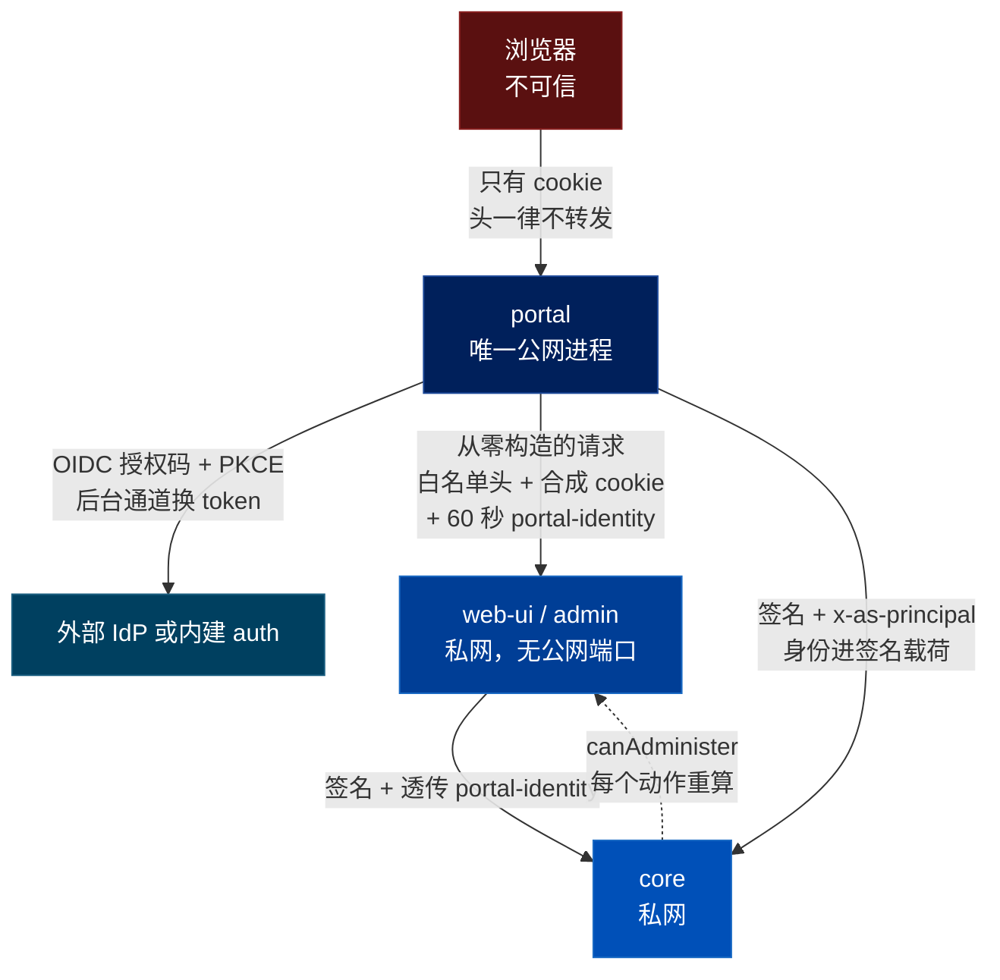
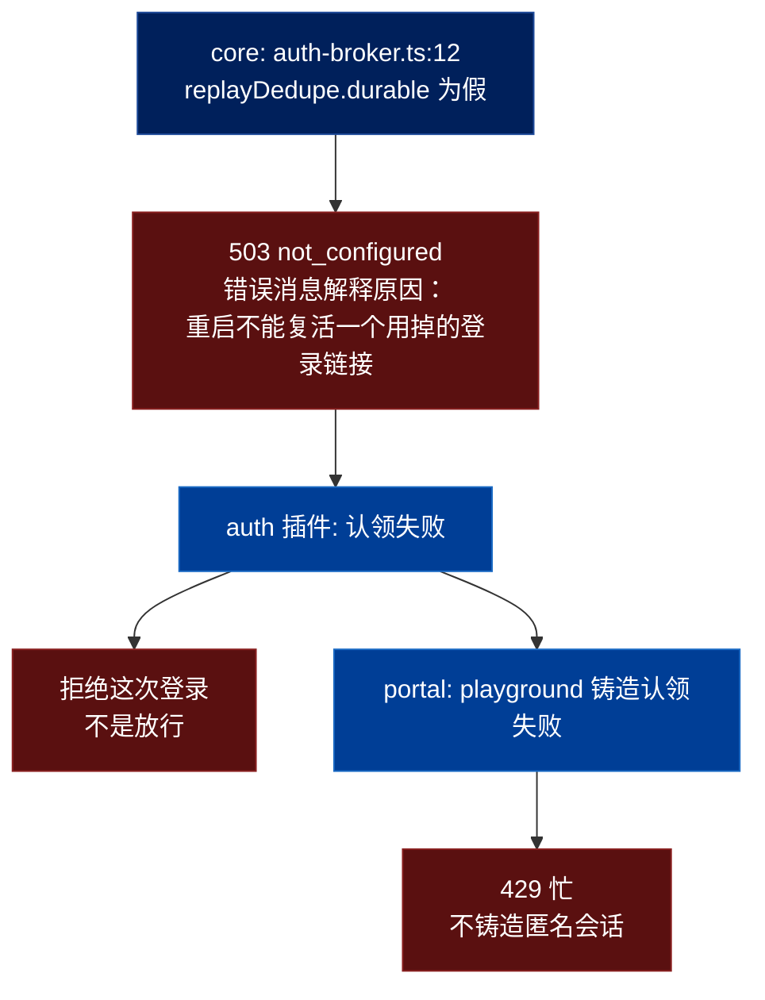

# QM 的表面层：一个公网入口，和它凭什么敢这么说

> 关联文档：
> - [[qm-overview]]（产品目标、八条哲学、十组模块分解）
> - [[qm-synthesis]]（综述——十五篇的可迁移做法按问题收敛）
> - [[qm-memory-layer]]（记忆层的逐文件深入分析）
> - [[qm-execution-layer]]（执行环境层——sandbox、文件、进程）
> - [[qm-skills-layer]]（技能层——注册表、Pack 导入、物化、权限）
> - [[qm-resolution-layer]]（解析层——`Resolution`、收紧代数、audience floor）
> - [[qm-turn-slice]]（纵切面——一条 Slack 消息的十九道闸门）
> - [[qm-harness-layer]]（Harness 层——四适配器、tape、压缩、冷启动重放）
> - [[qm-run-lifecycle]]（运行时——租约、排空、回收、中断重入）
> - [[qm-authz-layer]]（授权与安全层——本篇是它的**对面**：core 侧验签，这里是签发侧）
> - [[qm-credentials-layer]]（凭证层——借还协议、HKDF 用途隔离）
> - [[qm-autonomy-layer]]（自主工作层——cron、monitor、无人在场的回合）
> - [[qm-publish-layer]]（发布层——本篇的 `/d/*` 代理是它的对外入口）
> - [[qm-surface-mirror]]（镜像层——`surface-cache/` 与 ambient）
> - [[qm-crosscutting]]（横切件——`shq`、两种 ReDoS 答案、反向代理头）
> - [[qm-assembly-layer]]（装配层——core 的启动期校验，本篇是它在插件侧的同构）
>
> 调研对象：`yc-software/qm`，本地路径 `~/Repositories/qm`，`main` @ `0f0e0ad`
> 调研时间：2026-08-15
> 阅读范围：`plugins/chassis/`（8 文件 279 行）、`plugins/portal/`（4 文件 1889 行）、
> `plugins/auth/`（8 文件 1415 行）、`plugins/admin/`（1 文件 460 行 + 一个 14312 行的单文件 UI）
> ，四个 README，以及 4452 行测试的目录结构。合计约 4043 行 TS。

---

## 一、这一篇在看什么，以及为什么现在才看

前十六篇覆盖的是 `src/`——那是 headless core，76,648 行。`plugins/` 是另外 35,133 行，[[qm-overview]] 当时只读了它们的 README。

`plugins/` 里 26,595 行是 `web-ui`（一个 React SPA），本篇不看。剩下的四个才是这一篇的对象，因为它们合起来回答一个 core 完全不回答的问题：**外面的人怎么进来。**

| 插件 | 行数 | 一句话 |
|---|---|---|
| `chassis` | 279 | 四个插件共用的词汇：怎么给 core 签名、怎么表达一个身份、怎么限流 |
| `portal` | 1,889 | 唯一的公网入口。OIDC 登录 + 反向代理到私网上的其余表面 |
| `auth` | 1,415 | 一个内建的 OIDC 授权服务器。用邮件一次性链接代替外部 IdP |
| `admin` | 460 | 管理面。它自己没有任何权力 |

**这一篇的主线是一句可以证伪的断言**，来自 portal 的 README 第一行：

> The portal is the **one** publicly-reachable app in the stack.

「唯一的公网入口」是架构图上很常见的一句话，通常不值钱——因为它描述的是部署拓扑，而部署拓扑随时会被一个「临时开个端口」改掉。这一篇要看的是：**这句话在代码里被兑现成了几条具体的、写错就会立刻不成立的约束。** 我数出七条，它们各自的代价在下面各节。

**边界（这一篇明确不做的）：** 不看 `web-ui` 的前端实现；不看 Slack 插件（它是 in-process 的，[[qm-turn-slice]] 已经从入站侧覆盖了）；不评估部署拓扑本身是否正确配置——只看代码在假定拓扑成立时守住了什么。

---

## 二、`chassis`：279 行的共同词汇

四个插件都不 import core。它们之间共享的只有这 279 行。值得看的有三处。

### 2.1 签名把 nonce 藏在路径里

给 core 发请求要签名。签的是 `method\npathWithQuery\nbody`（`source-auth-sign.ts:3-5`），HMAC-SHA256，带时间戳。

有意思的是防重放的做法（`core-client.ts:19-24`）：

```ts
export function withSourceAuthNonce(pathWithQuery: string, secret: string | undefined): string {
  if (!secret) return pathWithQuery;
  const url = new URL(pathWithQuery, "http://core.local");
  url.searchParams.set("_sourceAuthNonce", `${Date.now()}-${Math.random().toString(16).slice(2)}`);
  return `${url.pathname}${url.search}`;
}
```

nonce 被塞进查询串，而签名覆盖整个 `pathWithQuery`——**于是 nonce 自动被签名保护，不需要给它单独设计一个头，也不需要在验签逻辑里给它开一个特例**。core 侧的去重表（[[qm-authz-layer]] 讲过的 `replay-dedupe`）拿这个串当事件 id。

**代价：** nonce 进了 URL，于是它会出现在任何记录了完整路径的地方——access log、APM、代理。对一个只在私网上传输的内部调用这没问题，但这个函数没有任何东西阻止它被用在公网路径上。另外 nonce 用了 `Math.random()` 而不是 `randomBytes`——它只需要唯一不需要不可预测（去重表是先验签后写入的，见 [[qm-authz-layer]] §11-8），所以这是对的，但它依赖那个顺序永远不变。

### 2.2 用一次性令牌桶做限流

这条是这 279 行里最值得抄的（`claims.ts:42-53`）：

```ts
export async function withinRateLimit(store, args): Promise<boolean> {
  const window = Math.floor(args.nowMs / (args.windowS * 1000));
  const bucket = createHmac("sha256", args.secret)
    .update(`ratelimit.v1|${args.kind}|${args.value}`, "utf8")
    .digest("base64url").slice(0, 22);
  const slots = Array.from({ length: args.limit }, (_, slot) => `rate:${args.kind}:${bucket}:${window}:${slot}`);
  return (await store.claimFirst(slots, (window + 1) * args.windowS * 1000)) !== null;
}
```

它把限流建在一张**一次性认领表**上：为当前时间窗生成 `limit` 个槽位 id，`claimFirst` 返回第一个还没被认领的；全被认领了就是超限。

**没有计数器，没有读-改-写，没有锁。** 一个计数信号量被拆成了一组一次性令牌，而「一次性」这件事那张表本来就会做。它复用的正是 core 里 `/v1/auth/broker/claim` 那个 Postgres 存储——也就是 [[qm-synthesis]] §3 里那个唯一把「我是不是持久的」暴露成接口字段的组件。

三个细节：

- **桶 id 是 HMAC 而不是明文。** 被限流的值（邮箱、IP）不进 core 的去重表。auth 插件的 README 把这条的威胁模型写出来了：另一个持有共享 core 签名密钥的插件，**不能算出**某个指定邮箱的槽位 id，因此也不能抢先把它们占掉。这是一个大多数人不会想到的威胁——**你自己的限流器的键空间，是一个兄弟服务可以投毒的共享资源**。
- **过期时间是 `(window + 1) * windowS`**，即槽位活到下一个窗口开始，认领表自己会清理。
- **`limit` 直接等于每次请求要生成的 id 数**，所以这个方案只适合小上限。core 那边最多给 64 个槽位——这个数字后面会再出现一次。

**代价：** 窗口是硬边界不是滑动窗口，所以真实允许量最坏是 `2 × limit`（窗口交界处）。每次检查要往 core 发一个带 `limit` 个 id 的 POST，比一个本地计数器贵得多。而且它把限流的可用性绑在了 core 的数据库上——core 挂了就限不了流，这套系统的选择是**那就不放行**（下面 §6）。

### 2.3 两处小的

**`portal-identity.ts` 是一个手写的极简签名令牌**：`base64url(JSON).HMAC`，字段名全是一个字母（`p` 主体、`n` 显示名、`imp` 冒充者、`exp`），因为它要塞进一个 HTTP 头。验证时先比长度再 `timingSafeEqual`（`portal-identity.ts:25`）——[[qm-crosscutting]] §12-3 那条的又一个实例。

**但它没有 `version` 字段。** [[qm-publish-layer]] §12-30 专门记过这条：「令牌结构里提前留 `version` 字段并严格比对——没留的代价见 [[qm-run-lifecycle]] §12 那份账单」。这是那份账单的第三个实例，而且是唯一一个**新写的**（另外两个是历史遗留）。

**`env.ts:6-11` 有一处降级警告：**

```ts
export const PORTAL_IDENTITY_SECRET = secret(process.env.PORTAL_IDENTITY_SECRET) ?? CORE_SIGNING_SECRET;
if (!secret(process.env.PORTAL_IDENTITY_SECRET) && CORE_SIGNING_SECRET) {
  console.warn("[chassis] PORTAL_IDENTITY_SECRET unset — signing portal identity with CORE_SIGNING_SECRET (dev fallback)");
}
```

按 [[qm-assembly-layer]] §11-8 的判据（「一个装了一半的安全控制必须崩」），这里应该崩而不是警告——它悄悄取消了两个密钥之间的用途隔离。**实际上它确实会崩，只是崩在别处**：portal 的启动检查要求这两个密钥必须存在且不同（§3.4）。所以这段警告只在 portal 之外的插件里可达。这是一个**跨文件才成立的不变量**——chassis 自己不保证，靠调用方保证。

---

## 三、`portal`：身份只有一个来源

portal 的安全模型可以压成一句话：**浏览器永远不能断言自己是谁。** 身份只来自被验证过的 OIDC subject，其余一切都是从那个 subject 推导出来的。

下图是一次请求穿过 portal 的信任边界。注意三条边的方向和它们各自携带什么。



### 3.1 上游请求从零构造，不是转发后删除

这是「唯一入口」的第一条兑现。`proxy.ts:22-29`：

```ts
const FORWARD_REQUEST_HEADERS = ["content-type", "accept", "accept-language", "user-agent", "accept-encoding"];
function safeForwardHeaders(req: IncomingMessage, base: Record<string, string>): Record<string, string> {
  const headers = { ...base };
  for (const h of FORWARD_REQUEST_HEADERS) { ... }
}
```

请求是**从 `base` 开始建的**，然后只把白名单里的五个头抄过来。客户端的 cookie 一个都不进——上游收到的是 portal 合成的那一个。README 说明了为什么：这样浏览器就无法把一个伪造的 `admin=` 或 `x-as-principal` 走私给一个信任私网的上游。

**同一个文件里，响应方向用的是删除名单**（`proxy.ts:9-20`）：`connection`、`transfer-encoding`、`upgrade`……外加两个不属于 hop-by-hop 的：**`set-cookie` 和 `strict-transport-security`**。也就是说上游被降级成了一个只能返回内容、**不能改变浏览器状态**的东西。

方向相反不是不一致，判据是**另一侧是谁**：请求来自不可信的浏览器（白名单），响应来自受信的内部上游（删除名单）。[[qm-crosscutting]] §7 分析的 `src/util/http-proxy.ts` 用的是纯删除名单，因为它的下游是不可信的用户应用。**同一个威胁，三种强度，判据都是「谁在另一头」**——这是 [[qm-crosscutting]] §12-6 那条（两种 ReDoS 答案）的第三个实例。

再往下还有一层：**五张不同的转发白名单**，按路由类别分（`proxy.ts:7,117,126,134,199`）。每张表编码的是「这条路由被允许携带哪种信任凭据」——`FORWARD_AGENT_API_HEADERS` 带 `x-agent-capability`，`FORWARD_DEPLOYMENT_LAYER_HEADERS` 带 `x-timestamp`/`x-signature`，其余两张一个都不带。这是 [[qm-assembly-layer]] §11-33（「把必须永远成立的和可以按情况配置的做成两张表，不要一张表加一堆例外」）的五路应用。

**代价：** 五张表要各自维护，加一个头要想清楚加到哪张。而且白名单意味着**任何新的合法头默认不通**——一个上游开始依赖某个头时，症状是「本地好用、过 portal 就不行」，而这个症状不指向 portal。

**一处值得单说的粗糙：** `proxyToDeployment` 里有一段（`proxy.ts:158-160`）先 `delete headers["content-type"]` 再从请求里重新读一遍。原因是 chassis 的 `signedHeaders` 顺手硬塞了一个 `"content-type": "application/json"`（`core-client.ts:16`），而这条路由要转发的是客户端的原始 content-type。**一个签名辅助函数做了两件事，其中一件调用方必须记得撤销。** 这类「顺手多做一点」正是 AGENTS.md 里「在所有路径流经的那一层解决」想避免的形状。

### 3.2 路由只决定一次

第二条兑现，也是最容易写错的一条。README 管它叫 tier-escape guard：

> The router rejects pathologically-encoded targets (`%2f`, `%5c`, `%2e%2e`, `\`, `//`, NUL → 400), selects the upstream by exact segment, and derives the `/admin` gate from that _selected_ key — never a second `startsWith` that could disagree.

代码里就是 `if (key === "admin")`（`index.ts:1039`），其中 `key` 是路由**已经选出来**的那个上游键，不是重新解析一次路径。

这条规则可以脱离 qm 表述：**任何基于路径的权限判定，必须复用路由已经算出的那个 key，不能重新解析一次路径。** 反面就是经典的代理越权 bug——路由用规范化后的路径选上游，鉴权用原始路径做 `startsWith`，两者对 `/admin/..%2f` 这种输入的看法不同，于是请求打到 admin 上游但没过 admin 闸。

**代价：** 它要求路由和鉴权在同一个函数里、同一次判断中完成，也就是说这两件事**不能分成两个中间件**。大多数 Web 框架的默认形状恰恰是分开的中间件，所以这条在框架里比在裸 `node:http` 里难做。这套系统是裸 `node:http`——README 说 portal「is a thin `node:http` server ... and it does **not** import the core」。这个选择的收益在这里兑现了一部分。

### 3.3 admin 没有第二份名单

第三条兑现。portal 里**不存在** `PORTAL_ADMIN_PRINCIPALS`——README 专门说这个环境变量被删掉了。管理员身份只有一个真源：core 的 `admin_grants`。

链路是 portal → admin 表面 → core（`index.ts:198-221`）：

```ts
async function adminProbe(sub: string): Promise<{ isAdmin: boolean; failed: boolean }> {
  const hit = adminCache.get(sub);
  if (hit !== undefined) return { isAdmin: hit, failed: false };
  ...
  const r = await fetch(`${UPSTREAMS.admin}/api/whoami`, { headers, signal: ctrl.signal });
  if (!r.ok) return { isAdmin: false, failed: true };
  const v = j.isAdmin === true;
  adminCache.set(sub, v);
  return { isAdmin: v, failed: false };
}
```

三个细节都对：

- **只缓存回答，不缓存失败。** `adminCache.set` 只在 `r.ok` 之后执行；超时和非 200 直接返回 `failed: true` 且不写缓存。所以 core 抖一下不会把某人钉在「不是管理员」上 60 秒。这是 [[qm-run-lifecycle]] §14-1（「心跳的『否定』与『无知』必须分开处理」）在一个完全不同的场景里的复现。
- **`failed` 一路传到页面上。** 调用方据此在「你不是管理员」和「暂时问不到」之间选不同的页面（`index.ts:1046-1048`）。admin 表面那侧也一样：core 问不到时返回 **502 而不是 403**（`admin/src/index.ts:341`）。**两侧都区分了「拒绝」和「问不到」。**
- **缓存 60 秒，但 core 每个动作重算。** 这个 60 秒只影响「首页上要不要显示 Admin 链接」和「`/admin` 这一跳放不放行」；真正的权限在 core 每次动作时重查。这是 [[qm-synthesis]] §2.2 的标准形状：贵且变得慢的缓存，必须立刻生效的每次重问。

**代价：** portal 对 admin 表面这一跳**不签名**（README 明说 "no signing secret"），它信的是私网。所以这条链的安全性等于「6PN 不可达」这个部署事实。真正被签名保护的是里面那个 `x-portal-identity` 令牌——它由 portal 签、由 core 验，中间的 admin 表面只是透传。也就是说：**能进到私网的攻击者可以问出任何人的 admin 状态，但问不出一个能用的身份断言。** 这个取舍是合理的，但它不是「零信任」，README 也没这么说。

### 3.4 两个寿命，一个钳制一个崩

会话 cookie 有两个期限：8 小时滑动（`PORTAL_SESSION_TTL_S`）和 24 小时绝对上限（`PORTAL_SESSION_MAX_TTL_S`，从 `auth` 时间戳起算）。续期时（`index.ts:792-811`）：

```ts
if (now - session.iat < SESSION_RENEW_AFTER_S) return;
const authenticatedAt = session.auth ?? session.iat;
const renewed: SessionClaims = { ...session, auth: authenticatedAt, iat: now,
  exp: Math.min(now + SESSION_TTL_S, authenticatedAt + SESSION_MAX_TTL_S) };
```

`auth` 原样带过去不动，`exp` 用 `Math.min` 钳到绝对上限。而且只在过了一半 TTL 之后才续（`SESSION_RENEW_AFTER_S = TTL/2`），避免每个请求都发一次 `Set-Cookie`。

**同一对约束，在启动期的处理方式相反**：如果 `MAX_TTL < TTL`，portal 直接拒绝启动。

这正好落在 [[qm-crosscutting]] §12-19 那条的两侧：「两个值的关系必须成立时，与其校验不如直接钳制（`Math.max`）。但要意识到被钳制的字段从此不再是它字面上的含义」。这套系统的选法是：**运行时的值钳制，启动期的配置崩。** 判据是谁能修——运行时的值没人能修，钳了就对了；配置是人写的，钳掉等于把人的错误意图静默改成别的意思。这条判据 [[qm-synthesis]] §2.7 那棵判据树里没有，是本篇新增的。

**代价：** 钳制之后 `exp` 不再等于「签发时间 + TTL」。任何据此反推 TTL 的代码都会算错。这套系统里没有这样的代码（**推出来的**：我看了 `openSession` 和 `renewSessionCookie` 两个读者，没有找第三个）。

### 3.5 剩下的三条兑现，从简

**启动期把全部问题攒起来一次报完**（`index.ts:1169-1298`）。`problems: string[]` 累积，最后一次性打印并抛出：

```
[portal] FATAL: PORTAL_SESSION_SECRET must differ from CORE_SIGNING_SECRET
[portal] FATAL: PORTAL_PUBLIC_URL must be https in production
...
portal refusing to start: 2 misconfiguration(s)
```

**不是 fail-fast 到第一条。** 运维一轮改完五个，而不是部署五次。代价是后面的检查必须能在前面的输入已经非法时不崩——这里靠的是每条检查都只读自己那个变量。

这一整块是 [[qm-assembly-layer]] §11-4/7/8/10/11 在插件侧的同构，但有三条是新的：

- **生产环境必须至少配一个 IdP 信任边界**（`OIDC_ALLOWED_EMAILS` / `OIDC_ALLOWED_EMAIL_DOMAIN` / `PORTAL_EXPECTED_TEAM_ID` 三选一）。少了这个，任何一个 Google 账号都能登进来。「配了 OIDC 但没配限制」是一个装了一半的安全控制，所以崩。
- **HTTPS 要求有一个精确到发指的例外**：token / userinfo / jwks 三个端点可以是 http，**当且仅当**它们是内建 broker，而 broker 本身必须在私网地址上，且 `OIDC_ISSUER` 和 `OIDC_AUTH_ENDPOINT` 必须逐字等于 `${PUBLIC_URL}${AUTH_BROKER_PREFIX}` 拼出来的值。不是「内网就放行」，是四条同时成立。
- **错误消息带理由**：`OIDC_AUTH_ENDPOINT must be https — the browser is sent there`。只有这一条端点解释了为什么，因为只有它是浏览器会被送过去的。

**`clientIpOf` 从右边数**（`index.ts:153-166）。在 Fly 上用平台注入的 `fly-client-ip`；否则要求显式配 `PORTAL_XFF_TRUSTED_HOPS`，并且 `hops[hops.length - N]` **从右往左取**——左边的条目是攻击者可写的。默认 0 表示只用 socket 地址。大多数实现取 `hops[0]`，那恰好是唯一一个可以随便伪造的。README 还把不配它的后果写出来了：每个访客（和每个接受 HTML 的爬虫）共用 socket 地址那一个桶。

**IPv6 按 /64 分桶**（`index.ts:728-741` 的 `mintBucketOf`）。处理了 zone id（`%eth0`）、IPv4-mapped（`::ffff:1.2.3.4` 还原成 v4）、`::` 展开，然后取前四组。理由 README 写了：有路由前缀的访客不能靠换地址刷新配额。**用 IPv6 完整地址做限流键等于没限流**，这是一个很常见的漏。

**`sanitizeReturnTo` 五道**（`session.ts:167-184`）：非 `/` 开头、`//` 开头、反斜杠或控制字符、`%2f%2f|%5c`、最后才是真正解析 URL 比 origin。这是 [[qm-publish-layer]] §12-10（「先跑能解释的检查，再跑管用的检查」）的第二个实例——前四道给得出具体错误，最后一道兜底。

### 3.6 OIDC 那一段里三处别人常漏的

`oidc.ts` 只有 162 行，但把 OIDC 里最容易糊弄过去的几处都做了：

**`azp` 检查**（`oidc.ts:112-118`）。多个 audience 时必须有 `azp`，且 `azp` 存在时必须等于自己的 client id。规范要求，实现里常被跳过。

**邮箱必须被 IdP 标记为已验证**（`oidc.ts:135-136`），然后 lowercase。域名检查做**两遍**（`oidc.ts:144-150`）：邮箱后缀，**以及** Google 的 `hd` claim。第二遍防的是一个真实攻击——一个消费级 Google 账号，其邮箱地址恰好长得像组织域名。光看后缀会放行。

**id_token 的 sub 必须等于 userinfo 的 sub**（`index.ts:1140`）。两个端点各说各话时拒绝。

**代价：** 这些检查的正确性没有任何测试之外的东西保证，而且它们分布在 `oidc.ts` 和 `index.ts` 两处。JWKS 的远端密钥集缓存在一个模块级 `Map`（`oidc.ts:86`），只在真实 `fetch` 时使用——注入的 fetch 每次新建，避免测试污染缓存。这个 Map 是进程内的，但它缓存的是公钥且 jose 自己有 TTL，所以无害。

---

## 四、`auth`：与其加一个分支，不如实现那个协议的服务端

这个插件的第一句 README 就是它的全部论点：

> An OIDC authorization server that speaks exactly the subset `plugins/portal` consumes, **so the portal keeps talking standard OIDC and never grows a second authentication path.**

需求是「不想强制每个部署都去接一个外部 IdP，给个内建的邮件登录」。常规做法是在 portal 里加一个 `if (builtInAuth) { ... }` 分支。这套系统的做法是**实现 portal 已经在说的那个协议的服务端**——1,415 行，换掉一个 `if`。

**判据（这条我认为是本篇最值得抄的）：** 要给一个已有的集成点加「内建」实现时，实现那个协议的服务端，而不是在客户端加分支。因为客户端的那个分支不是一段代码，是**第二条认证路径**——而认证 bug 恰恰住在第二条路径上，那条路径的测试覆盖、审计关注和演练频率永远低于主路径。

**代价，明码标价：** 1,415 行 vs 大约 30 行的分支。你必须把协议实现到真的正确——PKCE S256、JWKS、discovery、ES256 id_token、授权码单次使用，一样都不能少，否则你只是把 bug 从分支挪到了服务器里。这笔账划不划算取决于那个协议你是不是本来就得说：portal 本来就说 OIDC，所以划算。

### 4.1 四个用途、四把密钥、四个 audience

`tokens.ts` 的 `TokenSigner` 管四种令牌：`request`（授权请求）、`link`（邮件里的一次性链接）、`code`（授权码）、`access`（访问令牌）。

```ts
private keyFor(purpose: TokenPurpose): Uint8Array {
  const cached = this.keys.get(purpose);
  if (cached) return cached;
  const derived = new Uint8Array(createHmac("sha256", this.secret).update(`qm-auth.${purpose}.v1`).digest());
  ...
}
const audienceFor = (purpose: TokenPurpose): string => `qm-auth:${purpose}`;
```

**两套互相独立的机制在保证同一件事**：一个 `link` 令牌拿去当 `code` 开，密钥不对**而且** audience 校验也过不了。任何一个失效，另一个还在。

这是用途隔离这条线的第四个实例（[[qm-credentials-layer]] §12-18 的 HKDF、[[qm-publish-layer]] §12-32 的 `HMAC(secret, "purpose.vN")`、portal 的 `deriveKey(secret, label)`），也是**唯一一个既带版本号（`.v1`）又有冗余校验的**。portal 那个 `deriveKey` 就没有版本。

### 4.2 令牌走 URL fragment

签到链接把令牌放在 URL 的 **fragment** 里，不是查询串。理由 README 写得很干净：浏览器从不把 fragment 放上网线，所以它进不了 access log、进不了代理、也不会出现在 `Referer` 里。

确认页再把它从 `location.hash` 挪进表单并调 `history.replaceState`，于是它也不留在地址栏和历史记录里；值放在 `sessionStorage` 里活一个标签页的寿命，这样刷新还能用。

**代价，README 自己列了两条**：这最后一步需要 JavaScript——**页面上明说了这件事**；而且邮件网关可能把 fragment 剥掉，所以链接可以重新申请。

这是本次调研里我见过的对「一次性链接怎么不泄漏」最完整的一个答案。大多数实现止步于「放查询串 + 短 TTL + 单次使用」，那三条都对，但令牌仍然会躺在若干台机器的日志里。

### 4.3 限流键的双重设计

每个邮箱的发送预算，键是**邮箱 + 请求方地址**；另有一个纯按地址的预算。

理由是一个很少被想到的失效：如果每个邮箱只有一个全局预算，那么**一个陌生人可以把某个已知用户的预算耗光，把他锁在门外**。按「邮箱+来源」分桶之后，攻击者只能耗掉自己那一份；按地址的那个预算负责限住单一来源的总量。

两个都是持久认领（能扛重启），两个都用 `AUTH_TOKEN_SECRET` 做 HMAC（兄弟插件算不出、也就抢不了指定邮箱的槽位）。

**代价：** 两个预算意味着两次 core 往返。而且「按来源分桶」在 NAT 后面会退化——同一个出口 IP 的整个办公室共享一份 per-(邮箱,IP) 预算，这在正常使用下不会碰到，但它意味着这个防护对同网段的内部攻击者无效。

### 4.4 其余三处

**完全无状态。** 「Nothing about a sign-in lives in this process.」链接、授权码、访问令牌都是自包含 JWT；单次使用靠 core 的持久认领表。所以重启、蓝绿、第二个实例都不能复活一个已经用掉的链接。

**kid 由公钥指纹算出，忽略传入的 kid**（`keys.ts:13-22`）。先把私钥分量 `d` 和任何传入的 `kid` 剥掉，对剩下的公钥材料算 RFC 7638 thumbprint。同 [[qm-authz-layer]] §11-7（「密钥 ID 用密钥自身的哈希前缀」），但用的是标准算法。

**只有一把签名密钥，没有密钥集。** README 直说了代价：「rotating it means redeploying, and links minted by the previous key stop verifying at that moment」。对照 [[qm-credentials-layer]] §12-19（「预留旧派生方式与候选密钥链两个维度」）——这里没有预留。代价被写下来了，但账还没付。

**`safeEqual` 先哈希再比**（`tokens.ts:41-45`）。两边都过一次 SHA-256 再 `timingSafeEqual`，于是长度天然相等，不需要长度预检。这是同一个仓库里第三种「常数时间比较」的写法（另两种在 `session.ts:146` 和 `portal-identity.ts:25`，都需要显式长度检查）。**这一种是三种里唯一构造上不会抛的。**

**`POST /authorize` 永远返回同一个确认页。** 邮箱是否被允许不体现在响应里——防枚举。

---

## 五、`admin`：一个自己没有权力的管理面

460 行，加一个 14,312 行的单文件 HTML。它的设计目标是**自己不持有任何权力**：

> It holds **no admin id list** of its own. ... All authority is enforced in the core.

三处实现值得看。

**身份的降级链只有一环，而且在配置好之后不存在**（`index.ts:84-89`）：

```ts
const cookiePrincipal = (req: IncomingMessage): string | null => {
  const raw = req.headers[PORTAL_IDENTITY_HEADER];
  const token = Array.isArray(raw) ? raw[0] : raw;
  const principal = token && PORTAL_IDENTITY_SECRET ? verifyPortalIdentity(token, PORTAL_IDENTITY_SECRET, Date.now())?.p : null;
  return principal ?? (!CORE_SIGNING_SECRET || ALLOW_UNSIGNED_TEST_IDENTITY ? cookie(req, "admin") : null);
};
```

先验签名头；拿不到才看那个兼容 cookie，**而且只在完全没配 core 签名密钥（隔离开发）或显式测试开关下**。任何配置正常的部署里，那个 cookie 不被接受。（函数名叫 `cookiePrincipal` 但主路径读的是头——名字是坏的，逻辑是对的。）

**用 `AsyncLocalStorage` 携带本次请求的身份令牌**（`index.ts:92-96`、`298-303`）。进来时把 `x-portal-identity` 塞进 ALS，转发函数从 ALS 取出重新贴上。**于是不必在每个内部函数签名里传它。** 代价是隐式上下文：任何逃出 ALS 作用域的调用（后台任务、`setTimeout`）会静默丢掉令牌，而症状是「core 说你没身份」，这个症状不指向 ALS。

**CSP 的脚本哈希从文件内容算出**（`index.ts:31-42`）：

```ts
const ADMIN_SCRIPT = BASE_HTML.match(/<script>([\s\S]*?)<\/script>/)?.[1] ?? "";
const ADMIN_CSP = [..., `script-src 'sha256-${createHash("sha256").update(ADMIN_SCRIPT).digest("base64")}'`, ...].join("; ");
```

哈希是**推导出来的，不是声明的**——改了脚本不可能忘记更新 CSP。这是 [[qm-synthesis]] §2.5（用内容算身份）在一个我没预料到的地方的应用。代价：那个正则只取**第一个** `<script>` 块，所以这个文件永远只能有一个内联脚本，而没有任何东西检查这一点。

**还有一条治理上的：** `ADMIN_GRANTS` 环境变量现在只是空存储的一次性种子，之后管理员在运行时增删，「a redeploy never clobbers runtime grants」。这是 [[qm-authz-layer]] §11-5（「来源优先级压过时间顺序」）用在引导上：环境变量的种子**输给**运行时状态，不管谁更晚。

---

## 六、三层 fail-closed，串在同一个属性上

这一节是本篇和 [[qm-synthesis]] §3 的接口，也是把四个插件串起来的那条线。

[[qm-synthesis]] §3 讲过：整个仓库对「进程内状态在多实例下失效」这个反复出现的问题，只有一处给了结构性答案——`ReplayDedupe` 把「我是不是持久的」暴露成接口上的一位，`api/routes/auth-broker.ts:12` 读到它为假就 503。

**现在可以看到那条链的全长了。** 它一共三层，而且三层都倒向关闭：



三个不同的进程、三个不同的功能（登录链接单次使用、发信限流、游乐场铸造限流），共用一个持久性属性，而且每一层都自己决定了失败姿态。没有任何一层「因为下游可能不可用所以放行」。

**这条链还解释了一个数字。** portal 的启动检查里有这么一条：

> `PORTAL_PLAYGROUND_MINTS_PER_IP must be an integer between 1 and 64 (the core grants at most 64 claim slots per request)`

上限 64 不是拍脑袋，是 core 那个认领端点每次请求最多给 64 个槽位（`src/api/routes/auth-broker.ts` 的 `MAX_IDS = 64`），而 §2.2 的限流方案要为每次检查生成 `limit` 个槽位 id。**一个下游实现细节，成了一个上游配置项的硬上界，并且这个上界在启动期被检查、错误消息里把原因写出来了。**

这是本篇里我最想让人看到的一条。它的反面——配一个 100，然后每次限流检查都静默失败、于是所有人都拿到 429——是一个会在上线后很久才被发现的故障，而且现场看起来像「限流坏了」而不像「配置越界了」。

**判据：** 一个配置项的合法范围如果由下游的实现细节决定，那个范围必须在启动期检查，且错误消息里要写出下游的那个细节。**代价：** 上下游耦合被写死在了一个字面量 64 上，下游改了这个数没有任何东西会提醒上游。这套系统靠一句注释在错误消息里记着这件事，没有共享常量（两个包不互相依赖，也没法共享）。

---

## 七、张力与风险

**1. 登录 state 的一次性保护是进程内的，而同一个文件里就有持久方案。**

`index.ts:1126` 的 `consumeState` 用的是一个模块级 LRU（`index.ts:185`，上限 10,000，TTL 20 分钟），不是 core 的持久认领表——尽管 portal 为了游乐场限流**已经接了**那张表。

多实例或重启之后，一个 state 可以在另一个实例上再用一次。实际可利用性很低：攻击者还需要受害者的 `portal_oidc_tmp` cookie（它承载 PKCE verifier 和 nonce），而拿到那个 cookie 基本已经等于拿到了会话。所以这更像是**深度防御少了一层**，不是一个洞。

但它是 [[qm-synthesis]] §3 那份清单的**第七个实例**，而且是最刺眼的一个——前六个至少可以说「没有现成的持久设施」，这一个不能。

**2. `chassis/src/http.ts:15` 的 `readBody` 默认无上限。**

```ts
export async function readBody(req: IncomingMessage, maxBytes = Infinity): Promise<string>
```

默认值是 `Infinity`，调用方必须主动传上限才有保护。portal 自己定义了一个有界版本（`index.ts:584`，64 KB），说明作者知道这件事。

> **补：调用点已在 [[qm-web-client]] 里普查完，结论要更新。** 四个插件三种处理：
> `auth` 三处调用全部显式传 `MAX_FORM_BYTES`；`web-ui` 改名导入再本地包一层
> （`readBody as readBodyCapped`，然后自己定义一个 1 MB 的 `readBody`），
> 于是二十多处调用全部有界；**`admin` 有两处没传上限**
> （`admin/src/index.ts:388` 和 `:434`）。
> 所以确实存在一条真实的无界读取路径。它在 portal 后面且需要管理员身份，
> 爆炸半径是「一个已认证的管理员能把 admin 进程撑爆」——严重性低，
> 但这正是那个不安全默认本该挡住的东西。
> **web-ui 的处理方式是三家里最好的：让不安全的那个函数在本文件里根本叫不出名字。**

一个安全相关的默认值取「不保护」，与 [[qm-crosscutting]] §12-1 那条（把安全原语做小到没人想绕过）的精神相反：这里的默认形状是不安全的那个。

**3. `PORTAL_IDENTITY_SECRET` 的降级只在 portal 之外可达。**

§2.3 说过。chassis 自己只警告，靠 portal 的启动检查兜住。这个不变量**跨文件成立**，而 chassis 是给四个插件共用的——今天只有 portal 检查了它。

**4. 「缺失即垃圾」的词表有两份，会漂。**

core 有一份（[[qm-assembly-layer]] §11-11），portal 有另一份（`index.ts:1302` 的 `isMissingOrPlaceholder`，词表是 `replace-me|placeholder|changeme|todo`）。两份内容不同，没有共享。加一个新的占位词要记得改两处，而漏掉的症状是「生产上跑着一个占位密钥」。

**5. 单文件 14,312 行的 admin UI 只能有一个 `<script>`。**

§5 说过，CSP 哈希的正则只取第一个 `<script>` 块。加第二个内联脚本会被 CSP 拒绝执行，且没有任何构建期检查会提前告诉你。

**6. 游乐场模式对 core 是透明的，README 自己承认。**

`anon` 标记只活在 portal 的会话 cookie 里，**不跨越 portal identity 边界**。对 core 来说，一个游乐场访客就是这个组织里一个普通的 internal 主体——能跑回合、能用沙箱、能建 cron、能拿到任何 `org:` 作用域授权的东西。所以游乐场必须是一个独立部署，org 作用域下不能有任何敏感物。README 还说了「Nothing garbage-collects an abandoned visitor's scope yet」。

**这是一个产品判断，我把它单独标出来：** 这个设计把「隔离」这件事从代码边界移到了部署边界。它的好处是 core 一行都不用改；代价是**安全性依赖一份运维约定，而运维约定不会在 code review 里被检查**。（依据只到代码和 README 为止，未考虑他们实际的部署流程里有没有别的强制手段。）

---

## 八、存疑

1. ~~`readBody` 的调用点我没有普查。~~ **已在 [[qm-web-client]] 里查完**，结论见 §7-2 的补注：`admin` 有两处真实无界。仍未查的是这两处在实际部署里能承受多大的载荷，以及 admin 进程有没有别的内存保护。

2. **portal → admin 这一跳不签名，是我从 README 的 "no signing secret" 和 `adminProbe` 里没有 `signedHeaders` 推的**，与代码一致，但我没有抓包验证，也没有确认 6PN 在他们的实际部署里是否真的不可从外部达到。

3. **`web-ui`（26,595 行）完全没看。** 它是本篇之外最大的未覆盖体量。portal 对它的 `/app-edit` 路径做了一次 `res.removeHeader("x-frame-options")`（`index.ts:1076`），说明那里有一个 iframe 场景（大概率是 [[qm-publish-layer]] 讲的 owner shell），但我没有跟进去确认。

4. **`auth` 的 `server.ts`（390 行）、`email.ts`（150 行）、`smtp.ts`（208 行）、`pages.ts`（189 行）我只读了 README 对它们的描述和 `tokens.ts` / `keys.ts` 两个基础件。** 关于 SMTP 拒绝明文、`POST /authorize` 防枚举、fragment 搬运这三条，我引的是 README 而不是代码。README 在这个仓库里的准确率到目前为止很高（前十六篇里没抓到过 README 说谎），但这三条**没有代码级验证**。

5. **`session.ts:152-165` 的 `sanitizeAppsReturnTo` 丢弃 fragment（`${u.origin}${u.pathname}${u.search}`），而同源分支保留 fragment。** 我判断这是有意的（不把 fragment 带过跨源跳转，尤其考虑到 §4.2 里 fragment 正好被用来运令牌），但**代码里没有任何东西说明这一点**，也可能只是漏了。

---

## 九、可迁移做法

**关于「唯一入口」这个断言**

1. 「唯一的公网入口」要兑现成具体约束才有意义。可检验的那几条是：上游请求从零构造而不是转发后删除；路由只决定一次且权限判定复用路由的结论；下游不能改变浏览器状态（剥掉上游的 `set-cookie` 和 `strict-transport-security`）。
2. 请求方向用允许名单，响应方向用删除名单。**判据是另一头是谁**：不可信的浏览器给允许名单，受信的内部上游给删除名单，不可信的用户应用给删除名单加自己的鉴权头。
3. 按路由类别分多张转发白名单，每张编码「这条路由允许携带哪种信任凭据」。不要一张表加例外。
4. **任何基于路径的权限判定，必须复用路由已经算出的那个 key。** 重新解析一次路径就是经典的代理越权。这条要求路由和鉴权在同一次判断里完成，也就是不能拆成两个中间件。

**关于身份**

5. 浏览器不能断言自己是谁。身份只来自被验证的 IdP subject，其余全部推导。
6. 权限的真源只能有一个。表面层不存名单，问一次、缓存很短、**每个动作在真源重算**。
7. **只缓存回答，不缓存失败。** 上游抖动不该把某人钉在「没权限」上一整个 TTL。
8. 「拒绝」和「问不到」在**每一层**都要用不同的状态码和不同的页面。这里两层都做了（403 vs 502）。
9. 短命身份令牌的 TTL 按它要活过的跳数定，不按会话长度定（这里是 60 秒，只需活过一跳）。
10. 签名的载荷里要包含调用方声称的身份（`x-as-principal` 进签名尾），否则网关可以被诱导冒充。
11. 环境变量的种子应当**输给**运行时状态：`ADMIN_GRANTS` 只在存储为空时生效，重新部署不覆盖运行时授权。

**关于时间与配额**

12. 会话给两个寿命：滑动 TTL 和从认证时刻起算的绝对上限。续期时绝对上限那个时间戳原样带过去，`exp` 用 `Math.min` 钳住。只在过了一半 TTL 后才续，避免每个请求都 `Set-Cookie`。
13. **运行时的值钳制，启动期的配置崩。** 判据是谁能修：没人能修的钳了就对了；人写的配置钳掉等于把人的错误意图静默改成别的意思。
14. 限流可以建在一张一次性认领表上：为当前窗口生成 `limit` 个槽位 id，认领第一个空的，全满即超限。没有计数器、没有读-改-写、没有锁。代价是窗口是硬边界（最坏 `2 × limit`）且只适合小上限。
15. **限流桶的 id 要 HMAC，不要明文。** 否则任何能读到那张表、或者能算出键的兄弟服务，都能抢先占掉指定目标的槽位。
16. 「按目标」的配额要同时按来源分桶，否则陌生人可以耗光某个已知用户的配额把他锁在门外。
17. **IPv6 按 /64 分桶，不按地址。** 用完整地址等于没限流。顺手处理 zone id 和 IPv4-mapped。
18. **`X-Forwarded-For` 从右边数**，且要求显式配置可信跳数，默认只用 socket 地址。取 `hops[0]` 取的恰好是唯一可伪造的那个。

**关于协议**

19. **要给一个已有集成点加「内建」实现时，实现那个协议的服务端，不要在客户端加分支。** 客户端的那个分支不是一段代码，是第二条认证路径。代价是你必须把协议实现到真的正确——只有当那个协议你本来就得说时才划算。
20. 一次性链接的令牌放 URL **fragment**，不放查询串：浏览器不把 fragment 放上网线，所以它进不了日志、代理和 `Referer`。落地页再 `history.replaceState` 把它从地址栏和历史里抹掉，值存 `sessionStorage` 让刷新还能用。代价是需要 JavaScript——**页面上要明说**，并且要能重新申请链接（邮件网关会剥 fragment）。
21. 用途隔离用两套独立机制：密钥按用途派生**并且**令牌带用途专属的 audience。任一失效另一个还在。派生标签里带版本号。
22. nonce 塞进被签名的路径里，不要单独设计一个头——签名自动覆盖它，验签侧不用开特例。
23. OIDC 里三处常被跳过但要做：`azp` 校验、邮箱必须被 IdP 标记为已验证、id_token 的 `sub` 必须等于 userinfo 的 `sub`。用 Google 时域名要查两遍（邮箱后缀 + `hd` claim），只查后缀会放过消费级账号。
24. 常数时间比较**先各自哈希再比**，长度天然相等，构造上不会抛。

**关于启动检查**

25. **把全部问题攒进一个数组，一次性报完再退出**，不要 fail-fast 到第一条。运维一轮改完，而不是部署五次。代价是后面的检查要能在前面的输入已非法时不崩。
26. 「配了 OIDC 但没配任何允许范围」是一个装了一半的安全控制，必须崩。生产环境要求至少配一个 IdP 信任边界。
27. **明文传输的例外要精确到发指**：不是「内网就放行」，而是四条同时成立（是内建 broker、broker 在私网地址、issuer 逐字匹配、authorize 端点逐字匹配）。
28. 只给那条最需要解释的检查写理由（「必须是 https——浏览器会被送到那里去」），不要每条都写。
29. **一个配置项的合法范围如果由下游的实现细节决定，那个范围必须在启动期检查，并且错误消息里要写出下游的那个细节。** 反面（配一个越界值，然后每次调用静默失败）会在上线很久之后才暴露，且现场症状不指向配置。

**关于杂项**

30. CSP 的内联脚本哈希从文件内容**算出来**，不要写死。改了脚本不可能忘记更新。代价是要约束「只能有一个内联脚本」，而这一点最好也检查。
31. 用 `AsyncLocalStorage` 携带「本次请求的身份令牌」，转发函数就不必在每个签名里传它。代价是隐式上下文——逃出作用域的调用会静默丢掉它。
32. 安全相关的默认值不要取「不保护」。`readBody(req, maxBytes = Infinity)` 的形状是反的。

---

## 十、与其他篇的连接

- **[[qm-authz-layer]] 是本篇的对面。** 那篇讲 core 怎么验签、怎么算 `canAdminister`、能力令牌的四道闸门；本篇是签发侧——谁在签、签的时候把什么放进载荷、令牌活多久。两篇合起来才是完整的一次鉴权。
- **[[qm-synthesis]] §3 那条链在本篇闭合。** 那里只看到 core 的一端（`durable: boolean` 和一个读它的调用方）；本篇看到了另外两端（auth 的登录、portal 的游乐场铸造），以及那个 `64` 是怎么从 core 的实现细节变成 portal 的配置上界的。
- **[[qm-assembly-layer]] 的启动期校验在本篇有一个插件侧的同构，但形状不同。** core 是「崩 vs 警告」的判据表，portal 是「攒齐再报」的问题数组。两者可以合起来用。
- **[[qm-crosscutting]] §7 的反向代理头是本篇 §3.1 的第三种强度。** 那篇是删除名单（下游不可信），本篇请求侧是允许名单（上游可信但来源不可信）。判据都是「另一头是谁」。
- **[[qm-publish-layer]] 的 `/d/*` 从这里进来。** `proxyToDeployment` 是那篇讲的三扇门鉴权在公网侧的入口，`x-as-principal` 进签名载荷这件事那篇从验证侧发现，本篇看到了铸造侧。
- **未覆盖：** `plugins/web-ui`（26,595 行）。它是整个仓库现在最大的一块空白。

---

> 相关：[[qm-overview]] · [[qm-synthesis]] · [[qm-memory-layer]] · [[qm-execution-layer]] · [[qm-skills-layer]] · [[qm-resolution-layer]] · [[qm-turn-slice]] · [[qm-harness-layer]] · [[qm-run-lifecycle]] · [[qm-authz-layer]] · [[qm-credentials-layer]] · [[qm-autonomy-layer]] · [[qm-publish-layer]] · [[qm-surface-mirror]] · [[qm-crosscutting]] · [[qm-assembly-layer]]
