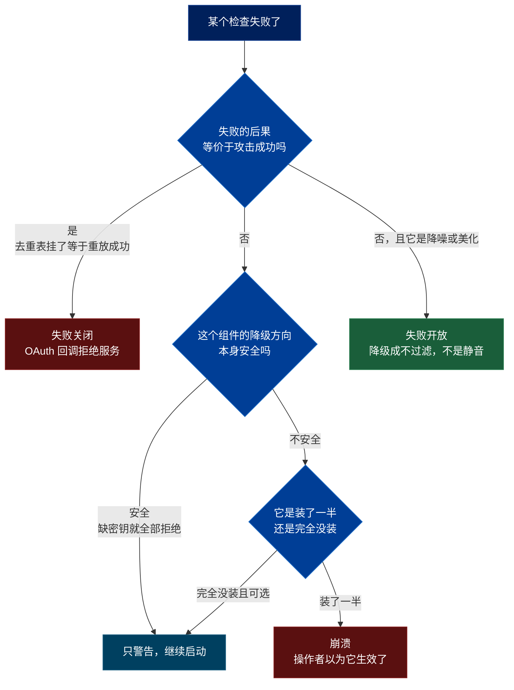
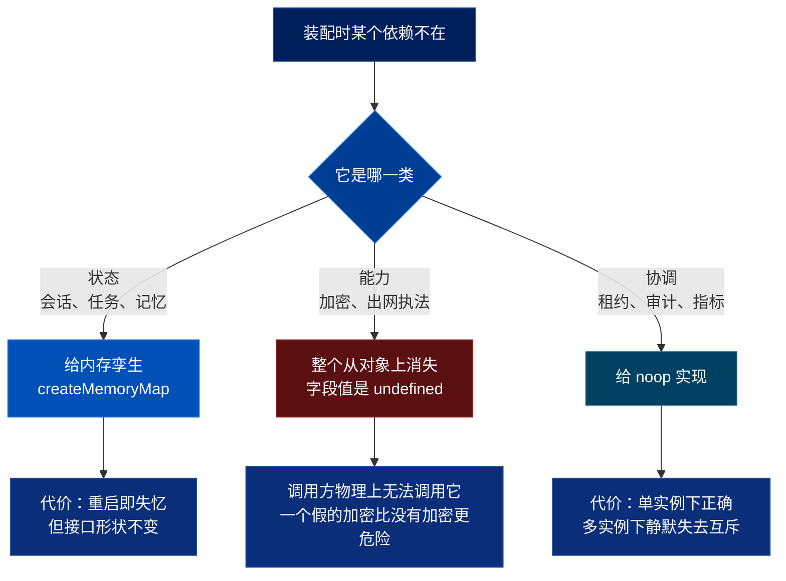

# 从 QM 抄什么：十五篇的收敛，按问题排列

> 关联文档：
> - [[qm-overview]]（整体架构、产品哲学、十组模块的地图）
> - [[qm-memory-layer]]（记忆层——动作脚本、三轴质量、自指污染）
> - [[qm-execution-layer]]（执行环境——能力协商的 Sandbox、四个后端、用 shell 长出能力）
> - [[qm-skills-layer]]（技能层——所有权与遮蔽、Pack 供应链、两级物化）
> - [[qm-resolution-layer]]（解析层——`Resolution`、收紧代数、audience floor、prompt 协议）
> - [[qm-turn-slice]]（纵切面——一条消息的十九道闸门）
> - [[qm-harness-layer]]（Harness——四适配器、tape 事件溯源、压缩、冷启动重放）
> - [[qm-run-lifecycle]]（运行时——蓝绿排空、两层租约、重试与回收、中断重入）
> - [[qm-authz-layer]]（授权与安全——能力令牌、命令反混淆、安全姿态、审计）
> - [[qm-credentials-layer]]（凭证——借还协议、HKDF 用途隔离、常驻/临时迁移）
> - [[qm-autonomy-layer]]（自主工作层——`runTrigger`、两种时间语义、沉默作为一等结果）
> - [[qm-publish-layer]]（发布层——两个版本指针、git 作版本存储、owner shell）
> - [[qm-surface-mirror]]（镜像层——单调合并、ambient 判官、模型决策日志）
> - [[qm-crosscutting]]（横切件——`shq`、两种 ReDoS 答案、`swallow` 约定）
> - [[qm-assembly-layer]]（装配层——三条切换轴、缺失的三种类型、出网执法的第二个进程）
>
> 调研对象：`yc-software/qm`，本地路径 `~/Repositories/qm`，`main` @ `0f0e0ad`
> 本篇写作时间：2026-08-15
> 定位：前十五篇是**按模块**覆盖 `src/` 的 76,648 行。这一篇不覆盖任何新代码，
> 它把散落在十五篇末尾的约 330 条做法，按**你正在解的问题**重新排一次。

---

## 一、这份清单是怎么筛出来的

前十五篇每篇末尾都有一节「可迁移做法」，加起来约 330 条。直接拼起来是一份没人会读第二遍的清单——按模块排列意味着你必须先知道答案在哪一层，才能找到它。

这一篇做三件事：

**第一，找重复。** 330 条里有相当一部分是**同一个答案在回答不同的问题**。比如「用内容哈希当 id」在凭证、技能、部署、通知去重、密钥标识五个互不相干的模块里各出现一次，作者大概率没意识到自己在重复。把它们收敛成一条，这条就从「一个技巧」变成「一个可以默认采用的立场」。第二节的十章全部是这种收敛。

**第二，找判据。** 一条做法只有配上「什么时候用它、什么时候不用」才能迁移。所以每一章的核心不是做法本身，而是那句**判据**——一条你能拿去判断自己系统里某个具体决定的规则。找不出判据的做法，我把它放进第十二节「只出现一次」，不假装它是通则。

**第三，标代价。** 每一章末尾有一段代价。没有代价的条目我倾向于认为自己还没看懂那个决策，这类我要么补上代价，要么删掉。

**筛掉了什么：** 只在一个模块成立、依赖 qm 特定数据结构、或者属于通用工程常识（「加索引」「用连接池」）的条目。330 条收敛到十章 + 七条单拎 = 约 90 条的信息量。

**把握度分三档，全文遵守：**

| 标记 | 含义 |
|---|---|
| 无标记 | 读到的。代码里能指到行号，或前十五篇里已经逐行验证过 |
| 「推出来的」 | 从代码形状推的，没有运行验证 |
| 「没查的」 | 明确说明我没有去查 |

本篇引用的行号，除第十一节是本次新验证的以外，其余来自前十五篇的验证结果；计数类断言（几个 Profile、几处 `swallow`）全部在本次重新数过。

---

## 二、十个反复出现的答案

### 2.1 合并两个约束时，没有一次是对称运算

**你在解的问题：** 组织设了一条规则，团队设了一条，个人又设了一条。同一个字段有三个值，这一轮该用哪个。

**这套系统的答案：** 每一种配置按**它自己的语义**选运算，而不是套一个通用的 merge 函数。整个仓库里我数出九次这样的合并，全部是「叠加约束」，**没有一次是取交集、取并集这类对称运算**：

| # | 位置 | 运算 |
|---|---|---|
| 1 | 安全姿态 | 取 rank 更大者，平手返回组织下界 |
| 2 | 命令策略 | mode 单向收紧 + 规则并集，靠「组织规则排在数组前面 + 首个命中即返回」保证 layer 只能收紧 |
| 3 | 审批授予模式 | 逻辑与 |
| 4 | Soul 文本 | 拼接，并在文本里声明层级 |
| 5 | `TurnOrigin` | 取 rank 更高者，rank 顺序即可信度递减——冲突时假定更不可信的来源 |
| 6 | `composeSecurityPosture` | 同 1，但平手规则相反（那里返回新形态，这里返回组织下界） |
| 7 | 命令策略求值顺序 | 收紧性不靠比较函数，靠求值顺序 |
| 8 | 筛查分块裁决 | 决策不同取严，决策相同取分数更高者 |
| 9 | `recipientConsentSatisfied` | 「这次不需要问你」不能覆盖「你已经说过不要」 |

同一族形状还出现在不是「合并」的地方：audience floor 里允许取交集、拒绝取并集、历史过滤用 `every`；最严姿态下只放行 `decline` 这一种取值（关掉一个东西永远畅通，打开照常审批）；群组邀请是低风险可撤销的所以放宽、移除不是所以收紧；装机定制层的审批决定只有 `require_approval` 和 `deny`，**没有 `allow`**。

**判据：** 写合并逻辑之前，先回答「这两个值里哪个代表更少的权限」。如果答不出来，说明这个字段的语义还没定清楚，不该急着写 merge。如果答得出来，那个方向就是唯一允许的方向——**一个只能收紧的接口，比一个能双向调整但有校验的接口更难写错**，因为前者的错误在类型层面就不存在。

第 6 条尤其值得注意：两处同形的 rank 合并，**平手规则相反**。这不是不一致，是平手规则由语义决定——那里的语义是「新形态优先」，这里是「组织下界优先」。可以抄的是「平手要显式写出来」，不能抄的是具体选哪边。

**代价：** 三条，都不小。

其一，**只能收紧意味着不能纠错**。`setSecurityPosture` 存的是 compose 之后的值：组织是 `strict` 时某个 scope 想设 `auto`，落库的是 `strict`；之后组织放松到 `auto`，那个 scope 的记录**仍然是 `strict`**，不会跟着放松，而且用户看到一个自己从没设过的值。这是「组织放松」这个操作变得不完整。

其二，**「最少权限者定上限」在交集为空时会翻转**。egress 允许清单取交集，而空的允许清单被解释成「不启用白名单」——两个人的允许清单毫无交集这个**最该收紧**的情形，产生的是**最松**的结果。（推出来的，没有运行验证；denied 并集仍在，所以不是完全没有防护。）

其三，九种不同的合并语义意味着九处需要各自测试的逻辑。这套系统没有为它们抽公共基类，我认为是对的——但代价是新增一种配置时，作者要自己意识到「我该选哪种运算」，没有任何东西会提醒他。

> 出处：[[qm-resolution-layer]] §2、§3、§9-2；[[qm-authz-layer]] §9；[[qm-autonomy-layer]] §6；[[qm-assembly-layer]] §装机定制层；[[qm-crosscutting]] §20
> 锚点：`src/security/security-posture.ts:36-39`、`src/triggers/trigger-store.ts:24-32`

---

### 2.2 存的是一个待验证的授权，不是一个已批准的动作

**你在解的问题：** 三个月前有人建了一个定时任务／分享了一个文件／拿到一个令牌。现在要执行它。当时的判断还算数吗？

**这套系统的答案：** 全部重做一遍，不缓存结论。cron 表里存的不是「一个待执行的动作」，是「一个待重新验证的授权」——每次 fire 都从头重问：这个人还在吗、他还在这个频道吗、目标频道还是这个可见性吗、收件人改主意了吗。

同一个答案的五次出现：

- **`runTrigger` 的六问** —— 五种无人值守的触发面（cron、monitor、keychain-ask、secret-drop、纯消息）全部走这一个门，每次重问。
- **能力令牌是授权决策的缓存，不是授权本身** —— 「算起来贵、变起来慢」的冻结进令牌（1 小时 TTL），「必须立刻生效」的每次使用重新核对。撤销延迟由后者的刷新周期决定，与令牌 TTL **解耦**。
- **`Resolution` 每轮重算** —— 一次 turn 的全部约束算成一个对象，下游不再回头查配置，但下一轮从零再算。
- **cookie 每次请求重新验令牌**并且重新查一次授权 —— 撤权立刻生效，不用等 cookie 过期。
- **长操作在开始前和执行中各查一次** —— `git push` 中途被撤权也要能拦下。

**判据：** 一条存下来的授权，问自己「从写入到使用，中间可能发生什么让它失效的事」。如果答案里有「人可能离职」「频道可能变私有」「对方可能改主意」这类**外部世界的变化**，就不能缓存结论，只能缓存输入。反过来，如果失效只可能来自系统自己的状态变化，缓存加失效通知就够。

配套的两条：**区分「暂时性失败」和「结构性失效」**——前者留着重试，后者直接停用，判据要写得出来（这里是「主体还存在吗」）；**停用而不是删除**，且停用时把状态回滚到能正确恢复的点。

**代价：** 每次触发都要打若干次身份、目录、ACL 查询。对每分钟跑一次的 monitor 来说，这是常驻的查询负载。这套系统接受了这个代价，因为触发回合本来就没人在等（见 2.10）。**如果你的重新验证发生在有人等待的路径上，这笔账要重算**——那时更合适的形态是「缓存结论 + 一条可靠的失效广播」，代价从查询负载换成了广播的可靠性。

还有一条隐性代价：重新验证意味着**同一个事实可能同时来自快照和实时源，而它们会分歧**。这套系统的做法是两个都查、都要求成立（`m.type === "internal"` 且 `identity.classify(m.id).type === "internal"`）。这是对的，但它把一个字段变成两次 I/O。

> 出处：[[qm-autonomy-layer]] §3、§13-1～5；[[qm-authz-layer]] §11-1；[[qm-resolution-layer]] §9-1；[[qm-publish-layer]] §12-50、52

---

### 2.3 不过滤不可信内容，标注它的出身

**你在解的问题：** 一段文本要进模型上下文，但它可能包含「忽略之前的指令」。删掉？

**这套系统的答案：** 不删。删掉会丢信息，而且过滤器一定有缺口。改成**剥夺它的权威而保留它的内容**。六个模块各做了一次同一件事：

| 模块 | 做法 |
|---|---|
| 记忆 | `(said in X)` 改写成 `[claimed source: X]` |
| 安全筛查 | 给模型一个 `{source, content}` 数组，让它按来源判断可信度 |
| Harness 冷启动 | 重放的历史用 `<<<BEGIN TRANSCRIPT` 包裹，并声明这是重放 |
| 触发回合 | 输入标注 `[background job update — automated, not a user message]` |
| 镜像层 | 「这条已经有人管了」翻译成一句话保留在上下文里，而不是悄悄过滤掉 |
| 运行时 | 给不可信文本套框，而不是过滤文本 |

**这条做法有一个必需的对偶**：既然标记本身承担了信任判断，标记就**必须不可伪造**。所以给模型的框架文字带固定标记，**凡是回流内容带这个标记就整块作废**——防止说明书被模型复述一遍之后污染下一轮。系统元数据独占命名空间，非可信输入一律降级改写。少了这半边，前半边是负作用：你教会了模型信任一个任何人都能写的字符串。

**判据：** 面对一段来源可疑的文本，问「删掉它，模型是会做出更好的判断，还是只是看不见了」。绝大多数情况是后者——一封钓鱼邮件的正文被删掉，模型就没法告诉你这是钓鱼。**只有当内容本身就是攻击载荷且没有任何解释价值时，才该真的删。** 这套系统里唯一真删的是被隔离判定的附件。

**代价：** 三条。

其一，这条做法把判断责任推给了模型。系统不再声称「进来的都是安全的」，它声称「进来的都标好了出身」。这意味着**模型的判断质量成为安全边界的一部分**——SECURITY.md 自己承认命令策略「是防手滑和注入的减速带，不是沙箱边界」。

其二，标注要花 token，而且要在 prompt 里额外解释「什么不算风险」来压误报，这段解释本身也要花 token。

其三，筛查的覆盖面永远小于「全部入模内容」。这套系统只筛「支持的、带来源标注的外部文本」；命令输出、后台进程输出、不透明或多模态结果、原始 webhook 载荷都不在内。这不是实现缺陷，是这个方案的结构性上界。

**一个划分范围的技巧值得单拎：** 区分「输入」和「其中需要筛查的那一段」，用两个字段传（`input` 与 `securityScreenData`）。筛查整个 prompt 既浪费，又会对系统自己的措辞误报。判断一个来源是否承载不可信数据，看它的「用户消息」是谁写的——cron 的是发起人自己写的任务文本，monitor 的是进程 stdout。所以只有后者进筛查（`src/security/security-posture.ts:111` 的 `DATA_BEARING_SURFACES` 里只有一个元素）。

> 出处：[[qm-memory-layer]] §12；[[qm-authz-layer]] §11-19、20；[[qm-harness-layer]] §7-7、§6；[[qm-autonomy-layer]] §13-18、23、58、59；[[qm-surface-mirror]] §11-38；[[qm-run-lifecycle]] §14-8

---

### 2.4 同一件事会被做两次：四层幂等，各堵一种漏

**你在解的问题：** 消息重投、任务重入队、多实例同时认领、用户手抖点两次。哪一层负责去重？

**这套系统的答案：** 四层，每层堵的漏不一样，**想清楚每一层堵的是哪种，不要指望一层解决全部**：

| 层 | 机制 | 堵的漏 |
|---|---|---|
| 队列 | pg-boss `singletonKey` | 重复入队 |
| 事务 | `claimSlot` 的 CAS | 多实例并发认领 |
| 幂等键 | `idempotency.once(fireKey)` | 跨时间的重放 |
| 进程内 | `inflight` Set（`src/idempotency/idempotency-store.ts:30`） | 同进程内的重入 |

三条配套规则：

- **幂等键在操作成功之后才落，失败不落**——这样重试是免费的。
- **手动触发不参与幂等**（键是 `manual:${randomUUID()}`），因为人重复操作就是想再来一次。
- **「先做事再记账」用于单写者 + 幂等键；「先记账再做事」用于多写者 + 补偿回滚。别混用。** 补偿式回滚还要先确认自己回滚的是不是自己造成的状态（`if (cron.lastFiredAt !== at) return cron;`）。

同一族问题在 OAuth 那边分成了两个机制：**state 只解决防伪造，重放要靠单独的 nonce 一次性 claim**。前者用签名，后者用去重表——两件事分开做。

**判据：** 每加一层去重，问「这一层拦不住什么」。如果答案和上一层重合，这一层是多余的；如果答案里出现「跨进程」或「跨重启」，那这一层就不能是进程内的（见第十一节）。

**代价：** 四层意味着四处可能出 bug，而且它们的失效是静默的——多一层去重不会让任何测试变红。这套系统付出的具体代价是：pg-boss 引入了一整套持久化队列的运维面，而 [[qm-run-lifecycle]] 里记过一笔账——**持久化队列的真正代价是双形态读取器**（读的时候要同时处理内存态和持久态），这笔账应该在决定「durable by default」的时候就算进去，而不是在实现队列的时候才发现。

**一条方向相反但同源的规则：** 内容筛查可以失败开放，**OAuth 去重设施不可用时必须失败关闭**。判据是「失败的后果是否等价于凭证被劫持」。去重槽位是可以被抢占的资源，所以**写去重表之前必须先验签**——顺序反了，未验签的请求就能占掉合法请求的槽位。

> 出处：[[qm-autonomy-layer]] §5、§13-11～17；[[qm-credentials-layer]] §12-11、12；[[qm-authz-layer]] §11-8；[[qm-run-lifecycle]] §14-10

---

### 2.5 用内容算身份

**你在解的问题：** 一个东西需要一个 id。用自增？用 UUID？

**这套系统的答案：** 只要「同样的内容应该是同一个东西」，就用内容的哈希当 id。九次出现，跨越五个互不相干的模块：

- 凭证的 ID 内容派生，于是重复保存天然幂等
- 密钥 ID（`kid`）用密钥自身的哈希前缀——不需要独立的编号体系
- 技能物化的标记文件用内容哈希做幂等凭据
- 部署内容没变就复用父提交，不产生新版本
- ro 层物化用 manifest 比对，相同就跳过传输
- 通知去重的键用**内容指纹**，不用时间窗口
- 装机定制层应用失败时按内容哈希，每种失败只记一次日志
- 部署层的运行时目录直接叫 `durable:<contentHash>`
- 每个上线过的提交建一个**以自己命名的 ref**，用 git 的可达性规则表达「永不回收」，不需要额外的保留策略表

**一条必须配套的细节：** 拼接后哈希时用 `\0`（空字节）当分隔符。任何可能出现在内容里的分隔符都会造成拼接歧义，让两个不同的输入哈希成同一个值。复合键还要**排序后再拼**，顺序不能影响身份。

**判据：** 问「两个内容相同的东西，是不是应该被当成同一个」。是 → 内容哈希。否（比如两次独立的转账金额相同）→ 不行，必须有外部身份。这条边界比看起来窄：**「重复保存同一份凭证」应该幂等，「重复发起同一笔操作」通常不应该**。

**代价：** 内容变了身份就变。这意味着重命名、重新格式化、加一个空行，都会产生一个全新的实体，旧的成为孤儿。这套系统用 git 的可达性规则处理了部署那一处（自引用 ref 当 GC 钉子），但其他八处没有对应的清理机制——**内容寻址的系统天然会积累孤儿，你要么接受，要么单独为它写 GC**。

第二个代价是截断。这套系统的 `hashId` 默认取 16 个十六进制字符（64 bit）。这对本地作用域的 id 够用，但它是一个**被隐藏的碰撞面**——调用方看不到这个参数，也不会去想自己的取值空间有多大。

> 出处：[[qm-crosscutting]] §12-2；[[qm-credentials-layer]] §12-10；[[qm-authz-layer]] §11-7；[[qm-skills-layer]] §6.2；[[qm-publish-layer]] §12-6、38；[[qm-execution-layer]] §11；[[qm-autonomy-layer]] §13-50

---

### 2.6 顺序：哪一侧的丢失不可逆，就先保住哪一侧

**你在解的问题：** 一个操作有两步，中间可能崩。先做哪一步？

**这套系统的答案：** 一条统一判据，覆盖至少七处看起来不相干的决定：

| 场景 | 顺序 | 中断留在 |
|---|---|---|
| 转让归属 | 先建后拆 | 多权限的一侧 |
| 轮换有状态实例 | 先存后杀 | 数据还在的一侧 |
| 级联删除 | 先失效引用者，再删被引用者 | 引用已断但对象还在 |
| 消耗一次性授权 | 先解密（可能失败），后消耗（不可逆） | 授权还没用掉 |
| 部署 | 先改期望态，执行，成功后才更新实际态 | 期望态领先，重试能算出差量 |
| 幂等键 | 成功之后才落 | 可以免费重试 |
| 存储指针 | 成功之后才写 | 不留悬空引用 |

**判据就是那句话本身**：哪一侧的丢失不可逆，就先保住哪一侧。它比「先做幂等的、后做不幂等的」更准，因为它直接指向后果而不是性质。

同一族里还有一条关于**清理**的：补偿清理的每一步各自 `catch` 并吞掉，最后重新抛出**原始**错误——不要让清理失败掩盖真正的失败原因。以及关于**记录失败**的：记录失败的代码本身失败了，不能盖掉原始失败，第二层 `try/catch` 只打日志。

**代价：** 「先建后拆」和「先存后杀」都意味着**中间态是资源翻倍的**。转让归属的中间态是两个人都有权限；轮换实例的中间态是两个实例都在跑。如果崩在中间，这个状态会一直留着——这套系统里没有看到统一的中间态清理器（**没查的**：我没有系统性地找每一处的补偿路径，只在部署和凭证两处确认了有）。

对权限来说这个代价是实的：「先建后拆」崩在中间等于**多给了一份权限且没人知道**。这套系统选择了它，理由是另一个方向（先拆后建）崩在中间会让人失去访问权，而失去访问权是用户会立刻报告的、可恢复的；多一份权限是不会有人报告的。这个理由成立，但它的前提是**有人会审计权限**。

> 出处：[[qm-publish-layer]] §12-21、46、47、35；[[qm-credentials-layer]] §12-6、7、17；[[qm-autonomy-layer]] §13-12

---

### 2.7 失败往哪边倒

**你在解的问题：** 一个检查项挂了。放行还是拦截？

**这套系统的答案：** 不是一个全局姿态，是一条**逐项计算**的判据——**这次失败的后果，是否等价于攻击成功**。



实际取值：

- **内容筛查失败 → 开放**，但内容穿着警示标签进去。更细一层：**决策失败开放、可信度失败关闭**。
- **OAuth 去重设施不可用 → 关闭**。失败等价于凭证被劫持。
- **降噪功能坏了 → 降级成不过滤，不是静音**。过滤器坏了不该让内容消失。
- **样式类的注入校验失败 → 静默回退到安全默认值**。一个坏颜色不该让页面打不开。
- **启动期配置**：输入不可解释或自相矛盾 → 崩；输入可解释且自洽但产生一个残缺但能跑的系统 → 警告，**并在警告里明说哪个能力会悄悄不存在**。
- **一个装了一半的安全控制必须崩**，一个完全没装的可选安全控制可以只警告。**反方向也要崩**——配了参数却没启用，说明操作者以为它生效了。

**判据的两个补充：** 「没带令牌」和「带了一个坏令牌」要区别对待，后者说明有人在试图用凭证，应当按更严的规则处理。跨信任边界传过来的判定结论要**重新推导**，不要直接采信上报的字段。

**代价：** 逐项计算意味着**没有一个开关能让你知道系统当前的整体姿态**。你不能问「我们是 fail-open 还是 fail-closed」，只能逐个组件去看。这套系统用两个办法缓解：把妥协写进日志（超时先 ack 会打日志说「在确认持久化之前 ack 了」）、把 fail-open 写进审计动作名（`input_failed_open`）——**系统知道自己在哪儿打了折扣，并写下来**。这条我认为是本节最值得抄的：判据可以复杂，但每一次按判据打的折扣都要留痕。

第二个代价：「崩溃 vs 警告」的分界线是一张需要人维护的表。这套系统把「哪个密钥在什么条件下必需」提炼成一张 `(名字, 条件谓词)` 的表让漂移测试盯住，但**表项不会随代码路径的消失而自动失效**——一个已经没人用的密钥仍然会被要求配置。

> 出处：[[qm-assembly-layer]] §11-7～11、39；[[qm-authz-layer]] §11-15、16；[[qm-credentials-layer]] §12-12、27；[[qm-publish-layer]] §12-27；[[qm-autonomy-layer]] §13-39；[[qm-turn-slice]] §8-2

---

### 2.8 三态优于两态

**你在解的问题：** 一个布尔字段，但「没设过」和「设成 false」需要区别对待。

**这套系统的答案：** 五次独立出现，全部是同一个理由——**「不知道」不等于「否」**：

- **成员判定用 `boolean | undefined`** ——目录答不上来时降级到另一个证据源（会话参与史），而不是直接拒绝。
- **ambient（主动说话）用三态开关** ——「没配过」可以被其他条件翻转，「明确关」不行。
- **凭证支持性用 `null` 表示「明确不支持」**，与 `undefined` 的「没配置」区分开。
- **迁移开关用三态不用布尔**，中间态留给灰度。
- **筛查裁决三态**，以及配套的「解析器对任何非预期输出一律判严」。

**判据：** 一个布尔字段，问「有没有一种情况，我既不能说是也不能说否」。有 → 三态。这套系统里这个「有」出现得比直觉频繁，因为它的每一个判断都可能依赖一个**可能答不上来的外部系统**（目录、平台 API、上游 OAuth）。

**代价：** 三态的代价全部落在调用方——每一个 `if (x)` 都要变成显式的三分支，漏一个就是把 `undefined` 当 falsy 处理，退化回两态且**静默**。TypeScript 在这里帮不上忙（`undefined` 就是 falsy）。这套系统没有解决这个问题，它只是接受了。**如果你的团队没有 code review 纪律，三态会比两态更容易出错。**

第二个代价：三态的持久化要想清楚。布尔字段在数据库里可以是 `NOT NULL DEFAULT false`；三态必须允许 NULL，于是所有查询都要处理 NULL 语义。

> 出处：[[qm-resolution-layer]] §4.1、§9-4；[[qm-surface-mirror]] §11-33；[[qm-credentials-layer]] §12-15、22；[[qm-authz-layer]] §11-16

---

### 2.9 「这个能力可能不在」的两半

**你在解的问题：** 一个接口有四个实现，其中两个做不了某件事。怎么表达？

**这套系统的答案：** 分两半，各解决一个方向。

**上半：下游自报 profile，调用方用结构化类型守卫探测。** 全仓库恰好三处，形状同构：

| 接口 | 位置 |
|---|---|
| `AgentComputerProfile` | `src/sandbox/sandbox.ts:33` |
| `HarnessAdapterProfile` | `src/harness/harness.ts:155` |
| `DeployProfile` | `src/deploy/deploy-provider.ts:5` |

比「统一接口 + 部分方法抛 NotImplemented」清楚，而且能在编译期收窄类型。**差异是数据，不是分支。**

这一半有两条延伸，都比 profile 本身更值得抄：

- **能力位可以决定一个后台任务存不存在。** 部署侧的回收任务是否启动，由下游自己声明的 `profile.managedScaleToZero` 决定，而不是一个配置开关——这样它不会和实际部署形态不一致。
- **能力探测的结果不只改变代码分支，还应当改变说给模型听的话。** 一个在当前部署形态下不成立的建议，压根不该出现在上下文里。而且描述必须如实——「连续复制或定期快照、崩溃会丢最近的写入、其余磁盘每次重启重置」，不能含糊成「数据会持久保存」。**模型不会去验证，它会直接据此做架构选择。**

还有一条属于产品面：**切换后端前列出会丢失的能力，非 force 不放行**——把隐性损失变显性。

**下半：装配时缺一个依赖，替身分三类。**



**判据：** 问「如果我给一个假的，调用方会不会做出比没有它更糟的决定」。会 → 不能给替身，让它不存在（加密就是这一类：一个假的加密让数据以为自己被保护了）。不会 → 可以给替身，但要选对类型。

配套的一条：**推断出来的默认适合无关紧要的东西；要紧的东西（会话历史存哪儿）应该逼部署者明说，说了却缺前置条件就崩。**

**代价：** 上半的代价是每个 profile 字段都要在**所有实现**里维护，加一个能力位要动 N 处，而且忘记更新某一处不会报错——它会默默声称自己不支持。下半的代价更隐蔽：**内存孪生让本地开发和生产的行为不一致**，一个只在多实例下出现的 bug 在开发机上永远不会复现（第十一节整节在讲这个）。

> 出处：[[qm-execution-layer]] §11；[[qm-harness-layer]] §1、§7-1；[[qm-publish-layer]] §12-17、44、45；[[qm-assembly-layer]] §11-13、14

---

### 2.10 对模型说话：把纠正放在错误路径上，把沉默做成一等结果

**你在解的问题：** 模型反复犯同一个错。往系统提示词里再加一段？

**这套系统的答案：** 分成三条，都是关于「话该说在哪儿」而不是「话该怎么说」。

**第一，把纠正性文档放在错误路径上，不放在工具描述里。** 不犯错的人不用读，省 token。相对的，**同一条规则在工具总述、参数描述、违反时的报错里各写一遍**——三处读者不同，不是冗余。这两条不矛盾：常识性约束进描述，针对某个已观察到的具体错误的纠正进报错。

**第二，提示词里最有价值的部分往往是对一个已观察到的具体错误的针对性纠正**（「打过招呼不等于引导完成」），而不是对正确行为的一般性描述。配套：**禁止一个行为时同时说明正确的时机在哪**（「以后会从已连接的工具里知道」），否则模型会把「现在别做」理解成「永远别做」。以及：**坏消息要和补救措施写在同一句里**（「任务可能还在跑——用 `background poll` 查，或者重新挂一个 watch」）。

**第三，「没什么可说的」必须是一个模型能表达、系统能识别的一等结果**，否则周期性 agent 一定会被用户静音。这套系统的做法：

- 认多个同义标记（`src/triggers/run-trigger.ts:68` 的 `SILENT_POLL_MARKERS`），别强求一种写法
- 只看最后一个非空行，让模型可以先想出声再给结论
- **沉默权只给轮询类 surface**（`src/triggers/run-trigger.ts:70` 的 `POLL_SURFACES`）。对具体请求的答复不许沉默——有人在等
- **「沉默是默认」要写在提示词最前面**。会主动说话的 agent，最大的失败模式是话多
- 开口条件穷举成几条互斥的具体情形，不要写「用你的判断」——这样「它为什么没说话」才是一个能争论的问题
- 关掉时也要记一条**带人话理由的判决**，让运维能看到「这条为什么没被处理」，而不是一片空白

**判据（这条是产品判断，依据只到代码为止，未考虑定价与用户分层）：** 是否主动打扰用户，取决于**这件事是不是他自己安排的**。cron 失败记日志（是他自己排的，他会去看）；monitor 失败发通知（是他委托系统盯的，他不知道它停了）。这个判据比「重要性」好用，因为重要性无法从代码里判断，而「谁安排的」可以。

**第四条，关于让模型自主决定：** 凡是让模型自主决定且无人复核的地方，把**输入、输出、模型 id、耗时**一起存进一张只增的表。这不是日志，是 prompt 回归测试的素材库——任何一次「它当时为什么这么判」都能被翻出来重放。这条是我在整个调研里认为最被低估的一条，因为它把「换个模型／改个提示词会不会变差」从一个没法回答的问题变成一个可以跑的测试。

**代价：** 三条。

其一，**沉默权是可以被滥用的**。一个学会了「什么都不说最安全」的模型，会让整个自动化层看起来在工作而实际上什么都没做。这套系统靠心跳缓解——**心跳的意义是让「安静」和「卡死」变得可区分，而不是报告状态**。但它没有解决「一直安静但本该说话」这种失效。

其二，**把纠正塞进错误路径意味着错误消息会越来越长**，而错误消息不受任何 token 预算约束。

其三，决策日志是只增表。这套系统里 `admin/` 范围内的五张事件表**没有任何过期清理**。

> 出处：[[qm-autonomy-layer]] §13-24、25、26～33、52～57、60～63；[[qm-surface-mirror]] §11-23～35；[[qm-crosscutting]] §12-25、26；[[qm-memory-layer]] §12

---

## 三、一个反复出现的失败，和它唯一一次被正面解决

这一节不是做法，是这次调研里最值得记住的一次观察。

QM 的 AGENTS.md 专门开了一节讲一条规则，理由写的是「这是反复犯的错误」：

> core 跑 blue-green 和多实例——内存里的 `Map` 或 ring buffer 是每实例的，每次部署都会被抹掉。任何 operator 或系统之后要读回的东西必须放在持久存储里，绝不能只在 RAM。

**这条规则在同一个仓库里至少被违反了六次**（以下行号本次全部重新验证）：

| 位置 | 是什么 | 多实例下的后果 |
|---|---|---|
| `src/harness/harness-router.ts:89` | `lastHarness` | A 实例上发生的 harness 切换，B 实例不知道，漏掉 `resetSession` |
| `src/memory/strategies/per-turn.ts:91` | `bursts` | 记忆的 burst buffer 每实例一份 |
| `src/credentials/keychain.ts:572` | `inflightRefreshes` | 刷新单飞只在进程内成立，跨进程仍可能并发刷新 |
| `src/wake/engaged-registry.ts:8` | `engaged` | 「谁正在对话中」每实例一份 |
| `src/sandbox/`（容器引用计数） | 引用计数 | 见 [[qm-execution-layer]] |
| Slack 插件侧去重 LRU（500 条） | 事件去重 | 每实例一份，靠 core 侧 `enqueue` 兜底 |

其中三处（`inflightRefreshes`、插件 LRU、`idempotency` 的 `inflight` Set）是**有意为之的进程内优化，外层有持久兜底**——这些不算违反。另外三处没有兜底。

**唯一一次被正面解决的，是 `src/auth/replay-dedupe.ts`。** 它的做法不是「换成 Postgres」，而是把降级本身**暴露成接口上的一位**：

```ts
export interface ReplayDedupe {
  readonly durable: boolean;
  claim(eventId: string, expiresAtMs: number): Promise<boolean>;
}
```

然后让调用方读它并**拒绝服务**（`src/api/routes/auth-broker.ts:12`）：

```ts
if (!deps.replayDedupe?.durable) {
  return sendJson(res, 503, {
    error: "not_configured",
    message:
      "single-use claims need the Postgres-backed replay store; set DATABASE_URL so a restart cannot resurrect a spent sign-in link",
  });
}
```

**这是这次调研里我认为最值得直接抄走的一条。** 它把一个「所有人都知道但所有人都会忘」的规则，从一条文档里的纪律变成了一个类型上的字段——你没法在调用它的时候假装不知道它是不是持久的。而且错误消息里连**为什么**一起说了：重启不能让一个已经用掉的登录链接复活。

**判据：** 一个接口有内存实现和持久实现两套时，问「调用方在什么情况下会因为拿到内存版而做出错误的决定」。有这种情况 → 把 `durable` 放上接口。没有 → 不用放。这条比「一律用持久实现」现实，因为本地开发和测试确实需要内存版。

**代价：** 每个调用方都要处理 `durable: false` 这一支，而且要各自决定是拒绝服务、降级、还是无所谓。这套系统里只有一个调用方读了这一位——**也就是说这个模式在这个仓库里的采用率是 1/6**。

**这一节的一般化结论：** 一条被写进规范文档、被明确标记为「反复犯的错误」、然后仍然被反复违反的规则，说明**规范文档不是解决这类问题的工具**。能解决它的只有两种东西：让错误的写法在类型上不可表达，或者让它在测试里变红。`durable: boolean` 是前者的一个廉价版本——它没有让错误不可表达，但让它不可忽视。

---

## 四、只出现一次但值得单拎的七条

这些没有形成模式，但每一条都解决了一个真实且常见的问题。

**1. 把安全原语做小到没人想绕过。**

```ts
export const shq = (s: string): string => `'${s.replace(/'/g, `'\\''`)}'`;
```

一行，导出，15 个文件在用。整个仓库的 shell 注入防御就是它。**一个安全原语如果足够小，就没有人想绕过它**——反过来，一个「shell 工具类」一定会被绕过，因为它有学习成本。

**2. 把「吞掉异常」做成一个必须传 context 的函数。**

`src/util/errors.ts` 一共 15 行，导出三个函数。88 个文件 import 它，其中 59 个用了 `swallow` / `swallowAs`，合计 235 个调用点。于是这个仓库里几乎不存在空的 `catch {}`（本次全仓只数出 4 个），每一处被吞的异常都带着一句人写的说明。

配套的 `swallowAs(context, fallback)` 返回一个 catch 处理器，让「吞掉并返回默认值」压缩成一个表达式——**降低使用成本，覆盖率才上得去**。

**但这条约定不强制，所以它的覆盖率本身是一个可测量的代码质量指标。** 本次数出 `src/` 里还有 **111 处**裸写的 `.catch(() => x)` 绕过了这个约定（比如 `src/resolution/scope-membership.ts:61` 的 `.catch(() => false)`——目录查询失败被静默地当成「不是成员」）。约定覆盖率约 68%。这个数字比约定本身更有用：**`.catch(() => undefined)` 出现在哪里，问题通常就在哪里。**

**3. 用退出码当跨进程的错误协议。** 远端 shell 脚本用退出码编码具体故障（22/23/24/25/97），不靠解析 stderr。**退出码是唯一一个一定传得回来、一定是整数、一定不被其他输出干扰的通道。** 配套：某些故障码（二进制缺失）代表环境问题，重试无用，给它配一个分钟级熔断而不是继续退避重试。

**4. DNS rebinding 靠钉住 IP 解决，不靠重新解析。** 授权时解析一次，把 IP 写进一个受控的头，代理直接连那个字面 IP。**窗口不是缩小，是消失。** 配套两条：解析出多个地址时任意一个不合格就整体拒绝，不要「第一个好的就用」；客户端可能伪造的头要**先删后写**。

**5. 把「版本」建模成一棵提交图，回退就免费了。** 回滚只是把指针指回去，交给下游的差量自动变成反向差量，走同一条代码路径——**不需要为回滚写任何代码**。这是整个调研里「选对数据结构」收益最大的一次。代价：差量的基准必须取**实际态**而不是期望态，否则失败重试和回滚都会算错。

**6. 把用户状态编码成一行带版本号的文本，放在用户看得见的地方。** 「这个用户完成过引导吗」是引导文件里的一行文本，改版本号就等于让所有人重来——不需要迁移脚本，不需要额外的表。代价：在一份人也会编辑的自由文本里维护结构化状态，写回时必须连带做格式清理（删旧行、折叠空行、去尾部空白），否则几次读写之后文件就花了。

**7. 让 LLM 输出动作脚本而非重写全文。** 凡是「让模型维护一份长期文档」的场景都适用。配套两条同样通用的：**抽取 prompt 的主体写「不要记什么」而非「要记什么」**；**禁止从模型自己的输出中提取用户偏好**——防自指污染闭环，这个坑很隐蔽。

---

## 五、这些做法的前提

十章判据不是无条件成立的。这套系统有四个前提，换一个前提，部分结论会翻转。

**前提一：单组织部署，不是多租户 SaaS。** SECURITY.md 明说「QM 不是加固的公开或多租户服务边界」。这让 2.1 的「只能收紧」成立——因为组织管理员是可信的，收紧的下界由他设定。**在真正的多租户环境里，「组织下界」这个概念本身要重新定义**，2.1 的九种代数至少有一半要重写。

**前提二：目标规模是创业公司，不是大企业。** 2.2 的「每次触发都重新验证」在几百人的组织里是几次查询；在几万人的组织里，目录查询会成为主要成本。**这条判据的成立区间和组织规模强相关**，而这套系统没有给出规模上界（**没查的**：我没有找 benchmark 或容量规划文档）。

**前提三：大部分代码由 agent 写，人负责判断和边界。** 这解释了零注释规则、「禁止自审」规则、「修就修全部实例」规则——它们都是针对 agent 失效模式设计的护栏。第三节那条结论（规范文档解决不了反复违反的问题）在这个前提下更尖锐：**agent 不会因为读过 AGENTS.md 就在第 200 个文件里想起那条规则。**

**前提四：模型的判断质量是安全边界的一部分。** 2.3 整章依赖这一点。SECURITY.md 列了 12 条 known limitations 承认了这个位置。如果你的系统不能接受「安全性部分依赖模型判断」，2.3 不适用，你需要的是真正的沙箱边界而不是标注。

---

## 六、不该抄的

**1. 九种收紧代数不该抽成一个公共基类。** 我在 2.1 说过它们各自独立是对的。这里补一句相反方向的提醒：**也不要因为「它们看起来像」就去统一它们**。这套系统里已经有一个反面教训——四个不同的包装器剥离逻辑被强行抽象成一个带回调的函数，可读性更差。判据是那句话：**重复的逻辑，先确认它们问的是不是同一个问题。**

**2. `swallow` 约定在小团队小项目里是负收益。** 它的价值来自「88 个文件、235 个调用点」这个规模。在一个二十个文件的项目里，空的 `catch {}` 一眼就能看完，加一层间接反而增加阅读成本。

**3. 四层幂等对绝大多数系统是过度设计。** 它成立是因为这套系统有五种无人值守的触发面、跑 blue-green、多实例。**先数一下你有几种重复来源，再决定要几层。** 大部分系统一层就够。

**4. 内容寻址不要用在有独立生命周期的实体上。** 2.5 的边界比看起来窄，重复一次：「重复保存同一份凭证」应该幂等，「重复发起同一笔操作」通常不应该。

**5. 三态在没有 review 纪律的团队里更容易出错。** 见 2.8 代价段。

**6. 这套系统自己承认不该抄的：** 命令策略「是防手滑和注入的减速带，不是沙箱边界」；沙箱里的凭证在使用时是明文；audience-floor 过滤有已知缺口。**把它们当安全控制会得到错误的安全感。**

---

## 七、存疑

本篇新引入的未确认项：

1. **`durable: boolean` 模式的采用率是 1/6，我按「读这一位的调用方数量」算的。** 我搜过全仓 `.durable` 的读取点，只有 `auth-broker.ts:12` 一处在做拒绝服务。但我没有排查「有没有别的地方通过其他方式表达了同一个意图」（比如启动时检查而不是请求时检查）。

2. **111 处裸 `.catch(() => x)` 里，有多少是真正的约定违反，有多少是刻意的。** 我抽样看了 14 处，全部落在 `swallowAs` 的适用范围内。但抽样不是普查，可能有一类我没抽到的合理用法。

3. **「至少被违反了六次」的六处里，`src/sandbox/` 的容器引用计数我这次没有重新定位行号**，它来自 [[qm-execution-layer]] 当时的分析。其余五处本次全部重新验证。

4. **第五节前提二里的规模上界，我没有查。** 没有找 benchmark、容量规划或压测记录，「几万人会成为主要成本」是从「每次触发若干次目录查询」推的，不是测出来的。

5. **前十五篇累计的存疑没有在本篇复述。** 每一章的出处链接指向对应篇，那些篇各自的存疑段仍然有效。

---

## 八、与其他篇的连接

这一篇是十六篇里唯一一篇不覆盖新代码的。它和其他十五篇的关系是：

- **前十五篇回答「这个模块怎么工作」，这一篇回答「我遇到这个问题时该怎么办」。** 如果你在读代码，从 [[qm-overview]] 进；如果你在做设计决定，从这一篇进，需要细节时顺着每章末尾的出处链接下去。
- **第三节（进程内状态）是唯一一处我把前十五篇的观察当作数据来统计的地方。** 单看任何一篇，`lastHarness` 都只是一条张力；六篇放在一起，它变成一条关于「规范文档做不到什么」的结论。这类结论只有在综述里才写得出来。
- **2.1 的九种代数散在四篇里，每篇发现一到三种。** [[qm-resolution-layer]] 记了前四种并预留了追加位置，后五种是在调研 A、B、H 三组时陆续补进去的。这条线索是整个调研里最长的一条。
- **[[qm-skills-layer]] §10 有一节「对照 harveyz-skill：能抄什么」**，那是唯一一处针对具体项目的迁移建议，和本篇的通用清单不重复。

---

> 相关：[[qm-overview]] · [[qm-memory-layer]] · [[qm-execution-layer]] · [[qm-skills-layer]] · [[qm-resolution-layer]] · [[qm-turn-slice]] · [[qm-harness-layer]] · [[qm-run-lifecycle]] · [[qm-authz-layer]] · [[qm-credentials-layer]] · [[qm-autonomy-layer]] · [[qm-publish-layer]] · [[qm-surface-mirror]] · [[qm-crosscutting]] · [[qm-assembly-layer]]
