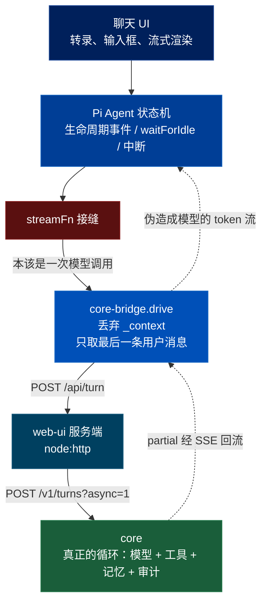

# QM 的 Web 客户端：一个假装自己在调模型的聊天界面

> 关联文档：
> - [[qm-overview]]（产品目标、八条哲学、十组模块分解）
> - [[qm-synthesis]]（综述——按问题收敛的做法清单；本篇给它第三节补了第二个答案）
> - [[qm-surface-layer]]（表面层——portal / auth / admin / chassis，本篇是同一层的第四块）
> - [[qm-memory-layer]]（记忆层——本篇的 Contexts 视图对应「每个 scope 一份记忆」）
> - [[qm-execution-layer]]（执行环境——真正的 agent 循环跑在那边的沙箱里）
> - [[qm-skills-layer]]（技能层——斜杠命令列出的是可见技能，正文不下发浏览器）
> - [[qm-resolution-layer]]（解析层——模型偏好在它的策略地板内被采纳）
> - [[qm-turn-slice]]（纵切面——本篇的 `POST /api/turn` 是那十九道闸门的另一个入口）
> - [[qm-harness-layer]]（Harness 层——本篇是同一个替换手法用在浏览器里）
> - [[qm-run-lifecycle]]（运行时——`runId`、SSE、信号、中断重入的服务端一侧）
> - [[qm-authz-layer]]（授权与安全层——`user-scoped-routes` 的三分类在本篇被打开）
> - [[qm-credentials-layer]]（凭证层——OAuth 回调在服务端换码，令牌不进浏览器）
> - [[qm-autonomy-layer]]（自主工作层——Crons 视图管理的是那一层的对象）
> - [[qm-publish-layer]]（发布层——Deploys 视图与 `/app-edit` 的 iframe 场景）
> - [[qm-surface-mirror]]（镜像层——Slack 会话在这里只读渲染的数据来源）
> - [[qm-crosscutting]]（横切件——`swallow`、字符串边界、代理头）
> - [[qm-assembly-layer]]（装配层——core 侧的路由注册与启动期校验）
>
> 调研对象：`yc-software/qm`，本地路径 `~/Repositories/qm`，`main` @ `0f0e0ad`
> 调研时间：2026-08-15
> 阅读范围：`plugins/web-ui/server/index.ts`（1948 行）、`src/core-bridge.ts`（1381 行）为主，
> 另读 README 全文、`src/` 其余 55 个文件的规模与职责分布；
> 回头核对了 `src/api/user-scoped-routes.ts`、`src/api/server.ts` 的身份闸、
> `test/portal-identity-gate.test.ts` 的漂移测试。
> 源码合计 18,772 行（另有 80 个测试文件 7,781 行）。
>
> **本篇不做的：** 不逐个看 55 个前端文件。`chat.ts`(2162)、`composer.ts`(1528)、
> `sessions.ts`(1249)、`contexts.ts`(1227) 这些是 Lit 组件，读完只能得到组件清单，
> 对理解这个系统没有增量。这一篇看的是**这个客户端和服务端之间那条线**。

---

## 一、定位

这是 `plugins/` 里最大的一块（占 `plugins/` 总量七成），也是整个仓库最后一块没被覆盖的源码。

它是一个 ChatGPT 形状的 Web 聊天界面，两个进程：一个零依赖的 `node:http` 服务端，一个 Vite 打包的前端。它跑在 [[qm-surface-layer]] 讲的 portal 后面，被挂在 portal 的根路径上。

**没有它会怎样：** Slack 之外没有入口。QM 的整个产品叙事是「同一个 agent，多个表面，同一份历史」，这个插件是那句话里 Slack 以外的那一半。

**这一篇的主线：** 这个客户端做了一件看起来很奇怪的事——**它在浏览器里跑了一个真正的 agent 状态机，但把这个状态机的「调用模型」那一步换成了「问服务端要答案」，并且把状态机辛苦拼好的上下文原封不动地扔掉。** 这一篇解释为什么这不是浪费，以及这个选择在安全上买到了什么。

---

## 二、主干：在一个接缝上换实现

### 2.1 `_context` 被丢弃

前端复用了 Pi 的 `Agent` 状态机（这是 [[qm-harness-layer]] 里那个 Pi harness 的浏览器同宗）。Pi 的 `Agent` 有一个叫 `streamFn` 的边界——它就是「把上下文交给模型，拿回一个事件流」这一步。

`src/core-bridge.ts:559` 把这一步整个换掉：

```ts
export function makeCoreStreamFn(threadRef, agent, getTurnOptions?, onWork?, slot?): StreamFn {
  const fn = (model: Model<Api>, _context: Context, options?: { signal?: AbortSignal }) => {
    const stream = createAssistantMessageEventStream();
    void drive(stream, model, threadRef, agent, getTurnOptions, options?.signal, onWork, undefined, false, slot);
    return stream;
  };
  return fn as unknown as StreamFn;
}
```

**注意第二个参数 `_context`。** 状态机在这里递过来的是它认为要发给模型的完整对话上下文——而这个函数**看都不看**。`drive()` 转头从 `agent.state` 里只取最后一条用户消息（`latestUserTurn(agent)`），拼上模型 id、思考等级、fastMode、时区、附件，`POST /api/turn` 完事。

真正的上下文在服务端。浏览器这一份是影子。

`fn as unknown as StreamFn` 那个双重强制转换也说明了问题：真实的 `StreamFn` 签名和这里给的并不匹配，接缝是被撬开的，不是被优雅实现的。

**那为什么还要留着这个状态机？** 因为 `streamFn` 之上的东西全都还有用：流式渲染、`waitForIdle()`、中断、工具调用的展示、消息的生命周期事件。README 那句「The custom transcript renders from Pi `Agent` lifecycle events」就是这个意思。**换掉最底下那一层，上面几千行 UI 逻辑一行不用改。**

这和 [[qm-harness-layer]] 是同一个手法的两次使用：那边是「四个 agent 循环实现同一个 `Harness` 接口」，这边是「一个 agent 循环的模型调用被换成一次 HTTP」。**这套系统的架构手法基本上就这一招——找到一个接缝，在那儿换实现。**



**代价，三条。**

其一，**浏览器里有一份永远对不上的状态**。`Agent` 以为自己维护着对话上下文，实际上那份上下文既不完整（服务端做了压缩、注入了记忆和技能）也不权威。任何依赖 `_context` 的 Pi 功能在这里都是坏的——README 明说了「Pi's client-side artifacts / JavaScript REPL are not enabled」，那不是产品取舍，是这个接缝的必然后果。

其二，**模型 id 是一个愿望，不是一个指令**。`model.id` 随请求带过去，core 在它的策略地板内决定采不采纳。UI 上那个模型选择器展示的是「你选了什么」，不保证「实际用了什么」。README 诚实地写了这条（「The model picker only expresses a _preference_」），但界面上这件事对用户是不是同样清楚，我没看前端渲染。

其三，**双重强制转换意味着类型系统在这里帮不上忙**。Pi 升级后 `StreamFn` 签名变了，这里不会报错，会在运行时以某种奇怪的方式坏掉。

### 2.2 这个接缝为什么选得对

把接缝放在「调用模型」这一步之下，直接决定了浏览器里没有什么：

- 没有模型密钥。
- 没有工具执行——三个原语、记忆、审计全在服务端沙箱里。
- 没有出网决策——[[qm-assembly-layer]] 讲的那套 egress 执法根本不在这一侧。
- 技能的**正文**不下发。斜杠命令那个选择器只拿到 name/description/scope。

**判据可以脱离 qm 表述：** 决定客户端有多「厚」时，不要问「哪些功能放前端体验更好」，问**「这个接缝之下有哪些东西是我不想让浏览器碰的」**。把接缝画在那些东西之上，剩下的自然就是安全的。这里的接缝画在模型调用之下，于是密钥、工具、出网一次性全部留在服务端——不是靠二十条「不要把 X 发给浏览器」的规矩。

### 2.3 SSE 优先，轮询兜底

`followRun`（`core-bridge.ts:737`）：

```ts
const viaSse = await streamRunViaSse(stream, partial, runId, st, signal, notify);
if (viaSse === "done") return;
if (signal?.aborted) return abortStream(stream, partial);
return await pollRun(stream, partial, runId, st, signal, notify);
```

SSE 有 4 秒的建连超时（`SSE_OPEN_TIMEOUT_MS`）；建不起来就退到轮询，README 说明了适用场景（老环境、对流式不友好的代理）。

**两个细节值得看：**

- **两条路之间重新检查了一次 `signal?.aborted`。** 用户在 SSE 阶段按了停止，不会被轮询兜底路径「复活」。降级路径最容易漏的就是这种——降级时把前一步已经发生的状态变化丢了。
- **`st: Acc` 在两条路之间传递。** 累积的文本和「上次有进展的时刻」跨降级保留，所以退到轮询之后不会把已经显示的内容重放一遍。

服务端这一侧有四个时间常数（`server/index.ts:174-178`）：`SSE_CORE_POLL_MS = 100`（服务端向 core 拉的频率）、`SSE_STALE_POLL_MS = 1000`（判定为停滞后降频）、`SSE_IDLE_MS = 6 分钟`、`SSE_HEARTBEAT_MS = 15 秒`。**服务端自己是轮询 core 的**——SSE 只存在于浏览器到服务端这一段。心跳那条印证了 [[qm-autonomy-layer]] §13-31：让「安静」和「卡死」可区分。

**代价：** 一个流式界面底下是一条每 100 毫秒一次的轮询。对一个内部工具的规模这没问题，但这条链的成本随并发在线的活跃回合数线性增长，而不是随消息量。停滞后降到 1 秒是唯一的减压手段。

---

## 三、浏览器不能撒谎

### 3.1 三段身份链

服务端的身份解析（`server/index.ts:249`）和 admin 插件那份**逐字同构**：先验 portal 签的身份头，拿不到才看 cookie，而且只在 `COOKIE_AUTH` 为真时——那等价于「压根没配 core 签名密钥」，也就是隔离开发。

```ts
const COOKIE_AUTH = !CORE_SIGNING_SECRET || ALLOW_UNSIGNED_TEST_IDENTITY;
const AUTH_MODE = COOKIE_AUTH ? "dev" : "portal";
```

`AUTH_MODE` 还被放进 401 的响应体里，这样前端能区分「你没登录」和「这个部署压根没接 portal」。

真正有意思的是第三段。服务端往 core 发请求时（`server/index.ts:423`）：

```ts
const portalTok = portalTokenStore.getStore();
const r = await fetch(`${CORE}${signedPath}`, {
  headers: {
    ...signedHeaders(CORE_SIGNING_SECRET, method, signedPath, rawBody),
    ...(portalTok ? { [PORTAL_IDENTITY_HEADER]: portalTok } : {}),
  },
  ...
});
```

**两个凭据一起走**：源认证签名（证明「我是一个合法的表面进程」）和透传的 portal 身份令牌（证明「这次请求代表这个人」）。前者是进程的身份，后者是人的身份，core 两个都要。

### 3.2 core 侧的三分类路由表

这是本篇最值得写下来的一段，而且它在 core 里，是前十七篇漏掉的。

`src/api/user-scoped-routes.ts` 把每一条 API 路由分进三类：

| 类别 | 含义 | 例子 |
|---|---|---|
| `USER_SCOPED`（60 条） | 代表某个人行动。多数还标注**声称的行动者藏在哪个字段** | `GET /v1/sessions` 的 `?principalId=`、`POST /v1/crons` 的 body `createdBy` |
| `SYSTEM`（32 条） | 合法的操作者级调用 | `POST /v1/turns`、投递回执、目录推送、keychain 管道 |
| 剩下的写操作 | **未分类** | —— |

`src/api/server.ts:267` 那个闸把三类接起来：

```ts
const needsActor =
  isUserScoped(method, pathname) || webTurn || pathname.startsWith("/v1/admin/") || isUnclassifiedWrite(method, pathname);
if (needsActor) {
  if (!psecret || !actor) { sendJson(res, 401, { error: "unauthorized", message: "portal identity required" }); return null; }
  ...
  if ((field && asserted !== actor.p) || (!field && asserted !== null && asserted !== actor.p)) {
    sendJson(res, 403, { error: "forbidden", message: "portal identity does not match the requested actor" });
    return null;
  }
}
```

三件事：

1. **未分类的写操作被并进「需要人类身份」。** 也就是说，新加一个写接口而忘记归类，它的默认待遇是最严的那一档，不是最松的。这是一张**必须穷尽的表**，而穷尽性由默认值兜住。
2. **声称的行动者要和验证过的身份逐字相等。** 请求里的 `?principalId=alice` 配上 bob 的 portal 身份 → 403。
3. **`POST /v1/turns` 且 `surface === "web"` 有专门一支**：声称的行动者取 `body.actor.externalId`，也就是 web-ui 从 cookie 填进去的那个值。**core 会把它和 portal 验过的身份对一遍。** 所以 web-ui 那句「identity from the cookie, never the body」不只是它自己的纪律——**就算它想撒谎，core 也会当场拆穿。**

**判据：** 一张安全相关的分类表，要让「忘记分类」落到最严的那一档，而不是落到「不匹配任何规则所以放行」。这条听起来是常识，但绝大多数路由鉴权中间件的默认恰恰是后者——匹配不到规则就不管。

### 3.3 漂移测试守的是反方向

`test/portal-identity-gate.test.ts:306` 有个测试断言：每一条 `auth: "source"` 的写路由都必须被归过类，失败消息是

> an unclassified write requires a portal identity under `REQUIRE_SIGNED_PORTAL_IDENTITY`; add it to SYSTEM in user-scoped-routes.ts

**注意它守的方向。** 它防的不是「忘记归类导致漏授权」——那个方向由默认值自动挡住了。它防的是**「忘记归类导致一个插件的服务间调用突然被要求提供它根本没有的人类身份」**，也就是把一个安全默认变成了可用性事故。

这个组合是我在整个调研里见过最干净的一次分工：**安全方向交给默认值（结构上不可能错），可用性方向交给测试（结构上会错，所以要测）。** 反过来做——把安全方向交给测试、可用性方向交给默认值——是常见得多的写法，而且更差。

---

## 四、进程内索引作为快路径：给综述第三节补一个答案

[[qm-synthesis]] §3 说过：整个仓库对「进程内 `Map` 在多实例下失效」这个反复出现的问题，只有一个结构性答案（把 `durable` 暴露成接口上的一位）。

**本篇找到了第二个，形状完全不同。**

web-ui 服务端有三个进程内的 Map（`server/index.ts:66-68`）：`runOwners`、`runThreadKeys`、`activeRunsByThread`。它们记录「哪个 run 属于哪个人、哪个线程上有哪些活跃 run」。按 AGENTS.md 那条规矩，这是典型的违反。

但看它们怎么被用（`server/index.ts:1621`，SSE 事件路由）：

```ts
if (!ownsRun(id, user)) {
  const auth = await coreFetch("GET", `/v1/runs/${encodeURIComponent(id)}`);
  if (auth.status < 200 || auth.status >= 300)
    return json(res, auth.status === 404 ? 404 : 502, { error: auth.status === 404 ? "not_found" : "upstream_error" });
}
```

**进程内索引命中就省一次往返；不命中就问权威源。** 而权威源那次调用带着 portal 身份令牌（§3.1），所以 core 是按验证过的人来判的。

`/api/runs/active`（`server/index.ts:1554`）是同一个形状的完整版：先遍历本地索引，每一条都**回 core 重新取一次**再决定；本地全空就换一条路问 core（`GET /v1/runs?threadRef=`）。终态的 run 顺手从索引里删掉——读路径承担状态自愈，[[qm-publish-layer]] §12-16 那条。

**于是这些 Map 有一个关键性质：它们只能省工作，不能授予权限。** 索引丢了（重启、换实例、超过 5000 条被挤掉），后果是多一次 HTTP 往返，不是拒绝服务，更不是越权。

**判据（这是本篇给综述补的那条）：** 进程内状态本身不是问题，**问题是进程内状态被当成权威**。判断方法：假设这个 Map 在下一毫秒被清空，会发生什么？答案是「多花点时间重算」→ 它是缓存，随便放内存。答案里出现「有人被拒绝」「有人被放行」「有件事不会发生了」→ 它是状态，必须持久化，或者像 `ReplayDedupe` 那样把非持久性暴露给调用方。

[[qm-synthesis]] §3 那份清单里已经把六个实例分成了两组——三个有外层兜底（`inflightRefreshes`、插件侧去重 LRU、`idempotency` 的 `inflight` Set），三个没有（`lastHarness`、`bursts`、`engaged`）。当时那个划分是凭具体情况一个个判的。**本节补的是判据本身**：不用逐个看兜底在哪，问一句「清空会怎样」就能分。

按这条判据，web-ui 这三个 Map 干净地落在缓存那一侧，而且它们比前三个更进一步——**前三个是「碰巧有兜底」，这三个是「兜底写在了同一个函数里，命中与否走的是同一段授权逻辑」。**

**代价：** 这个模式要求权威源本身**便宜且总在**。web-ui 到 core 是私网一跳，够便宜。如果权威源是一个跨区域的服务，「缓存未命中就问权威」会变成「缓存未命中就慢 200 毫秒」，那时又得引入别的东西。

还有一个具体的粗糙处：`rememberRun`（`server/index.ts:89`）超过 5000 条时挤掉**最早插入**的那条，而不是最久未用的。一个跑了很久的长回合会先于刚开始的短回合被忘掉——正好挤掉最需要索引的那个。后果只是多一次往返，所以不严重，但取的是错的那一端。

---

## 五、只读是产品决定，不是技术限制

Slack 会话在 Web 上**只读渲染**——有转录，没有输入框。前端的判据（`core-bridge.ts:351`）：

```ts
export function isContinuable(s, user: string): boolean {
  if (!s.threadRef.startsWith("web:")) return false;
  return s.threadRef.startsWith(`web:${user}:`) || s.scopeId.startsWith("channel:") || s.scopeId.startsWith("group:");
}
```

非 `web:` 开头的一律不可续。README 给的理由是产品性的，不是技术性的：

> a web reply would be invisible to Slack participants, so contributing to those Slack threads from the web isn't allowed yet

**这是一个「宁可少一个功能，也不要一个会骗人的功能」的决定。** 技术上完全可以让 Web 回复投递回 Slack；他们选择不做，因为半吊子的双向投影会让人以为自己在参与一个别人看不到的对话。

**设计出来的替代路径是 Contexts。** 你不能续 Slack 那个话头，但你可以在**同一个工作区**里开一个新的 Web 对话——同一份文件、同一份记忆、同一个沙箱，只是对话本身留在 Web 上。这比「让 Web 回复能发到 Slack」更诚实：它把「共享的是工作区，不是对话」这件事变成了界面上看得见的结构。

这里还有一处授权上的细节值得单说。web-ui 服务端的 `conversationForScope`（`server/index.ts:228`）**完全不做成员校验**——它只把一个 scope 字符串映射成 conversation 的形状，非法输入返回 `null`（然后 403，`server/index.ts:1501`）。README 的说法是准确的：

> The web-ui never vouches for membership — it only shapes the claim.

**而 core 那边的重新授权，比 cron 创建那条路更严。** README 把理由写出来了：cron 的规则是「任何内部人都可以往公开频道发消息」，而从 Web 挂载一个频道的工作区不适用这条——

> a post is visible to the channel, mounting its workspace from the web is not

**「发一条消息」和「打开一个工作区」的可见性不同，所以门槛不同。** 前者的后果会被频道里所有人看到（社会性约束在起作用），后者不会。这是 [[qm-resolution-layer]] 那条收紧代数序列之外的另一种判据——**不按权限大小分级，按「做错了会不会有人发现」分级。**

---

## 六、张力与风险

**1. 未覆盖的 55 个前端文件里可能有安全相关的东西。**
我读的是服务端和桥。`chat.ts`(2162) 里有 markdown 渲染，仓库里有 `markdown-sanitize.ts`（16 行）和 `streaming-markdown.ts`（112 行）——**一个 16 行的净化器给一个渲染模型输出的转录用，这个比例值得看一眼，我没看。** 这是本篇最大的未查项。

**2. `_context` 被丢弃这件事没有任何东西标记出来。**
参数名前缀下划线是唯一的信号。一个不知情的人给 `drive()` 加功能时，很容易假设那份上下文是有效的。

**3. `rememberRun` 的驱逐取错了一端。** 见 §4 末尾。

**4. 服务端到 core 是每 100 毫秒一次轮询。** 见 §2.3 代价。

**5. `readBody` 的无上限默认，在 admin 插件上是真实可达的。**

[[qm-surface-layer]] §7-2 我把这条标成「没有审计全部调用点、不声称存在可利用路径」。本篇顺手普查了，结论要更新：

| 插件 | 用法 |
|---|---|
| `auth` | 三处调用全部显式传 `MAX_FORM_BYTES` |
| `web-ui` | 改名导入 + 本地包一层（`readBody as readBodyCapped`，然后 `readBody = (req) => readBodyCapped(req, 1_000_000)`），于是二十多处调用**全部**有界 |
| `admin` | `admin/src/index.ts:388` 和 `:434` 两处**没有传上限** |

所以：**存在一条真实的无界读取路径**，在 admin 表面的一个 PUT 和一个通用转发上。它在 portal 后面且需要管理员身份，所以爆炸半径是「一个已认证的管理员可以把 admin 进程撑爆」——严重性低，但它正是那个不安全默认本该挡住的东西。

web-ui 的处理方式是三家里最好的：**改名导入，让不安全的那个在本文件里根本叫不出名字。** 这比「记得传参数」可靠。

**6. 归类表和它守的默认，依赖一个环境开关。**
§3.2 那套只在 `requirePortalIdentity` 为真时生效（对应 `REQUIRE_SIGNED_PORTAL_IDENTITY`）。关掉它，整套「未分类即最严」就不存在了。**我没查这个开关在生产部署模板里是不是强制打开的**，也没查关掉时有没有启动期警告。

---

## 七、存疑

1. **前端 55 个文件没读。** 尤其是 markdown 净化这一条（§6-1）。
2. **`REQUIRE_SIGNED_PORTAL_IDENTITY` 的部署侧默认没查**（§6-6）。这条直接决定第三节那套的实际有效性，是本篇最重要的未查项。
3. **`/v1/runs` 和 `/v1/runs/:id` 在 `USER_SCOPED` 里没有 `field`**，意味着 core 从 portal 身份推导行动者而不是比对请求字段。我确认了它们在表里、也确认了闸的代码，但**没有去读 `getRun` / `getActiveRunForThread` 两个处理函数**，所以「core 确实按这个人过滤」这一步我是从分类表推的，不是从处理逻辑读到的。
4. **「模型选择器只是偏好」在界面上是否表达清楚，没看。** README 说清楚了，UI 上未必。
5. **`SYSTEM` 表 32 条我没有逐条核对是否都该在里面。** 一条本该 user-scoped 的路由被误放进 `SYSTEM`，就会绕过身份比对，而且不会有任何东西报错——§3.3 那个漂移测试守的是反方向，挡不住这种误放。

---

## 八、可迁移做法

**关于换接缝**

1. 复用一个别人的状态机时，可以只换掉它最底下那一层（这里是「调用模型」），上面的 UI、生命周期、中断逻辑一行不改。代价是那个状态机会持有一份**永远对不上的影子状态**，任何依赖它的功能都得关掉。
2. **决定客户端有多厚，不要问「哪些功能放前端体验更好」，问「这个接缝之下有哪些东西我不想让浏览器碰」。** 把接缝画在那些东西之上，安全性就是结构性的，不靠二十条「不要下发 X」的规矩。
3. 被丢弃的参数要显眼。一个 `_` 前缀不足以告诉后来的人「这里有一份看起来有效、实际是影子的数据」。

**关于降级路径**

4. 主路（SSE）和兜底路（轮询）之间要**重新检查取消信号**，否则用户在主路阶段的中断会被兜底路径复活。
5. 累积状态要跨降级传递，否则退到兜底路时会把已经展示的内容重放一遍。
6. 流式界面底下是轮询时，停滞后降频（这里 100 毫秒 → 1 秒），并保留心跳——心跳的作用是让「安静」和「卡死」可区分。

**关于身份**

7. 表面进程往核心发请求时**带两个凭据**：进程自己的签名（我是一个合法的表面）和透传的人类身份令牌（这次代表谁）。两者用途不同，不要用一个凑合。
8. **核心必须重新核对表面声称的行动者。** 表面从 cookie 里读出身份填进请求体是对的做法，但它不能是唯一的保证——核心拿验证过的身份和请求里声称的那个逐字比对，表面就算想撒谎也撒不成。
9. 401 的响应体里带上认证模式（`mode: "dev" | "portal"`），前端才能区分「你没登录」和「这个部署压根没接身份提供方」。

**关于路由分类表**

10. **把每条路由分进「代表人」「系统间」两类，并让「未分类的写操作」自动落进最严的那一档。** 大多数鉴权中间件的默认是「匹配不到规则就不管」，方向是反的。
11. 分类规则里顺带标注**声称的行动者藏在哪个字段**（query 的 `viewer`、body 的 `principalId`…），比对逻辑就能写成一份数据而不是一堆 if。
12. **安全方向交给默认值，可用性方向交给测试。** 忘记归类导致漏授权——由默认值结构性挡住；忘记归类导致服务间调用被要求人类身份——写一个漂移测试，并把修复方法写进断言消息。

**关于进程内状态**

13. **判据：假设这个 Map 下一毫秒被清空，会发生什么。** 答案是「多花点时间重算」→ 它是缓存，放内存没问题。答案里出现「有人被拒绝/被放行/某件事不会发生了」→ 它是状态，必须持久化，或者把非持久性暴露到接口上。
14. 落实这条的写法：进程内索引命中就省一次往返，**不命中就问权威源**，并且权威源那次调用要带上验证过的身份。这样索引只能省工作，不能授予权限。
15. 前提是权威源便宜且总在。跨区域的权威源会把「未命中」从「省不到」变成「慢一截」。
16. 有上限的索引要按**最久未用**驱逐，不要按插入顺序——后者会先挤掉跑得最久的那个，而那正是最需要索引的。

**关于安全默认值**

17. **一个不安全的默认（`maxBytes = Infinity`），最好的补救不是「记得传参数」，是改名导入 + 本地包一层，让不安全的那个在你的文件里叫不出名字。** 这个仓库三个插件三种处理，只有这一种不依赖纪律。

**关于产品边界**

18. **宁可少一个功能，也不要一个会骗人的功能。** Web 不能回复 Slack 线程，因为那条回复对 Slack 参与者不可见——半吊子的双向投影比没有更糟。
19. 砍掉功能时要给出**设计过的替代路径**，而不是一句「暂不支持」。这里是「在同一个工作区开一个新的 Web 对话」，它顺带把「共享的是工作区，不是对话」这个事实变成了界面上看得见的结构。
20. **权限分级除了按「权限大小」，还可以按「做错了会不会有人发现」。** 往公开频道发消息全频道可见（社会性约束在起作用），从 Web 挂载那个频道的工作区不可见——所以后者门槛更高，尽管前者「动静」更大。

---

## 九、与其他篇的连接

- **[[qm-harness-layer]] 是同一个手法的另一次使用。** 那边四个 agent 循环实现同一个接口，这边一个 agent 循环的模型调用被换成一次 HTTP。合起来看，这套系统的架构手法基本上只有这一招。
- **[[qm-synthesis]] §3 被本篇补了两样。** 一是**判据**——那里的「有兜底 / 没兜底」是逐个判出来的，这里给出一句可以直接套的话（「清空会怎样」）。二是**第二个结构性答案**：那里只有「把持久性暴露到接口上」一种，这里是「让本地状态只能省工作、不能授予权限」，形状完全不同且更常用。
- **[[qm-surface-layer]] §7-2 被本篇证实并收紧。** 那条当时标着「没有审计全部调用点」，现在查完了：真实的无界路径在 admin 的两处。
- **[[qm-authz-layer]] 少了一块，在本篇补上。** 那篇讲了能力令牌的四道闸门，但没有讲 `user-scoped-routes.ts` 这张三分类表——它是 portal 身份这条链在 core 侧的落点，也是「未分类即最严」这个默认的所在地。
- **[[qm-turn-slice]] 的十九道闸门有另一个入口。** 那篇从 Slack 侧进，本篇从 `POST /api/turn` 进；两条路在 `POST /v1/turns` 汇合，但 web 这条多一道 `surface === "web"` 的行动者比对。
- **未覆盖的只剩前端组件**（55 个文件，约 15,400 行）和 `cli/`（109 文件）、`scripts/`（46 个）、`skills-seed/`（79 文件）。`src/` 与 `plugins/` 的服务端部分至此全部读过。

---

> 相关：[[qm-overview]] · [[qm-synthesis]] · [[qm-surface-layer]] · [[qm-memory-layer]] · [[qm-execution-layer]] · [[qm-skills-layer]] · [[qm-resolution-layer]] · [[qm-turn-slice]] · [[qm-harness-layer]] · [[qm-run-lifecycle]] · [[qm-authz-layer]] · [[qm-credentials-layer]] · [[qm-autonomy-layer]] · [[qm-publish-layer]] · [[qm-surface-mirror]] · [[qm-crosscutting]] · [[qm-assembly-layer]]
