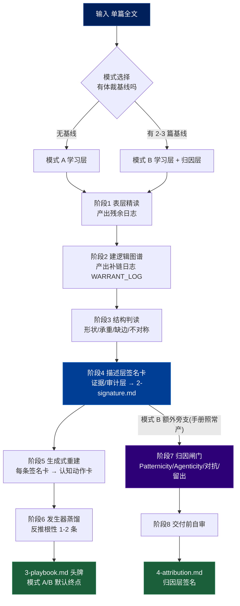
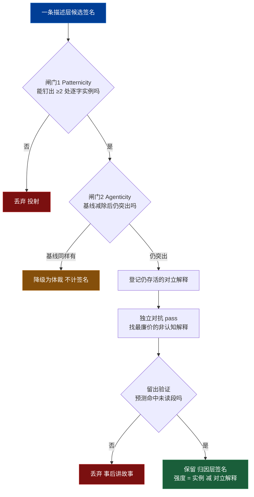

# 认知动作学习:Agent 可执行行为框架

从一篇文章里捞出**可迁移、能复用的认知动作**，讲到用户能把它纳入自己的思考与写作工具箱。签名卡退为证据/审计层；头牌产出是认知动作手册（playbook）。本框架把方法论编译成可确定性执行的流程:每个阶段有明确的进入条件、动作、二元判据(pass/fail)和产出物。所有"判断"都被替换为可勾选的标准。

**操作信条(执行前内化):**
- 产出的是**可迁移的认知动作 + 生成它们的根性**，学的单位是剥离了本文内容的招，不是作者怪癖。
- 学习层每条招**必须能回指一张签名卡（证据层）**，不许凭空生成——这是防鸡汤的硬锁。
- generative 为主：重点是"我能怎么用"，批判性判别退为每招一行附注（仍在，非主角）。

---

## 路径变量

```
ConfigPath: ~/.hskill/extract-cognition/config.json
```

### Step 0：初始化配置

用 Read 读取 `~/.hskill/extract-cognition/config.json`。

若不存在，询问用户：

```
认知签名分析保存到哪个目录？（直接回车使用默认：~/Documents/cognition）
```

用户回复后，用 Bash 写入配置（路径用 `$HOME` 展开，不可写字面量 `~`）：

```bash
mkdir -p "$HOME/.hskill/extract-cognition"
output_dir="${用户指定路径/#\~/$HOME}"
[ -z "$output_dir" ] && output_dir="$HOME/Documents/cognition"
echo "{\"output_dir\": \"$output_dir\"}" > "$HOME/.hskill/extract-cognition/config.json"
```

若已存在，解析 JSON 取 `output_dir`，把其中残留的 `~` 展开为 `$HOME`：

```bash
output_dir=$(python3 -c "import json,os; d=json.load(open('$HOME/.hskill/extract-cognition/config.json')); print(d['output_dir'].replace('~', os.environ['HOME'], 1))")
```

### Step 1：提取文章路径，准备输出目录

从用户消息提取主文章路径。**安全净化（Bash）：**

```bash
article_path=$(echo "<用户提供路径>" | tr -d '\000-\037\177' | xargs)
article_path="${article_path/#\~/$HOME}"
test -f "$article_path" || { echo "ERROR: 文件不存在: $article_path"; exit 1; }
```

**生成 slug**（去扩展名、转小写、非字母数字/汉字替换为 `-`）：

```bash
filename=$(basename "$article_path"); filename="${filename%.*}"
slug=$(echo "$filename" | tr '[:upper:]' '[:lower:]' | sed 's/[^a-z0-9一-鿿]/-/g' | sed -E 's/-+/-/g' | sed 's/^-//;s/-$//')
mkdir -p "<output_dir>/$slug"
```

**解析 `--pass` 参数：**

| 参数 | 行为 | 依赖 |
|------|------|------|
| `--pass 1` | 只跑阶段 1–3 → `1-evidence.md` | 无 |
| `--pass 2` | 只跑阶段 4 → `2-signature.md` | `1-evidence.md` 已存在 |
| `--pass 3` | 只跑阶段 5–6 → `3-playbook.md` | `2-signature.md` 已存在 |
| `--pass 4` | 只跑阶段 7（归因闸门）→ `4-attribution.md` | `2-signature.md` 已存在 + 模式 B + **重新提供原文路径与基线路径** |
| 无参数 | 跑到 `3-playbook.md`（模式 A/B 都到手册）；模式 B 再加 `4-attribution.md` | — |

依赖检查（单遍模式）：

```bash
# --pass 2
test -f "<output_dir>/$slug/1-evidence.md" || { echo "请先运行 --pass 1"; exit 1; }
# --pass 3
test -f "<output_dir>/$slug/2-signature.md" || { echo "请先运行 --pass 2"; exit 1; }
# --pass 4 (仅模式 B；另需重新提供原文路径与基线路径，见上方 --pass 表)
test -f "<output_dir>/$slug/2-signature.md" || { echo "请先运行 --pass 2"; exit 1; }
```

**体裁基线（模式 B）：** 先按下文 §1 的**模式判定**确认确实要归因到作者（模式 B）、需要基线，再收集 2–3 个基线文件路径，逐个同样净化并 `test -f` 验证；任一不存在则报错或请用户更正。（模式 A 不需要基线，跳过此步。）

## 1. 输入契约与前置条件

**必需输入:** 待分析文章全文(非片段)。

**可选输入:** 2–3 篇*同类型、同场域、非同作者*的体裁基线文本。

**硬停机条件(满足任一则不执行,向用户说明):**
- 文本少于约 300 字或明显是片段 → 样本不足,拒绝执行,请求完整文本。
- 文本是纯数据/表格/代码且无论述成分 → 无认知痕迹可抽,说明不适用。
- 主文章须为本地 `.md` / `.txt` 文件；不抓取 URL、不解析 PDF。

**模式判定(执行前必须确定,不可跳过):**

| 条件 | 选择模式 |
|---|---|
| 无体裁基线,或用户只想学习本文 | **模式 A:学习层（evidence → signature → playbook）** |
| 有 2–3 篇体裁基线,且用户想归因到作者 | **模式 B:模式 A + 归因层（再加 `4-attribution.md`）** |
| 用户想归因到作者但无基线 | 学习层照常产出（模式 A）；仅 `4-attribution.md` 不产，明确告知"无基线不归因，但手册照常给" |

**绝对规则:无体裁基线时,禁止输出 `4-attribution.md` 的归因签名。** 学习层（`3-playbook.md`）对所有用户可用，不受此限。

---

## 2. 执行管线总览



---

## 3. 状态产物(全程维护这三份)

执行中必须显式维护以下结构,后续阶段依赖它们。

**RESIDUE_LOG(残余日志)** — 阶段1 产出
```
- span:        [逐字引用的文本片段]
  location:    [段落/句子定位]
  type:        隐喻 / 对冲情态 / 反常选词 / 离题旁白 / 价值词 / 连接词 / 其他
  why_flagged: [为什么它"不合群"或值得盘问]
```

**WARRANT_LOG(补链日志)** — 阶段2 产出
```
- from_node:   [图中节点 A]
  to_node:     [图中节点 B]
  unstated:    [作者没明说、但你为连通必须补上的前提]
  location:    [对应原文位置]
```

**SIGNATURE_CARD(签名卡)** — 阶段4 产出，作为证据/审计层（写入 `2-signature.md`），并作为学习层每条动作卡的回指锚。schema 见第 6 节。

---

## 产出文件映射

执行中各阶段产物落入 `<output_dir>/<slug>/` 下四个文件：

| 文件 | 阶段 | 内容 | 终止/依赖 |
|---|---|---|---|
| `1-evidence.md` | 1–3 | 残余日志 + 逻辑图谱(+补链日志) + 结构信号 | 两源就绪 |
| `2-signature.md` | 4 | 描述层签名卡 = 证据/审计层 | 防鸡汤锚 |
| `3-playbook.md` | 5–6 | 认知动作手册（发生器 + 动作卡 + 迁移练习） | **头牌；模式 A/B 默认终点** |
| `4-attribution.md` | 7 | 归因层签名卡 | 仅模式 B，依赖文件 2 + 基线 |

每个文件开头写元信息块：
```
# {文章标题} — {阶段名}
**来源文件**: <article_path>
**模式**: A 仅描述 / B 描述+归因
**分析日期**: YYYY-MM-DD
```

## 4. 阶段详解(每阶段:进入 / 动作 / 标准 / 产出)

### 阶段 1:表层精读 —— 先别拆

**进入:** 模式已定。**关键约束:此阶段禁止构建逻辑图谱**,否则归一化会抹掉表层信号。

**动作:** 通读全文,逐项标记并写入 RESIDUE_LOG:
- 隐喻与框架(作者把什么当图、什么当底)
- 对冲与情态词("显然 / 也许 / 必然 / 我猜")——确定性在哪里高、哪里留余地
- 局部连接词("因此 / 然而 / 也就是说")——推理的接缝
- 价值词与立场词——情绪聚集处
- 反常选词、离题、旁白——任何让你"咦"的地方

**读姿:** 除标"不合群/破绽(tells)"之外，**同时标记作者哪里做得有效、利落（craft）**——这些是后续最可学的料，不要只盯着异常，要兼读有效之处。

**标准:** RESIDUE_LOG 每条必须含逐字 span + 定位。无法逐字定位的观察不入日志。

**产出:** RESIDUE_LOG，写入 1-evidence.md 的"残余日志"节。

> 读全文是对的——阶段2-3 建图与结构判读本就需要完整文本。留出验证的隔离**不靠少读**，而靠阶段5 把"预测留出段"交给一个全新子任务来做（见阶段5）。

### 阶段 2:建逻辑图谱

**进入:** 阶段1 完成。

**动作:**
1. 判型:用四问("论证观点 / 给方案 / 梳理关系 / 讲过程")锁定主导逻辑,选拆解方法(金字塔 / Toulmin / 概念图 / 流程图等)。
   判型与选拆解法时查阅 `references/article-analysis-methods.md`（19 方法 / 7 家族 / 13 类文章选型对照 / 四问决策树）。
2. 建图:节点 + 带含义的边。
3. **每一次你不得不补一条原文没明说的链接才能连通,立即写入 WARRANT_LOG。** 这是核心原料——作者觉得"不需要论证"的前提。（warrant 是阶段 6 发生器蒸馏的主原料。）

**标准:** 图中每条边要么有原文支撑,要么进了 WARRANT_LOG(二选一,不允许无记录的暗连)。

**产出:** 逻辑图谱(mermaid) + WARRANT_LOG，追加写入 1-evidence.md。

### 阶段 3:结构判读

**进入:** 图谱完成。

**动作:** 对图本身(而非原文)读出四类信号,逐条记录并附图中证据:
- **形状**:深(层层还原)还是宽(枚举)?交叉连接多(系统/联想)还是纯树(分类)?
- **承重节点**:整篇论证挂在哪个 claim 上(= 作者当作基岩的东西)?
- **缺失的边**:哪两个节点之间没给论证就直接连了?什么显眼地缺席?
- **不对称**:哪个论点支撑充足、哪个同样可争议却零支撑(= 作者没挣来的自信)?

**标准:** 每条结构观察必须指向图中具体位置(节点/边/空位)。

**产出:** 结构信号清单，追加写入 1-evidence.md。写完告知:✓ 阶段1–3 完成 → <output_dir>/<slug>/1-evidence.md

### 阶段 4:两源交叉 → 描述层签名卡（证据/审计层）

**进入:** 表层(残余)+ 结构(空隙等)就绪。

**动作:**
1. **残余分诊**:对 RESIDUE_LOG 每条问"这是认知线索,还是疲劳/凑字/编辑痕迹?"。保留前者为候选,后者剔除。**不要默认所有残余都是信号**——那本身就是在噪声里找模式。
2. 交叉:把残余叠回图上看认知纹理聚在哪;把空隙对回原文看作者用什么手法(隐喻?自信断言?)糊过去。
3. 形成一批**描述层候选签名**,每条写成"本文实现了 X"的客观陈述 + 证据实例。**不要因"可能是体裁惯例"而丢弃候选**——一个常规但有效的招照样保留进描述层；体裁判定的丢弃逻辑只在模式 B 的阶段 7（归因闸门）生效。

**标准(描述层证据门槛):** 一条描述层签名至少需 **1 处逐字定位实例**;声明"高置信"需 **≥3 处一致实例且无明显替代读法**。

**产出:** 一批描述层 SIGNATURE_CARD，构成证据/审计层，写入 `2-signature.md`。**分支:** 模式 A 与模式 B 均继续进入阶段 5（生成式重建）。

### 阶段 5:生成式重建 —— 签名卡 → 认知动作卡

**进入:** 阶段 4 的描述层签名卡（`2-signature.md`）已就绪。每张签名卡是本阶段每张动作卡的强制回指锚。

**动作:** 对每一张描述层签名卡，正向重建出一张**认知动作卡**——意图→步骤→效果的可复现配方 + 适用条件。**判断轴是有效性 / 可迁移性 / 接地程度，不是归因置信度。**

对每张签名卡，填写以下 7 栏 schema：

```
认知动作 #k：[可迁移的招名 —— 剥离本文内容，写成通用操作]

  这招替你干什么活:  [它在论证/表达里完成的认知工作；为何有效]
  怎么自己跑:        [① … ② … ③ … 可复现的正向步骤]
  本文怎么使的:      [≥1 处逐字实例 + 定位（来自签名卡）]
  该学还是该防:      [一行附注：✓纳入工具箱 / ✗识破防御 / ~双刃 + 本文判定]
  从哪条根性长出:    [回指阶段 6 发生器的哪条镜头]
  回指证据:          [签名卡 #k —— 强制，不许无锚生成]
  迁移练习:          [一个让用户拿自己的题目套用此招的 prompt]
```

**标准（二元判据）：**
- **F6 鸡汤锁**：`回指证据` 为空的动作卡不许产出——每招必须钉到一张签名卡的逐字实例。
- **F7 不可迁移锁**：招名或步骤中出现本文专有名词 / 具体话题 → 判定不可迁移，须改写成内容无关的通用操作（迁移练习能换题套用才算过）。

**产出:** 一批认知动作卡（暂存，阶段 6 后汇入 `3-playbook.md`）。

---

### 阶段 6:发生器蒸馏 + 手册组装产出

**进入:** 阶段 5 的认知动作卡集合 + 阶段 2 的 WARRANT_LOG 已就绪。

**动作（发生器蒸馏）:** 从动作卡集合反推 **1–2 条根性（发生器）**，主原料是 WARRANT_LOG（作者默认不证自明的前提）。每条根性写成：

> 作者把 X 看成 Y / 默认 Z 不证自明

**标准：**
- 根性 ≤2 条。
- 每张动作卡的 `从哪条根性长出` 必须指向这里的某一条。
- 回查阶段 5 所有动作卡，补填 `从哪条根性长出` 栏。

**动作（手册组装）:** 将发生器 + 动作卡 + 迁移练习汇总写入 `3-playbook.md`，结构如下：

```
# {标题} — 认知动作手册
**来源**: <article_path>  **模式**: A/B  **日期**: YYYY-MM-DD

## 一、这套思维的发生器（先学这个）
   根性镜头：1-2 条 —— "作者把 X 看成 Y / 默认 Z 不证自明"（来自 WARRANT_LOG 蒸馏）
   为什么先学它：学会镜头能自己再生出下面的招；只背招，换题就忘。

## 二、认知动作 ×N（每条 = 发生器落到一个具体操作）
   [认知动作卡 schema 见阶段 5；此处按发生器优先顺序排列]

## 三、迁移练习汇总
   把各招的练习 prompt 汇成一张清单，供用户拿自己的题目逐条练。
```

**模式 B + 基线：** 若用户提供了体裁基线，手册里对应招可附"别处也这么使"的泛化注脚（基线在学习层作加法样本，扩充可迁移性，非减法滤镜）。

**产出:** `3-playbook.md`。产出后告知：✓ 阶段 5–6 完成 → `<output_dir>/<slug>/3-playbook.md`。**模式 A 到此为默认终点。**

---

### 阶段 7:归因闸门流水线（仅模式 B，可选增强）

> 本阶段仅在模式 B 执行，产出 `4-attribution.md`，是在学习层手册之外的可选归因增强——不是管线脊梁，不影响 `3-playbook.md` 的产出。

对每一条描述层候选,独立走完下面整条流水线。任一硬闸门 FAIL 即终止该条。



**闸门 1 — Patternicity(模式真在文本里吗):**
- PASS 当且仅当能钉出 **≥2 处独立、逐字可定位**的实例(单处可能是巧合)。
- FAIL → 丢弃,标记"无法证实的投射"。

**闸门 2 — Agenticity(指向作者认知,还是体裁/巧合):**
- 把该特征拿到 2–3 篇体裁基线上比对。
- FAIL(降级)当基线文本**也普遍具有**该特征 → 这是体裁信号,移出签名集。
- PASS 当扣除基线后该特征**在本文仍异常突出**。

**登记对立解释:** 列出所有仍说得通的*非作者认知*读法——体裁惯例、题目约束、读者适配、编辑/合著之手、引用他人、巧合。记下其中**未被排除**的条数。

**独立对抗 pass(由独立子任务执行):**
- **派一个全新子任务**(干净上下文),只给它:这条签名 + 支撑它的证据实例。它唯一的任务是为该签名找出**最廉价的非认知解释**并尽力推翻它。
- 为何要独立上下文:自我证伪是同一推理给自己出题,而 agent 的"流畅过度归因"是系统性的,同一上下文兜不住。隔离的红队才有意义。
- 签名存活,当且仅当子任务给出的最佳替代解释,**弱于**认知解释。
- **无子任务能力的环境**:退回同上下文换框架重推,并在产出里标注"对抗未隔离,强度打折"。

**留出验证(Hold-out,最强闸门;由独立子任务执行):**
- **为什么必须用子任务**:Agent 读文件是一次性读入,同一上下文**物理上无法"假装没看过"留出段**——光说"预留 20-30%"没用,读都读了。真正的盲测只能交给一个从没拿到留出段的全新子任务。
- 主流程照常读全文、形成签名(隔离**只发生在预测这一步**,不牺牲阶段1-3 的全文分析)。
- **派一个全新子任务**,prompt 里只给两样:**这条签名(那句假设)** + **删去最后 ~20–30% 的文章正文**(按行范围截断,留出段绝不放进去)。
- 让子任务据此**预测**留出段的 ≥1 个具体可核对属性:某处会怎么措辞 / 会略去说什么 / 会用什么结构动作。
- 主 agent 拿回预测,**比对自己手里的留出段**判定。PASS = 命中;FAIL = 未中 → 丢弃为"事后讲故事"。(核对不需盲,只有预测需盲。)
- **残留局限(如实记入 4-attribution):** 签名毕竟是在读过全文后形成的,可能已被留出段轻微拟合;故喂子任务时只给"签名那句话 + 70% 正文",不附基于全文的完整证据清单,把这层污染压到最低。留出验证**降低而非消除**事后归因风险。
- **无子任务能力的环境**:退回同上下文"先写下预测、再揭晓核对",并明确标注"留出未隔离,记忆污染未排除,验证强度打折"。

**产出:** 通过全部闸门的归因层签名（组装如下）。

**归因组装 + 置信度:** 把存活签名填成完整 SIGNATURE_CARD，按第 6 节标准赋置信度。

**置信度规则(不可拍脑袋):**
- 描述层:高(≥3 一致实例,无替代读法)/ 中(2 实例,或 3 但有歧义)/ 低(1 实例,或读法有争议)。
- 归因层强度 = `实例数 − 仍存活的对立解释数`,并叠加留出结果:
  - **强**:≥2 实例,≤1 对立解释,留出 PASS。
  - **暂定**:过了硬闸门,但留出弱或对立解释 >1。
  - 其余一律不进归因层。
- **归因层置信度必须明确标注为低于其描述层对应项。**

把归因层签名卡 + 归因画像写入 `4-attribution.md`；告知 ✓ 阶段 7 完成 → `<output_dir>/<slug>/4-attribution.md`。

### 阶段 8:交付前自审

逐项过下面的清单,任一不通过则返工对应阶段:

```
□ 1. 学习层每条动作卡有非空回指证据（F6 鸡汤锁）？
□ 2. 每条动作卡的招名/步骤内容无关、可换题套用（F7 不可迁移锁）？
□ 3. 模式 A 也产出了 3-playbook.md？
□ 4. 发生器 ≤2 条，且每张动作卡已标注来源根性？
□ 5. 无基线时未产 4-attribution.md，而手册照常产出？
□ 6. 学习层：3-playbook.md 末尾附了学习层上限声明？
□ 7. 没有出现"清单扫描"痕迹（见失败模式 F1）？
─ 以下仅模式 B（产出 4-attribution.md 时才核） ─
□ 8. [仅模式 B] 每条归因签名都有体裁基线对照记录？
□ 9. [仅模式 B] 每条归因签名都有 ≥2 逐字定位实例（描述层签名 ≥1 已在阶段4 核过）？
□ 10. [仅模式 B] 没有把假设写成事实的措辞（"作者认为" vs "本文指向一个…倾向"）？
□ 11. [仅模式 B] 每条归因签名都跑过独立对抗 pass 和留出验证？
□ 12. [仅模式 B] 每条归因签名都列了仍存活的对立解释，且置信度已减去它们？
□ 13. [仅模式 B] 4-attribution.md 附了归因层（隐含作者/带校准置信度/单篇）上限声明？
```

**产出:** 自审通过后，最终输出产物树（模式 A：`1-evidence.md` / `2-signature.md` / `3-playbook.md`；模式 B 另加 `4-attribution.md`）。

---

## 5. 失败模式与自检触发器

执行中持续监控这些模式;命中即按"纠正"处理。

**F1 — 模式强加 / 清单扫描.** *触发信号*:你在拿"系统思维?第一性原理?"之类的预设标签去文本里找对应。*为何危险*:确认偏误下你一定能"找到"。*纠正*:停。改由残余 + 空隙的负向定义出发——让"不合 / 缺失"自己冒出来,而不是验证清单。

**F2 — 流畅的过度归因.** *触发信号*:你生成了一段听起来很合理的认知模式,但回头找不到 ≥2 处逐字实例。*为何危险*:agent 的过度阐释是系统性的,流畅性会掩盖无据性。*纠正*:走对抗 pass;钉不到实例就丢。

**F3 — 体裁信号冒充作者签名.** *触发信号*:你把一个体裁本来就要求的结构特征(如咨询报告必然是金字塔)当成了作者的个人思维。*纠正*:过 Agenticity 门,基线减除。

**F4 — 置信度膨胀.** *触发信号*:一条签名只有 1 个实例却标了"强",或忽略了未排除的对立解释。*纠正*:套置信度公式,减去对立解释。

**F5 — 残余过读.** *触发信号*:把每一处离题都当成深层认知线索。*纠正*:残余分诊——它是高优先级*候选*,不是自动的信号。

**F6 — 鸡汤化.** *触发信号*:动作卡写得漂亮却钉不到签名卡逐字实例。*纠正*:删；强制回指证据。

**F7 — 不可迁移.** *触发信号*:招卡仍绑死在本文内容（出现了文章的专有名词/具体话题才成立）。*纠正*:重写成内容无关的通用操作，迁移练习能换题套用才算过。

---

## 6. 输出契约(严格模板)

最终输出由(a)签名卡集合 +(b)整体画像 +(c)上限声明 三部分构成。

**每条签名卡用此模板:**
```
签名 #N:[一句话命名这个特征操作]

── 描述层(关于本文)──
  本文实现:     [客观描述本文中的这个认知操作]
  证据实例:     [≥1 处逐字片段 + 定位]
  来源:         表层颗粒 / 结构骨架 / 残余 / 空隙
  描述层置信度:  高 / 中 / 低

── 归因层(关于隐含作者;模式 A 留空)──
  归因主张:     [这指向隐含作者的什么思维方式]
  体裁基线对照:  [对照文本;扣除了什么体裁信号]
  Patternicity:  PASS（≥2 实例)/ FAIL
  Agenticity:    PASS（基线减除后仍突出)/ FAIL
  对立解释:      [仍说得通的非认知读法,逐条;未排除数 = N]
  对抗 pass:     [最强反驳 + 为何未推翻]
  留出验证:      [预测了留出段什么属性;是否命中]
  归因层置信度:  强 / 暂定（明确低于描述层)
  关联 Warrant:  [背后那个作者默认不论证的前提]
```

**整体画像:** 描述层卡片汇成"本文实现了什么认知风格"的稳健画像;归因层卡片(若有)汇成关于隐含作者的假设集。**未明说的 Warrant 通常是信息量最大的一栏,应在画像中突出。**

**归因层上限声明(仅模式 B，附在 `4-attribution.md` 末尾，固定措辞精神):**
> 以上为对**隐含作者**(文本所投射的认知形象)的分析。基于单篇,产物为**带校准置信度的假设**而非确证;"是否为作者稳定特质"需跨文本,本框架不作此声称。

**学习层上限声明（每次产出 `3-playbook.md` 必附）：**
> 本手册抽取的是**本文实现的、可迁移的认知动作**及其背后的默认前提，作为你可学习/可警惕的对象。每招都锚定了本文逐字实例；但"这是不是该作者的稳定特质"属于归因问题，仅在模式 B 的 `4-attribution.md` 中、且有体裁基线时才作有限主张。手册不等于为这些招背书——`该学还是该防` 一栏给出本文语境下的判定。

---

## 7. 停机 / 降级 / 求助条件

- **降级到模式 A**:想归因但无基线 → 自动降级,告知用户。
- **拒绝执行**:命中硬停机条件(片段 / 无论述成分)。
- **求助用户**:基线文本是否合适、文章体裁难以判定、或文本含大量他人引文难分作者声音时,向用户澄清而非猜测。
- **空结果是合法结果**:若所有候选都未过闸门,如实交付"未发现可证实的归因层签名,仅有描述层观察"——不要为了产出而降低标准。

---

## 8. 最小工作示例(锚定行为)

**输入片段:** "市场从来不是一台机器,而是一场永不停歇的对话;读懂它,要听,而不是算。"

**阶段1(残余):** span="市场是一场对话";type=隐喻;why=用"对话"而非"机器/系统"框架经济现象。

**阶段4(描述层候选):**
- 本文实现:用**人际/言语隐喻**框架抽象的市场机制(对话、听、读懂),回避机械/计算隐喻。
- 实例:"一场永不停歇的对话""要听,而不是算"。来源:表层颗粒/残余。描述层置信度:中(2 实例)。

**阶段5(生成式重建,模式 A/B 均执行):** 从阶段4签名卡出发，生成一张认知动作卡：

```
认知动作 #1：用人际隐喻框架抽象系统

  这招替你干什么活:  把抽象系统（市场/组织/流程）映射到人际互动框架，
                     让读者用已有的社会直觉理解陌生机制；降低认知门槛，
                     同时暗示系统的行为逻辑更像"协商"而非"优化"。
  怎么自己跑:        ① 找出你要描述的抽象系统的核心动态；
                     ② 找一个人际场景（对话/谈判/倾听/博弈），
                        其动态与上述系统同构；
                     ③ 用人际场景的动词和名词替换系统术语，
                        检查替换后是否导入了错误预期；若无则保留。
  本文怎么使的:      "市场是一场永不停歇的对话；读懂它，要听，而不是算。"
                     （第1句，人际框架替换机械框架；逐字定位：开篇第1句）
  该学还是该防:      ✓ 纳入工具箱（本文用于降低抽象度、传递认识论立场，效果利落）
  从哪条根性长出:    根性1（见下方发生器）
  回指证据:          签名卡 #1 — 人际/言语隐喻框架（描述层置信度：中）
  迁移练习:          取你熟悉的一个复杂系统（供应链/免疫系统/学习曲线），
                     用人际互动词汇重写一句核心描述；检查它是否比原版更易理解、
                     是否引入了你不想要的含义。
```

**阶段6(发生器蒸馏):** 从动作卡集合与 WARRANT_LOG 反推根性：

> 根性1：作者默认"复杂系统的真相要靠诠释而非计算获得"——这条 warrant 使得人际/解释学框架比机械框架更"自然"，下面的所有招（用感官动词、拒绝量化断言）都从这里长出。

**阶段7(模式 B 归因闸门,需基线):**
- Patternicity:若全文另有 ≥2 处同类言语隐喻 → PASS;仅此一处 → FAIL(单处巧合)。
- Agenticity:对照同领域基线——若基线作者普遍用机械隐喻,而本文反着来 → PASS(突出);若基线也爱用对话隐喻 → 降级为体裁。
- 对立解释:可能是面向大众读者的通俗化策略(读者适配)→ 未排除则计入,降低强度。
- 留出:预测作者在结尾段会继续用感官/言语动词("听见""读出")而非计算动词 → 读结尾核对。

**输出(归因层,若通过):** 归因主张="倾向以人际/解释学框架而非机械/计算框架理解复杂系统";置信度=暂定(读者适配这一对立解释未完全排除);关联 Warrant="复杂系统的真相要靠诠释而非计算获得"。写入 `4-attribution.md`（仅模式 B）。

---

## 9. 一页执行清单(runbook)

```
0. 定模式:有基线→B;无基线但想归因→告知"无基线不出4-attribution,手册照常给"→降级A;只析本文→A
1. 表层精读(先别拆)→ RESIDUE_LOG(逐字span+定位,兼读craft有效处)
   产出:1-evidence.md(部分)
2. 判型+建图,记每条暗连 → WARRANT_LOG(未明说前提,发生器蒸馏主原料)
   产出:1-evidence.md(追加逻辑图谱+补链日志)
3. 结构判读:形状/承重/缺边/不对称(各指向图中位置)
   产出:1-evidence.md(追加结构信号) ← --pass 1 终点
4. 残余分诊 + 两源交叉 → 描述层签名卡(≥1实例),写入2-signature.md
   ← --pass 2 终点;作为防鸡汤锚供阶段5回指
5. 生成式重建:每张签名卡→认知动作卡(7栏schema)
   标准:回指证据非空(F6);招名/步骤内容无关可换题(F7)
6. 发生器蒸馏:从动作卡+WARRANT_LOG反推≤2条根性;回填各卡"从哪条根性长出"
   组装手册→3-playbook.md ← 模式A/B默认终点; --pass 3 终点
7. [仅模式B] 归因闸门:对每条签名卡跑Patternicity→Agenticity→对立解释→
   独立对抗pass(独立子任务)→留出预测验证(独立子任务:签名+70%正文去盲测)
   无子任务环境则退回同上下文,标注"未隔离,强度打折"
   组装置信度(归因:实例减对立解释,叠留出;归因<描述)→4-attribution.md
   ← --pass 4 终点
8. 交付前自审12项 → 附上限声明(学习层+归因层各一条) → 最终交付产物树

红线:无基线不出4-attribution;动作卡无锚不出;不可迁移则改写
```
