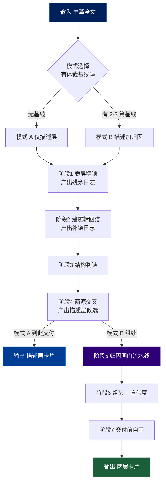
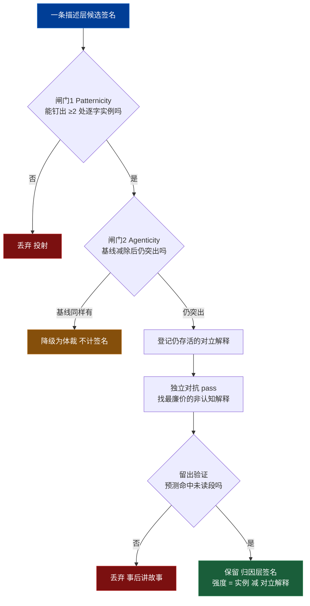

# 认知签名抽取:Agent 可执行行为框架

把一篇文章当作认知的痕迹,反推出隐含作者的思维方式,输出为**带证据、带置信度、带对立解释**的结构化签名。本框架把方法论编译成可确定性执行的流程:每个阶段有明确的进入条件、动作、二元判据(pass/fail)和产出物。所有"判断"都被替换为可勾选的标准。

**操作信条(执行前内化):**
- 你产出的是**关于隐含作者的假设**,不是对真人心智的确证。永远不要把假设表述为事实。
- 默认怀疑自己。每条签名的默认状态是"未证实",由证据和闸门把它推向"更可信",而不是反过来。
- 宁可少声称而站得住,不可多声称而虚高。

---

## 路径变量

```
ConfigPath: ~/.hskill/extract-cognition/config.json
```

### Step 0：初始化配置

用 Read 读取 `~/.hskill/extract-cognition/config.json`。

若不存在，询问用户：

```
认知签名分析保存到哪个目录？（直接回车使用默认：~/Documents/cognition）
```

用户回复后，用 Bash 写入配置（路径用 `$HOME` 展开，不可写字面量 `~`）：

```bash
mkdir -p "$HOME/.hskill/extract-cognition"
output_dir="${用户指定路径/#\~/$HOME}"
[ -z "$output_dir" ] && output_dir="$HOME/Documents/cognition"
echo "{\"output_dir\": \"$output_dir\"}" > "$HOME/.hskill/extract-cognition/config.json"
```

若已存在，解析 JSON 取 `output_dir`，把其中残留的 `~` 展开为 `$HOME`：

```bash
output_dir=$(python3 -c "import json,os; d=json.load(open('$HOME/.hskill/extract-cognition/config.json')); print(d['output_dir'].replace('~', os.environ['HOME'], 1))")
```

### Step 1：提取文章路径，准备输出目录

从用户消息提取主文章路径。**安全净化（Bash）：**

```bash
article_path=$(echo "<用户提供路径>" | tr -d '\000-\037\177' | xargs)
article_path="${article_path/#\~/$HOME}"
test -f "$article_path" || { echo "ERROR: 文件不存在: $article_path"; exit 1; }
```

**生成 slug**（去扩展名、转小写、非字母数字/汉字替换为 `-`）：

```bash
filename=$(basename "$article_path"); filename="${filename%.*}"
slug=$(echo "$filename" | tr '[:upper:]' '[:lower:]' | sed 's/[^a-z0-9一-鿿]/-/g' | sed -E 's/-+/-/g' | sed 's/^-//;s/-$//')
mkdir -p "<output_dir>/$slug"
```

**解析 `--pass` 参数：**

| 参数 | 行为 | 依赖 |
|------|------|------|
| `--pass 1` | 只跑阶段 1–3 → `1-evidence.md` | 无 |
| `--pass 2` | 只跑阶段 4 → `2-descriptive.md` | `1-evidence.md` 已存在 |
| `--pass 3` | 只跑阶段 5–7 → `3-attribution.md` | `2-descriptive.md` 已存在 + 模式 B + 基线 |
| 无参数 | 模式 A 跑到文件 2；模式 B 跑到文件 3 | — |

依赖检查（单遍模式）：

```bash
# --pass 2
test -f "<output_dir>/$slug/1-evidence.md" || { echo "请先运行 --pass 1"; exit 1; }
# --pass 3
test -f "<output_dir>/$slug/2-descriptive.md" || { echo "请先运行 --pass 2"; exit 1; }
```

**体裁基线（模式 B）：** 收集 2–3 个基线文件路径，逐个同样净化并 `test -f` 验证；任一不存在则报错或请用户更正。

## 1. 输入契约与前置条件

**必需输入:** 待分析文章全文(非片段)。

**可选输入:** 2–3 篇*同类型、同场域、非同作者*的体裁基线文本。

**硬停机条件(满足任一则不执行,向用户说明):**
- 文本少于约 300 字或明显是片段 → 样本不足,拒绝执行,请求完整文本。
- 文本是纯数据/表格/代码且无论述成分 → 无认知痕迹可抽,说明不适用。
- 主文章须为本地 `.md` / `.txt` 文件；不抓取 URL、不解析 PDF。

**模式判定(执行前必须确定,不可跳过):**

| 条件 | 选择模式 |
|---|---|
| 无体裁基线,或用户只想分析本文 | **模式 A:仅描述层** |
| 有 2–3 篇体裁基线,且用户想归因到作者 | **模式 B:描述层 + 归因层** |
| 用户想归因到作者但无基线 | 先请求基线;用户拒绝则**降级为模式 A**,并明确告知"无基线时无法归因到作者,只能描述本文" |

**绝对规则:无体裁基线时,禁止输出任何归因层签名。** N=1 时"作者信号"与"体裁信号"不可分离;无基线的归因是已知的失败模式,不是可接受的近似。

---

## 2. 执行管线总览



---

## 3. 状态产物(全程维护这三份)

执行中必须显式维护以下结构,后续阶段依赖它们。

**RESIDUE_LOG(残余日志)** — 阶段1 产出
```
- span:        [逐字引用的文本片段]
  location:    [段落/句子定位]
  type:        隐喻 / 对冲情态 / 反常选词 / 离题旁白 / 价值词 / 连接词 / 其他
  why_flagged: [为什么它"不合群"或值得盘问]
```

**WARRANT_LOG(补链日志)** — 阶段2 产出
```
- from_node:   [图中节点 A]
  to_node:     [图中节点 B]
  unstated:    [作者没明说、但你为连通必须补上的前提]
  location:    [对应原文位置]
```

**SIGNATURE_CARD(签名卡)** — 阶段4/6 产出,即最终输出。schema 见第 6 节。

---

## 产出文件映射

执行中各阶段产物落入 `<output_dir>/<slug>/` 下三个文件：

| 文件 | 阶段 | 内容 | 终止/依赖 |
|---|---|---|---|
| `1-evidence.md` | 1–3 | 残余日志 + 逻辑图谱(+补链日志) + 结构信号 | 两源就绪 |
| `2-descriptive.md` | 4(+6/7) | 描述层签名卡 + 描述画像 + 上限声明 + 自审 | **模式 A 到此交付** |
| `3-attribution.md` | 5–7 | 归因层签名卡 + 归因画像 + 自审 | 仅模式 B，依赖文件 2 + 基线 |

每个文件开头写元信息块：
```
# {文章标题} — {阶段名}
**来源文件**: <article_path>
**模式**: A 仅描述 / B 描述+归因
**分析日期**: YYYY-MM-DD
```

## 4. 阶段详解(每阶段:进入 / 动作 / 标准 / 产出)

### 阶段 1:表层精读 —— 先别拆

**进入:** 模式已定。**关键约束:此阶段禁止构建逻辑图谱**,否则归一化会抹掉表层信号。

**动作:** 通读全文,逐项标记并写入 RESIDUE_LOG:
- 隐喻与框架(作者把什么当图、什么当底)
- 对冲与情态词("显然 / 也许 / 必然 / 我猜")——确定性在哪里高、哪里留余地
- 局部连接词("因此 / 然而 / 也就是说")——推理的接缝
- 价值词与立场词——情绪聚集处
- 反常选词、离题、旁白——任何让你"咦"的地方

**标准:** RESIDUE_LOG 每条必须含逐字 span + 定位。无法逐字定位的观察不入日志。

**产出:** RESIDUE_LOG，写入 1-evidence.md 的"残余日志"节。

### 阶段 2:建逻辑图谱

**进入:** 阶段1 完成。

**动作:**
1. 判型:用四问("论证观点 / 给方案 / 梳理关系 / 讲过程")锁定主导逻辑,选拆解方法(金字塔 / Toulmin / 概念图 / 流程图等)。
   判型与选拆解法时查阅 `references/article-analysis-methods.md`（19 方法 / 7 家族 / 13 类文章选型对照 / 四问决策树）。
2. 建图:节点 + 带含义的边。
3. **每一次你不得不补一条原文没明说的链接才能连通,立即写入 WARRANT_LOG。** 这是核心原料——作者觉得"不需要论证"的前提。

**标准:** 图中每条边要么有原文支撑,要么进了 WARRANT_LOG(二选一,不允许无记录的暗连)。

**产出:** 逻辑图谱(mermaid) + WARRANT_LOG，追加写入 1-evidence.md。

### 阶段 3:结构判读

**进入:** 图谱完成。

**动作:** 对图本身(而非原文)读出四类信号,逐条记录并附图中证据:
- **形状**:深(层层还原)还是宽(枚举)?交叉连接多(系统/联想)还是纯树(分类)?
- **承重节点**:整篇论证挂在哪个 claim 上(= 作者当作基岩的东西)?
- **缺失的边**:哪两个节点之间没给论证就直接连了?什么显眼地缺席?
- **不对称**:哪个论点支撑充足、哪个同样可争议却零支撑(= 作者没挣来的自信)?

**标准:** 每条结构观察必须指向图中具体位置(节点/边/空位)。

**产出:** 结构信号清单，追加写入 1-evidence.md。写完告知:✓ 阶段1–3 完成 → <output_dir>/<slug>/1-evidence.md

### 阶段 4:两源交叉 → 描述层候选

**进入:** 表层(残余)+ 结构(空隙等)就绪。

**动作:**
1. **残余分诊**:对 RESIDUE_LOG 每条问"这是认知线索,还是疲劳/凑字/编辑痕迹?"。保留前者为候选,后者剔除。**不要默认所有残余都是信号**——那本身就是在噪声里找模式。
2. 交叉:把残余叠回图上看认知纹理聚在哪;把空隙对回原文看作者用什么手法(隐喻?自信断言?)糊过去。
3. 形成一批**描述层候选签名**,每条写成"本文实现了 X"的客观陈述 + 证据实例。

**标准(描述层证据门槛):** 一条描述层签名至少需 **1 处逐字定位实例**;声明"高置信"需 **≥3 处一致实例且无明显替代读法**。

**产出:** 一批描述层 SIGNATURE_CARD。组装+置信度(阶段6规则)+自审(阶段7清单)后写入 2-descriptive.md。**分支:** 模式 A → 告知 ✓ 完成并交付(到此为止,零作者断言);模式 B → 进入阶段 5。

**分支:** 模式 A → 跳到阶段 6(只组装描述层),然后交付。模式 B → 进入阶段 5。

### 阶段 5:归因闸门流水线(仅模式 B)

对每一条描述层候选,独立走完下面整条流水线。任一硬闸门 FAIL 即终止该条。



**闸门 1 — Patternicity(模式真在文本里吗):**
- PASS 当且仅当能钉出 **≥2 处独立、逐字可定位**的实例(单处可能是巧合)。
- FAIL → 丢弃,标记"无法证实的投射"。

**闸门 2 — Agenticity(指向作者认知,还是体裁/巧合):**
- 把该特征拿到 2–3 篇体裁基线上比对。
- FAIL(降级)当基线文本**也普遍具有**该特征 → 这是体裁信号,移出签名集。
- PASS 当扣除基线后该特征**在本文仍异常突出**。

**登记对立解释:** 列出所有仍说得通的*非作者认知*读法——体裁惯例、题目约束、读者适配、编辑/合著之手、引用他人、巧合。记下其中**未被排除**的条数。

**独立对抗 pass(尤其 agent/LLM 执行时必做):**
- 开一个**结构上独立**的推理(换框架/换上下文/另起子任务),其唯一任务是为这条签名找出**最廉价的非认知解释**并试图推翻它。
- 签名存活,当且仅当对抗给出的最佳替代解释,**弱于**认知解释。
- 这一步对冲 agent 系统性的"流畅过度归因"——自我证伪是同一推理给自己出题,不够。

**留出验证(Hold-out,最强闸门):**
- 在形成该签名时,**预留**约 20–30% 的文本(如最后一节)未参与。
- 用该签名**预测**留出段的 ≥1 个具体、可核对的属性:某处会怎么措辞 / 会略去说什么 / 会用什么结构动作。
- 读留出段核对。PASS = 预测被印证;FAIL = 未印证 → 丢弃为"事后讲故事"。

**产出:** 通过全部闸门的归因层签名(暂存,待阶段6组装)。

### 阶段 6:组装 + 置信度

**动作:** 把存活签名填成完整 SIGNATURE_CARD,按第 5 节标准赋置信度。

**置信度规则(不可拍脑袋):**
- 描述层:高(≥3 一致实例,无替代读法)/ 中(2 实例,或 3 但有歧义)/ 低(1 实例,或读法有争议)。
- 归因层强度 = `实例数 − 仍存活的对立解释数`,并叠加留出结果:
  - **强**:≥2 实例,≤1 对立解释,留出 PASS。
  - **暂定**:过了硬闸门,但留出弱或对立解释 >1。
  - 其余一律不进归因层。
- **归因层置信度必须明确标注为低于其描述层对应项。**

### 阶段 7:交付前自审

逐项过下面的清单,任一不通过则返工对应阶段:

```
□ 1. 模式 A 的输出里没有任何关于作者的断言?
□ 2. 模式 B 的每条归因签名都有体裁基线对照记录?
□ 3. 每条签名都有 ≥1(描述)/≥2(归因)逐字定位实例?
□ 4. 没有把假设写成事实的措辞("作者认为" vs "本文指向一个…倾向")?
□ 5. 每条归因签名都跑过独立对抗 pass 和留出验证?
□ 6. 每条归因签名都列了仍存活的对立解释,且置信度已减去它们?
□ 7. 没有出现"清单扫描"痕迹(见第 8 节失败模式 F1)?
□ 8. 全篇是否声明了认识论上限(单篇 / 隐含作者 / 假设)?
```

把归因层签名卡 + 归因画像 + 自审结果写入 3-attribution.md;告知 ✓ 完成 → <output_dir>/<slug>/3-attribution.md。最后输出三文件树。

---

## 5. 失败模式与自检触发器

执行中持续监控这些模式;命中即按"纠正"处理。

**F1 — 模式强加 / 清单扫描.** *触发信号*:你在拿"系统思维?第一性原理?"之类的预设标签去文本里找对应。*为何危险*:确认偏误下你一定能"找到"。*纠正*:停。改由残余 + 空隙的负向定义出发——让"不合 / 缺失"自己冒出来,而不是验证清单。

**F2 — 流畅的过度归因.** *触发信号*:你生成了一段听起来很合理的认知模式,但回头找不到 ≥2 处逐字实例。*为何危险*:agent 的过度阐释是系统性的,流畅性会掩盖无据性。*纠正*:走对抗 pass;钉不到实例就丢。

**F3 — 体裁信号冒充作者签名.** *触发信号*:你把一个体裁本来就要求的结构特征(如咨询报告必然是金字塔)当成了作者的个人思维。*纠正*:过 Agenticity 门,基线减除。

**F4 — 置信度膨胀.** *触发信号*:一条签名只有 1 个实例却标了"强",或忽略了未排除的对立解释。*纠正*:套置信度公式,减去对立解释。

**F5 — 残余过读.** *触发信号*:把每一处离题都当成深层认知线索。*纠正*:残余分诊——它是高优先级*候选*,不是自动的信号。

---

## 6. 输出契约(严格模板)

最终输出由(a)签名卡集合 +(b)整体画像 +(c)上限声明 三部分构成。

**每条签名卡用此模板:**
```
签名 #N:[一句话命名这个特征操作]

── 描述层(关于本文)──
  本文实现:     [客观描述本文中的这个认知操作]
  证据实例:     [≥1 处逐字片段 + 定位]
  来源:         表层颗粒 / 结构骨架 / 残余 / 空隙
  描述层置信度:  高 / 中 / 低

── 归因层(关于隐含作者;模式 A 留空)──
  归因主张:     [这指向隐含作者的什么思维方式]
  体裁基线对照:  [对照文本;扣除了什么体裁信号]
  Patternicity:  PASS（≥2 实例)/ FAIL
  Agenticity:    PASS（基线减除后仍突出)/ FAIL
  对立解释:      [仍说得通的非认知读法,逐条;未排除数 = N]
  对抗 pass:     [最强反驳 + 为何未推翻]
  留出验证:      [预测了留出段什么属性;是否命中]
  归因层置信度:  强 / 暂定（明确低于描述层)
  关联 Warrant:  [背后那个作者默认不论证的前提]
```

**整体画像:** 描述层卡片汇成"本文实现了什么认知风格"的稳健画像;归因层卡片(若有)汇成关于隐含作者的假设集。**未明说的 Warrant 通常是信息量最大的一栏,应在画像中突出。**

**上限声明(每次输出必附,固定措辞精神):**
> 以上为对**隐含作者**(文本所投射的认知形象)的分析。基于单篇,产物为**带校准置信度的假设**而非确证;"是否为作者稳定特质"需跨文本,本框架不作此声称。

---

## 7. 停机 / 降级 / 求助条件

- **降级到模式 A**:想归因但无基线 → 自动降级,告知用户。
- **拒绝执行**:命中硬停机条件(片段 / 无论述成分)。
- **求助用户**:基线文本是否合适、文章体裁难以判定、或文本含大量他人引文难分作者声音时,向用户澄清而非猜测。
- **空结果是合法结果**:若所有候选都未过闸门,如实交付"未发现可证实的归因层签名,仅有描述层观察"——不要为了产出而降低标准。

---

## 8. 最小工作示例(锚定行为)

**输入片段:** "市场从来不是一台机器,而是一场永不停歇的对话;读懂它,要听,而不是算。"

**阶段1(残余):** span="市场是一场对话";type=隐喻;why=用"对话"而非"机器/系统"框架经济现象。

**阶段4(描述层候选):**
- 本文实现:用**人际/言语隐喻**框架抽象的市场机制(对话、听、读懂),回避机械/计算隐喻。
- 实例:"一场永不停歇的对话""要听,而不是算"。来源:表层颗粒/残余。描述层置信度:中(2 实例)。

**阶段5(模式 B,需基线):**
- Patternicity:若全文另有 ≥2 处同类言语隐喻 → PASS;仅此一处 → FAIL(单处巧合)。
- Agenticity:对照同领域基线——若基线作者普遍用机械隐喻,而本文反着来 → PASS(突出);若基线也爱用对话隐喻 → 降级为体裁。
- 对立解释:可能是面向大众读者的通俗化策略(读者适配)→ 未排除则计入,降低强度。
- 留出:预测作者在结尾段会继续用感官/言语动词("听见""读出")而非计算动词 → 读结尾核对。

**输出(归因层,若通过):** 归因主张="倾向以人际/解释学框架而非机械/计算框架理解复杂系统";置信度=暂定(读者适配这一对立解释未完全排除);关联 Warrant="复杂系统的真相要靠诠释而非计算获得"。

---

## 9. 一页执行清单(runbook)

```
0. 定模式:有基线→B;无基线但想归因→请求基线,拒绝则降级A;只析本文→A
1. 表层精读(先别拆)→ RESIDUE_LOG(逐字span+定位)
2. 判型+建图,记每条暗连 → WARRANT_LOG(未明说前提)
3. 结构判读:形状/承重/缺边/不对称(各指向图中位置)
4. 残余分诊 + 两源交叉 → 描述层候选(≥1实例)
   └ 模式A:组装描述层 → 交付(到此为止,零作者断言)
5. 模式B 对每条候选跑闸门:
   Patternicity(≥2逐字实例) → Agenticity(基线减除) →
   登记对立解释 → 独立对抗pass → 留出预测验证
6. 组装+置信度(描述:实例数;归因:实例减对立解释,叠留出;归因<描述)
7. 自审8项 → 附上限声明 → 交付

红线:无基线不出归因;假设不写成事实;钉不到实例就丢;空结果照实交付
```
