# 文章逻辑拆解方法论完全指南

> 把一篇文章整理成思维图谱、理清逻辑,本质上不是"画图技巧"问题,而是"识别文章主导逻辑结构 → 套用对应方法 → 落成对应图形"的问题。
> 本文分三部分:**(一)** 把所有方法逐个讲透;**(二)** 讲清每类文章为什么适合特定方法;**(三)** 决策流程与速查表。

---

## 核心思路:选方法看"主导逻辑",不看"文章标签"

同一个标签下(比如"技术博客")可能藏着完全不同的逻辑结构。真正决定用哪种方法的,是文章内部的**主导逻辑形态**。所有方法可以归到七个家族:

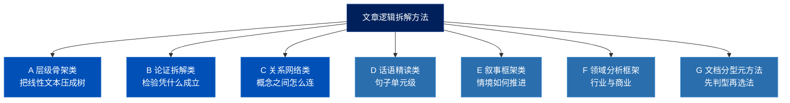

---

# 第一部分:方法论详解

每个方法按统一模板讲解:**一句话本质 → 出处 → 核心结构 → 怎么拆文章 → 产出图形 → 局限**。

---

## 家族 A:层级骨架类

把一篇线性铺开的文章,压缩成一棵"结论在顶、支撑在下"的树。这是处理"有明确主张/方案"的文章时最锋利的一类。

### A1. 金字塔原理(Pyramid Principle)

**一句话本质**:任何复杂表达都能归约为"一个中心论点 + 若干层级化的支撑",像金字塔一样自上而下展开。

**出处**:Barbara Minto 在麦肯锡期间提出,是咨询业写作与汇报的事实标准。

**核心结构**:
- **结论先行(Answer First)**:塔尖是唯一的中心论点,先抛结论再展开。
- **以上统下**:每一层都是对上一层"为什么 / 如何"的回答;上层是下层的概括。
- **归类分组**:同一层的要点必须是同一逻辑类别。
- **逻辑递进**:同组要点要么按演绎(大前提→小前提→结论),要么按归纳(时间/结构/程度顺序)排列。

两个常配套使用的子工具:
- **MECE 原则(Mutually Exclusive, Collectively Exhaustive)**:每一层的分组要"相互独立、完全穷尽",既不重叠也不遗漏。这是检验分解质量的尺子。
- **SCQA 引入框架**:Situation(情境)→ Complication(冲突/变化)→ Question(由此产生的疑问)→ Answer(回答,即金字塔塔尖)。用来定位文章真正要回答的核心问题,以及它的中心论点。

**怎么拆文章**:
1. 用 SCQA 定位文章在回答什么问题,把 Answer 提为塔尖。
2. 向下找出直接支撑塔尖的几个一级论点(通常 3 个左右)。
3. 每个一级论点再向下找支撑,直到落到事实/数据层。
4. 横向用 MECE 检查每一层有没有重叠或遗漏。

**产出图形**:金字塔图 / 自上而下的层级树(`mindmap` 或 `flowchart TD`)。

**结构图示**:

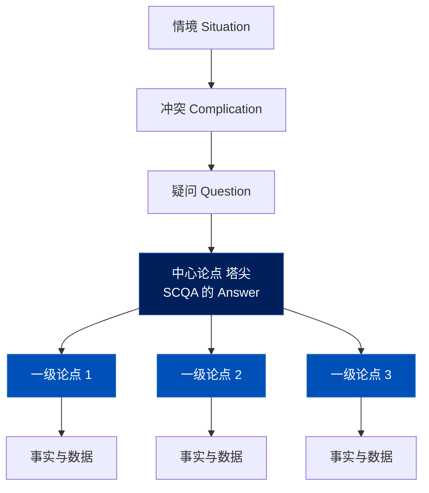

**局限**:只适合"有明确主张要论证"的文章。面对"梳理一堆平行概念之间关系"的文章(如综述),强行套金字塔会扭曲原意。

---

### A2. 议题树 / 逻辑树(Issue Tree / Logic Tree)

**一句话本质**:把一个大问题逐层拆成相互独立、可单独解决的子问题。

**出处**:与金字塔同源于咨询方法论,是问题分解(problem structuring)的标准工具。常见三种:议题树(拆问题)、假设树(拆论证)、决策树(拆选项)。

**核心结构**:根节点是核心议题,每往下一层是对上一层的 MECE 拆分,叶子节点是可直接回答/验证的最小单元。

**怎么拆文章**:适合拆"解决方案型"文章——把文章主张的解决方案当根,逐层还原它是如何把大问题切成小问题、再逐个击破的。它和金字塔的区别在于:金字塔是"答案的结构",议题树是"问题的结构"。一份好的咨询报告往往是"先有议题树(分析阶段),再翻转成金字塔(汇报阶段)"。

**产出图形**:树形图(`flowchart TD`)。

**结构图示**:

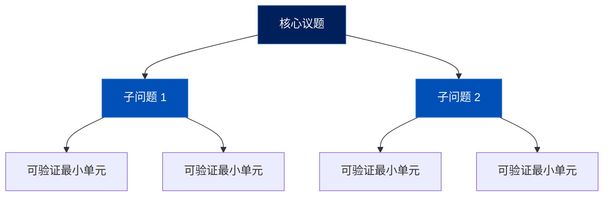

**局限**:依赖问题本身可以被 MECE 切分;面对高度耦合、相互缠绕的议题时,切分会显得勉强。

---

### A3. 倒金字塔 + 5W1H

**一句话本质**:最重要的信息放最前,细节按重要性递减排列;用 5W1H 保证事实要素齐全。

**出处**:新闻写作的经典结构。倒金字塔(Inverted Pyramid)源于电报时代——保证编辑从任意位置砍掉后文都不丢关键信息。

**核心结构**:
- **倒金字塔**:导语(最关键的 What/Who/结果)→ 重要细节 → 背景 → 次要信息。注意它和 Minto 金字塔方向**相反**:Minto 是论点在顶向下展开论证,倒金字塔是重要性在顶向下递减。
- **5W1H**:Who / What / When / Where / Why / How,用来盘点一则报道是否交代清楚了全部事实要素。

**怎么拆文章**:对新闻类文本,先用 5W1H 抽出六要素填表,再按倒金字塔标注信息的重要性层级。

**产出图形**:信息层级图 / 5W1H 要素表。

**结构图示**:

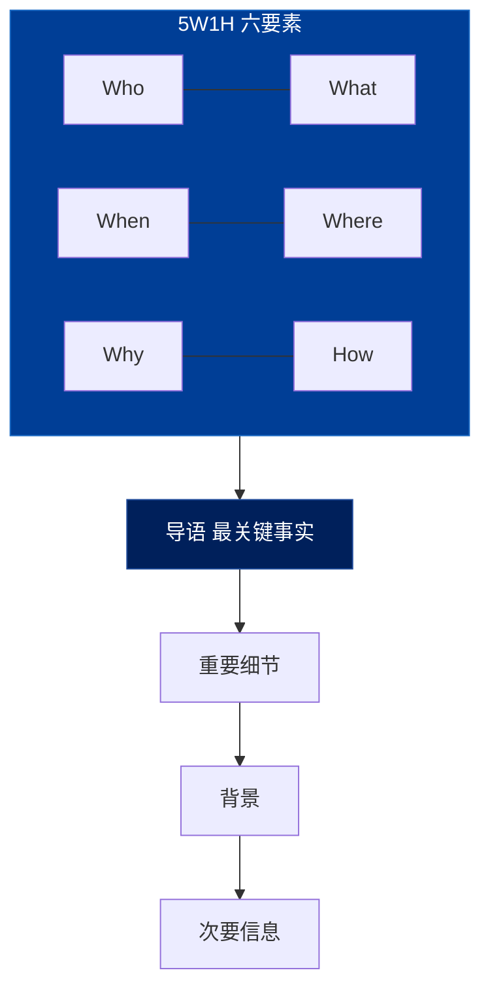

**局限**:只适合事实陈述型文本,不处理论证关系。

---

## 家族 B:论证拆解类

不关心文章讲了什么,只关心"它凭什么得出这个结论"。专门用来暴露论证链条和隐藏前提。

### B1. Toulmin 论证模型

**一句话本质**:任何一个论证都能拆成"主张 + 依据 + 凭什么从依据推出主张",再加上限定与反驳。

**出处**:哲学家 Stephen Toulmin 在《The Uses of Argument》(1958)提出,是非形式逻辑与论证分析的核心模型。

**核心结构**(六要素):
- **Claim(主张)**:要证明的结论。
- **Grounds / Data(论据)**:支撑主张的事实、数据、证据。
- **Warrant(论证依据)**:连接论据与主张的逻辑桥梁——"为什么这个论据能推出这个主张"。**这一项作者通常不写出来**,是分析的重点。
- **Backing(支撑)**:为 Warrant 本身提供的进一步支持。
- **Qualifier(限定词)**:主张成立的强度/范围("通常""在某些情况下")。
- **Rebuttal(反驳)**:主张不成立的例外情形。

**怎么拆文章**:对每一个核心论点,逐一填这六个格子。最大的收获往往是被迫写出作者**省略的 Warrant 和 Rebuttal**——也就是"论证成立必须依赖、但作者没明说"的隐含假设。这是发现观点文章逻辑漏洞的最有效手段。

**产出图形**:论证图(argument map),节点为主张/论据,边标注 Warrant。

**结构图示**:

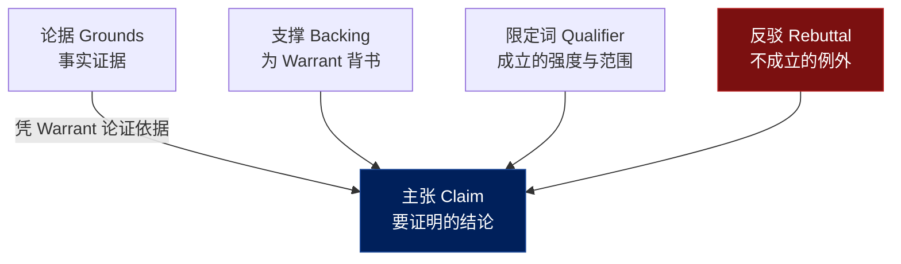

**局限**:粒度细,逐点分析成本高;不适合用来把握全文宏观结构(那是金字塔的活)。

---

### B2. IRAC

**一句话本质**:法律论证的标准四段式——争点、规则、适用、结论。

**出处**:英美法学院的经典分析框架。

**核心结构**:
- **Issue(争点)**:本案要解决的法律问题。
- **Rule(规则)**:适用的法条/判例/原则。
- **Application / Analysis(适用)**:把规则套到本案事实上的推理过程(全文重心)。
- **Conclusion(结论)**:由适用推出的结果。

**怎么拆文章**:对法律/政策分析类文章,逐个争点套 IRAC。多个争点时,每个争点是一条独立的 IRAC 链,可并列。

**产出图形**:决策树 / 分争点的论证链。

**结构图示**:

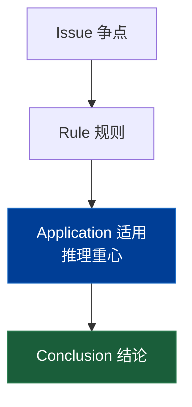

**局限**:专用于规则适用型推理,迁移到非规范性论证时需改造。

---

## 家族 C:关系网络类

文章没有"一个要证明的主张",核心是"一堆概念/对象之间是什么关系"。这一类的关键是**边要带含义**。

### C1. 概念图(Concept Map)

**一句话本质**:节点是概念,**边带标签**(导致/属于/支持/反对),一个"概念—关系—概念"就是一个命题。

**出处**:Joseph Novak 与 D. Bob Gowin 在 1980 年代基于 Ausubel 的有意义学习理论提出。

**核心结构**:有向图,节点=概念,带标签的边=命题关系。允许交叉连接(cross-links)——揭示不同分支概念之间的非显然关联,这往往是理解的关键。

**怎么拆文章**:
1. 抽出文章涉及的所有核心概念作为节点。
2. 逐对判断概念间的关系,在边上标注关系类型。
3. 重点找跨段落、跨分支的交叉连接。

**产出图形**:带标签边的有向图。这是"理清逻辑关系"的首选形态——因为逻辑恰恰藏在边上。

**结构图示**:

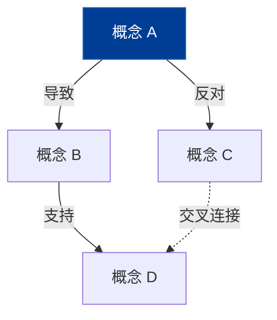

**局限**:概念多时图会变密、易乱;需要克制,只保留承重的关系边。

---

### C2. 思维导图(Mind Map)

**一句话本质**:中心主题向外放射的树,节点是关键词,**边不带含义**。

**出处**:Tony Buzan 普及,核心用途是发散思考、记忆、快速整理要点。

**核心结构**:单一中心节点,放射状层级分支,边只表达"从属/包含"。

**怎么拆文章**:适合快速提取文章的要点骨架、做读书笔记。

**产出图形**:放射状树(`mindmap`)。

**结构图示**:

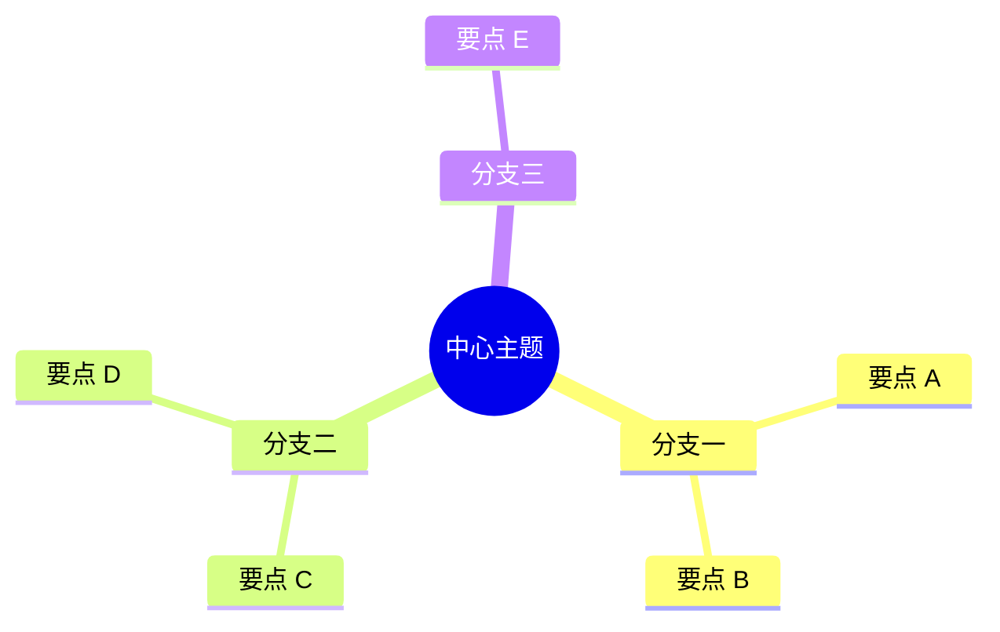

**局限**:**这是用于"理清逻辑"时最弱的工具**。因为它的边没有语义,无法表达"A 导致 B""A 反驳 B""A 是 B 的前提"。一旦目标是逻辑而非记忆,应优先用概念图或论证图。记住:思维导图擅长发散,概念图擅长关系。

---

### C3. 分类法(Taxonomy)

**一句话本质**:把一组对象按"是一种(is-a)"关系组织成严格的层级分类树。

**出处**:源于生物学分类,广泛用于知识组织。与概念图的区别:分类法的边只有一种关系(归类),而概念图的边是多样的。

**怎么拆文章**:适合拆"对一个领域做分类梳理"的文章(常见于综述)。先识别分类维度,再把对象逐一归位,检查是否 MECE。

**产出图形**:分类树(`mindmap` 或 `flowchart TD`)。

**结构图示**:

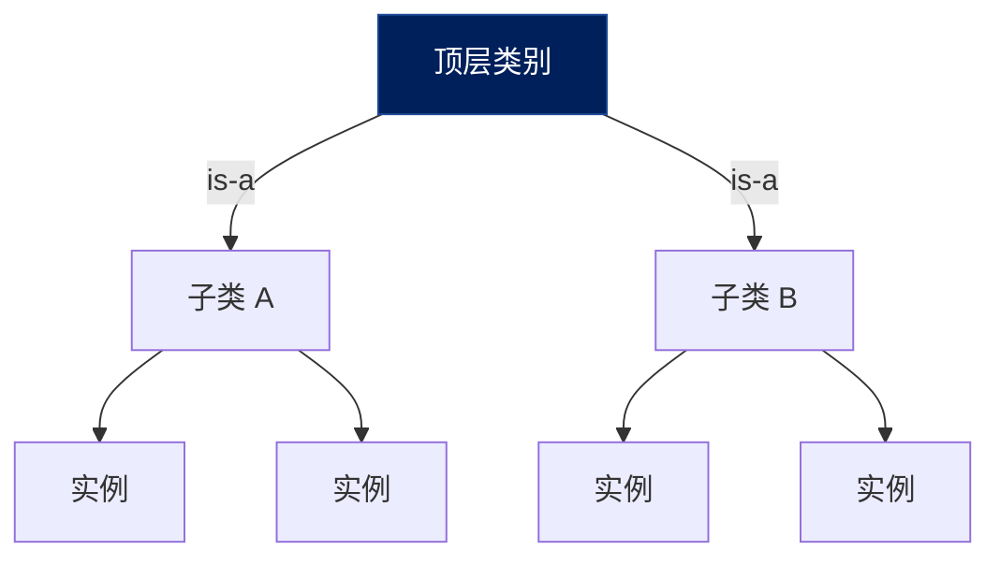

**局限**:只能表达单一维度的归类关系;当对象需要多维度交叉归类时会失效。

---

## 家族 D:话语精读类

粒度最细的一类,下沉到句子/小句单元,用于学术级深度精读单篇。

### D1. 修辞结构理论(RST, Rhetorical Structure Theory)

**一句话本质**:把文本切成最小话语单元,标注单元之间的修辞关系,并区分"核心"与"卫星"。

**出处**:William Mann 与 Sandra Thompson 在 1988 年提出,是计算语言学与篇章分析的基础理论之一。

**核心结构**:
- **话语单元(EDU)**:通常对应一个小句。
- **核心-卫星(Nucleus-Satellite)**:每对单元中,核心是主要内容,卫星是辅助核心的部分。
- **修辞关系**:详述(Elaboration)、对比(Contrast)、因果(Cause)、证据(Evidence)、让步(Concession)、背景(Background)等二十余种。

**怎么拆文章**:逐句切分,自下而上递归合并,标注每次合并的关系类型与核心方向,最终得到一棵覆盖全文的修辞结构树。

**产出图形**:RST 树(核心-卫星结构 + 关系标签)。

**结构图示**:

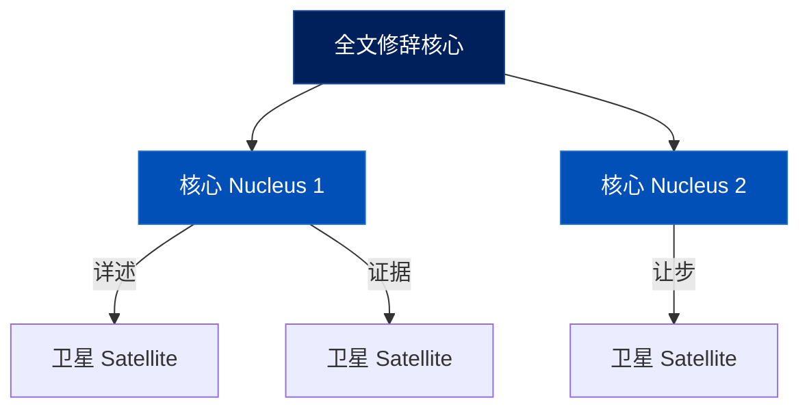

**局限**:**最严谨也最重**,逐句标注成本极高;只适合需要精细解构的单篇深读,不适合快速通读或长文。

---

## 家族 E:叙事框架类

处理"情境随时间/逻辑推进"的文章,核心是抓住推进的因果链。

### E1. SCQA

**一句话本质**:情境 → 冲突 → 疑问 → 回答,一个把读者引入核心问题的叙事钩子。

**出处**:同样出自 Barbara Minto,常作为金字塔的"开场结构"。

**核心结构**:Situation(稳定的背景共识)→ Complication(打破共识的变化)→ Question(由此自然产生的疑问)→ Answer(文章的回答)。

**怎么拆文章**:用来快速定位任何论说文/案例文的"问题—答案"主轴,尤其是开篇部分。

**产出图形**:线性四段 + 指向 Answer 的箭头。

**结构图示**:

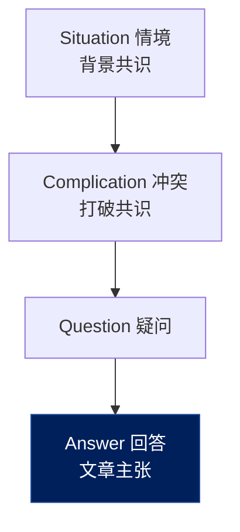

**局限**:是定位主轴的工具,不负责展开主体论证。

---

### E2. STAR

**一句话本质**:情境 → 任务 → 行动 → 结果,描述"做了什么、产生了什么效果"的叙事结构。

**出处**:行为面试与案例写作的经典框架。

**核心结构**:Situation(背景)→ Task(目标/挑战)→ Action(采取的行动)→ Result(结果与影响)。

**怎么拆文章**:适合拆案例分析、复盘类文章——还原"在什么处境下、为了什么、做了什么、得到什么"的因果链条。

**产出图形**:时间线 / 因果链(`timeline` 或 `flowchart TD`)。

**结构图示**:

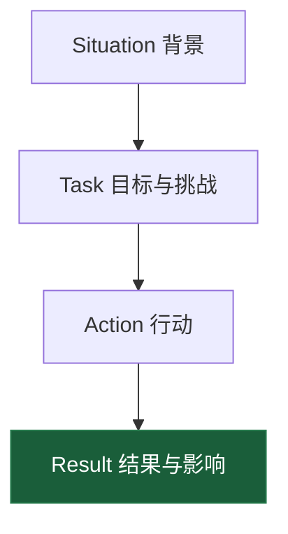

**局限**:偏叙事描述,不深入论证为什么行动有效(那需要再叠 Toulmin)。

---

## 家族 F:领域分析框架

行业/商业类文章有成熟的专用分析框架,直接套用比通用方法更高效。

### F1. 波特五力(Porter's Five Forces)

**一句话本质**:从五种竞争力量分析一个行业的结构性吸引力。

**核心结构**:现有竞争者的竞争强度、潜在进入者威胁、替代品威胁、供应商议价能力、购买者议价能力。

**用于拆文章**:把行业研究报告中关于竞争格局的论述,归位到这五个力上,看作者覆盖了哪些、遗漏了哪些。

**产出图形**:五力图(中心 + 五个力)。

**结构图示**:

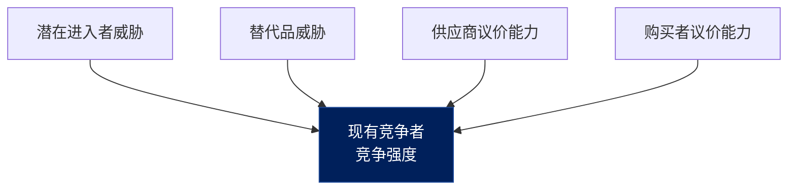

### F2. PEST / PESTEL

**一句话本质**:从宏观环境的四到六个维度扫描外部影响。

**核心结构**:Political(政治)、Economic(经济)、Social(社会)、Technological(技术),扩展版加 Environmental(环境)、Legal(法律)。

**用于拆文章**:把行业研究中的宏观背景论述,按这几个维度归类。

**产出图形**:维度雷达 / 分组卡片。

**结构图示**:

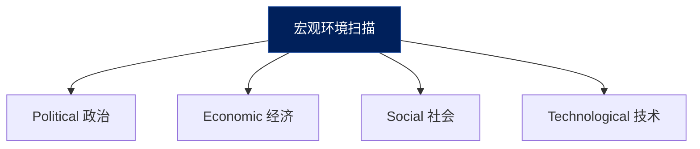

### F3. 价值链 / 产业链(Value Chain)

**一句话本质**:把一个行业按上游—中游—下游的价值流动拆解。

**核心结构**:有方向的价值流动,各环节的玩家、利润分布、卡位关系。

**用于拆文章**:把产业研究报告还原成上中下游分层结构,标出每层的关键玩家和价值卡点。

**产出图形**:产业链图(`flowchart TD` + 三层 subgraph + 上游→中游→下游箭头,见 mermaid 规范)。

**结构图示**:

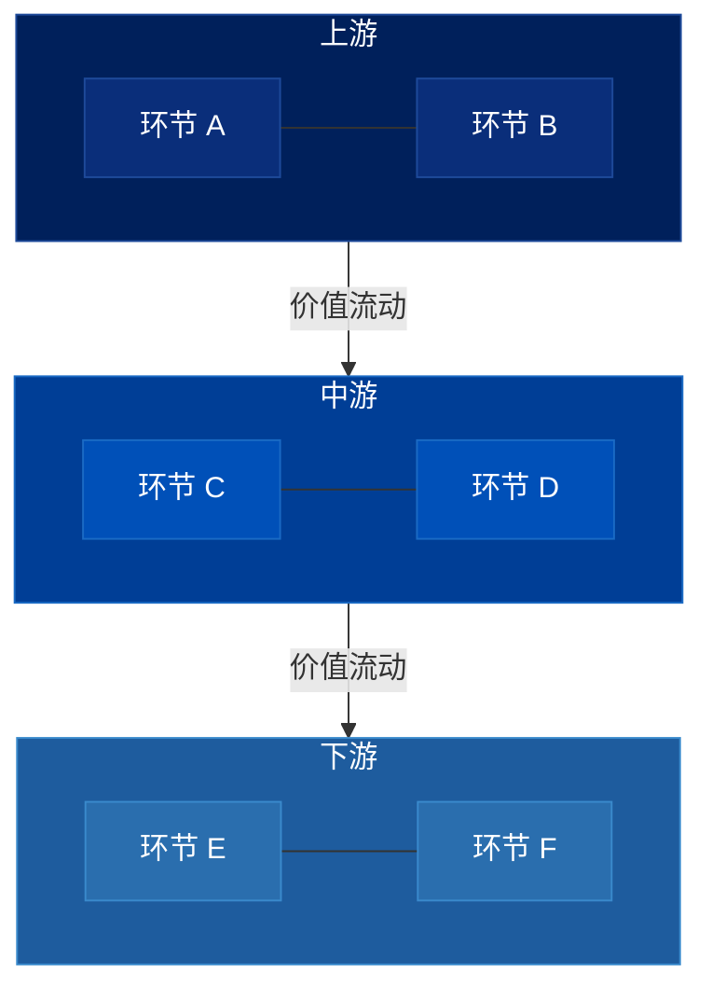

**局限(整个 F 家族)**:框架本身有视角盲区,套用时要警惕"框架覆盖到的就分析、框架外的就忽略"。框架是脚手架,不是全部。

---

## 家族 G:文档分型元方法

这一类不直接拆逻辑,而是先帮你**判断文章属于哪一型**,再决定该用上面哪种方法。它们是"方法之上的方法"。

### G1. Diátaxis

**一句话本质**:把技术文档按"实践/理论"和"学习/工作"两个维度,分成四种互不混淆的类型。

**出处**:Daniele Procida 提出的技术文档组织框架。

**核心结构**(四象限):
- **Tutorial(教程)**:面向学习,带着新手动手完成一件事 → 逻辑是**严格的步骤序列**。
- **How-to(操作指南)**:面向工作,解决一个具体问题 → 逻辑是**目标导向的流程**。
- **Reference(参考)**:面向工作,提供查阅信息 → 逻辑是**分类/检索结构**。
- **Explanation(解释)**:面向理解,讲清为什么 → 逻辑是**概念关系网**。

**怎么用**:拿到一篇技术博客,先判断它属于四象限的哪一个——因为同一个"技术博客"标签下,tutorial 要用流程图、explanation 要用概念图,方法完全不同。Diátaxis 解决的是"先分清子类型"这个前置问题。

**产出图形**:先分型,再落到对应方法的图形。

**结构图示**:

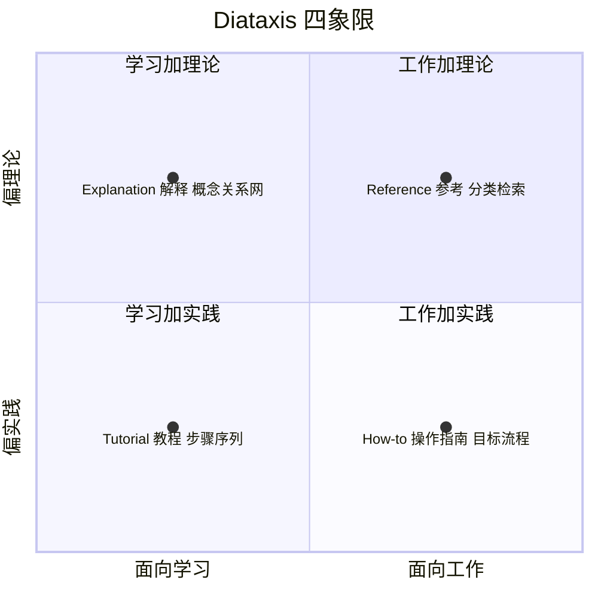

### G2. IMRaD

**一句话本质**:实证科研论文的标准骨架——引言、方法、结果、讨论。

**核心结构**:Introduction(为什么做这个研究/研究问题)→ Methods(怎么做的)→ Results(发现了什么)→ and Discussion(这意味着什么/局限)。

**怎么用**:拿到一篇实证论文,先按 IMRaD 定位四大块,再在 Introduction/Discussion 里用 Toulmin 拆论证,在 Methods→Results 里画因果/数据链。IMRaD 是定位骨架的元方法,Toulmin 是填充论证的细方法。

**产出图形**:四段链 + 各段内部的论证/因果图。

**结构图示**:

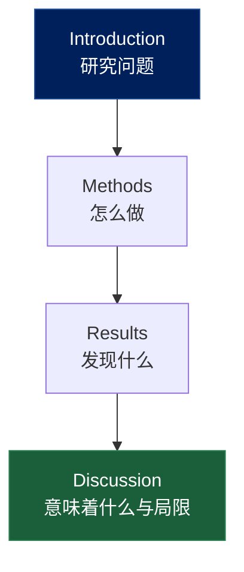

---

## 附:抽象映射(用于元框架/理论文章)

对于"提出一个统一框架、把多个领域映射到同一抽象结构"的理论文章(比如用某个数学纲领统一解释一类问题),通用方法都不够用。需要的是**抽象层级 + 映射关系**的图谱:识别文章的抽象层(具体实例 → 中层结构 → 顶层抽象),以及不同领域实例如何被同一抽象"对齐"。本质上是概念图 + 严格层级的组合,重点放在"跨域映射"的那些边上。

**结构图示**:

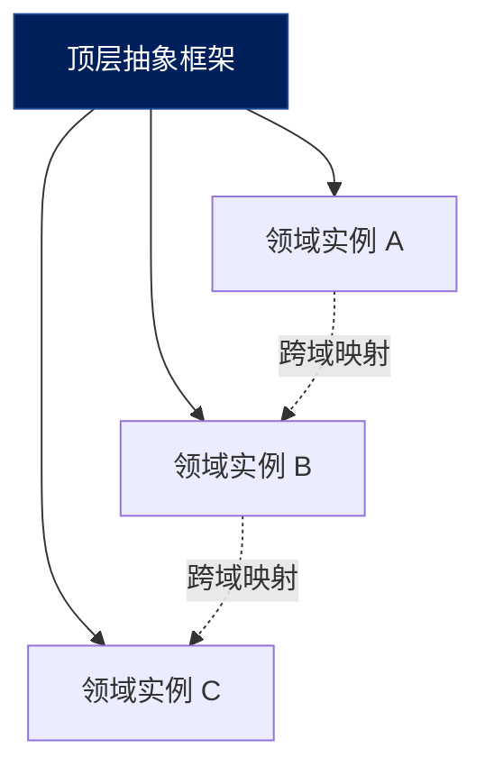

---

# 第二部分:文章类型 → 为什么用这个方法

判断方法的关键问句:**这篇文章主导意图是"论证一个观点 / 给一套方案 / 梳理一堆关系 / 讲一个过程"中的哪一个?** 下面逐类说明。

## 1. 咨询报告 / 解决方案

**主导逻辑**:结论先行 + 问题分解。咨询报告天生是金字塔结构——先给建议,再层层论证。
**推荐**:金字塔原理 + 议题树(MECE)。
**为什么**:报告的撰写过程本身就是"先用议题树分解问题(分析),再翻转成金字塔汇报结论(交付)"。逆向拆解时,沿这两个结构走最贴合作者的真实思路。MECE 还能帮你检验论证是否有遗漏。
**配图**:金字塔 / 议题树。

## 2. 研究论文(实证)

**主导逻辑**:问题 → 方法 → 证据 → 结论的因果链。
**推荐**:IMRaD 定骨架 + Toulmin 拆论证。
**为什么**:实证论文有固定的 IMRaD 结构,先用它快速定位四大块;然后真正的逻辑含量在"结果如何支撑结论"上,这正是 Toulmin 的强项——尤其能检验作者从数据到结论之间的 Warrant 是否成立、有没有过度推断。
**配图**:IMRaD 四段链 + 论证图 + 数据/因果链。

## 3. 综述论文

**主导逻辑**:对一个领域的已有工作做分类、对比、梳理演化、指出空白。**它没有一个要证明的主张**。
**推荐**:概念图 + 分类法,辅以时间线。
**为什么**:综述的核心是"这些工作之间是什么关系"——谁是谁的前提、谁改进谁、谁反驳谁、领域怎么演化。这是关系网络问题,必须用带标签边的概念图;按流派/方法的分类用分类树;演化脉络用时间线。**千万别套金字塔或 Toulmin**——综述没有单一主张,强行套会扭曲它。
**配图**:概念图 / 分类树 / 时间线。

## 4. 技术博客

**主导逻辑**:不固定。可能是 how-to,可能是 how-it-works,也可能是 reference。
**推荐**:先用 Diátaxis 分型,再选方法。
**为什么**:"技术博客"这个标签太宽,底下藏着四种逻辑。先判断:是教程/操作指南(→ 流程图)、是原理解释(→ 结构图或概念图)、还是参考资料(→ 表格/分类)。不先分型就直接拆,容易用错图形。
**配图**:视子类型而定——流程图 / 结构图 / 概念图。

## 5. 行业研究

**主导逻辑**:市场结构、价值链、竞争格局、宏观环境。
**推荐**:领域框架分析(波特五力 / PEST / 价值链)。
**为什么**:行业分析有高度成熟的专用框架,直接套比用通用方法快得多。研究报告的论述基本能归位到这些框架的格子里;归位后还能一眼看出作者覆盖了哪些维度、漏了哪些。
**配图**:产业链图 / 竞争矩阵 / 五力图。

## 6. 观点博客

**主导逻辑**:单一主张 + 论证,且常省略关键前提。
**推荐**:Toulmin(重点挖隐藏前提)。
**为什么**:观点文的价值不在表面论点,而在它**没说出来、但论证成立必须依赖**的那些假设。Toulmin 逼你写出 Warrant 和 Rebuttal,正好把这些隐含前提和未考虑的反例暴露出来——这是判断一个观点是否站得住的关键。
**配图**:论证图(标出隐含 Warrant)。

## 7. 新闻报道

**主导逻辑**:事实陈述,重要性递减。
**推荐**:5W1H + 倒金字塔。
**为什么**:报道是事实型文本,不含论证。用 5W1H 盘点要素是否齐全,用倒金字塔标注信息重要性层级即可。注意方向和咨询报告的金字塔相反:这里是重要性从上往下递减,不是论点向下展开。
**配图**:信息层级图 / 要素表。

## 8. 白皮书

**主导逻辑**:问题 → 方案 → 技术实现 → 价值主张。
**推荐**:金字塔 + 流程图(混合)。
**为什么**:白皮书前半段是论说(为什么需要这个方案,用金字塔),后半段是机制(方案怎么运作,用流程/结构图)。需要两种方法分段处理。
**配图**:层级图 + 流程图混合。

## 9. 案例分析

**主导逻辑**:情境 → 行动 → 结果的叙事推进。
**推荐**:SCQA / STAR + 因果链。
**为什么**:案例文的骨架是叙事,SCQA 或 STAR 能快速还原"在什么处境、为了什么、做了什么、得到什么"。若还要分析"为什么这个行动有效",再叠一层 Toulmin。
**配图**:时间线 / 因果链。

## 10. 法律 / 政策分析

**主导逻辑**:争点 → 规则 → 适用 → 结论。
**推荐**:IRAC。
**为什么**:这类文章是规则适用型推理,IRAC 是为它量身定做的。多个争点时,每个争点拆成独立的 IRAC 链并列。
**配图**:决策树 / 分争点论证链。

## 11. 教程 / 操作指南

**主导逻辑**:严格的步骤序列。
**推荐**:Diátaxis 的 tutorial/how-to 分型 + 步骤拆解。
**为什么**:教程的逻辑就是有序的步骤依赖,几乎是纯线性或带分支的流程。先用 Diátaxis 确认它是 tutorial(带学习者走)还是 how-to(解决具体问题),再拆成流程。
**配图**:流程图 / 步骤图。

## 12. 哲学 / 思辨文章

**主导逻辑**:正 → 反 → 合的辩证推进,以及环环相扣的前提链。
**推荐**:Toulmin + RST(辩证关系)。
**为什么**:思辨文章论证密度高、前提层层依赖,且大量使用让步/反驳/对比等修辞关系。Toulmin 拆每个论点的依据链,RST 捕捉段落间的辩证关系(让步、对比、反驳)。这是少数值得上 RST 重型工具的场景。
**配图**:含反驳分支的论证图。

## 13. 元框架 / 理论文章

**主导逻辑**:抽象、统一、跨域映射。
**推荐**:概念图 + 抽象层级映射。
**为什么**:这类文章的核心是"用一个顶层抽象统一解释多个领域"。要画出抽象层级(实例 → 结构 → 抽象),以及不同领域如何被同一框架对齐。重点在那些"跨域映射"的边上。
**配图**:概念图 / 层级映射图。

---

# 第三部分:决策流程与速查

## 四问决策树

不确定用哪个方法时,按这个顺序问自己:

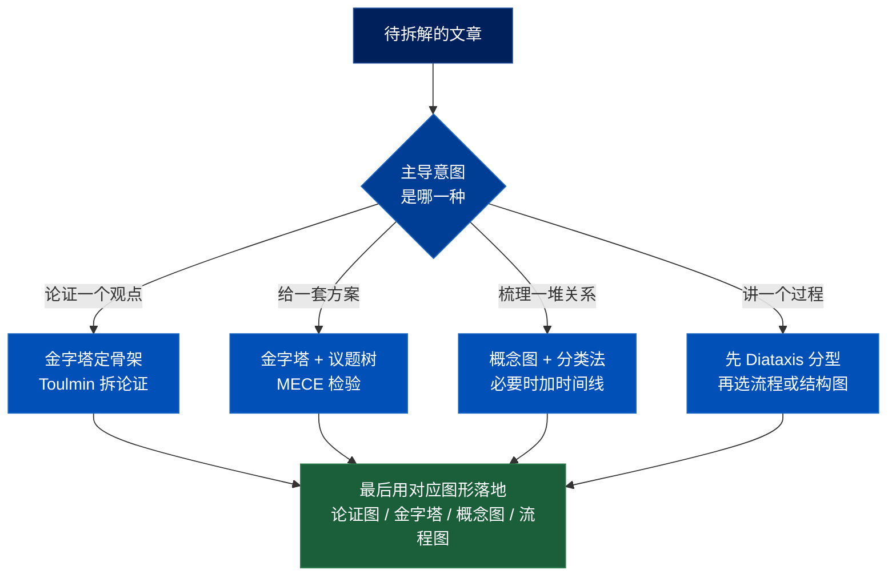

## 文章类型对照总表

| 文章类型 | 主导逻辑 | 推荐方法 | 图形形态 |
|---|---|---|---|
| 咨询报告 / 解决方案 | 结论先行、问题分解 | 金字塔原理 + 议题树(MECE) | 金字塔 / 议题树 |
| 研究论文(实证) | 问题→方法→证据→结论 | IMRaD + Toulmin | 四段链 + 论证图 |
| 综述论文 | 分类、对比、演化、空白 | 概念图 + 分类法 | 概念图 / 分类树 / 时间线 |
| 技术博客 | how-to 或 how-it-works | Diátaxis 分型后再选 | 流程图 或 结构图 |
| 行业研究 | 市场、价值链、竞争 | 波特五力 / PEST / 价值链 | 产业链图 / 竞争矩阵 |
| 观点博客 | 单一主张 + 论证 | Toulmin(挖隐藏前提) | 论证图 |
| 新闻报道 | 倒金字塔、5W1H | 5W1H + 倒金字塔 | 信息层级图 |
| 白皮书 | 问题→方案→技术→价值 | 金字塔 + 流程 | 层级 + 流程混合 |
| 案例分析 | 情境→行动→结果 | SCQA / STAR + 因果 | 时间线 / 因果链 |
| 法律 / 政策分析 | 争点→规则→适用→结论 | IRAC | 决策树 / 论证链 |
| 教程 / 操作指南 | 严格步骤序列 | Diátaxis tutorial + 步骤拆解 | 流程图 / 步骤图 |
| 哲学 / 思辨文章 | 正→反→合、前提链 | Toulmin + RST | 含反驳的论证图 |
| 元框架 / 理论文章 | 抽象、统一、映射 | 概念图 + 抽象层级 | 概念图 / 层级映射 |

## 通用工作流(任何文章)

1. **判型**:用四问决策树锁定主导意图,选定主方法。
2. **定主轴**:用 SCQA / IMRaD / 5W1H 等定位文章在回答什么、骨架分几块。
3. **切单元**:把段落切成独立的论点/概念/步骤单元。
4. **标关系**:给单元之间标注关系类型(因果、支持、反对、归属、序列……)——这一步就是在为图的"边"赋予含义。
5. **重组**:按主方法重组成层级或网络,横向用 MECE 检查重叠与遗漏。
6. **落图**:选对应图形落地(金字塔→层级树,论证→论证图,关系→概念图,过程→流程图)。

## 三条最容易踩的坑

- **两种"金字塔"方向相反**:咨询报告的 Minto 金字塔是论点在顶、向下论证;新闻的倒金字塔是重要性在顶、向下递减。拆解方向反着走。
- **综述别当论证文拆**:它没有单一主张,核心是关系网络,用概念图而非金字塔/Toulmin。
- **观点文与思辨文的价值在"挖隐藏前提"**:用 Toulmin 的最大收获不是画出明面论证,而是逼出作者省略的 Warrant 和 Rebuttal。
