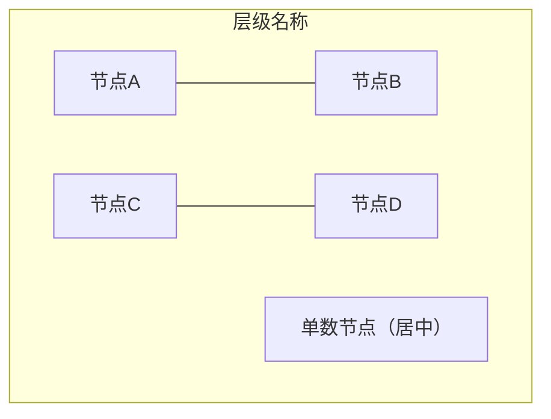
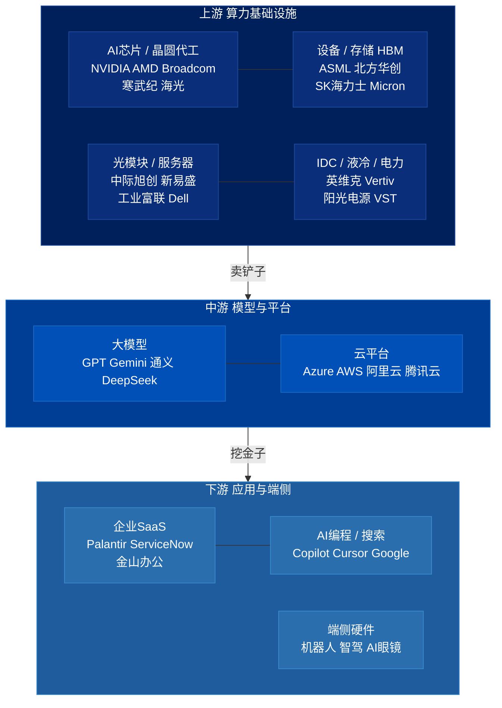

# flowchart 详细规则与布局技法

## 基本语法

```yaml
方向:    TD 优先；LR 仅用于天然横向内容
节点:    ["标签"] 格式，标签内用 <br/> 换行
子图:    subgraph ID["显示名"] ... end
颜色:    style NodeID fill:#xxx,color:#fff,stroke:#xxx
边:      --> 有向；--- 无向（用于矩阵配对）；-.-> 虚线
禁止:    emoji, ·, →, direction TB in subgraph
```

## 矩阵布局（subgraph 内 2 列网格）

当 subgraph 内节点 ≥ 4 个时，用 `---`（无向边）配对强制 2 列布局：



- `---` 产生细线连接，视觉上表示"同组"
- 奇数节点放最后一行，独立居中
- 严禁 4 个或以上节点堆在同一无连接行（会横向撑满）

## subgraph 间箭头

```mermaid
flowchart TD
    subgraph UP["上游"] end
    subgraph MID["中游"] end
    subgraph DOWN["下游"] end

    UP -->|"标签"| MID
    MID -->|"标签"| DOWN
```

- subgraph ID 可直接作为箭头端点（Mermaid v9+）
- 层间箭头标签保持**单行短语**，不用 `\n`

## 多行节点标签

```
✅ A["第一行<br/>第二行<br/>第三行"]
❌ A["第一行\n第二行\n第三行"]   ← \n 在部分渲染器失效
```

---

## 完整示例：三层产业链板块地图


