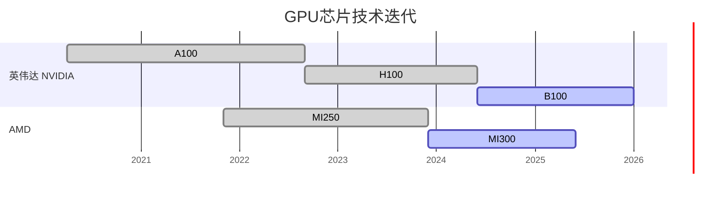

# gantt / timeline 详细规则与示例

## gantt

```yaml
日期格式:  dateFormat YYYY-MM-DD（必须，不可用 YYYY-Q 或其他格式）
轴标签:   axisFormat %Y（年份粒度）或 %b %Y（月份+年份）
          默认不写则渲染器自选，通常不美观，建议显式声明
状态:     done（已完成）/ active（进行中）/ 空（未来计划）
任务ID:   ASCII，不含特殊字符
中文任务名: 直接写在 : 前，可以含中文
```

示例：



**axisFormat 选择原则：**
- 跨度 ≥ 3 年 → `%Y`（只显示年份，不拥挤）
- 跨度 3–18 个月 → `%b %Y`（月份缩写 + 年份）
- 跨度 < 3 个月 → `%m-%d`

---

## timeline

```yaml
结构:    timeline → title → section（可选）→ key : event1 \n : event2
key:     纯文本，不含 + % & 等特殊字符
section: 分组用，可选
注意:    不支持自定义颜色；渲染为垂直时间轴，天然窄页友好
```

示例：

```
timeline
    title AI 大模型发展里程碑
    section 2022
        ChatGPT 发布 : OpenAI 推出对话式 AI
                      : 用户量 1 亿破纪录
    section 2023
        GPT-4 发布    : 多模态能力
        Claude 2      : Anthropic 发布
    section 2024
        o1 系列       : 推理模型时代开启
        DeepSeek R1   : 开源推理模型
```
