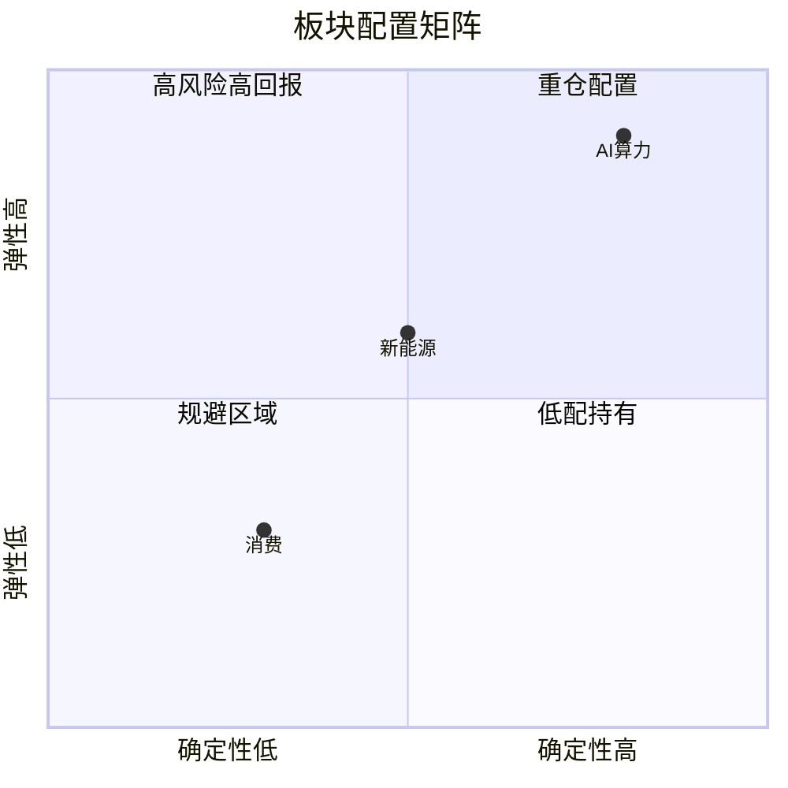
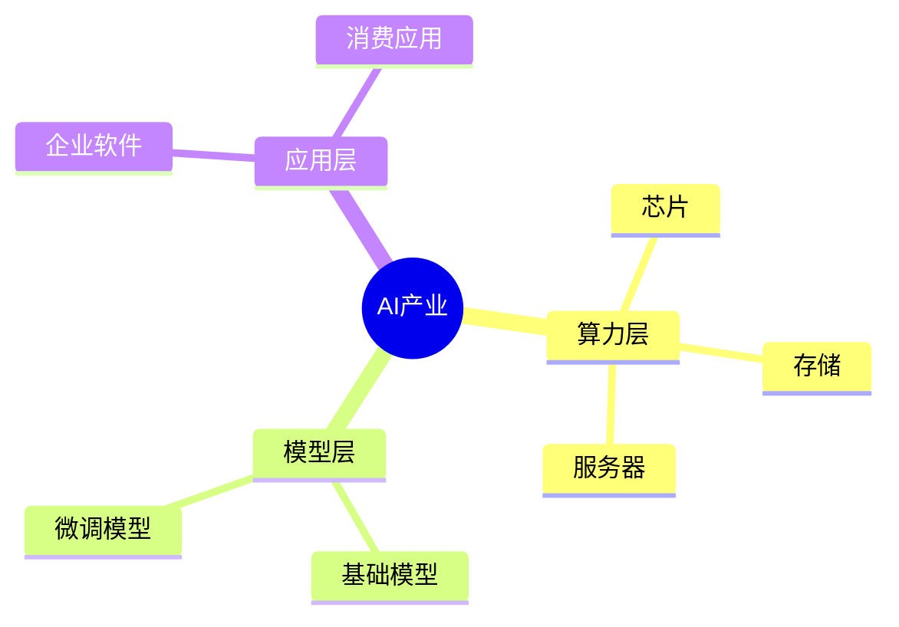

# quadrantChart / mindmap 详细规则

## quadrantChart

```yaml
quadrant标签: 不含 / & → 等字符
              ❌ quadrant-3 减仓/规避
              ✅ quadrant-3 减仓规避
点标签:       "标签名: [x, y]"，x/y 在 0.0–1.0 之间
              中文标签可用，但不能有冒号之外的特殊字符
```

示例：



---

## mindmap

```yaml
缩进:    严格 2 空格/级，不混用 tab
节点文本: 纯文本，不含 : ( ) [ ] { } 等 Mermaid 控制字符
root:    root((显示文本)) 圆形；root[文本] 方形
分隔符:  同级用空格，不用 · / → 等
```

示例：


