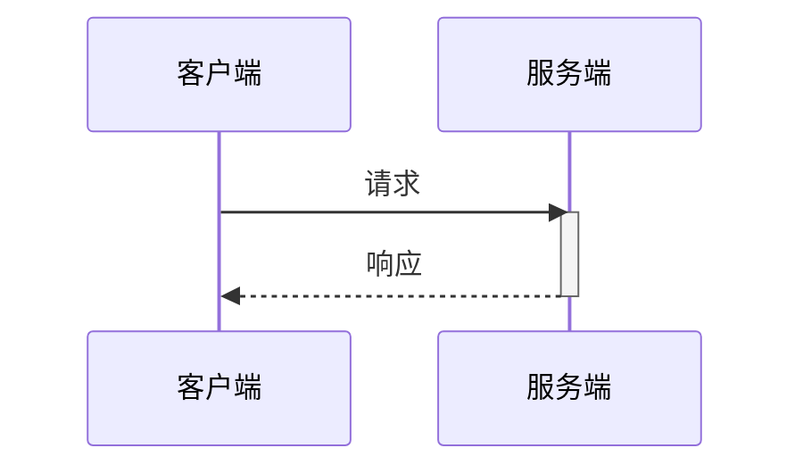
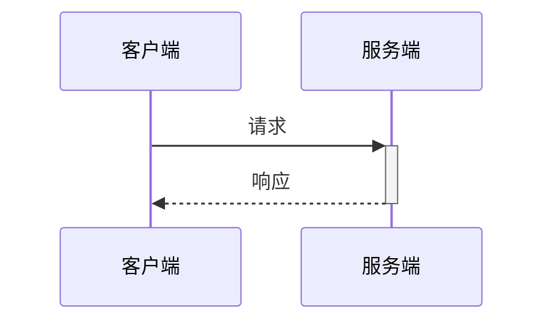
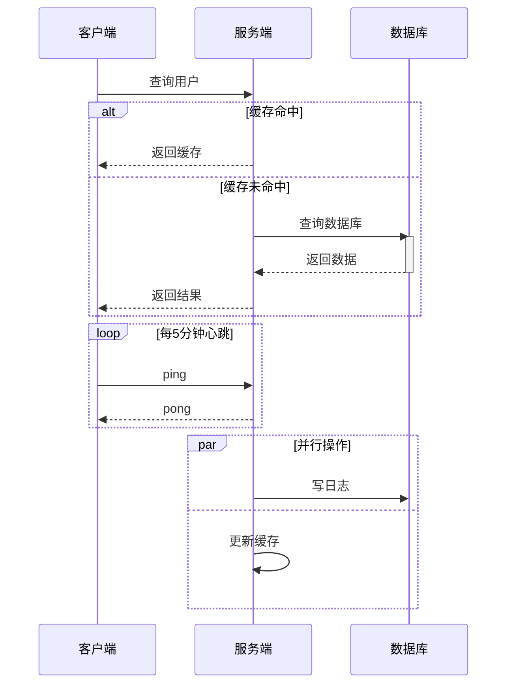

# sequenceDiagram 详细规则与示例

## 基本语法

```yaml
参与者:   participant A as 显示名（推荐）或 participant "含空格/中文名"
角色图标: actor 替代 participant，渲染为火柴人（人类角色用 actor，系统用 participant）
箭头:     ->>  同步调用（实线箭头）
          -->> 返回/异步响应（虚线箭头）
          -x   消息丢失（实线+X，表示失败/超时）
          --x  异步失败
激活框:   activate A ... deactivate A （或缩写 ->>+ / ->>-）
编号:     autonumber（在 sequenceDiagram 下一行加此关键字）
```

## 最重要规则：参与者名称

含中文、空格或特殊字符的参与者名必须处理，否则语法报错：

```
✅ participant U as 用户
✅ participant "用户服务"
✅ actor Client as 客户端
❌ participant 用户服务          ← 中文无引号，部分渲染器报错
❌ participant User Service     ← 空格无引号，报错
```

**推荐用 alias 语法（`X as 显示名`）而非引号**：ID 保持 ASCII，显示名随意。

## activate / deactivate 配对规则

每个 `activate X` 必须有对应的 `deactivate X`，否则激活框会无限叠加：



**简写形式**（`->>+` 等价于发送后 activate，`-->>-` 等价于返回后 deactivate）：



## 条件 / 循环 / 并行块

所有块必须以 `end` 关闭：



## Note 注释

```
Note right of A: 文字          ← A 右侧
Note left of A: 文字           ← A 左侧
Note over A,B: 跨越 A 和 B     ← 跨多个参与者
```

## 窄页宽度控制

sequenceDiagram 天然横向排列，参与者越多越宽：

- **≤ 5 个参与者**可适配 700–900px 的 Markdown 窄页
- 超过 5 个时，考虑拆成两张图或用 `destroy` 提前移除不再需要的参与者

## 禁止事项

```
❌ 消息文本内换行（\n / <br/>）    → sequenceDiagram 消息只支持单行
❌ activate 未配对 deactivate      → 会产生叠加激活框 bug
❌ 中文/空格参与者名不加处理        → 用 alias 或引号
❌ 禁用字符（· → — "" emoji）     → 同其他图类型规则
❌ 自定义颜色（style/classDef）    → sequenceDiagram 不支持节点着色
```

## 完整示例：API 调用时序

```mermaid
sequenceDiagram
    autonumber
    actor U as 用户
    participant G as API网关
    participant A as 认证服务
    participant B as 业务服务
    participant DB as 数据库

    U ->>+ G: POST /api/order
    G ->>+ A: 验证 Token
    A -->>- G: Token 有效

    G ->>+ B: 创建订单
    B ->>+ DB: INSERT order
    DB -->>- B: 成功

    alt 库存充足
        B -->>- G: 订单ID: 12345
        G -->>- U: 200 创建成功
    else 库存不足
        B -->>- G: 错误: 库存不足
        G -->>- U: 400 库存不足
    end

    Note over B,DB: 异步写入审计日志
```
