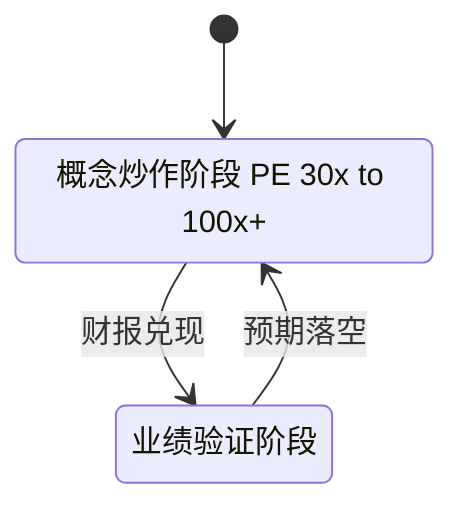
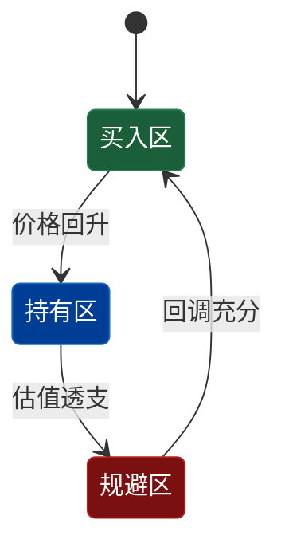

# stateDiagram-v2 详细规则与示例

## 基本语法

```yaml
方向:     direction TB（不用 LR，否则横向过宽）
state ID: 只用 ASCII（S1 S2 Idle 等）
显示文本: state "中文描述" as ASCII_ID
转换标签: S1 --> S2 : 简短描述（单行，无 → / 等特殊字符）
```

## 为什么 state ID 必须是 ASCII

Mermaid 解析器对中文 state ID 的支持不稳定——某些渲染器（如 GitHub、Notion）
会报语法错误或产生乱码。始终用 ASCII ID + `state "..." as ID` 语法：



## 语义配色（classDef）



## 注意事项

- `note right of / left of` 语法部分渲染器不支持，谨慎使用
- 转换标签（`:` 后）避免 `/`、`→`、`<`、`>` 等特殊字符
- 不使用 nested state（嵌套状态）——渲染不稳定
