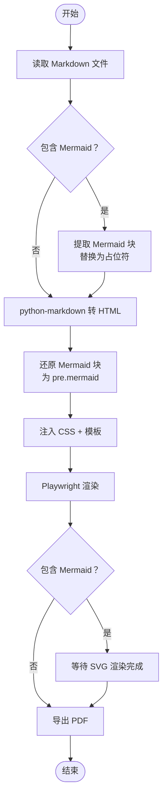
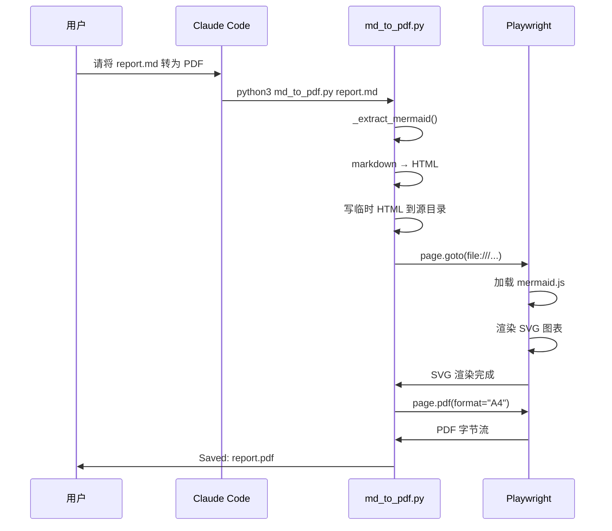
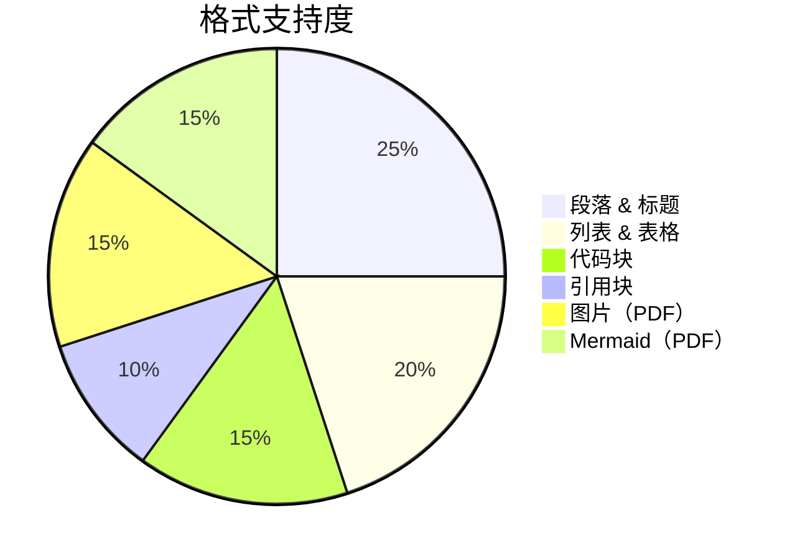
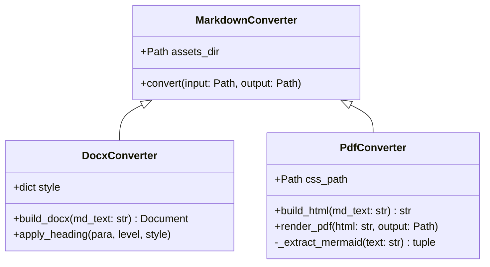

# 一级标题：综合格式测试文档

本文档覆盖所有支持的 Markdown 格式，用于验证 DOCX 与 PDF 双路径的输出质量。

---

## 二级标题：行内格式

这是一段普通正文。中文宋体，两字符首行缩进，行距适中。

行内格式组合：**粗体文字**、*斜体文字*、~~删除线~~、`行内代码`、**_粗斜体_**。

带链接的正文：访问 [Anthropic 官网](https://www.anthropic.com) 了解更多，或参考 [`python-docx` 文档](https://python-docx.readthedocs.io)。

多种格式混合在同一段落中：这份报告由 **Claude** 生成，基于 *Playwright Chromium* 渲染，支持 `mermaid.js` 图表，版本号为 ~~1.0.0~~ **2.0.0**。

### 三级标题：列表

#### 四级标题：无序列表

- 第一项
- 第二项，包含 **粗体** 和 `代码`
- 第三项
  - 嵌套第一层 A
  - 嵌套第一层 B
    - 嵌套第二层 α
    - 嵌套第二层 β
  - 嵌套第一层 C（回到第一层）
- 第四项，列表末尾

#### 四级标题：有序列表

1. 步骤一：安装依赖
2. 步骤二：配置环境
   1. 子步骤 2.1：设置路径
   2. 子步骤 2.2：验证版本
      1. 子子步骤 2.2.1
      2. 子子步骤 2.2.2
3. 步骤三：运行转换
4. 步骤四：检查输出

---

## 二级标题：表格

### 三级标题：基础表格

| 功能         | DOCX 支持 | PDF 支持 |
|--------------|:---------:|:--------:|
| 标题 H1–H4   | ✅        | ✅       |
| 段落         | ✅        | ✅       |
| 粗体 / 斜体  | ✅        | ✅       |
| 行内代码     | ✅        | ✅       |
| 删除线       | ✅        | ✅       |
| 有序列表     | ✅        | ✅       |
| 无序列表     | ✅        | ✅       |
| 表格         | ✅        | ✅       |
| 代码块       | ✅        | ✅       |
| 引用块       | ✅        | ✅       |
| 分隔线       | ✅        | ✅       |
| 图片         | ❌        | ✅       |
| Mermaid 图表 | ❌        | ✅       |

### 三级标题：数据表格

| 编号 | 姓名     | 部门     | 得分  | 备注           |
|------|----------|----------|------:|----------------|
| 001  | 张伟     | 研发部   | 92.5  | 优秀           |
| 002  | 李娜     | 产品部   | 88.0  | 良好           |
| 003  | 王芳     | 设计部   | 95.3  | **最高分**     |
| 004  | 刘洋     | 运营部   | 79.5  | 需要改进       |
| 005  | 陈静     | 市场部   | 83.0  | ~~缺席~~       |

---

## 二级标题：代码块

### 三级标题：Python

```python
#!/usr/bin/env python3
"""Convert Markdown to PDF via Playwright."""

from pathlib import Path
import markdown as md_lib

ASSETS_DIR = Path(__file__).parent.parent / "assets"

def build_html(md_text: str, css_path: Path) -> tuple[str, int]:
    """Return complete HTML string and Mermaid block count."""
    body = md_lib.markdown(
        md_text,
        extensions=["tables", "fenced_code", "attr_list"],
    )
    template = (ASSETS_DIR / "template.html").read_text(encoding="utf-8")
    css = css_path.read_text(encoding="utf-8")
    html = template.replace("{{CSS_CONTENT}}", css).replace("{{BODY_CONTENT}}", body)
    return html, 0
```

### 三级标题：Shell

```bash
# 安装依赖
pip install python-docx markdown
playwright install chromium

# 基础转换
python3 md_to_pdf.py input.md
python3 md_to_pdf.py input.md output.pdf --style custom.css

# 导出默认样式以供定制
python3 md_to_pdf.py --dump-style > my-style.css
```

### 三级标题：JSON 配置

```json
{
  "page": {
    "top_cm": 2.54,
    "bottom_cm": 2.54,
    "left_cm": 3.17,
    "right_cm": 3.17
  },
  "body": {
    "font": "宋体",
    "font_en": "Times New Roman",
    "size_pt": 12,
    "line_spacing_pt": 22
  },
  "headings": {
    "h1": { "size_pt": 22, "bold": true, "align": "center" },
    "h2": { "size_pt": 16, "bold": true }
  }
}
```

### 三级标题：SQL

```sql
SELECT
    u.name        AS 姓名,
    d.dept_name   AS 部门,
    AVG(s.score)  AS 平均分
FROM users u
JOIN departments d ON u.dept_id = d.id
JOIN scores s      ON u.id = s.user_id
WHERE s.year = 2026
GROUP BY u.id, d.dept_name
HAVING AVG(s.score) >= 80
ORDER BY 平均分 DESC;
```

---

## 二级标题：引用块

> 这是一段单行引用。引用内容使用仿宋字体，向右缩进。

> 这是一段多行引用。
> 引用可以跨越多行，
> 仿宋字体在阅读上有明显区分效果。

> **重要提示：** 引用块中也支持 **粗体**、*斜体* 和 `行内代码`。
> 适合用于标注注意事项或引用原文。

---

## 二级标题：嵌入图片（仅 PDF）

下图为测试用样例图片，验证相对路径加载：


图片说明：以上蓝色矩形为自动生成的测试图片（200×80px），用于验证 `base_url` 相对路径解析是否正常。

---

## 二级标题：Mermaid 图表（仅 PDF）

### 三级标题：流程图



### 三级标题：时序图



### 三级标题：饼图



### 三级标题：类图



---

## 二级标题：混合内容

以下段落结合多种格式，验证段落内各元素共存时的渲染效果。

本项目的**技术栈**：`python-docx`（DOCX 生成）、`markdown`（HTML 转换）、`playwright`（PDF 渲染）、`mermaid.js`（图表）。所有样式文件独立存放于 `assets/` 目录，脚本中**不含任何内联样式**，符合 *关注点分离* 原则。

> **设计决策：** DOCX 与 PDF 采用完全独立的样式系统——DOCX 使用 `default-style.json`，PDF 使用 `default.css`——两套配置互不影响，可单独定制。

格式支持列表：

1. **行内格式**：粗体、斜体、删除线、`代码`、链接
2. **块级格式**：
   - 标题 H1–H4（字体、字号、颜色、对齐独立配置）
   - 段落（首行缩进 2em / 2字符）
   - 代码块（等宽字体，PDF 有背景色）
   - 引用块（仿宋，缩进）
3. **结构元素**：
   - 有序 / 无序列表（最多三级嵌套）
   - 表格（表头加深背景，边框统一）
   - 分隔线
4. **富媒体（仅 PDF）**：
   - 本地图片（`./relative/path.png`）
   - Mermaid 图表（flowchart、sequence、pie、class）

---

## 二级标题：特殊字符与边界情况

### 三级标题：空白行为

连续两个换行产生新段落。

（上方有一个空段落）

### 三级标题：长代码行

```
这是一行非常非常非常非常非常非常非常非常非常非常非常非常非常非常非常非常非常非常非常非常非常非常非常非常非常非常非常长的代码行，用于测试横向溢出处理。
```

### 三级标题：特殊 HTML 字符

段落中包含需要转义的字符：`<div>`、`&amp;`、`"quoted"`、5 > 3 且 2 < 4。

---

*文档结束。本文件自动生成，用于 md-to-docx v2.0.0 全格式覆盖测试。*
