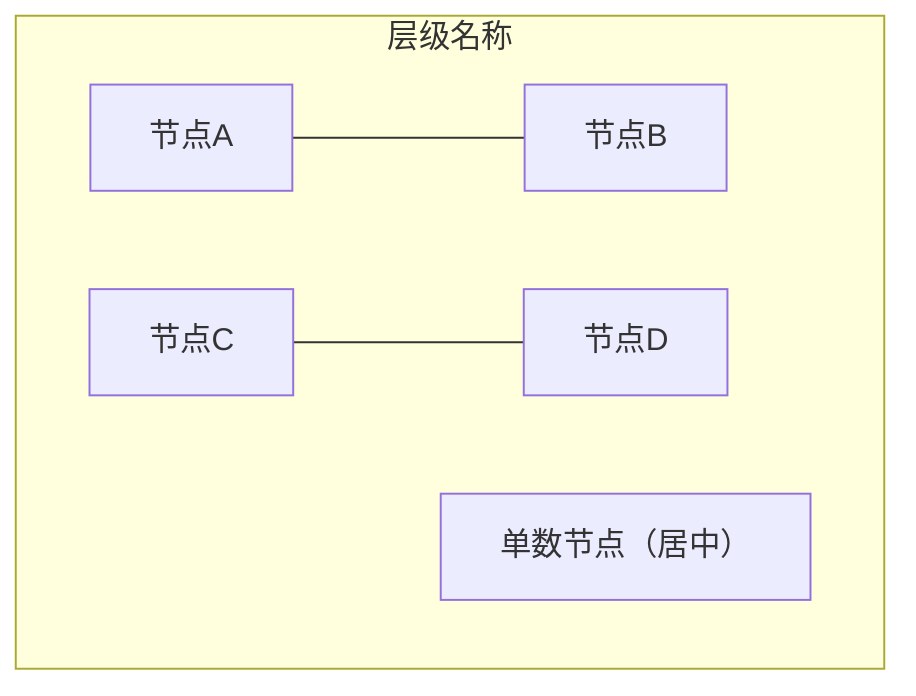
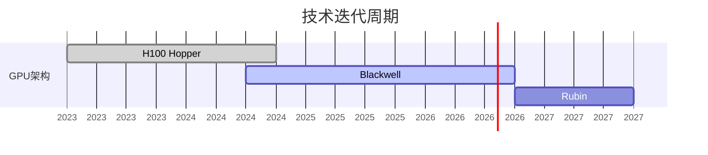
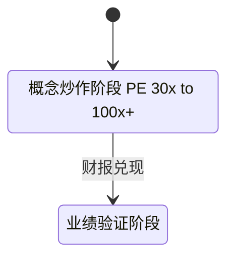

# 各图类型详细规则与示例

## 目录

- [布局技法](#布局技法)
- [flowchart](#flowchart)
- [timeline](#timeline)
- [gantt](#gantt)
- [stateDiagram-v2](#statediagram-v2)
- [quadrantChart](#quadrantchart)
- [mindmap](#mindmap)
- [正确语法示例](#正确语法示例)

---

## 布局技法

### 矩阵布局（subgraph 内 2 列网格）

当 subgraph 内节点 ≥ 4 个时，用 `---`（无向边）配对强制 2 列布局：



- `---` 产生细线连接，视觉上表示"同组"，语义上可接受
- 奇数节点放最后一行，独立居中
- 严禁 4 个或以上节点堆在同一无连接行（会横向撑满）

### subgraph 间箭头

```mermaid
flowchart TD
    subgraph UP["上游"] end
    subgraph MID["中游"] end
    subgraph DOWN["下游"] end

    UP -->|"标签"| MID
    MID -->|"标签"| DOWN
```

- subgraph ID 可直接作为箭头端点（Mermaid v9+）
- 层间箭头标签保持**单行短语**，不用 `\n`

---

## flowchart

```yaml
方向:    TD 优先；LR 仅用于天然横向内容
节点:    ["标签"] 格式，标签内用 <br/> 换行
子图:    subgraph ID["显示名"] ... end
颜色:    style NodeID fill:#xxx,color:#fff,stroke:#xxx
边:      --> 有向；--- 无向（用于矩阵配对）；-.-> 虚线
禁止:    emoji, ·, →, direction TB in subgraph
```

---

## timeline

```yaml
结构:    timeline → title → section → key : event1 \n : event2
key:     纯文本，不含 + % & 等特殊字符
section: 分组用，可选
注意:    不支持自定义颜色；渲染为垂直时间轴，天然窄页友好
```

---

## gantt

```yaml
日期格式: dateFormat YYYY-MM-DD（必须用此格式，不可用 YYYY-Q）
轴标签:  axisFormat %Y（年份）或 %b %Y（月份+年份）
状态:    done / active / 空（未来）
任务ID:  ASCII，不含特殊字符
中文任务名: 直接写，放在 : 前面
```

示例：



---

## stateDiagram-v2

```yaml
方向:    direction TB（不用 LR，否则横向过宽）
state ID: 只用 ASCII
显示文本: state "中文" as ASCII_ID
描述:    state_id : 描述文字（禁止 → / 等特殊字符）
转换标签: S1 --> S2 : 简短描述（单行，无特殊字符）
```

---

## quadrantChart

```yaml
quadrant标签: 不含 / & → 等字符
              ❌ quadrant-3 减仓/规避
              ✅ quadrant-3 减仓规避
点标签:       "标签名: [x, y]"，x/y 在 0.0–1.0 之间
              中文标签可用，但不能有冒号之外的特殊字符
```

---

## mindmap

```yaml
缩进:    严格 2 空格/级，不混用 tab
节点文本: 纯文本，不含 : ( ) [ ] { } 等 Mermaid 控制字符
root:    root((显示文本)) 圆形；root[文本] 方形
分隔符:  同级用空格，不用 · / → 等
```

---

## 正确语法示例

### 多行节点标签

```
✅ A["第一行<br/>第二行<br/>第三行"]
❌ A["第一行\n第二行\n第三行"]       ← \n 在部分渲染器失效
```

### stateDiagram ASCII ID 写法



- State ID 只用 ASCII（`S1` `S2` `Idle` 等）
- 显示文本用 `state "中文描述" as ID` 语法
- 转换标签（`:` 后）避免 `/` 和 `→`
