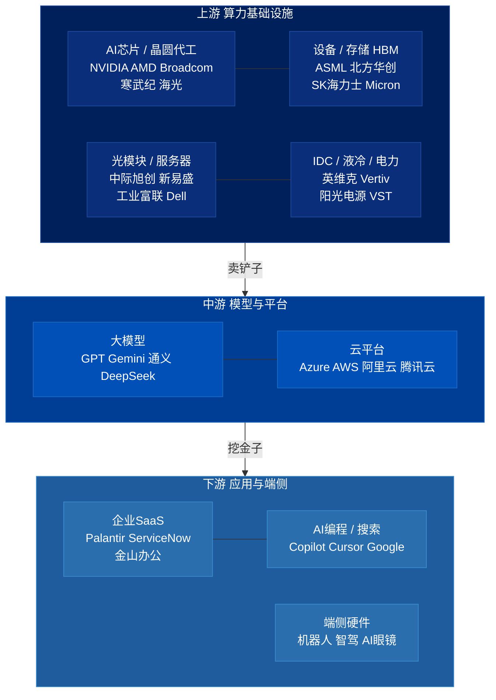
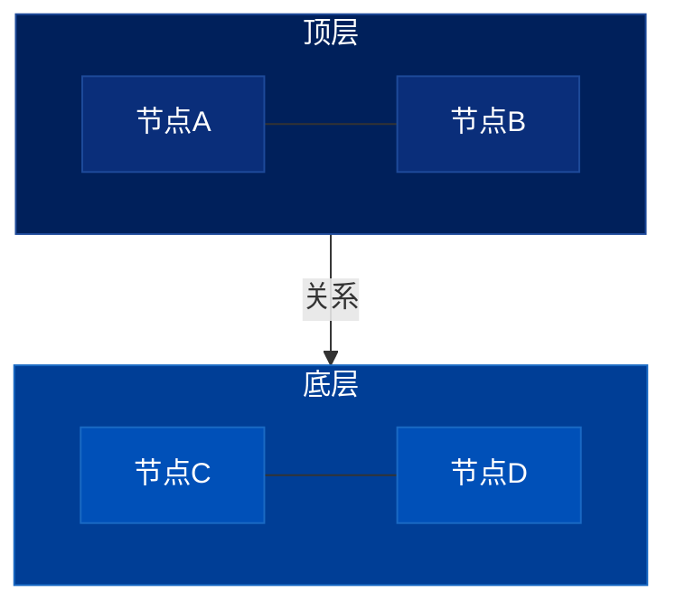

# Roland Berger 完整配色模板

## 三层产业链 style 模板

直接复制以下 style 块到 flowchart，然后按实际节点 ID 调整：

```
style UP   fill:#00205B,color:#fff,stroke:#1E4A9A
style MID  fill:#003E96,color:#fff,stroke:#1A6AC4
style DOWN fill:#1E5C9E,color:#fff,stroke:#3A8ACC
style U1 fill:#0A2E7A,color:#fff,stroke:#1E4A9A
style U2 fill:#0A2E7A,color:#fff,stroke:#1E4A9A
style U3 fill:#0A2E7A,color:#fff,stroke:#1E4A9A
style U4 fill:#0A2E7A,color:#fff,stroke:#1E4A9A
style M1 fill:#0050B8,color:#fff,stroke:#1A6AC4
style M2 fill:#0050B8,color:#fff,stroke:#1A6AC4
style D1 fill:#2A6EAE,color:#fff,stroke:#3A8ACC
style D2 fill:#2A6EAE,color:#fff,stroke:#3A8ACC
style D3 fill:#2A6EAE,color:#fff,stroke:#3A8ACC
```

---

## 完整示例：三层产业链板块地图

以下示例综合运用所有规则，可直接复制修改：



---

## 极简两层模板


