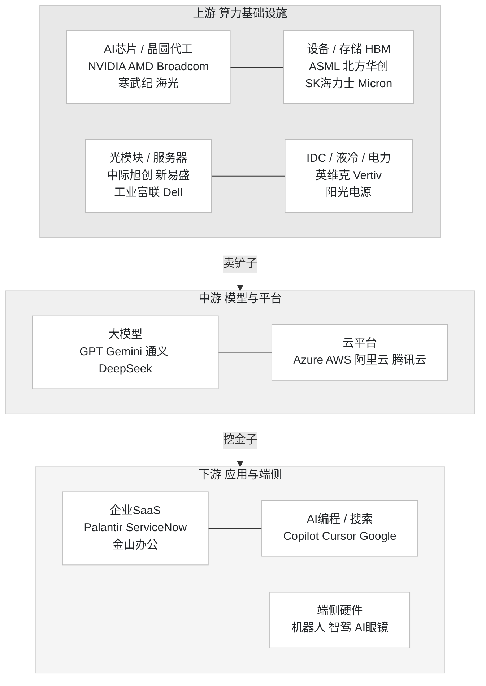
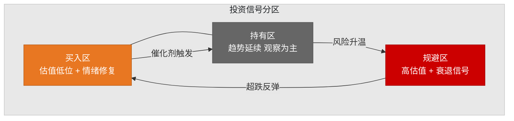
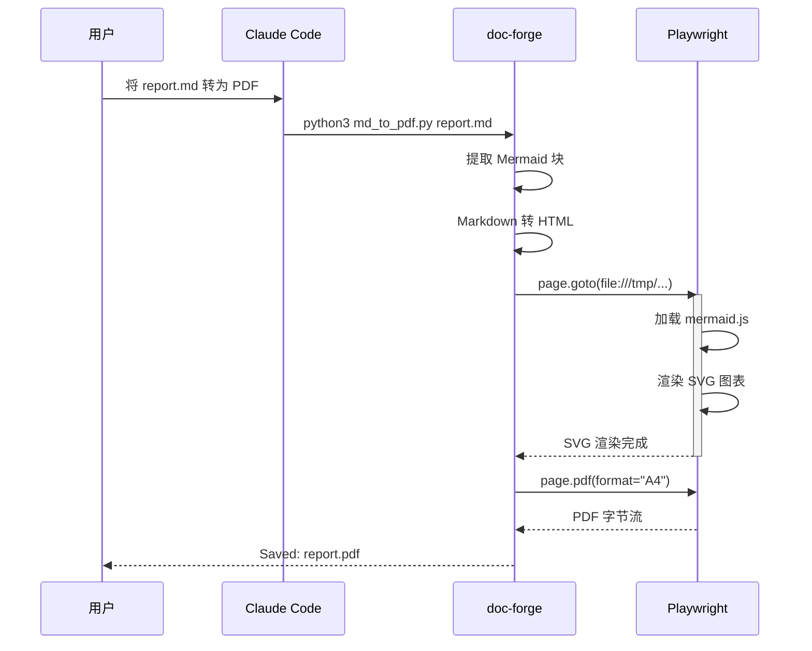
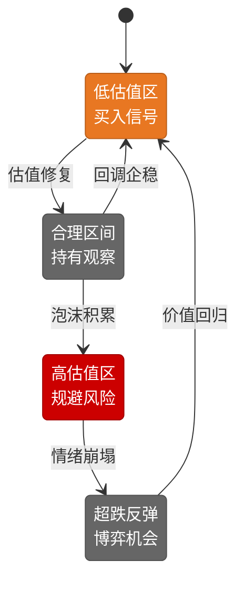
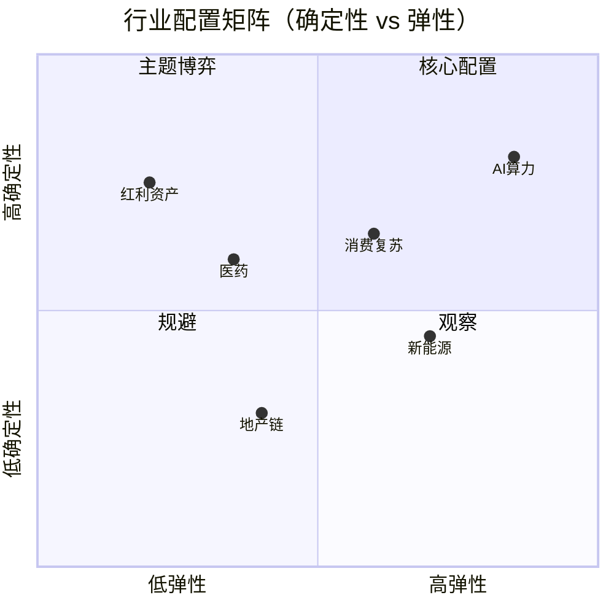
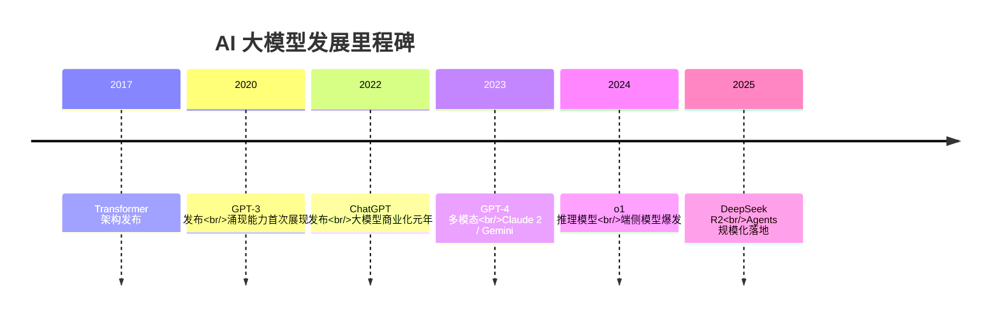
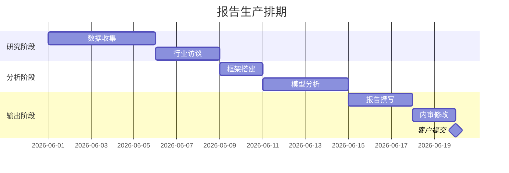

# Mermaid 配色测试 — Bain & Company 风格

用于验证 Bain 近黑 subgraph + Bain Red 节点配色在各图类型下的视觉效果。
主题文件：`themes/bain.json`

---

## 1. flowchart TD — 三层产业链（核心场景）

---

## 2. flowchart TD — 语义辅助色（风险信号）

---

## 3. sequenceDiagram — 系统调用时序（库默认色）

---

## 4. stateDiagram-v2 — 估值周期状态机

---

## 5. quadrantChart — 2x2 机会矩阵（库默认色）

---

## 6. timeline — 里程碑时间轴（库默认色）

---

## 7. gantt — 项目计划（库默认色）

